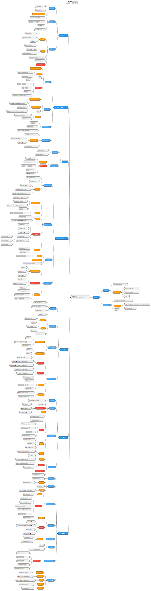
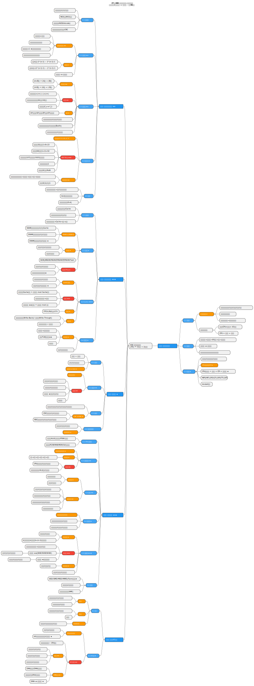
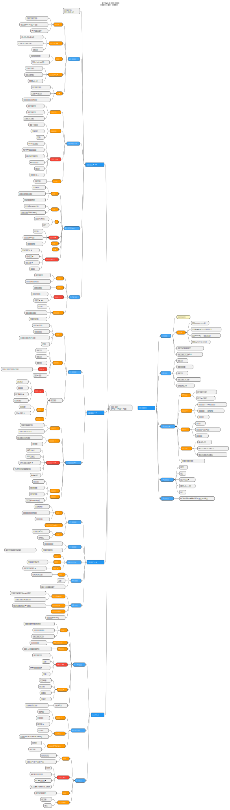
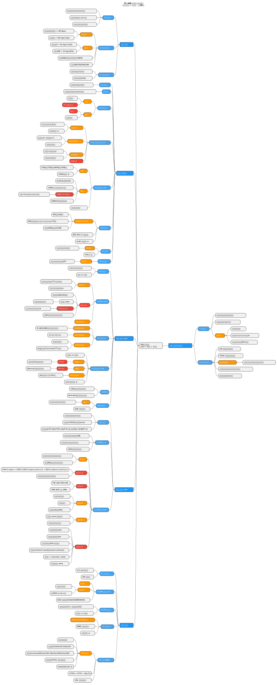
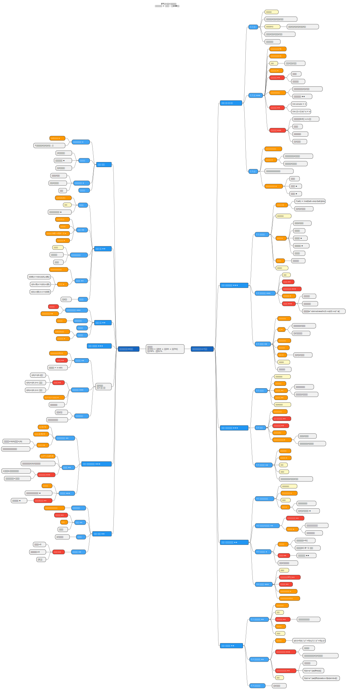

# 27考研408 · 全科思维导图

> 结合王道教材 + 考研大纲 | 总分150分 | SVG可无损缩放

---

## 一、数据结构（45分 = 11选择 + 2大题含算法题）

---

## 二、计算机组成原理（45分 = 11选择 + 2大题）

---

## 三、操作系统（35分 = 10选择 + 2大题）

---

## 四、计算机网络（25分 = 8选择 + 1大题）

---

## 五、考研数学二（150分 = 选择50 + 填空30 + 解答70 | 高数78% · 线代22%）

