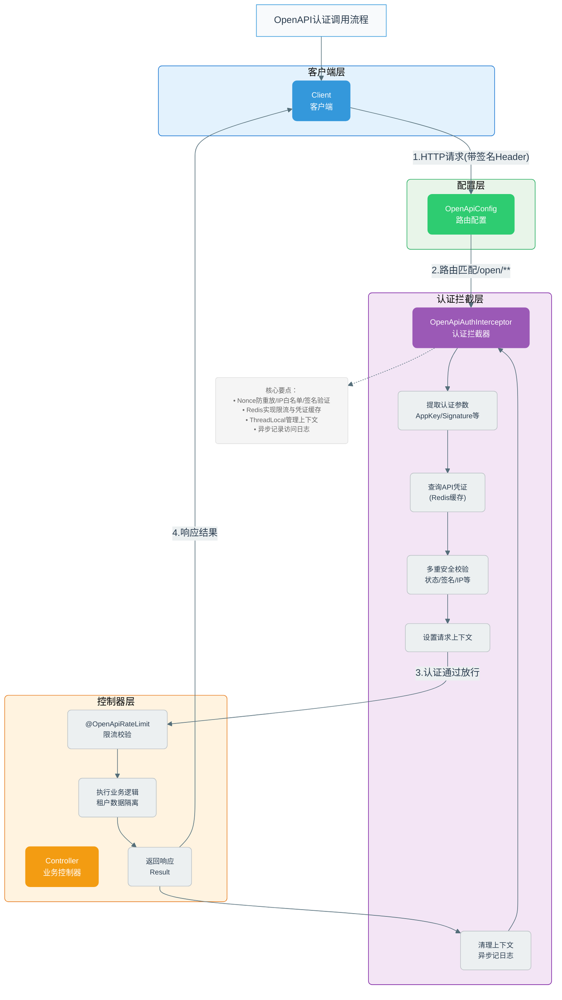
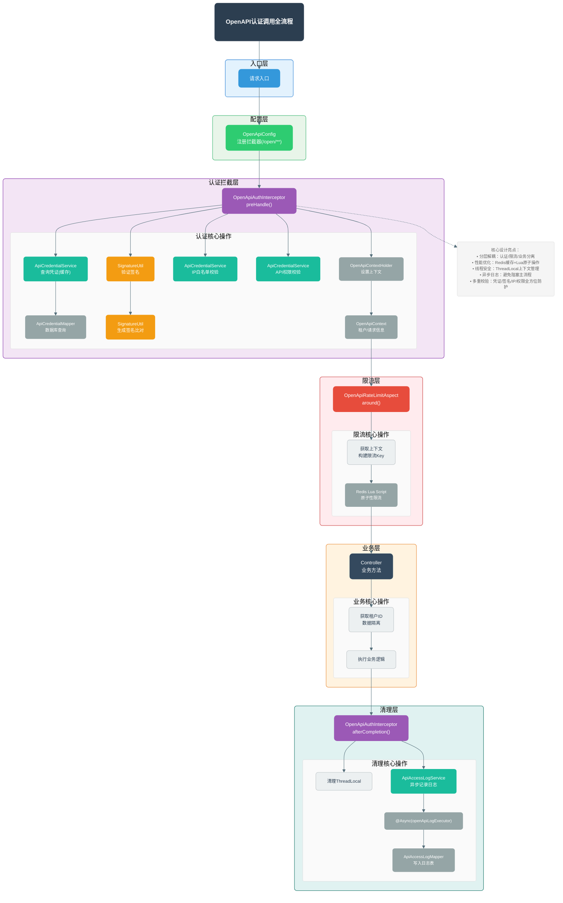

# ArcChat 开放API技术文档

## 一、全链路调用流程

~~~mermaid
erDiagram
    api_credential {
        BIGINT id PK "主键ID"
        BIGINT tenant_id "租户ID（关联业务用户）"
        VARCHAR(100) app_name "应用名称"
        VARCHAR(64) app_key UK "AppKey（公开标识）"
        VARCHAR(128) app_secret "AppSecret（加密存储）"
        TINYINT status "状态：0-禁用 1-启用"
        BIGINT daily_quota "每日调用配额（-1无限制）"
        INT qps_limit "QPS限制"
        JSON allowed_apis "允许访问的API列表"
        JSON ip_whitelist "IP白名单"
        DATETIME expire_time "过期时间"
        DATETIME create_time "创建时间"
        DATETIME update_time "更新时间"
        TINYINT deleted "逻辑删除：0-未删 1-已删"
    }

    api_access_log {
        BIGINT id PK "主键ID"
        VARCHAR(64) request_id "请求唯一标识"
        VARCHAR(64) app_key "关联api_credential.app_key"
        BIGINT tenant_id "租户ID"
        VARCHAR(255) request_path "请求路径"
        VARCHAR(10) request_method "请求方法"
        TEXT request_params "请求参数（脱敏）"
        INT response_code "响应状态码"
        BIGINT response_time "响应耗时（毫秒）"
        VARCHAR(64) client_ip "客户端IP"
        VARCHAR(500) user_agent "User-Agent"
        TEXT error_message "错误信息"
        DATETIME create_time "创建时间"
    }

    api_call_statistics {
        BIGINT id PK "主键ID"
        VARCHAR(64) app_key "关联api_credential.app_key"
        BIGINT tenant_id "租户ID"
        DATE stat_date "统计日期"
        VARCHAR(255) api_path "API路径"
        BIGINT total_count "总调用次数"
        BIGINT success_count "成功次数"
        BIGINT fail_count "失败次数"
        BIGINT avg_response_time "平均响应时间（毫秒）"
        BIGINT max_response_time "最大响应时间（毫秒）"
        DATETIME create_time "创建时间"
        DATETIME update_time "更新时间"
    }

    api_credential ||--o{ api_access_log : "app_key关联"
    api_credential ||--o{ api_call_statistics : "app_key关联"
    api_access_log }|--|| api_call_statistics : "统计来源"
~~~


### 1.1 架构总览

```
┌──────────────────────────────────────────────────────────────────┐
│                         API Gateway 层                           │
│  (认证鉴权、限流、日志、路由、协议转换、版本控制)                    │
└──────────────────────────────────────────────────────────────────┘
                                │
                ┌───────────────┼───────────────┐
                ▼               ▼               ▼
        ┌─────────────┐ ┌─────────────┐ ┌─────────────┐
        │ 内部API     │ │ 开放API     │ │ 管理API     │
        │ /internal/* │ │ /open/v1/*  │ │ /admin/*    │
        └─────────────┘ └─────────────┘ └─────────────┘
```

### 1.2 请求全链路时序图



### 1.3 核心类调用链路



### 1.4 项目结构

```
common/openapi/
├── annotation/
│   └── OpenApiRateLimit.java          # 多维度限流注解
├── aspect/
│   └── OpenApiRateLimitAspect.java    # 限流切面（Redis滑动窗口）
├── config/
│   ├── OpenApiConfig.java             # 拦截器配置
│   └── OpenApiThreadPoolConfig.java   # 异步线程池配置
├── context/
│   ├── OpenApiContext.java            # 请求上下文
│   └── OpenApiContextHolder.java      # ThreadLocal持有者
├── controller/
│   └── OpenApiDemoController.java     # 示例Controller
├── domain/entity/
│   ├── ApiCredential.java             # API凭证实体
│   └── ApiAccessLog.java              # 访问日志实体
├── exception/
│   └── OpenApiErrorEnum.java          # 标准错误码
├── interceptor/
│   └── OpenApiAuthInterceptor.java    # 认证鉴权拦截器
├── mapper/
│   ├── ApiCredentialMapper.java
│   └── ApiAccessLogMapper.java
├── service/
│   ├── ApiCredentialService.java
│   ├── ApiAccessLogService.java       # 异步日志记录
│   └── impl/ApiCredentialServiceImpl.java
├── util/
│   └── SignatureUtil.java             # HMAC-SHA256签名工具
└── version/
    └── ApiVersion.java                # 版本注解

sql/
└── open_api_tables.sql                # 数据库表结构
```

---

## 二、核心类详解

### 2.1 ApiCredential - API凭证实体

```java
package com.senjay.archat.common.openapi.domain.entity;

import com.baomidou.mybatisplus.annotation.*;
import lombok.Data;
import lombok.experimental.Accessors;

import java.time.LocalDateTime;

/**
 * API凭证实体 - 用于开放API的身份认证
 * <p>
 * 每个接入方（租户）分配一对 AppKey + AppSecret
 * </p>
 */
@Data
@Accessors(chain = true)
@TableName("api_credential")
public class ApiCredential {

    @TableId(type = IdType.AUTO)
    private Long id;

    /**
     * 租户ID - 关联业务用户
     */
    private Long tenantId;

    /**
     * 应用名称
     */
    private String appName;

    /**
     * AppKey - 公开标识（32位UUID）
     */
    private String appKey;

    /**
     * AppSecret - 私密密钥（64位随机字符串，加密存储）
     */
    private String appSecret;

    /**
     * 状态：0-禁用 1-启用
     */
    private Integer status;

    /**
     * 每日调用配额（-1表示无限制）
     */
    private Long dailyQuota;

    /**
     * QPS限制（每秒请求数）
     */
    private Integer qpsLimit;

    /**
     * 允许访问的API列表（JSON格式，空表示全部）
     */
    private String allowedApis;

    /**
     * IP白名单（JSON数组，空表示不限制）
     */
    private String ipWhitelist;

    /**
     * 过期时间（null表示永不过期）
     */
    private LocalDateTime expireTime;

    @TableField(fill = FieldFill.INSERT)
    private LocalDateTime createTime;

    @TableField(fill = FieldFill.INSERT_UPDATE)
    private LocalDateTime updateTime;

    @TableLogic
    private Integer deleted;
}
```

**类作用说明：**

| 职责 | 说明 |
|------|------|
| **身份标识** | 存储每个接入方的 `AppKey`（公开标识）和 `AppSecret`（私密密钥） |
| **多租户隔离** | 通过 `tenantId` 关联业务用户，实现数据隔离 |
| **访问控制** | `status` 控制凭证启用/禁用，`expireTime` 控制有效期 |
| **权限管理** | `allowedApis` 限制可访问的API列表，`ipWhitelist` 限制来源IP |
| **配额限制** | `dailyQuota` 控制每日调用次数，`qpsLimit` 控制每秒请求数 |

**核心字段说明：**
- `appKey`：32位UUID，用于标识接入方，可公开传输
- `appSecret`：64位随机字符串，用于签名验证，需加密存储
- `allowedApis`：JSON数组格式，如 `["/open/v1/user/**", "/open/v1/message/**"]`
- `ipWhitelist`：JSON数组格式，支持通配符，如 `["192.168.1.*", "10.0.0.1"]`

---

### 2.2 ApiAccessLog - API访问日志实体

```java
package com.senjay.archat.common.openapi.domain.entity;

import com.baomidou.mybatisplus.annotation.*;
import lombok.Data;
import lombok.experimental.Accessors;

import java.time.LocalDateTime;

/**
 * API访问日志 - 用于审计、统计和故障排查
 */
@Data
@Accessors(chain = true)
@TableName("api_access_log")
public class ApiAccessLog {

    @TableId(type = IdType.AUTO)
    private Long id;

    /**
     * 请求唯一标识（用于链路追踪）
     */
    private String requestId;

    /**
     * AppKey
     */
    private String appKey;

    /**
     * 租户ID
     */
    private Long tenantId;

    /**
     * 请求路径
     */
    private String requestPath;

    /**
     * 请求方法
     */
    private String requestMethod;

    /**
     * 请求参数（脱敏后）
     */
    private String requestParams;

    /**
     * 响应状态码
     */
    private Integer responseCode;

    /**
     * 响应耗时（毫秒）
     */
    private Long responseTime;

    /**
     * 客户端IP
     */
    private String clientIp;

    /**
     * User-Agent
     */
    private String userAgent;

    /**
     * 错误信息（如有）
     */
    private String errorMessage;

    @TableField(fill = FieldFill.INSERT)
    private LocalDateTime createTime;
}
```

**类作用说明：**

| 职责 | 说明 |
|------|------|
| **审计追踪** | 记录每次API调用的完整信息，满足安全审计要求 |
| **链路追踪** | 通过 `requestId` 实现分布式链路追踪，快速定位问题 |
| **性能分析** | `responseTime` 记录响应耗时，用于性能监控和优化 |
| **故障排查** | `errorMessage` 记录错误详情，便于问题定位 |
| **统计分析** | 支持按租户、API、时间维度进行调用量统计 |

**使用建议：**
- 建议按月分表存储，避免单表数据量过大
- `requestParams` 需脱敏处理，避免敏感信息泄露
- 可通过定时任务汇总到统计表，减少查询压力

---

### 2.3 SignatureUtil - 签名工具类

```java

/**
 * API签名工具类
 * <p>
 * 签名算法：HMAC-SHA256
 * 签名规则：
 * 1. 将所有请求参数按key字典序排序
 * 2. 拼接成 key1=value1&key2=value2 格式
 * 3. 追加 timestamp 和 nonce
 * 4. 使用 AppSecret 进行 HMAC-SHA256 签名
 * </p>
 */
public final class SignatureUtil {

    private SignatureUtil() {
    }

    /**
     * 签名有效期（毫秒）- 防重放攻击
     */
    private static final long SIGNATURE_EXPIRE_MS = 5 * 60 * 1000L;

    /**
     * 生成签名
     *
     * @param params    请求参数
     * @param timestamp 时间戳（毫秒）
     * @param nonce     随机字符串
     * @param appSecret 应用密钥
     * @return 签名字符串
     */
    public static String generateSignature(Map<String, String> params, 
                                           long timestamp, 
                                           String nonce, 
                                           String appSecret) {
        // 1. 参数按key排序
        TreeMap<String, String> sortedParams = new TreeMap<>(params);
        
        // 2. 拼接参数
        String paramString = sortedParams.entrySet().stream()
                .filter(e -> StrUtil.isNotBlank(e.getValue()))
                .map(e -> e.getKey() + "=" + e.getValue())
                .collect(Collectors.joining("&"));
        
        // 3. 追加时间戳和随机数
        String stringToSign = paramString + "&timestamp=" + timestamp + "&nonce=" + nonce;
        
        // 4. HMAC-SHA256签名
        return SecureUtil.hmacSha256(appSecret).digestHex(stringToSign);
    }

    /**
     * 验证签名
     *
     * @param params       请求参数
     * @param timestamp    时间戳
     * @param nonce        随机字符串
     * @param signature    待验证签名
     * @param appSecret    应用密钥
     * @return 验证结果
     */
    public static SignatureResult verifySignature(Map<String, String> params,
                                                   long timestamp,
                                                   String nonce,
                                                   String signature,
                                                   String appSecret) {
        // 1. 验证时间戳（防重放）
        long now = System.currentTimeMillis();
        if (Math.abs(now - timestamp) > SIGNATURE_EXPIRE_MS) {
            return SignatureResult.expired();
        }

        // 2. 验证签名
        String expectedSignature = generateSignature(params, timestamp, nonce, appSecret);
        if (!expectedSignature.equalsIgnoreCase(signature)) {
            return SignatureResult.invalid();
        }

        return SignatureResult.success();
    }

    /**
     * 签名验证结果
     */
    public static class SignatureResult {
        private final boolean valid;
        private final String errorMsg;

        private SignatureResult(boolean valid, String errorMsg) {
            this.valid = valid;
            this.errorMsg = errorMsg;
        }

        public static SignatureResult success() {
            return new SignatureResult(true, null);
        }

        public static SignatureResult expired() {
            return new SignatureResult(false, "签名已过期，请检查系统时间");
        }

        public static SignatureResult invalid() {
            return new SignatureResult(false, "签名验证失败");
        }

        public boolean isValid() {
            return valid;
        }

        public String getErrorMsg() {
            return errorMsg;
        }
    }
}
```

**类作用说明：**

| 职责 | 说明 |
|------|------|
| **防篡改** | 使用HMAC-SHA256算法对请求参数签名，确保数据完整性 |
| **防重放** | 通过时间戳验证，签名有效期为5分钟，过期请求将被拒绝 |
| **身份验证** | 只有持有正确AppSecret的调用方才能生成有效签名 |

**签名流程：**
```
1. 参数字典序排序    →  a=1&b=2&c=3
2. 追加时间戳/随机数  →  a=1&b=2&c=3&timestamp=xxx&nonce=xxx
3. HMAC-SHA256签名   →  使用AppSecret作为密钥生成签名
```

**核心方法：**
- `generateSignature()`：生成签名，供客户端SDK调用
- `verifySignature()`：验证签名，供服务端拦截器调用

---

### 2.4 OpenApiAuthInterceptor - 认证鉴权拦截器

```java
/**
 * 开放API认证拦截器
 * <p>
 * 职责：
 * 1. AppKey/AppSecret 验证
 * 2. 签名验证（防篡改）
 * 3. 时间戳验证（防重放）
 * 4. Nonce验证（防重放）
 * 5. IP白名单验证
 * 6. API权限验证
 * </p>
 */
@Slf4j
@Component
@RequiredArgsConstructor
public class OpenApiAuthInterceptor implements HandlerInterceptor {

    private final ApiCredentialService credentialService;
    private final StringRedisTemplate redisTemplate;
    private final ObjectMapper objectMapper;

    /**
     * Nonce缓存前缀（用于防重放）
     */
    private static final String NONCE_KEY_PREFIX = "openapi:nonce:";

    /**
     * Nonce有效期（秒）
     */
    private static final long NONCE_EXPIRE_SECONDS = 300;

    @Override
    public boolean preHandle(HttpServletRequest request, 
                            HttpServletResponse response, 
                            Object handler) throws Exception {
        // 生成请求ID（链路追踪）
        String requestId = UUID.randomUUID().toString().replace("-", "");
        
        // 1. 提取认证参数
        String appKey = request.getHeader("X-App-Key");
        String signature = request.getHeader("X-Signature");
        String timestampStr = request.getHeader("X-Timestamp");
        String nonce = request.getHeader("X-Nonce");

        // 2. 参数完整性校验
        if (StrUtil.hasBlank(appKey, signature, timestampStr, nonce)) {
            writeError(response, 401, "缺少必要的认证参数", requestId);
            return false;
        }

        long timestamp;
        try {
            timestamp = Long.parseLong(timestampStr);
        } catch (NumberFormatException e) {
            writeError(response, 401, "时间戳格式错误", requestId);
            return false;
        }

        // 3. 查询API凭证
        ApiCredential credential = credentialService.getByAppKey(appKey);
        if (credential == null) {
            writeError(response, 401, "无效的AppKey", requestId);
            return false;
        }

        // 4. 凭证状态校验
        if (credential.getStatus() != 1) {
            writeError(response, 403, "API凭证已被禁用", requestId);
            return false;
        }

        // 5. 过期时间校验
        if (credential.getExpireTime() != null && 
            credential.getExpireTime().isBefore(LocalDateTime.now())) {
            writeError(response, 403, "API凭证已过期", requestId);
            return false;
        }

        // 6. Nonce防重放校验
        String nonceKey = NONCE_KEY_PREFIX + appKey + ":" + nonce;
        Boolean nonceExists = redisTemplate.hasKey(nonceKey);
        if (Boolean.TRUE.equals(nonceExists)) {
            writeError(response, 401, "请求已被处理，请勿重复提交", requestId);
            return false;
        }
        // 记录Nonce
        redisTemplate.opsForValue().set(nonceKey, "1", NONCE_EXPIRE_SECONDS, TimeUnit.SECONDS);

        // 7. IP白名单校验
        String clientIp = getClientIp(request);
        if (!credentialService.isIpAllowed(credential, clientIp)) {
            writeError(response, 403, "IP地址不在白名单内", requestId);
            return false;
        }

        // 8. 签名验证
        Map<String, String> params = extractParams(request);
        SignatureUtil.SignatureResult signResult = SignatureUtil.verifySignature(
                params, timestamp, nonce, signature, credential.getAppSecret());
        if (!signResult.isValid()) {
            writeError(response, 401, signResult.getErrorMsg(), requestId);
            return false;
        }

        // 9. API权限校验
        String requestPath = request.getRequestURI();
        if (!credentialService.isApiAllowed(credential, requestPath)) {
            writeError(response, 403, "无权访问该API", requestId);
            return false;
        }

        // 10. 设置上下文信息
        OpenApiContext context = new OpenApiContext()
                .setRequestId(requestId)
                .setAppKey(appKey)
                .setTenantId(credential.getTenantId())
                .setClientIp(clientIp)
                .setRequestPath(requestPath)
                .setStartTime(System.currentTimeMillis());
        OpenApiContextHolder.set(context);

        // 设置响应头
        response.setHeader("X-Request-Id", requestId);

        return true;
    }

    @Override
    public void afterCompletion(HttpServletRequest request, 
                               HttpServletResponse response, 
                               Object handler, 
                               Exception ex) {
        // 清理上下文
        OpenApiContextHolder.remove();
    }

    /**
     * 提取请求参数
     */
    private Map<String, String> extractParams(HttpServletRequest request) {
        Map<String, String> params = new HashMap<>();
        request.getParameterMap().forEach((key, values) -> {
            if (values != null && values.length > 0) {
                params.put(key, values[0]);
            }
        });
        return params;
    }

    /**
     * 获取客户端真实IP
     */
    private String getClientIp(HttpServletRequest request) {
        String ip = request.getHeader("X-Forwarded-For");
        if (StrUtil.isBlank(ip) || "unknown".equalsIgnoreCase(ip)) {
            ip = request.getHeader("X-Real-IP");
        }
        if (StrUtil.isBlank(ip) || "unknown".equalsIgnoreCase(ip)) {
            ip = request.getRemoteAddr();
        }
        // 多级代理取第一个
        if (ip != null && ip.contains(",")) {
            ip = ip.split(",")[0].trim();
        }
        return ip;
    }

    /**
     * 写入错误响应
     */
    private void writeError(HttpServletResponse response, int code, String msg, String requestId) 
            throws IOException {
        response.setContentType("application/json;charset=UTF-8");
        response.setHeader("X-Request-Id", requestId);
        Result<?> result = Result.fail(code, msg);
        response.getWriter().write(objectMapper.writeValueAsString(result));
    }
}
```

**类作用说明：**

| 职责 | 说明 |
|------|------|
| **统一认证入口** | 所有 `/open/**` 请求的认证鉴权统一入口 |
| **多重安全校验** | 凭证状态、过期时间、Nonce防重放、IP白名单、签名验证、API权限 |
| **上下文管理** | 认证通过后设置 `OpenApiContext`，请求结束后清理 |
| **链路追踪** | 生成唯一 `requestId` 并设置到响应头 |

**preHandle() 校验流程（共10步）：**
```
1. 生成requestId           → 用于链路追踪
2. 提取认证参数             → X-App-Key, X-Signature, X-Timestamp, X-Nonce
3. 参数完整性校验           → 缺少任一参数返回401
4. 查询API凭证             → 通过AppKey查询（带缓存）
5. 凭证状态校验             → status必须为1
6. 过期时间校验             → expireTime未过期
7. Nonce防重放校验          → Redis检查Nonce是否已使用
8. IP白名单校验             → 客户端IP在白名单内
9. 签名验证                → 调用SignatureUtil验证
10. API权限校验            → 请求路径在允许列表内
```

**关键依赖：**
- `ApiCredentialService`：凭证查询服务
- `SignatureUtil`：签名验证工具
- `StringRedisTemplate`：Nonce防重放存储
- `OpenApiContextHolder`：上下文存储

---

### 2.5 OpenApiContext - 请求上下文

```java
package com.senjay.archat.common.openapi.context;

import lombok.Data;
import lombok.experimental.Accessors;

/**
 * 开放API请求上下文
 * <p>
 * 存储当前请求的租户信息，用于：
 * 1. 数据隔离（多租户）
 * 2. 日志追踪
 * 3. 限流统计
 * </p>
 */
@Data
@Accessors(chain = true)
public class OpenApiContext {

    /**
     * 请求唯一标识（链路追踪）
     */
    private String requestId;

    /**
     * AppKey
     */
    private String appKey;

    /**
     * 租户ID
     */
    private Long tenantId;

    /**
     * 客户端IP
     */
    private String clientIp;

    /**
     * 请求路径
     */
    private String requestPath;

    /**
     * 请求开始时间（毫秒）
     */
    private Long startTime;
}
```

**类作用说明：**

| 职责 | 说明 |
|------|------|
| **请求信息载体** | 存储当前请求的关键信息，在整个请求链路中传递 |
| **多租户隔离** | 通过 `tenantId` 实现业务数据隔离 |
| **链路追踪** | `requestId` 贯穿整个请求链路，便于日志追踪 |
| **性能统计** | `startTime` 用于计算请求耗时 |

**字段说明：**
- `requestId`：请求唯一标识，32位UUID
- `appKey`：调用方标识
- `tenantId`：租户ID，用于数据隔离
- `clientIp`：客户端真实IP
- `requestPath`：请求路径
- `startTime`：请求开始时间戳

---

### 2.6 OpenApiContextHolder - 上下文持有者

```java
package com.senjay.archat.common.openapi.context;

/**
 * 开放API上下文持有者（ThreadLocal）
 */
public final class OpenApiContextHolder {

    private static final ThreadLocal<OpenApiContext> CONTEXT = new ThreadLocal<>();

    private OpenApiContextHolder() {
    }

    public static void set(OpenApiContext context) {
        CONTEXT.set(context);
    }

    public static OpenApiContext get() {
        return CONTEXT.get();
    }

    public static void remove() {
        CONTEXT.remove();
    }

    /**
     * 获取当前请求ID
     */
    public static String getRequestId() {
        OpenApiContext context = get();
        return context != null ? context.getRequestId() : null;
    }

    /**
     * 获取当前租户ID
     */
    public static Long getTenantId() {
        OpenApiContext context = get();
        return context != null ? context.getTenantId() : null;
    }

    /**
     * 获取当前AppKey
     */
    public static String getAppKey() {
        OpenApiContext context = get();
        return context != null ? context.getAppKey() : null;
    }
}
```

**类作用说明：**

| 职责 | 说明 |
|------|------|
| **线程隔离存储** | 使用 `ThreadLocal` 存储请求上下文，线程安全 |
| **便捷访问入口** | 提供静态方法直接获取租户ID、AppKey等信息 |
| **生命周期管理** | `set()` 设置上下文，`remove()` 清理防止内存泄漏 |

**核心方法：**
- `set(OpenApiContext)`：拦截器认证通过后设置上下文
- `get()`：获取完整上下文对象
- `remove()`：请求结束后清理（**必须调用，防止内存泄漏**）
- `getTenantId()`：快捷获取租户ID，用于业务层数据隔离
- `getRequestId()`：快捷获取请求ID，用于日志追踪
- `getAppKey()`：快捷获取AppKey，用于限流Key构建

**使用示例：**
```java
// 在Controller或Service中获取租户信息
Long tenantId = OpenApiContextHolder.getTenantId();
// 根据tenantId做数据隔离查询
userMapper.selectByTenantId(tenantId);
```

---

### 2.7 ApiCredentialService - 凭证服务接口

```java
package com.senjay.archat.common.openapi.service;

import com.senjay.archat.common.openapi.domain.entity.ApiCredential;

/**
 * API凭证服务接口
 */
public interface ApiCredentialService {

    /**
     * 根据AppKey查询凭证
     *
     * @param appKey AppKey
     * @return 凭证信息（带缓存）
     */
    ApiCredential getByAppKey(String appKey);

    /**
     * 创建新凭证
     *
     * @param tenantId 租户ID
     * @param appName  应用名称
     * @return 创建的凭证（含AppKey和AppSecret）
     */
    ApiCredential createCredential(Long tenantId, String appName);

    /**
     * 重置AppSecret
     *
     * @param appKey AppKey
     * @return 新的AppSecret
     */
    String resetSecret(String appKey);

    /**
     * 禁用凭证
     *
     * @param appKey AppKey
     */
    void disableCredential(String appKey);

    /**
     * 启用凭证
     *
     * @param appKey AppKey
     */
    void enableCredential(String appKey);

    /**
     * 检查IP是否在白名单内
     *
     * @param credential 凭证
     * @param clientIp   客户端IP
     * @return 是否允许
     */
    boolean isIpAllowed(ApiCredential credential, String clientIp);

    /**
     * 检查API是否允许访问
     *
     * @param credential  凭证
     * @param requestPath 请求路径
     * @return 是否允许
     */
    boolean isApiAllowed(ApiCredential credential, String requestPath);

    /**
     * 增加调用次数（用于配额统计）
     *
     * @param appKey AppKey
     * @return 当日已调用次数
     */
    long incrementCallCount(String appKey);

    /**
     * 检查是否超出配额
     *
     * @param credential 凭证
     * @return 是否超出
     */
    boolean isQuotaExceeded(ApiCredential credential);
}
```

**接口作用说明：**

| 方法 | 说明 |
|------|------|
| `getByAppKey()` | 根据AppKey查询凭证，带缓存 |
| `createCredential()` | 创建新凭证，返回AppKey和AppSecret |
| `resetSecret()` | 重置AppSecret，清除缓存 |
| `disableCredential()` | 禁用凭证 |
| `enableCredential()` | 启用凭证 |
| `isIpAllowed()` | 检查客户端IP是否在白名单内 |
| `isApiAllowed()` | 检查请求路径是否有权访问 |
| `incrementCallCount()` | 增加调用次数统计 |
| `isQuotaExceeded()` | 检查是否超出每日配额 |

---

### 2.8 ApiCredentialServiceImpl - 凭证服务实现

```java
package com.senjay.archat.common.openapi.service.impl;

import cn.hutool.core.util.RandomUtil;
import cn.hutool.core.util.StrUtil;
import cn.hutool.crypto.SecureUtil;
import cn.hutool.json.JSONUtil;
import com.baomidou.mybatisplus.core.conditions.query.LambdaQueryWrapper;
import com.senjay.archat.common.openapi.domain.entity.ApiCredential;
import com.senjay.archat.common.openapi.mapper.ApiCredentialMapper;
import com.senjay.archat.common.openapi.service.ApiCredentialService;
import lombok.RequiredArgsConstructor;
import lombok.extern.slf4j.Slf4j;
import org.springframework.cache.annotation.CacheEvict;
import org.springframework.cache.annotation.Cacheable;
import org.springframework.data.redis.core.StringRedisTemplate;
import org.springframework.stereotype.Service;
import org.springframework.util.AntPathMatcher;

import java.time.LocalDate;
import java.time.format.DateTimeFormatter;
import java.util.List;
import java.util.UUID;
import java.util.concurrent.TimeUnit;

/**
 * API凭证服务实现
 */
@Slf4j
@Service
@RequiredArgsConstructor
public class ApiCredentialServiceImpl implements ApiCredentialService {

    private final ApiCredentialMapper credentialMapper;
    private final StringRedisTemplate redisTemplate;
    
    private static final String CACHE_NAME = "apiCredential";
    private static final String CALL_COUNT_PREFIX = "openapi:call_count:";
    private static final AntPathMatcher PATH_MATCHER = new AntPathMatcher();

    @Override
    @Cacheable(value = CACHE_NAME, key = "#appKey", unless = "#result == null")
    public ApiCredential getByAppKey(String appKey) {
        return credentialMapper.selectOne(
                new LambdaQueryWrapper<ApiCredential>()
                        .eq(ApiCredential::getAppKey, appKey)
                        .eq(ApiCredential::getDeleted, 0)
        );
    }

    @Override
    public ApiCredential createCredential(Long tenantId, String appName) {
        ApiCredential credential = new ApiCredential()
                .setTenantId(tenantId)
                .setAppName(appName)
                .setAppKey(generateAppKey())
                .setAppSecret(generateAppSecret())
                .setStatus(1)
                .setDailyQuota(-1L)
                .setQpsLimit(100);
        
        credentialMapper.insert(credential);
        log.info("创建API凭证成功: appKey={}, tenantId={}", credential.getAppKey(), tenantId);
        return credential;
    }

    @Override
    @CacheEvict(value = CACHE_NAME, key = "#appKey")
    public String resetSecret(String appKey) {
        String newSecret = generateAppSecret();
        ApiCredential credential = new ApiCredential()
                .setAppSecret(encryptSecret(newSecret));
        
        credentialMapper.update(credential,
                new LambdaQueryWrapper<ApiCredential>()
                        .eq(ApiCredential::getAppKey, appKey));
        
        log.info("重置AppSecret成功: appKey={}", appKey);
        return newSecret;
    }

    @Override
    @CacheEvict(value = CACHE_NAME, key = "#appKey")
    public void disableCredential(String appKey) {
        ApiCredential credential = new ApiCredential().setStatus(0);
        credentialMapper.update(credential,
                new LambdaQueryWrapper<ApiCredential>()
                        .eq(ApiCredential::getAppKey, appKey));
        log.info("禁用API凭证: appKey={}", appKey);
    }

    @Override
    @CacheEvict(value = CACHE_NAME, key = "#appKey")
    public void enableCredential(String appKey) {
        ApiCredential credential = new ApiCredential().setStatus(1);
        credentialMapper.update(credential,
                new LambdaQueryWrapper<ApiCredential>()
                        .eq(ApiCredential::getAppKey, appKey));
        log.info("启用API凭证: appKey={}", appKey);
    }

    @Override
    public boolean isIpAllowed(ApiCredential credential, String clientIp) {
        String ipWhitelist = credential.getIpWhitelist();
        // 白名单为空表示不限制
        if (StrUtil.isBlank(ipWhitelist)) {
            return true;
        }
        
        List<String> allowedIps = JSONUtil.toList(ipWhitelist, String.class);
        if (allowedIps.isEmpty()) {
            return true;
        }
        
        // 支持CIDR和通配符匹配
        for (String pattern : allowedIps) {
            if (matchIp(pattern, clientIp)) {
                return true;
            }
        }
        return false;
    }

    @Override
    public boolean isApiAllowed(ApiCredential credential, String requestPath) {
        String allowedApis = credential.getAllowedApis();
        // 为空表示允许所有
        if (StrUtil.isBlank(allowedApis)) {
            return true;
        }
        
        List<String> patterns = JSONUtil.toList(allowedApis, String.class);
        if (patterns.isEmpty()) {
            return true;
        }
        
        // ANT风格路径匹配
        for (String pattern : patterns) {
            if (PATH_MATCHER.match(pattern, requestPath)) {
                return true;
            }
        }
        return false;
    }

    @Override
    public long incrementCallCount(String appKey) {
        String dateStr = LocalDate.now().format(DateTimeFormatter.BASIC_ISO_DATE);
        String key = CALL_COUNT_PREFIX + appKey + ":" + dateStr;
        
        Long count = redisTemplate.opsForValue().increment(key);
        // 设置过期时间（次日凌晨过期）
        redisTemplate.expire(key, 2, TimeUnit.DAYS);
        
        return count != null ? count : 0;
    }

    @Override
    public boolean isQuotaExceeded(ApiCredential credential) {
        if (credential.getDailyQuota() == null || credential.getDailyQuota() < 0) {
            return false;
        }
        
        String dateStr = LocalDate.now().format(DateTimeFormatter.BASIC_ISO_DATE);
        String key = CALL_COUNT_PREFIX + credential.getAppKey() + ":" + dateStr;
        String countStr = redisTemplate.opsForValue().get(key);
        
        long currentCount = countStr != null ? Long.parseLong(countStr) : 0;
        return currentCount >= credential.getDailyQuota();
    }

    /**
     * 生成AppKey（32位）
     */
    private String generateAppKey() {
        return UUID.randomUUID().toString().replace("-", "");
    }

    /**
     * 生成AppSecret（64位随机字符串）
     */
    private String generateAppSecret() {
        return RandomUtil.randomString(64);
    }

    /**
     * 加密存储Secret（实际生产环境应使用更安全的加密方式）
     */
    private String encryptSecret(String secret) {
        // 这里简化处理，实际应使用AES等对称加密
        return SecureUtil.sha256(secret);
    }

    /**
     * IP匹配（支持通配符）
     */
    private boolean matchIp(String pattern, String ip) {
        if (pattern.contains("*")) {
            String regex = pattern.replace(".", "\\.").replace("*", ".*");
            return ip.matches(regex);
        }
        return pattern.equals(ip);
    }
}
```

**类作用说明：**

| 职责 | 说明 |
|------|------|
| **凭证管理** | 创建、查询、禁用、启用API凭证 |
| **缓存优化** | 使用 `@Cacheable` 缓存凭证查询，减少数据库压力 |
| **权限验证** | IP白名单匹配（支持通配符）、API路径匹配（ANT风格） |
| **配额统计** | 基于Redis的每日调用量统计 |

**核心实现细节：**

1. **凭证缓存**：`@Cacheable(value = "apiCredential", key = "#appKey")`
2. **缓存失效**：修改凭证时使用 `@CacheEvict` 清除缓存
3. **AppKey生成**：32位UUID
4. **AppSecret生成**：64位随机字符串
5. **IP匹配**：支持 `192.168.1.*` 通配符格式
6. **API匹配**：使用 `AntPathMatcher` 支持 `/open/v1/**` 格式
7. **调用统计Key**：`openapi:call_count:{appKey}:{yyyyMMdd}`

---

### 2.9 ApiCredentialMapper - 凭证数据访问

```java
package com.senjay.archat.common.openapi.mapper;

import com.baomidou.mybatisplus.core.mapper.BaseMapper;
import com.senjay.archat.common.openapi.domain.entity.ApiCredential;
import org.apache.ibatis.annotations.Mapper;

/**
 * API凭证Mapper
 */
@Mapper
public interface ApiCredentialMapper extends BaseMapper<ApiCredential> {
}
```

**类作用说明：**
- 继承 `BaseMapper<ApiCredential>`，提供标准CRUD操作
- 被 `ApiCredentialServiceImpl` 调用进行数据库操作
- 无需编写XML，MyBatis-Plus自动实现

---

### 2.10 OpenApiRateLimit - 限流注解

```java
package com.senjay.archat.common.openapi.annotation;

import java.lang.annotation.*;
import java.util.concurrent.TimeUnit;

/**
 * 开放API限流注解
 * <p>
 * 支持多维度限流：
 * 1. 按租户（AppKey）限流
 * 2. 按接口限流
 * 3. 全局限流
 * </p>
 */
@Retention(RetentionPolicy.RUNTIME)
@Target(ElementType.METHOD)
@Documented
public @interface OpenApiRateLimit {

    /**
     * 限流维度
     */
    Dimension dimension() default Dimension.APP_KEY;

    /**
     * 时间窗口
     */
    int time() default 1;

    /**
     * 时间单位
     */
    TimeUnit unit() default TimeUnit.SECONDS;

    /**
     * 允许的最大请求数
     */
    int count() default 10;

    /**
     * 限流提示信息
     */
    String message() default "请求过于频繁，请稍后再试";

    /**
     * 限流维度枚举
     */
    enum Dimension {
        /**
         * 按AppKey限流（租户级）
         */
        APP_KEY,
        
        /**
         * 按AppKey + 接口路径限流
         */
        APP_KEY_API,
        
        /**
         * 按IP限流
         */
        IP,
        
        /**
         * 全局限流（所有请求共享）
         */
        GLOBAL
    }
}
```

**注解作用说明：**

| 属性 | 说明 | 默认值 |
|------|------|--------|
| `dimension` | 限流维度 | `APP_KEY` |
| `time` | 时间窗口 | 1 |
| `unit` | 时间单位 | `SECONDS` |
| `count` | 最大请求数 | 10 |
| `message` | 限流提示信息 | "请求过于频繁..." |

**限流维度说明：**
- `APP_KEY`：按租户限流，所有接口共享配额
- `APP_KEY_API`：按租户+接口限流，每个接口独立配额
- `IP`：按客户端IP限流
- `GLOBAL`：全局限流，所有请求共享

**使用示例：**
```java
@OpenApiRateLimit(
    dimension = Dimension.APP_KEY_API,
    time = 1, unit = TimeUnit.SECONDS,
    count = 10,
    message = "查询接口每秒最多10次"
)
public Result<User> getUser(Long id) { ... }
```

---

### 2.11 OpenApiRateLimitAspect - 限流切面

```java
package com.senjay.archat.common.openapi.aspect;

import com.senjay.archat.common.exception.FrequencyControlException;
import com.senjay.archat.common.openapi.annotation.OpenApiRateLimit;
import com.senjay.archat.common.openapi.context.OpenApiContext;
import com.senjay.archat.common.openapi.context.OpenApiContextHolder;
import lombok.RequiredArgsConstructor;
import lombok.extern.slf4j.Slf4j;
import org.aspectj.lang.ProceedingJoinPoint;
import org.aspectj.lang.annotation.Around;
import org.aspectj.lang.annotation.Aspect;
import org.aspectj.lang.reflect.MethodSignature;
import org.springframework.data.redis.core.StringRedisTemplate;
import org.springframework.data.redis.core.script.DefaultRedisScript;
import org.springframework.stereotype.Component;

import java.lang.reflect.Method;
import java.util.Collections;
import java.util.concurrent.TimeUnit;

/**
 * 开放API限流切面
 * <p>
 * 基于Redis的滑动窗口限流实现
 * </p>
 */
@Slf4j
@Aspect
@Component
@RequiredArgsConstructor
public class OpenApiRateLimitAspect {

    private final StringRedisTemplate redisTemplate;

    /**
     * Lua脚本实现原子性限流判断
     */
    private static final String RATE_LIMIT_SCRIPT = """
            local key = KEYS[1]
            local limit = tonumber(ARGV[1])
            local window = tonumber(ARGV[2])
            local current = redis.call('INCR', key)
            if current == 1 then
                redis.call('EXPIRE', key, window)
            end
            if current > limit then
                return 0
            end
            return 1
            """;

    @Around("@annotation(com.senjay.archat.common.openapi.annotation.OpenApiRateLimit)")
    public Object around(ProceedingJoinPoint joinPoint) throws Throwable {
        Method method = ((MethodSignature) joinPoint.getSignature()).getMethod();
        OpenApiRateLimit annotation = method.getAnnotation(OpenApiRateLimit.class);

        String rateLimitKey = buildRateLimitKey(annotation, method);
        long windowSeconds = annotation.unit().toSeconds(annotation.time());

        // 执行Lua脚本进行限流判断
        DefaultRedisScript<Long> script = new DefaultRedisScript<>(RATE_LIMIT_SCRIPT, Long.class);
        Long result = redisTemplate.execute(script,
                Collections.singletonList(rateLimitKey),
                String.valueOf(annotation.count()),
                String.valueOf(windowSeconds));

        if (result == null || result == 0) {
            log.warn("开放API限流触发: key={}, limit={}/{}{}", 
                    rateLimitKey, annotation.count(), annotation.time(), annotation.unit());
            throw new FrequencyControlException(annotation.message());
        }

        return joinPoint.proceed();
    }

    /**
     * 构建限流Key
     */
    private String buildRateLimitKey(OpenApiRateLimit annotation, Method method) {
        OpenApiContext context = OpenApiContextHolder.get();
        String prefix = "openapi:rate_limit:";
        
        return switch (annotation.dimension()) {
            case APP_KEY -> prefix + "app:" + 
                    (context != null ? context.getAppKey() : "unknown");
            
            case APP_KEY_API -> prefix + "app_api:" + 
                    (context != null ? context.getAppKey() : "unknown") + ":" + 
                    method.getDeclaringClass().getSimpleName() + ":" + method.getName();
            
            case IP -> prefix + "ip:" + 
                    (context != null ? context.getClientIp() : "unknown");
            
            case GLOBAL -> prefix + "global:" + 
                    method.getDeclaringClass().getSimpleName() + ":" + method.getName();
        };
    }
}
```

**类作用说明：**

| 职责 | 说明 |
|------|------|
| **AOP切面** | 拦截带有 `@OpenApiRateLimit` 注解的方法 |
| **限流判断** | 基于Redis的滑动窗口算法，原子性操作 |
| **多维度支持** | 根据注解配置构建不同的限流Key |

**Lua脚本原理：**
```lua
-- 原子性操作，保证并发安全
local current = redis.call('INCR', key)  -- 计数+1
if current == 1 then
    redis.call('EXPIRE', key, window)     -- 首次访问设置过期时间
end
if current > limit then
    return 0  -- 超出限制
end
return 1      -- 允许通过
```

**限流Key构建规则：**
| 维度 | Key格式 |
|------|---------|
| `APP_KEY` | `openapi:rate_limit:app:{appKey}` |
| `APP_KEY_API` | `openapi:rate_limit:app_api:{appKey}:{Class}:{method}` |
| `IP` | `openapi:rate_limit:ip:{clientIp}` |
| `GLOBAL` | `openapi:rate_limit:global:{Class}:{method}` |

---

### 2.12 OpenApiConfig - 拦截器配置

```java
package com.senjay.archat.common.openapi.config;

import com.senjay.archat.common.openapi.interceptor.OpenApiAuthInterceptor;
import lombok.RequiredArgsConstructor;
import org.springframework.context.annotation.Configuration;
import org.springframework.web.servlet.config.annotation.InterceptorRegistry;
import org.springframework.web.servlet.config.annotation.WebMvcConfigurer;

/**
 * 开放API配置
 */
@Configuration
@RequiredArgsConstructor
public class OpenApiConfig implements WebMvcConfigurer {

    private final OpenApiAuthInterceptor openApiAuthInterceptor;

    @Override
    public void addInterceptors(InterceptorRegistry registry) {
        // 开放API拦截器 - 只拦截 /open/** 路径
        registry.addInterceptor(openApiAuthInterceptor)
                .addPathPatterns("/open/**")
                .excludePathPatterns(
                        // 开放API文档（可选择性开放）
                        "/open/docs/**",
                        // 健康检查接口
                        "/open/health"
                );
    }
}
```

**类作用说明：**

| 职责 | 说明 |
|------|------|
| **拦截器注册** | 将 `OpenApiAuthInterceptor` 注册到Spring MVC |
| **路径匹配** | 只拦截 `/open/**` 路径 |
| **白名单设置** | 排除不需要认证的路径（如健康检查、API文档） |

**拦截规则：**
- **拦截**：所有 `/open/**` 路径
- **排除**：`/open/docs/**`（API文档）、`/open/health`（健康检查）

---

### 2.13 OpenApiDemoController - 示例Controller

```java
package com.senjay.archat.common.openapi.controller;

import com.senjay.archat.common.openapi.annotation.OpenApiRateLimit;
import com.senjay.archat.common.openapi.context.OpenApiContextHolder;
import com.senjay.archat.common.user.domain.vo.response.Result;
import io.swagger.v3.oas.annotations.Operation;
import io.swagger.v3.oas.annotations.tags.Tag;
import lombok.RequiredArgsConstructor;
import org.springframework.web.bind.annotation.*;

import java.util.HashMap;
import java.util.Map;
import java.util.concurrent.TimeUnit;

/**
 * 开放API示例Controller
 * <p>
 * 演示如何设计符合行业标准的开放API
 * </p>
 */
@Tag(name = "开放API示例", description = "展示开放API的标准设计模式")
@RestController
@RequestMapping("/open/v1")
@RequiredArgsConstructor
public class OpenApiDemoController {

    /**
     * 获取用户信息（示例）
     * <p>
     * 请求示例：
     * Headers:
     *   X-App-Key: your_app_key
     *   X-Signature: hmac_sha256_signature
     *   X-Timestamp: 1701234567890
     *   X-Nonce: random_string
     * </p>
     */
    @Operation(summary = "获取用户信息", description = "根据用户ID获取用户基本信息")
    @GetMapping("/user/{userId}")
    @OpenApiRateLimit(
            dimension = OpenApiRateLimit.Dimension.APP_KEY_API,
            time = 1,
            unit = TimeUnit.SECONDS,
            count = 10,
            message = "用户查询接口请求过于频繁"
    )
    public Result<Map<String, Object>> getUserInfo(@PathVariable Long userId) {
        // 业务逻辑：查询用户信息
        // 注意：这里应该根据租户ID做数据隔离
        Long tenantId = OpenApiContextHolder.getTenantId();
        
        Map<String, Object> userInfo = new HashMap<>();
        userInfo.put("userId", userId);
        userInfo.put("tenantId", tenantId);
        userInfo.put("requestId", OpenApiContextHolder.getRequestId());
        
        return Result.success(userInfo);
    }

    /**
     * 发送消息（示例）
     */
    @Operation(summary = "发送消息", description = "向指定用户发送消息")
    @PostMapping("/message/send")
    @OpenApiRateLimit(
            dimension = OpenApiRateLimit.Dimension.APP_KEY,
            time = 1,
            unit = TimeUnit.MINUTES,
            count = 100,
            message = "消息发送接口请求过于频繁，每分钟最多100次"
    )
    public Result<Map<String, Object>> sendMessage(@RequestBody Map<String, Object> request) {
        // 业务逻辑：发送消息
        String requestId = OpenApiContextHolder.getRequestId();
        
        Map<String, Object> response = new HashMap<>();
        response.put("requestId", requestId);
        response.put("messageId", "MSG_" + System.currentTimeMillis());
        response.put("status", "SENT");
        
        return Result.success(response);
    }

    /**
     * 健康检查（无需认证）
     */
    @Operation(summary = "健康检查", description = "检查API服务是否正常运行")
    @GetMapping("/health")
    public Result<Map<String, Object>> healthCheck() {
        Map<String, Object> health = new HashMap<>();
        health.put("status", "UP");
        health.put("timestamp", System.currentTimeMillis());
        return Result.success(health);
    }
}
```

**类作用说明：**

| 职责 | 说明 |
|------|------|
| **示例演示** | 展示开放API的标准设计模式 |
| **限流应用** | 演示 `@OpenApiRateLimit` 注解的使用方式 |
| **数据隔离** | 演示通过 `OpenApiContextHolder` 获取租户信息 |

**API设计要点：**
1. 路径版本化：`/open/v1/**`
2. 使用 `@Operation` 添加Swagger文档
3. 通过 `@OpenApiRateLimit` 配置限流规则
4. 使用 `OpenApiContextHolder.getTenantId()` 实现多租户隔离
5. 响应中包含 `requestId` 便于链路追踪

---

### 2.14 OpenApiErrorEnum - 错误码枚举

```java
package com.senjay.archat.common.openapi.exception;

import com.senjay.archat.common.exception.errorEnums.ErrorEnum;
import lombok.AllArgsConstructor;
import lombok.Getter;

/**
 * 开放API错误码枚举
 * <p>
 * 错误码规范（遵循HTTP状态码语义）：
 * - 401xxx: 认证相关错误
 * - 403xxx: 授权相关错误
 * - 429xxx: 限流相关错误
 * - 500xxx: 服务端错误
 * </p>
 */
@Getter
@AllArgsConstructor
public enum OpenApiErrorEnum implements ErrorEnum {

    // ========== 认证错误 (401) ==========
    MISSING_AUTH_PARAMS(401001, "缺少必要的认证参数"),
    INVALID_APP_KEY(401002, "无效的AppKey"),
    INVALID_SIGNATURE(401003, "签名验证失败"),
    SIGNATURE_EXPIRED(401004, "签名已过期，请检查系统时间"),
    INVALID_TIMESTAMP(401005, "时间戳格式错误"),
    DUPLICATE_REQUEST(401006, "请求已被处理，请勿重复提交"),

    // ========== 授权错误 (403) ==========
    CREDENTIAL_DISABLED(403001, "API凭证已被禁用"),
    CREDENTIAL_EXPIRED(403002, "API凭证已过期"),
    IP_NOT_ALLOWED(403003, "IP地址不在白名单内"),
    API_NOT_ALLOWED(403004, "无权访问该API"),
    QUOTA_EXCEEDED(403005, "已超出每日调用配额"),

    // ========== 限流错误 (429) ==========
    RATE_LIMIT_EXCEEDED(429001, "请求过于频繁，请稍后再试"),
    QPS_LIMIT_EXCEEDED(429002, "QPS超出限制"),

    // ========== 服务端错误 (500) ==========
    INTERNAL_ERROR(500001, "服务内部错误"),
    SERVICE_UNAVAILABLE(503001, "服务暂时不可用"),
    ;

    private final Integer code;
    private final String msg;

    @Override
    public Integer getErrorCode() {
        return this.code;
    }

    @Override
    public String getErrorMsg() {
        return this.msg;
    }
}
```

**类作用说明：**

| 职责 | 说明 |
|------|------|
| **错误码规范** | 统一定义开放API的错误码，遵循HTTP状态码语义 |
| **国际化支持** | 提供标准错误信息，便于前端展示 |
| **异常处理** | 配合 `GlobalExceptionHandler` 返回标准错误响应 |

**错误码分类：**

| 范围       | 类别    | 示例                  |
| -------- | ----- | ------------------- |
| `401xxx` | 认证错误  | 无效 AppKey、签名错误、签名过期 |
| `403xxx` | 授权错误  | 凭证禁用、IP 不在白名单、超出配额  |
| `429xxx` | 限流错误  | 请求频率过高、QPS 超限       |
| `500xxx` | 服务端错误 | 内部错误、服务不可用          |

---


## 三、接入指南

### 3.1 接入流程

```
1. 申请API凭证 → 2. 获取AppKey/AppSecret → 3. 按规范签名 → 4. 调用API
```

### 3.2 认证机制

#### 请求头规范

| Header | 必填 | 说明 |
|--------|------|------|
| `X-App-Key` | ✅ | 应用标识（32位） |
| `X-Signature` | ✅ | 请求签名（HMAC-SHA256） |
| `X-Timestamp` | ✅ | 请求时间戳（毫秒级） |
| `X-Nonce` | ✅ | 随机字符串（防重放） |

#### 签名算法

```java
// 1. 将请求参数按key字典序排序
TreeMap<String, String> sortedParams = new TreeMap<>(params);

// 2. 拼接成 key=value&key=value 格式
String paramString = sortedParams.entrySet().stream()
    .filter(e -> StringUtils.isNotBlank(e.getValue()))
    .map(e -> e.getKey() + "=" + e.getValue())
    .collect(Collectors.joining("&"));

// 3. 追加时间戳和随机数
String stringToSign = paramString + "&timestamp=" + timestamp + "&nonce=" + nonce;

// 4. HMAC-SHA256签名
String signature = HmacUtils.hmacSha256Hex(appSecret, stringToSign);
```

### 3.3 Java SDK示例

```java
public class ArcChatOpenApiClient {
    
    private final String baseUrl;
    private final String appKey;
    private final String appSecret;
    private final OkHttpClient httpClient;
    
    public ArcChatOpenApiClient(String baseUrl, String appKey, String appSecret) {
        this.baseUrl = baseUrl;
        this.appKey = appKey;
        this.appSecret = appSecret;
        this.httpClient = new OkHttpClient.Builder()
            .connectTimeout(10, TimeUnit.SECONDS)
            .readTimeout(30, TimeUnit.SECONDS)
            .build();
    }
    
    /**
     * 发送GET请求
     */
    public String get(String path, Map<String, String> params) throws IOException {
        long timestamp = System.currentTimeMillis();
        String nonce = UUID.randomUUID().toString().replace("-", "");
        String signature = generateSignature(params, timestamp, nonce);
        
        HttpUrl.Builder urlBuilder = HttpUrl.parse(baseUrl + path).newBuilder();
        params.forEach(urlBuilder::addQueryParameter);
        
        Request request = new Request.Builder()
            .url(urlBuilder.build())
            .header("X-App-Key", appKey)
            .header("X-Signature", signature)
            .header("X-Timestamp", String.valueOf(timestamp))
            .header("X-Nonce", nonce)
            .get()
            .build();
        
        try (Response response = httpClient.newCall(request).execute()) {
            return response.body().string();
        }
    }
    
    /**
     * 发送POST请求
     */
    public String post(String path, Map<String, String> params, String jsonBody) throws IOException {
        long timestamp = System.currentTimeMillis();
        String nonce = UUID.randomUUID().toString().replace("-", "");
        String signature = generateSignature(params, timestamp, nonce);
        
        Request request = new Request.Builder()
            .url(baseUrl + path)
            .header("X-App-Key", appKey)
            .header("X-Signature", signature)
            .header("X-Timestamp", String.valueOf(timestamp))
            .header("X-Nonce", nonce)
            .header("Content-Type", "application/json")
            .post(RequestBody.create(jsonBody, MediaType.parse("application/json")))
            .build();
        
        try (Response response = httpClient.newCall(request).execute()) {
            return response.body().string();
        }
    }
    
    private String generateSignature(Map<String, String> params, long timestamp, String nonce) {
        TreeMap<String, String> sortedParams = new TreeMap<>(params);
        String paramString = sortedParams.entrySet().stream()
            .filter(e -> e.getValue() != null && !e.getValue().isEmpty())
            .map(e -> e.getKey() + "=" + e.getValue())
            .collect(Collectors.joining("&"));
        
        String stringToSign = paramString + "&timestamp=" + timestamp + "&nonce=" + nonce;
        return new HmacUtils(HmacAlgorithms.HMAC_SHA_256, appSecret).hmacHex(stringToSign);
    }
}
```

#### 成熟 SDK 还会补充的封装（可选）

1. **单例 / 工厂模式**：避免重复创建客户端，比如`ArcChatOpenApiClientFactory.getClient(config)`；
2. **异步调用**：提供`CompletableFuture`版本的方法（如`getUserInfoAsync`）；
3. **日志埋点**：自动记录请求 / 响应日志（脱敏密钥），便于排查问题；
4. **配置加载**：支持从`application.properties`/`yml`/ 环境变量加载配置；
5. **参数校验**：对业务参数做前置校验（如非空、格式），提前抛出异常；
6. **重试策略**：对限流 / 网络抖动等异常做自动重试（可配置重试次数 / 间隔）；
7. **连接池优化**：统一管理 HTTP 连接池，避免资源泄漏。
### 3.4 错误码说明

| 错误码    | 说明        | 处理建议         |
| ------ | --------- | ------------ |
| 401001 | 缺少认证参数    | 检查请求头是否完整    |
| 401002 | 无效的AppKey | 确认AppKey是否正确 |
| 401003 | 签名验证失败    | 检查签名算法实现     |
| 401004 | 签名已过期     | 检查系统时间是否同步   |
| 403001 | 凭证已禁用     | 联系管理员启用凭证    |
| 403005 | 超出配额      | 升级套餐或次日重试    |
| 429001 | 请求频率过高    | 降低请求频率       |
|        |           |              |

### 3.5 最佳实践

#### 安全建议
- AppSecret 妥善保管，不要硬编码在客户端
- 使用HTTPS进行通信
- 定期轮换AppSecret

#### 性能建议
- 合理设置超时时间
- 使用连接池复用HTTP连接
- 对响应结果进行本地缓存

#### 容错建议
- 实现重试机制（指数退避）
- 处理限流响应（429状态码）
- 记录请求日志便于排查问题

---

## 四、附录：其他核心类

### 4.1 ApiVersion - 版本注解

```java
package com.senjay.archat.common.openapi.version;

import java.lang.annotation.*;

/**
 * API版本注解
 * <p>
 * 用于标记Controller或方法的API版本
 * 配合 /open/v1/**, /open/v2/** 等路径使用
 * </p>
 * 
 * 版本策略：
 * - 大版本（v1, v2）：不兼容变更时升级
 * - 小版本：通过请求头 X-API-Version 指定
 */
@Target({ElementType.TYPE, ElementType.METHOD})
@Retention(RetentionPolicy.RUNTIME)
@Documented
public @interface ApiVersion {
    
    /**
     * 主版本号
     */
    int major() default 1;
    
    /**
     * 次版本号
     */
    int minor() default 0;
    
    /**
     * 是否已废弃
     */
    boolean deprecated() default false;
    
    /**
     * 废弃说明
     */
    String deprecatedMessage() default "";
    
    /**
     * 替代API路径
     */
    String replacement() default "";
}
```

**注解作用说明：**

| 职责 | 说明 |
|------|------|
| **版本标记** | 标记Controller或方法的API版本号 |
| **废弃管理** | 标记API是否废弃及替代路径 |
| **版本演进** | 支持大版本（路径）+ 小版本（Header）策略 |

**版本策略：**
- **大版本**：通过URL路径区分（`/open/v1/**`、`/open/v2/**`），不兼容变更时升级
- **小版本**：通过请求头 `X-API-Version` 指定，兼容性变更

---

### 4.2 ApiAccessLogService - 日志服务

```java
package com.senjay.archat.common.openapi.service;

import com.senjay.archat.common.openapi.context.OpenApiContext;
import com.senjay.archat.common.openapi.domain.entity.ApiAccessLog;
import com.senjay.archat.common.openapi.mapper.ApiAccessLogMapper;
import lombok.RequiredArgsConstructor;
import lombok.extern.slf4j.Slf4j;
import org.springframework.scheduling.annotation.Async;
import org.springframework.stereotype.Service;

/**
 * API访问日志服务
 * <p>
 * 异步记录API访问日志，不影响主流程性能
 * </p>
 */
@Slf4j
@Service
@RequiredArgsConstructor
public class ApiAccessLogService {

    private final ApiAccessLogMapper accessLogMapper;

    /**
     * 异步记录访问日志
     *
     * @param context      请求上下文
     * @param responseCode 响应码
     * @param errorMessage 错误信息（可选）
     * @param userAgent    User-Agent
     * @param requestParams 请求参数（脱敏后）
     */
    @Async("openApiLogExecutor")
    public void recordAccessLog(OpenApiContext context,
                                int responseCode,
                                String errorMessage,
                                String userAgent,
                                String requestParams) {
        try {
            long responseTime = System.currentTimeMillis() - context.getStartTime();
            
            ApiAccessLog accessLog = new ApiAccessLog()
                    .setRequestId(context.getRequestId())
                    .setAppKey(context.getAppKey())
                    .setTenantId(context.getTenantId())
                    .setRequestPath(context.getRequestPath())
                    .setRequestMethod("GET") // 可从context扩展
                    .setRequestParams(maskSensitiveData(requestParams))
                    .setResponseCode(responseCode)
                    .setResponseTime(responseTime)
                    .setClientIp(context.getClientIp())
                    .setUserAgent(userAgent)
                    .setErrorMessage(errorMessage);
            
            accessLogMapper.insert(accessLog);
        } catch (Exception e) {
            // 日志记录失败不应影响业务
            log.error("记录API访问日志失败: requestId={}", context.getRequestId(), e);
        }
    }

    /**
     * 敏感数据脱敏
     */
    private String maskSensitiveData(String params) {
        if (params == null) {
            return null;
        }
        // 脱敏密码、token等敏感字段
        return params
                .replaceAll("(password[\"']?\\s*[:=]\\s*[\"']?)[^\"',}]+", "$1****")
                .replaceAll("(token[\"']?\\s*[:=]\\s*[\"']?)[^\"',}]+", "$1****")
                .replaceAll("(secret[\"']?\\s*[:=]\\s*[\"']?)[^\"',}]+", "$1****");
    }
}
```

**类作用说明：**

| 职责 | 说明 |
|------|------|
| **异步记录** | 使用 `@Async` 异步记录日志，不阻塞主流程 |
| **数据脱敏** | 自动脱敏 password、token、secret 等敏感字段 |
| **容错处理** | 日志记录失败不影响业务，仅打印错误日志 |

**核心设计：**
- 使用 `openApiLogExecutor` 专用线程池
- 计算响应耗时：`System.currentTimeMillis() - context.getStartTime()`
- 敏感数据正则脱敏，替换为 `****`

---

### 4.3 ApiAccessLogMapper - 日志数据访问

```java
package com.senjay.archat.common.openapi.mapper;

import com.baomidou.mybatisplus.core.mapper.BaseMapper;
import com.senjay.archat.common.openapi.domain.entity.ApiAccessLog;
import org.apache.ibatis.annotations.Mapper;

/**
 * API访问日志Mapper
 */
@Mapper
public interface ApiAccessLogMapper extends BaseMapper<ApiAccessLog> {
}
```

**类作用说明：**
- 继承 `BaseMapper<ApiAccessLog>`，提供标准CRUD操作
- 被 `ApiAccessLogService` 调用进行日志写入
- 无需编写XML，MyBatis-Plus自动实现

---

### 4.4 OpenApiThreadPoolConfig - 线程池配置

```java
package com.senjay.archat.common.openapi.config;

import org.springframework.context.annotation.Bean;
import org.springframework.context.annotation.Configuration;
import org.springframework.scheduling.annotation.EnableAsync;
import org.springframework.scheduling.concurrent.ThreadPoolTaskExecutor;

import java.util.concurrent.Executor;
import java.util.concurrent.ThreadPoolExecutor;

/**
 * 开放API异步线程池配置
 */
@Configuration
@EnableAsync
public class OpenApiThreadPoolConfig {

    /**
     * 日志记录专用线程池
     * <p>
     * 特点：
     * 1. 核心线程数较小，避免资源浪费
     * 2. 队列容量大，允许日志堆积
     * 3. 拒绝策略使用丢弃最旧任务，保证新日志优先
     * </p>
     */
    @Bean("openApiLogExecutor")
    public Executor openApiLogExecutor() {
        ThreadPoolTaskExecutor executor = new ThreadPoolTaskExecutor();
        executor.setCorePoolSize(2);
        executor.setMaxPoolSize(4);
        executor.setQueueCapacity(1000);
        executor.setKeepAliveSeconds(60);
        executor.setThreadNamePrefix("openapi-log-");
        // 日志记录失败可接受，丢弃最旧的日志任务
        executor.setRejectedExecutionHandler(new ThreadPoolExecutor.DiscardOldestPolicy());
        executor.initialize();
        return executor;
    }

    /**
     * 开放API业务处理线程池
     */
    @Bean("openApiBusinessExecutor")
    public Executor openApiBusinessExecutor() {
        ThreadPoolTaskExecutor executor = new ThreadPoolTaskExecutor();
        executor.setCorePoolSize(8);
        executor.setMaxPoolSize(16);
        executor.setQueueCapacity(200);
        executor.setKeepAliveSeconds(120);
        executor.setThreadNamePrefix("openapi-biz-");
        // 业务处理使用CallerRunsPolicy，确保任务不丢失
        executor.setRejectedExecutionHandler(new ThreadPoolExecutor.CallerRunsPolicy());
        executor.initialize();
        return executor;
    }
}
```

**类作用说明：**

| 职责 | 说明 |
|------|------|
| **异步支持** | 启用 `@EnableAsync`，支持异步方法执行 |
| **线程隔离** | 日志和业务使用不同线程池，互不影响 |
| **资源控制** | 合理配置核心线程数和队列容量 |

**线程池配置对比：**

| 线程池 | 用途 | 核心/最大线程 | 队列容量 | 拒绝策略 |
|--------|------|--------------|---------|---------|
| `openApiLogExecutor` | 日志记录 | 2/4 | 1000 | DiscardOldestPolicy |
| `openApiBusinessExecutor` | 业务处理 | 8/16 | 200 | CallerRunsPolicy |

**设计原理：**
- **日志线程池**：核心线程少，队列大，允许日志堆积，丢弃旧日志优先新日志
- **业务线程池**：核心线程多，队列适中，使用CallerRunsPolicy确保任务不丢失

---

## 五、核心问题与方案解析

### 1. 核心问题

**业务痛点**：将内部Java接口安全、高效地开放给第三方调用，需解决认证、限流、隔离、审计等问题。

**选择该方案的原因**：

- 基于你现有技术栈（Spring Boot 3 + Redis + JWT），改造成本最低
- 符合业界主流开放平台标准（阿里云、腾讯云、微信开放平台均采用类似机制）

### 2. 方案核心逻辑

| 安全维度       | 实现方式                    | 文件位置                 |
| :------------- | :-------------------------- | :----------------------- |
| **身份认证**   | AppKey + AppSecret          | OpenApiAuthInterceptor   |
| **防篡改**     | HMAC-SHA256签名             | SignatureUtil            |
| **防重放**     | Timestamp + Nonce + Redis   | OpenApiAuthInterceptor   |
| **IP白名单**   | JSON配置 + 通配符匹配       | ApiCredentialServiceImpl |
| **多租户隔离** | TenantId + ThreadLocal      | OpenApiContextHolder     |
| **限流**       | Redis滑动窗口 + Lua原子操作 | OpenApiRateLimitAspect   |
| **审计日志**   | 异步记录 + 脱敏处理         | ApiAccessLogService      |


## 关键补充

### 最佳实践与准则

1. **路径设计**：`/open/v1/**` 带版本号，便于后续升级

2. 响应格式：统一使用 Result封装，含 

   ```
code/msg/data
   ```

3. **错误码规范**：`401xxx`认证错误、`403xxx`授权错误、`429xxx`限流错误**

### 注意事项（含设计风险）

| 风险点         | 缓解措施                            |
| :------------- | :---------------------------------- |
| AppSecret泄露  | 支持重置Secret、设置IP白名单        |
| 签名算法被破解 | 使用HMAC-SHA256，密钥足够长（64位） |
| 限流被绕过     | 多维度限流（AppKey + IP + 全局）    |
| 日志表膨胀     | 建议按月分表、定期归档              |

### 替代方案对比

| 方案                     | 优点                 | 缺点                 | 适用场景         |
| :----------------------- | :------------------- | :------------------- | :--------------- |
| **当前方案（自建）**     | 灵活可控、无额外成本 | 需自行维护           | 中小规模开放平台 |
| **Spring Cloud Gateway** | 功能强大、生态完善   | 架构复杂、学习成本高 | 微服务架构       |
| **Kong/APISIX**          | 企业级功能、性能强   | 运维成本高           | 大规模API网关    |
| **云厂商API网关**        | 免运维、开箱即用     | 费用高、厂商锁定     | 快速上线         |

### 优化修正建议

1. 缓存优化：ApiCredential已启用Spring Cache，建议配置为Redis缓存

2. **签名增强**：可考虑对请求Body也进行签名（当前仅签名Query参数）

3. **监控告警**：集成Prometheus/Grafana监控API调用量和错误率

### 扩展方向建议

1. **OAuth 2.0**：如需支持用户授权场景，可扩展为OAuth 2.0

2. **API市场**：可构建开发者门户，展示API文档和SDK

3. **计费系统**：基于`ApiCallStatistics`表实现按量计费

4. 灰度发布：基于ApiVersion注解实现多版本并存


## 结尾提示

该方案适用于以下场景：

- **SaaS平台开放能力**：如ArcChat开放消息推送API给第三方集成
- **企业内部API治理**：统一内部系统间的调用规范
- **数据服务开放**：向合作方提供数据查询接口

如需进一步实现，下一步可以：

1. 执行 sql/open_api_tables.sql创建数据库表

2. 在 InterceptorConfig中确保不冲突

3. 创建API凭证管理的Admin接口


