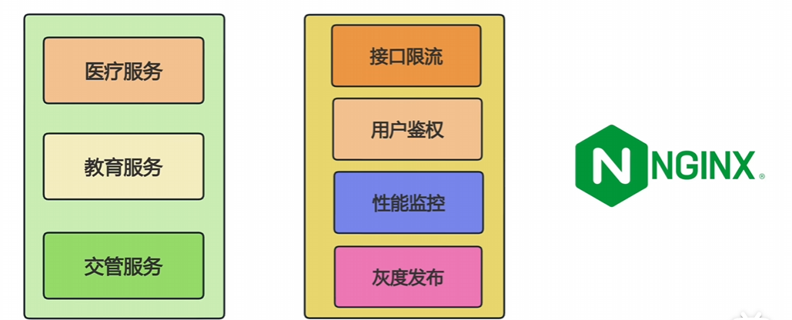

# ==1、基础夯实==

## ==业务功能开发！！！！！流程+增强点==


**系统设计场景（懂得多、知道技术组合使用场景） -- 业务流程分析（算法能力强考虑各种情况） -- 代码实践能力（源码阅读能力和全局项目思维、AI 开发能力）**


---


---


**不能让业务耦合**


**注意不能只看到表面还要看到关联也就是数据库 实体之间的关系** 


---

## HTTP 签名问题 （开放自己的接口给第三方调用）

<span style="color:#CC0000; font-size:1.5em;">**为什么需要这个方案？（解决的核心问题）**</span>

当项目给第三方提供HTTP接口时，裸奔的接口会面临3个致命安全风险，还存在参数冲突的业务问题，这就是方案的核心出发点：

1. 核心安全问题

- **参数篡改风险**：HTTP请求在网络传输中可能被拦截（比如中间人攻击），攻击者修改参数后重新发送。比如查询用户余额的接口，把「amount=100」改成「amount=10000」，直接造成业务损失。
- **身份伪造风险**：任何人都能调用接口，无法确认调用方是否是授权的第三方。比如恶意攻击者伪装成合作方，调用「数据导出」接口窃取核心数据。
- **重放攻击风险**：攻击者截获合法请求后，重复发送该请求。比如支付回调接口，被重复调用会导致多次打款；查询接口被重复调用会造成服务器资源浪费。2. 业务冲突问题

如果把「appId、sign」等验证参数放在URL（QueryString）或请求体（RequestBody）中，可能和接口本身的业务参数重名（比如接口本身就有「sign」字段表示用户签名），导致参数解析错误，对接失败。

**<span style="color:#CC0000; font-size:1.5em;">方案核心内容（怎么实现的？）</span>**

该方案基于 `yudao-spring-boot-starter-protection` 组件，通过「注解声明+AOP拦截+签名校验」的流程实现，具体步骤如下：

**<span style="color:#CC0000; font-size:1.5em;">方案核心流程</span>**

1. **依赖引入+密钥配置**：项目引入组件依赖，在Redis中存储「appId-appSecret」键值对（appId是调用方唯一标识，appSecret是双方约定的私密密钥，仅调用方和服务方知晓）。
2. **接口启用签名**：在需要保护的Controller方法上添加 `@ApiSignature` 注解，声明该接口需要签名校验。
3. **第三方调用传参**：第三方调用时，必须在HTTP请求头中传递4个参数：
   - appId：证明自己的授权身份（对应Redis中的合法标识）；
   - timestamp：请求发送的时间戳（用于防重放）；
   - nonce：每次请求唯一的随机串（比如UUID，用于防重放）；
   - sign：根据约定算法生成的签名（核心校验依据）。
4. **服务端AOP校验**：AOP切面 `ApiSignatureAspect` 拦截带注解的接口，执行校验：
   - 第一步：获取请求的「URL参数、请求体、请求头（指定字段）」，按固定顺序排序（避免参数顺序不同导致签名不一致）；
   - 第二步：将排序后的参数拼接，再追加appSecret，形成完整的「待签名字符串」；
   - 第三步：用SHA256算法对「待签名字符串」加密，得到服务端计算的签名；
   - 第四步：对比服务端签名和第三方传递的「sign」，同时校验timestamp是否在有效期内（比如30分钟）、nonce是否重复（可通过Redis暂存已使用的nonce）；
   - 第五步：校验通过则执行接口逻辑，失败则直接返回异常（拒绝服务）。

**<span style="color:#CC0000; font-size:1.5em;">关键技术细节</span>**

- **参数传递方式**：4个核心验证参数放在**请求头，而非URL或请求体**，**避免和业务参数重名冲突**；
- **排序的意义**：不同调用方可能按不同顺序传递参数（比如URL参数a在前或b在前），固定排序能保证「待签名字符串」的唯一性；
- **SHA256算法**：**不可逆加密算法**，即使攻击者拿到加密后的sign，也无法反推出原始参数和appSecret；
- **appSecret的作用**：作为**「加盐值」**，确保即使参数完全相同，没有密钥也无法生成正确签名（核心安全保障）。


> 问题解决
>
> 1. 解决「参数篡改」：签名的不可逆性+完整性校验
>
> - 待签名字符串包含了「URL参数+请求体+请求头关键字段」，只要其中任何一个参数被篡改，重新计算的sign就会和服务端的签名不一致；
> - SHA256是不可逆算法，攻击者无法通过篡改后的参数反推出正确的sign（因为没有appSecret），篡改后的请求会被直接拒绝。
>
> 2. 解决「身份伪造」：appId+appSecret的绑定校验
>
> - appId是调用方的唯一标识，只有授权的第三方才拥有合法的appId；
> - appSecret仅服务方和对应调用方知晓，即使攻击者伪造了appId，没有对应的appSecret，也无法生成正确的sign，无法通过校验。
>
> 3. 解决「重放攻击」：timestamp+nonce的双重防护
>
> - timestamp：服务端会校验请求的时间戳是否在有效期内（比如注解中配置的30分钟），过期的请求直接拒绝。即使攻击者截获了1小时前的合法请求，也无法重复使用；
> - nonce：每次请求的nonce是唯一的，服务端会记录已使用的nonce（比如存Redis，设置和timestamp相同的过期时间），重复的nonce会被判定为非法请求，避免同一请求被多次发送。
>
> 4. 解决「参数冲突」：请求头独立传递
>
> - 验证参数（appId、sign等）放在HTTP请求头，和URL参数、请求体的业务参数完全分离，不会出现字段重名导致的解析错误，降低对接成本。
>

---


## Spel 表达式

SpEL 在 Spring Boot 中的使用围绕 “**动态获取 / 计算 Spring 环境中的资源**” 展开，核心场景包括：配置注入、Bean 间依赖动态绑定、条件注解、AOP 切点表达式等。详细见Spel.md 文档

## Lua脚本

Lua 是一种**轻量、高效、可嵌入的脚本语言**，设计初衷是作为应用程序的 “胶水语言”，而非独立开发大型系统。其核心特性决定了它的适用场景：

1. **轻量紧凑**：解释器体积极小（仅几十 KB），内存占用低，适合嵌入式环境（如游戏引擎、嵌入式设备）。
2. **单线程执行**：天然支持原子操作（无多线程竞争），尤其适合需要 “事务性” 操作的场景（如 Redis 中的 Lua 脚本）。
3. **灵活的类型系统**：动态类型（无需声明变量类型），支持表（table，兼具数组、哈希表功能）、函数（一等公民，可作为参数 / 返回值）。
4. **C 语言集成友好**：可通过 C API 轻松嵌入其他语言（Java、C++ 等），反之也能在 Lua 中调用 C 函数，兼顾灵活性与性能。

### 1. Redis 为何支持 Lua？—— 解决 “原子性与性能” 问题

Redis 是单线程的内存数据库，其核心诉求是 **“将多步命令打包为原子操作，同时减少网络往返”**。

- **原子性需求**：Redis 的单条命令是原子的，但多命令组合（如 “查库存→扣库存→记录订单”）在高并发下可能被打断（如两个请求同时读到库存 = 1，导致超卖）。
- **Lua 的价值**：Redis 会将整个 Lua 脚本作为一个 “原子单元” 执行，执行期间不接受其他命令，天然解决多命令原子性问题。
- **性能加成**：多命令通过 Lua 脚本一次发送到 Redis，减少网络 IO 次数（尤其跨机房部署时，网络延迟影响显著）。

~~~java
    // 通用执行方法：调用Lua脚本
    private Object executeScript(String key, String opType, String... args) {
        // 参数组装：KEYS列表 + ARGV列表（ARGV[0]是操作类型，后续是额外参数）
        return redisTemplate.execute(
            commonOpsScript,
            Arrays.asList(key), // KEYS[1] = key
            opType, // ARGV[1] = 操作类型
            args // ARGV[2...] = 额外参数
        );
    }
~~~


### 2. Nginx 为何支持 Lua？—— 解决 “静态配置的动态扩展” 问题

Nginx 是高性能反向代理服务器，其核心诉求是 **“在不修改 C 源码的前提下，通过脚本动态扩展请求处理逻辑”**。

- **原生配置的局限性**：Nginx 的配置文件（nginx.conf）是静态的，无法实现复杂逻辑（如根据请求参数动态路由、实时限流计算）。
- **Lua 的价值**：通过`ngx_lua`模块，Nginx 可在请求处理的各个阶段（如接收请求、转发前、响应后）嵌入 Lua 脚本，实现动态逻辑（如基于用户 ID 的灰度路由、实时黑名单校验）。
- **性能适配**：Lua 轻量且执行高效，配合 LuaJIT 即时编译，性能接近 C 模块，不会拖慢 Nginx 的高并发特性。

---


## JDK 8 特性

~~~java
 /*传入原集合，筛选（过滤 相当于 where）规则，和映射规则 相当于投影 select*/
    public static <T, U> U findFirst(Collection <T> from, Predicate <T> predicate, Function <T, U> func) {
        if (CollUtil.isEmpty(from)) {
            return null;
        }
        return from.stream().filter(predicate).findFirst().map(func).orElse(null);
    }
~~~


`Predicate<T> predicate`：筛选条件接口

- **核心功能**：判断一个 `T` 类型的元素是否 “符合条件”，返回 `true` 或 `false`（类似 “过滤器”）。

- 接口定义（简化）

  ```java
  @FunctionalInterface
  public interface Predicate<T> {
      // 核心方法：接收 T 类型元素，返回 boolean（符合条件返回 true，否则 false）
      boolean test(T t);
  }
  ```

  

- **通俗理解**：给方法传一个 “判断规则”，方法用这个规则去检查每个元素是否合格。

### 实际使用场景（结合 `findFirst` 方法）

比如从 `List<User>` 中找 “年龄大于 18” 的用户，`predicate` 就是这个 “年龄 > 18” 的判断规则：


```java
// 1. 用 Lambda 表达式定义“筛选规则”（Predicate<User>）
Predicate<User> agePredicate = user -> user.getAge() > 18; 

// 2. 把这个规则传给 findFirst 方法
User adultUser = CollectionUtils.findFirst(
    userList,        // 源集合
    agePredicate,    // 筛选规则：年龄>18
    Function.identity() // 转换函数（暂时忽略，后面讲）
);
```

**也可用方法引用简洁式子**

---

`Function<T, U> func`：类型转换接口

- **核心功能**：接收一个 `T` 类型的元素，经过处理后返回一个 `U` 类型的结果（类似 “转换器”）。

- 接口定义（简化）

  ```java
  @FunctionalInterface
  public interface Function<T, U> {
      // 核心方法：接收 T 类型，返回 U 类型（完成转换逻辑）
      U apply(T t);
  }
  ```

  

- **通俗理解**：给方法传一个 “转换规则”，方法用这个规则把源元素（`T`）变成你想要的目标类型（`U`）。

### 实际使用场景（结合 `findFirst` 方法）

比如找到 “年龄 > 18” 的第一个用户后，不需要整个 `User` 对象，只需要他的 `userId`（`Long` 类型），`func` 就是 “从 `User` 取 `userId`” 的转换规则：

```java
// 1. 用 Lambda 定义“转换规则”（从 User 转 Long）
Function<User, Long> userIdFunc = user -> user.getId(); 

// 2. 传给 findFirst 方法
Long adultUserId = CollectionUtils.findFirst(
    userList,
    user -> user.getAge() > 18, // 筛选规则
    userIdFunc                  // 转换规则：取 userId
);
```

- 方法内部会先筛选出符合条件的 `User`，再用 `func.apply(user)` 把 `User` 转为 `Long`（即 `user.getId()`），最终返回 `userId`。




## SPI （生命周期扩展点）

### Spring MVC 响应增强


**Spring MVC的工作流程如下：**

1. **用户发送请求**

   - 请求到达 **DispatcherServlet**

   **DispatcherServlet 调用 HandlerMapping**

   - 根据**请求 URL** 查找对应 Handler（Controller）
   - 生成 **HandlerExecutionChain**：
     - 包含 Handler 对象
     - 包含拦截器链（Interceptor）

   **拦截器 preHandle 执行（前置）**

   - 顺序执行 HandlerExecutionChain 中的拦截器
   - **作用**：
     - 权限认证、日志记录、请求预处理
     - 如果返回 false，则中断请求，直接返回响应

   **DispatcherServlet 根据 Handler 获取 HandlerAdapter 并执行**

   - **HandlerAdapter 负责**：
     - 参数封装（PathVariable / RequestParam / RequestBody）
     - 数据类型转换（String → Long / LocalDate / Enum）
     - 数据验证（@Valid / Validator）
     - **调用 Handler 方法**
   - **此时 Controller 方法执行前**，可以结合 `@ControllerAdvice` 的 `@InitBinder` / `@ModelAttribute` 做全局处理

   **Controller（Handler）执行**

   - 执行具体业务逻辑
   - 返回结果（对象 / ModelAndView）

   **拦截器 postHandle 执行（后置）**

   - 顺序执行 HandlerExecutionChain 中的拦截器（倒序或顺序，根据实现）
   - **作用**：
     - 可修改返回结果（ModelAndView）
     - 对页面渲染类型可以修改 Model 数据
   - 注意：此时响应尚未写入客户端

   **HandlerAdapter 返回结果给 DispatcherServlet**

   - 对返回对象进行处理：
     - JSON 返回：经过 **ResponseBodyAdvice.beforeBodyWrite**
     - 页面渲染：ModelAndView 交给 ViewResolver

   **DispatcherServlet 将 ModelAndView 传给 ViewResolver**

   - 根据视图名称解析到具体 View

   **DispatcherServlet 渲染 View**

   - 将模型数据填充到视图（HTML、JSP 等）
   - JSON 类型直接写入响应流

   **拦截器 afterCompletion 执行（完成）**

   - 顺序执行 HandlerExecutionChain 中的拦截器
   - **作用**：
     - 清理资源（ThreadLocal、日志上下文等）
     - 记录总耗时
     - 无法修改响应数据（响应已写入流或缓冲区准备发送）

   **DispatcherServlet 响应客户端**

   - 数据通过 TCP 发送到浏览器 / 调用方

---


`@ControllerAdvice` 就是 **Spring 提供的全局“增强器”**，主要用在 Controller 层

`ResponseBodyAdvice` 属于 **出参增强组件**，在响应输出阶段统一做包装、审计和链路埋点，而不影响业务控制逻辑。它比拦截器更加贴近**数据结果层**，关注的是“输出格式一致性与可观测性保障”。

~~~java
@ControllerAdvice
@Slf4j
public class GeneralResponseBodyAdvice implements ResponseBodyAdvice<Object> {
    @Autowired
    private Tracer tracer;
    @Override
    public boolean supports( MethodParameter methodParameter, Class<? extends HttpMessageConverter<?>> aClass ) {
        return true;
    }

    @Override
    public Object beforeBodyWrite( Object object,
                                    MethodParameter methodParameter,
                                    MediaType mediaType,
                                    Class<? extends HttpMessageConverter<?>> aClass,
                                    ServerHttpRequest serverHttpRequest,
                                    ServerHttpResponse serverHttpResponse ) {
        if (object instanceof  BaseDto){
            BaseDto baseDto = (BaseDto) object;
            if (baseDto != null){
                baseDto.setRequestId(tracer.currentSpan().context().traceIdString());
                log.info("返回结果 {}",JSON.toJSONString(baseDto));

            }
            return baseDto;
        }

        return object;
    }
}

~~~


### Spring SPI （Link to spring 生命周期）

**扩展点（Extension Point）** = 框架预留的接口或钩子，让用户在不修改框架核心代码的前提下，插入自定义功能 **（类似vue 生命周期钩子）**

---


#### 1️⃣ 核心 SPI 分类

##### 1️⃣1 核心容器扩展 SPI

Spring IoC 容器提供多种扩展点，方便在容器生命周期中插入逻辑：

| SPI 接口                                                     | 作用                                                         |
| ------------------------------------------------------------ | ------------------------------------------------------------ |
| `BeanFactoryPostProcessor`                                   | 容器启动后，实例化 Bean 之前修改 BeanDefinition（配置修改、属性注入前处理） |
| `BeanPostProcessor`                                          | Bean 实例化之后、初始化之前或之后插入自定义逻辑（AOP、代理等） |
| `InstantiationAwareBeanPostProcessor`                        | Bean 实例化前后插入逻辑，支持字段注入、动态代理              |
| `BeanNameAware` / `BeanFactoryAware` / `ApplicationContextAware` | Bean 可以感知自身名称、BeanFactory 或 ApplicationContext     |
| `SmartInitializingSingleton`                                 | 所有单例 Bean 初始化完成后执行（类似容器启动完成回调）       |

---

##### 1️⃣2 事件与监听 SPI

Spring 提供事件机制，允许应用自定义事件与监听器：

| SPI 接口                                          | 作用                             |
| ------------------------------------------------- | -------------------------------- |
| `ApplicationListener<E extends ApplicationEvent>` | 监听 Spring 容器事件或自定义事件 |
| `ApplicationEventMulticaster`                     | 事件广播器，可定制事件分发策略   |

---

##### 1️⃣3 Aware 接口

* 所有 `Aware` 接口也是一种 SPI：

  * `BeanNameAware` → Bean 可以知道自己在容器中的名字
  * `BeanFactoryAware` → Bean 可以操作 BeanFactory
  * `ApplicationContextAware` → Bean 可以操作 ApplicationContext

✅ 这些都是 Spring 给 Bean 提供的“钩子”，允许扩展 Spring 功能。

---

##### 1️⃣4 SPI 用于资源和服务扩展

Spring 内部和 Spring Boot 使用了大量标准 SPI：

| SPI 接口                        | 场景                                             |
| ------------------------------- | ------------------------------------------------ |
| `EnvironmentPostProcessor`      | Spring Boot 启动时修改环境属性                   |
| `ApplicationContextInitializer` | 在 ApplicationContext 刷新前进行初始化           |
| `LoadTimeWeaver`                | 动态织入 AOP 字节码                              |
| `FactoryBean`                   | 定制 Bean 的实例化逻辑                           |
| `ConversionService`             | 类型转换扩展，可注册自定义转换器                 |
| `PropertyEditorRegistrar`       | 自定义 PropertyEditor，用于类型转换              |
| `ResourceLoader`                | SPI 用于加载不同类型资源（classpath、文件、URL） |

---

##### 1️⃣5 Spring Boot 特有 SPI

Spring Boot 在自动配置和插件机制中使用 SPI：

| SPI 接口                           | 场景                                          |
| ---------------------------------- | --------------------------------------------- |
| `spring.factories` 文件            | 自动装配 SPI 注册入口，Spring Boot 启动时扫描 |
| `SpringBootApplication` → 自动装配 | 通过 SPI 加载各种 `AutoConfiguration` 实现    |
| `ConditionalOn...` 系列注解        | 条件化加载 Bean，本质依赖 SPI 注册的配置      |

#### 具体的SPI

##### AWARE

`ApplicationContextAware` 是 Spring 框架提供的一个 **核心接口（属于 Spring Context 模块）**，归类为 “Bean 生命周期回调接口”—— 它的核心作用是让 Spring 管理的 Bean 能主动获取到 Spring 容器本身（`ApplicationContext` 对象）。


平时用 `@Autowired` 注入 `waitApplicationService`，本质是 Spring 容器帮你做了两件事：

1. 容器启动时，创建 `waitApplicationService` 的实例（Bean）并管理；
2. 当你在 `CheckInAction` 中用 `@Autowired` 声明这个依赖时，Spring 自动把容器中的 `waitApplicationService` 实例 “塞” 到你的类里。

这种方式简单直接，是 Spring 推荐的 “常规操作”，能满足 90%+ 的业务场景。


继承这个接口获取容器，核心是为了应对 **“依赖注入无法直接生效”** 的场景，常见有 3 种：

**1. 非 Spring 管理的类，需要用 Spring 中的 Bean**

如果一个类不是由 Spring 容器创建的（比如用 `new` 手动创建、第三方框架实例化的类），`@Autowired` 是无效的 —— 因为 Spring 只对自己管理的 Bean 进行依赖注入。

比如你的 `CheckInAction` 如果是状态机框架动态创建的（不是 Spring 自动扫描的 Bean），用 `@Autowired` 注入 `waitApplicationService` 会失败（注入的是 `null`）。这时就可以通过 `ApplicationContextAware` 获取容器，手动拿到 `waitApplicationService`：

```java
// 假设 CheckInAction 是非 Spring 管理的类（@Autowired 无效）
public class CheckInAction implements WaitApplicationAction {
    private ApplicationContext applicationContext;
    private WaitApplicationService waitApplicationService;

    // 实现 ApplicationContextAware 的方法，Spring 会自动传入容器实例
    @Override
    public void setApplicationContext(ApplicationContext context) {
        this.applicationContext = context;
        // 手动从容器中获取 Bean（替代 @Autowired）
        this.waitApplicationService = context.getBean(WaitApplicationService.class);
    }

    // 后续就能正常使用 waitApplicationService 了
    @Override
    public WaitApplication getWaitApplication(Integer applicationId) {
        return waitApplicationService.getWaitApplication(applicationId);
    }
}
```


---


**2. 动态获取 Bean（不是固定依赖，运行时才知道要哪个）**

如果你的类不是固定依赖某个 Bean，而是需要根据运行时的参数动态选择不同的 Bean，`@Autowired` 也搞不定 —— 因为 `@Autowired` 是 “编译时声明、启动时注入” 的固定依赖。

比如你有多个 “申请单处理器” Bean（`OrdinaryApplicationHandler`、`EmergencyApplicationHandler`），需要根据申请单类型动态获取对应的处理器：

```java
public class ApplicationHandlerDispatcher implements ApplicationContextAware {
    private ApplicationContext applicationContext;

    @Override
    public void setApplicationContext(ApplicationContext context) {
        this.applicationContext = context;
    }

    // 动态获取 Bean：根据申请单类型，拿到对应的处理器
    public ApplicationHandler getHandler(String applicationType) {
        String beanName = applicationType + "ApplicationHandler";
        // 运行时从容器中获取指定名称的 Bean
        return applicationContext.getBean(beanName, ApplicationHandler.class);
    }
}
```

这种场景下，`@Autowired` 无法提前声明 “不确定的依赖”，只能通过容器动态获取。


---


**3. 解决 “循环依赖” 的特殊情况**

虽然 Spring 能处理大部分循环依赖（比如 A 依赖 B，B 依赖 A），但如果是 “构造器注入” 的循环依赖，或者某些特殊 Bean（比如 `FactoryBean`）的循环依赖，`@Autowired` 会失效。这时可以通过 `ApplicationContextAware` 延迟获取依赖，避免循环依赖报错。

## 通用（一般性）

### **apiResult （返回值包装类）**

~~~java


/**
 * 通用状态枚举
 * @author  huangtaiji
 * @date 2025/10/23
 */
@Getter
@AllArgsConstructor
public enum CommonStatusEnum implements ArrayValuable <Integer> {
    ENABLE(0, "开启"),
    DISABLE(1, "关闭");

    public static final Integer [] ARRAYS = Arrays.stream(values())
        .map(CommonStatusEnum:: getStatus)
        .toArray(Integer []::new);

    /**
     * 状态值
     */
    private final Integer status;

    /**
     * 状态名
     */
    private final String name;

    /**
     * 用于批量获取状态值的场景，如参数值、下拉框选项
     * @return 所有状态值的数组
     */
    @Override
    public Integer [] array() { return ARRAYS;}

    public static boolean isEnable(Integer status) {return ObjUtil.equal(ENABLE.status, status);}

    public static boolean isDisable(Integer status) {return ObjUtil.equal(DISABLE.status, status);}
}

~~~

### **基础 DO**

~~~java

/**
 * 基础 DO
 * {@link TransPojo} 标识类，用于 mybatis-plus 识别转换 do 之类的
 *
 * @author  huangtaiji
 * @date 2025/10/23
 */
@Data
public abstract class BaseDO implements Serializable , TransPojo {
    /**
     * 创建时间
     */
    @TableField(fill = FieldFill.INSERT)
    private LocalDateTime createTime;

    /**
     * 更新时间
     */
    @TableField(fill = FieldFill.INSERT_UPDATE)
    private LocalDateTime updateTime;

    /**
     * 创建者
     */
    @TableField(fill = FieldFill.INSERT, jdbcType = JdbcType.VARCHAR)
    private String creator;

    /**
     * 更新者
     */
    @TableField(fill = FieldFill.INSERT_UPDATE, jdbcType = JdbcType.VARCHAR)
    private String updater;

    /**
     * 是否删除
     */
    @TableLogic
    private Boolean isDeleted;

    /**
     * 清空这些字段避免前端直接传递
     */
    public void clear() {
        this.createTime = null;
        this.updateTime = null;
        this.creator = null;
        this.updater = null;
    }
}

~~~


`Serializable` 是 Java 的 **序列化接口**，实现它的类可以将对象转换为字节流（序列化），以便于：

- **网络传输**：比如在分布式系统中，对象需要通过 RPC 或消息队列在服务间传递。
- **持久化存储**：比如将对象写入磁盘文件、缓存（如 Redis）中持久化保存。

在 ORM 框架（如 MyBatis-Plus）中，虽然本身不强制要求实体类实现 `Serializable`，但如果涉及 **分布式场景、缓存序列化、或某些中间件（如 Elasticsearch）的交互**，实现该接口能避免序列化异常。


`TransPojo` 是依赖 `easy-trans-mybatis-plus-extend` 中的一个标识接口，主要用于 **数据字典翻译、多语言字段翻译** 的能力：

- 该依赖是 `easy-trans` 框架的 MyBatis-Plus 拓展模块，用于在持久层（DO）和业务层（DTO）之间自动完成 **字段翻译**（比如将数据库中存储的 “性别编码 0/1” 自动转换为 “男 / 女”）。
- 实现 `TransPojo` 后，`easy-trans` 会识别该类为 “需要翻译的实体”，在查询、插入、更新时自动触发翻译逻辑。


`easy-trans-mybatis-plus-extend` 是一个 **数据翻译中间件**，基于 MyBatis-Plus 拓展，主要功能是：

1. **数据字典（编码到含义的映射）翻译**：将数据库中存储的编码（如 `status=1`）自动转换为业务含义（如 `status=启用`）。
2. **多语言翻译**：根据用户语言环境，自动将字段翻译为对应语言（如 `name` 字段在中文环境显示 “张三”，英文环境显示 “Zhang San”）。
3. **关联数据翻译**：比如根据用户 ID 自动关联查询出用户名，无需手动写联表 SQL。

它的核心价值是 **减少业务代码中手动处理 “编码 → 含义” 的冗余逻辑**，让数据翻译与持久层操作解耦，提升代码简洁性和可维护性。

---


### **分页对象**

~~~java
package com.cometer.ednova.framework.common.pojo;

import io.swagger.v3.oas.annotations.media.Schema;
import lombok.Data;

import java.io.Serializable;
import java.util.ArrayList;
import java.util.List;

/**
 * @author 33813 -> 2025-10-24
 */
@Schema(description = "分页结果")
@Data
public final class PageResult <T> implements Serializable {

    @Schema(description = "总量", requiredMode = Schema.RequiredMode.REQUIRED)
    private Long total;

    @Schema(description = "数据", requiredMode = Schema.RequiredMode.REQUIRED)
    private List <T> list;

    public PageResult() {
    }

    public PageResult(List <T> list, Long total) {
        this.list = list;
        this.total = total;
    }

    public PageResult(Long total) {
        this.list = new ArrayList <>();
        this.total = total;
    }

    public static <T> PageResult <T> empty() {
        return new PageResult <>(0L);
    }

    public static <T> PageResult <T> empty(Long total) {
        return new PageResult <>(total);
    }

}

~~~


---


## 日志策略 


项目提供 2 类 4 种系统日志：

- 审计日志：用户的操作日志、登录日志
- API 日志：RESTful API 的访问日志、错误日志

**这个也是基于 AOP 各种AOP日志 记录不同东西 看业务场景**


---


注意区分 **HTTP 状态码** 和 **业务自定义 errorCode** 的区别

**全局异常处理器中**

~~~java
    @ExceptionHandler(NullPointerException.class)
    @ResponseStatus(HttpStatus.INTERNAL_SERVER_ERROR)
    public BaseDto nullPointException( NullPointerException e){
        BaseDto responseBody = getBaseDto();
        responseBody.setErrMsg("UnKnow.error");
        e.printStackTrace();
        return responseBody;
    }
~~~

**-Dspring.profiles.active=Debug   （这是激活配置文件，不是日志级别）**


### 日志AOP

mallchat 也有实现 见ruoyi  实现 + 自己思考扩展 + 原理 理清AOP 流程 —————————— 理论实践

和各种日志的AOP（yudao）

项目还提供了 [ApiAccessLogInterceptor (opens new window)](https://github.com/YunaiV/yudao-cloud/blob/master/yudao-framework/yudao-spring-boot-starter-web/src/main/java/cn/iocoder/yudao/framework/apilog/core/interceptor/ApiAccessLogInterceptor.java)拦截器，打印 HTTP 请求、参数、耗时到文件（IDEA 控制台）中，方便大家进行调试。如下图所示：

**也可以用AOP 看情况选择**

每次请求有两条：一条 `request` 【开始请求】包括请求 URL、请求参数；一条 `response` 【结束请求】只包括耗时。

另外，考虑到 ApiAccessLogInterceptor 的定位是开发调试，所以 `prod` 生产环境默认不开启噢，当然你也可以按照自己需要修改

### MDC 全链路（配合 IP）

**见Archat**

~~~css
Thread
 └── ThreadLocalMap
       ├── ThreadLocalA → valueA
       ├── ThreadLocalB → valueB
       ├── ThreadLocalC → valueC
       └── ...

~~~


**日志配置文件**

| 能力       | 说明                       |
| ---------- | -------------------------- |
| 环境隔离   | `<springProfile>` 动态加载 |
| 日志分级   | info / error / debug 分流  |
| 模块隔离   | 各包独立日志               |
| 异步写入   | AsyncAppender 提升性能     |
| 滚动策略   | TimeBased + SizeBased      |
| Trace 集成 | Sleuth / ELK / SkyWalking  |
| 在线调级   | actuator loggers           |
| 自动清理   | maxHistory / totalSizeCap  |


~~~xml
<?xml version="1.0" encoding="UTF-8"?>
<configuration>
    <!--日志路径 -->
    <property name="LOG_PATH" value="/data/logs/mallchat-chat-server"/>
    <property name="LOG_FILE" value="mallchat-chat-server"/>
    <!-- 格式化-->
    <property name="CONSOLE_LOG_PATTERN"
              value="|%level|%d{yyyy-MM-dd HH:mm:ss.SSS}|%thread|%X{tid}|uid=%X{uid}|%msg|%X{callChain}%n"/>

    <include resource="org/springframework/boot/logging/logback/defaults.xml"/>
    <include resource="org/springframework/boot/logging/logback/console-appender.xml"/>

    <appender name="STDOUT" class="ch.qos.logback.core.ConsoleAppender">
        <encoder>
            <pattern>${CONSOLE_LOG_PATTERN}</pattern>
        </encoder>
    </appender>
    <!-- 全部日志的配置-->
    <appender name="fileAppender" class="ch.qos.logback.core.rolling.RollingFileAppender">
        <file>${LOG_PATH}/${LOG_FILE}.log</file>
        <append>true</append>
        <encoder>
            <pattern>${CONSOLE_LOG_PATTERN}</pattern>
        </encoder>
        <rollingPolicy class="ch.qos.logback.core.rolling.TimeBasedRollingPolicy">
            <!-- 按天生成日志文件 -->
            <fileNamePattern>
                ${LOG_PATH}/archived/${LOG_FILE}.%d{dd-MM-yyyy}.log
            </fileNamePattern>
            <!--保留天数-->
            <maxHistory>30</maxHistory>
            <!--单个文件的大小-->
            <totalSizeCap>5GB</totalSizeCap>
        </rollingPolicy>

    </appender>
    <!-- error日志的配置-->
    <appender name="fileError" class="ch.qos.logback.core.rolling.RollingFileAppender">
        <filter class="ch.qos.logback.classic.filter.LevelFilter">
            <level>ERROR</level>
            <onMatch>ACCEPT</onMatch>
            <onMismatch>DENY</onMismatch>
        </filter>
        <file>${LOG_PATH}/${LOG_FILE}.error.log</file>
        <append>true</append>
        <encoder>
            <pattern>${CONSOLE_LOG_PATTERN}</pattern>
        </encoder>
        <rollingPolicy class="ch.qos.logback.core.rolling.TimeBasedRollingPolicy">
            <fileNamePattern>
                ${LOG_PATH}/archived/${LOG_FILE}.%d{dd-MM-yyyy}.error.log
            </fileNamePattern>
            <maxHistory>30</maxHistory>
            <totalSizeCap>2GB</totalSizeCap>
        </rollingPolicy>
    </appender>

    <root level="info">
        <!--文件输出-->
        <appender-ref ref="fileAppender"/>
        <appender-ref ref="fileError"/>
        <!--制台输出-->
        <appender-ref ref="STDOUT"/>
    </root>

</configuration>
~~~

**定义日志路径与文件名**：集中管理路径变量，便于运维。

**自定义日志格式**：包含线程名、时间、MDC 信息（traceId、uid、调用链等）。

**多路输出**：控制台 + 普通文件 + 错误文件。

**滚动归档与容量控制**：日志文件按日期归档、自动清理旧文件。

---


一个用户请求从 Controller → Service → DAO 一路调用下去。
 你希望在所有日志里都能看到该请求的唯一标识（比如 `traceId`），方便追踪

MDC（Mapped Diagnostic Context，映射诊断上下文）是 **日志框架（如 Logback、Log4j 2）提供的一种工具**，用于在 **多线程 / 分布式环境** 中追踪同一请求的全链路日志，解决 “日志混乱、难以关联” 的问题。


## ==线程池-异步==

注意问题还有 **异步线程 的日志问题/异常问题**

| 问题分类           | 具体问题点                                               | 核心表现                                                     | 问题原因                                                     | 关键注意点（规避方案）                                       |
| ------------------ | -------------------------------------------------------- | ------------------------------------------------------------ | ------------------------------------------------------------ | ------------------------------------------------------------ |
| 日志问题           | 上下文丢失、链路断裂、日志混乱                           | 缺少请求 ID / 用户 ID，链路追踪中断，多线程日志交叉输出      | 线程独立 ThreadLocal 存储，异步线程不继承主线程上下文；线程池复用导致信息串流 | 用 MDC 传递日志上下文，结合 TransmittableThreadLocal 继承 ThreadLocal 数据；日志必含请求 ID / 线程 ID |
| 异常问题           | 异常静默丢失、线程池击穿、堆栈不完整                     | 主线程感知不到异常，线程池频繁销毁线程，异常堆栈缺失关键信息 | 跨线程无法传播异常，主线程 try-catch 无效；线程池默认吞噬未捕获异常 | 任务内 try-catch 全覆盖，自定义线程池 UncaughtExceptionHandler；统一记录异常并告警 |
| 并发安全问题       | 共享变量操作冲突、数据错乱                               | 静态变量 / 全局缓存被覆盖，计数错误、容器（如 HashMap）死循环 | 多异步线程并发操作非线程安全对象，未做同步控制               | 用 ConcurrentHashMap 等线程安全容器，共享变量加锁（ReentrantLock），避免全局变量操作 |
| 任务依赖与顺序问题 | **依赖任务执行顺序错乱、无依赖任务需保证顺序但无法满足** | 任务 B 依赖任务 A 结果却提前执行，提交的任务未按顺序执行     | 默认线程池无顺序保障，手动管理依赖关系复杂                   | **用 CompletableFuture 管理依赖（thenApply/thenRun），需顺序执行时用 SingleThreadExecutor** (多线程依赖问题) |
| 资源泄露问题       | 数据库连接、文件句柄、Socket 连接未释放                  | 连接池耗尽、系统资源不足，后续操作无法执行                   | **异步线程持有资源后未主动释放，执行异常时资源释放逻辑未触发** | 用 try-with-resources 语法，任务执行完毕强制释放资源，异常时在 finally 中补全释放逻辑 |
| 过载与限流问题     | 任务堆积导致 OOM、下游服务被压垮                         | 线程池队列满、内存飙升，第三方接口熔断 / 超时                | 任务提交速度超过处理速度，无限流机制控制并发量               | 合理配置线程池核心线程数 / 队列大小，搭配 Guava              |


`ThreadLocal ` 是线程本地变量，用于在**同一个线程**内传递上下文（比如用户信息、事务 ID 等）。但在**异步任务**（比如用 `@Async` 注解的方法）中，任务会被提交到线程池的其他线程执行，此时：

- 异步线程无法获取到原线程 `ThreadLocal` 中存储的上下文数据，导致**上下文丢失**。
- 典型场景：用户登录后，原线程用 `ThreadLocal` 存储了用户 ID；异步任务需要读取该用户 ID 做权限校验，却读不到，引发业务异常。

**方案：用 `TransmittableThreadLocal` 解决异步上下文传递**

`TransmittableThreadLocal`（简称 TTL）是对 `ThreadLocal` 的增强，它能**跨线程传递上下文**。结合图中的配置：

1. `@EnableAsync`：开启 Spring 的异步功能，让 `@Async` 注解的方法能异步执行。
2. `setTaskDecorator(TtlRunnable::get)`：通过任务装饰器，让线程池在执行异步任务时，自动把原线程的 `TransmittableThreadLocal` 上下文传递给异步线程。


`TaskDecorator` 是 Spring 提供的接口，通过 `setTaskDecorator` 可以给线程池中的每个异步任务 “包装一层逻辑”。你可以把它理解为：**在任务真正执行前，先执行一段你定义的代码；任务执行后，再执行一段代码**。

---


异步线程未处理的异常会由 JVM 默认异常处理器处理，**仅中断抛出异常的那个异步线程本身**，主线程和其他线程不受影响；控制台会打印异常堆栈（爆红），但程序不会整体终止**（除非是主线程抛出未处理异常）。**

- 异常分两类：`Unchecked Exception`（运行时异常，如 NPE、数组越界）和 `Checked Exception`（编译时异常，如 IOException）。
- 只有 **未被任何 try-catch 捕获的异常**，才会触发 JVM 默认异常处理器（若被捕获则按自定义逻辑处理，不触发默认流程）。
- 核心规则：**线程的异常仅影响自身，不会跨线程传播**。


- 仅 `Unchecked Exception`（运行时异常）会直接触发 JVM 默认处理器（控制台爆红 + 线程中断）；
- `Checked Exception` 若未捕获，编译无法通过（必须显式声明 `throws` 或 `try-catch`），除非在异步任务中偷偷抛出（如用 RuntimeException 包装），否则不会出现 “未处理” 的情况。


## ==业务幂等性==

| 实现方案                        | 核心思路                                                     | 优点                             | 缺点                                       | 典型场景                         |
| ------------------------------- | ------------------------------------------------------------ | -------------------------------- | ------------------------------------------ | -------------------------------- |
| **数据库唯一约束**              | 在表中建立唯一索引（如 user_id + biz_no），防止重复插入      | 简单可靠、无额外依赖、底层保障   | 无法防止请求多次执行，只防止重复落库       | 下单、注册、唯一记录创建         |
| **幂等 Token（一次性令牌）**    | 前端先申请 Token，提交操作时携带；后端校验并删除 Token       | 业务无侵入、防重复提交、逻辑清晰 | Token 只能使用一次；Redis 需保证原子性删除 | 表单提交、支付发起               |
| **业务唯一号（业务幂等 ID）**   | 每笔业务有唯一标识；重复请求只返回同一结果                   | 可跨服务、跨系统使用；实现简单   | 上游必须生成唯一 ID；不适合无标识场景      | 支付回调、第三方请求、MQ 消费    |
| **Redis 去重（短期防重）**      | 用请求指纹（如参数哈希）在 Redis 中做 setIfAbsent + 过期时间 | 高性能、轻量、适合高并发         | 仅短期有效；宕机或TTL过期后失效            | 秒杀、接口防抖、重复点击防护     |
| **乐观锁（版本号 / 状态判断）** | 更新前检查版本号或状态是否符合预期                           | 与事务一致性天然契合、无外部依赖 | 仅适合更新操作；无法防止重复新增           | 库存扣减、账户余额变更           |
| **分布式锁（Redisson/ZK）**     | 对同一业务键加锁，确保同一时刻仅一个请求执行                 | 保证并发安全、跨节点生效         | 实现复杂、性能成本高                       | 定时任务、异步回调、分布式写操作 |

**场景选型：**

| 业务类型                       | 推荐组合方案            |
| ------------------------------ | ----------------------- |
| **下单 / 支付 / 提交表单**     | 幂等 Token + 唯一业务号 |
| **接口防抖 / 秒杀 / 重复点击** | Redis 去重              |
| **状态流转 / 更新操作**        | 乐观锁                  |
| **分布式任务 / 异步执行**      | 分布式锁                |
| **唯一资源创建**               | 数据库唯一约束          |

# ==2、框架探索==

## 插件集成

| 分类         | 组件                     | 核心职责                                    | 典型替代品                                        |
| ------------ | ------------------------ | ------------------------------------------- | ------------------------------------------------- |
| 缓存层       | **Ehcache**              | JVM 内存级缓存                              | Caffeine、Guava Cache、Redis                      |
| 分布式事务   | **Atomikos**             | 分布式事务协调器（JTA 实现）                | Seata、Narayana、RocketMQ 事务消息                |
| 对象存储     | **MinIO**                | 类似 AWS S3 的私有对象存储服务              | 阿里云 OSS、七牛云、Ceph                          |
| 搜索引擎     | **Easy-ES**              | ElasticSearch ORM 封装                      | 官方 ES Client、Elasticsearch RestHighLevelClient |
| Web 服务器   | **Undertow**             | 轻量、高性能 Web 容器                       | Tomcat、Jetty、Netty                              |
| 应用监控     | **Spring Boot Actuator** | Spring Boot 的运行指标与健康检测            | Micrometer、Prometheus、SkyWalking                |
| 数据分片     | **Sharding-JDBC**        | 数据分库分表中间件（ShardingSphere 子项目） | MyCAT、Cobar、TDDL                                |
| 水印工具     | **Watermark**            | 图像/文件加水印                             | Hutool ImageUtil、Thumbnailator                   |
| 第三方登录   | **JustAuth**             | OAuth2 第三方登录聚合框架                   | Spring Security OAuth2、Sa-Token                  |
| 分布式缓存   | **Redisson**             | Redis 的 Java 客户端与分布式工具集          | Jedis、Lettuce                                    |
| HTTP 客户端  | **HttpClient**           | Apache 提供的 HTTP 请求库                   | OkHttp、RestTemplate、WebClient                   |
| 数据库连接池 | **Druid**                | 阿里巴巴出品的数据库连接池                  | HikariCP、C3P0                                    |
| 动态数据源   | **Dynamic-Datasource**   | 多数据源动态切换                            | Spring DynamicDataSource、MyBatis Plus 动态源     |
| UA 解析      | **Browscap**             | 浏览器 User-Agent 识别库                    | ua-parser、UserAgentUtils                         |

## 数据脱敏

接口在返回一些敏感或隐私数据时，是需要进行脱敏处理，通常的手段是使用 `*` 隐藏一部分数据。

**在字段上添加脱敏注解。如下所示：**

```java
public class User extends BaseEntity
{
    @Sensitive(desensitizedType = DesensitizedType.PHONE)
    private String phonenumber;
}
```

> 其他的脱敏策略根据自己的需求在`DesensitizedType.java`去定义，可以是方法，也可以是正则表达式。


## Maven

如果我有两个模块 一个模块是父模块负责管理依赖的版本 其中管理了一个 starter starter 里面 不是包含了一堆依赖吗 假如包含了一个 a 依赖
然后我 第二个模块 引入这个 a 依赖可以不写 a 的版本吗

**answer : 不行**

---


## Mybatis plus

MyBatis-Plus 继承了 MyBatis 的默认约定：**如果未显式配置 `mapper-locations`，会默认扫描 `classpath\*:mapper/\**/\*.xml`**（注意是 `classpath*` 而非 `classpath`）。


## 对象转换

### Convert & MapStruct tranPojo


## 设计模式应用

### 策略模式 + 注册工厂方法

**Link to ArcHat** 

### 适配器模式

类适配器、**对象适配器（常用）**


**类似静态代理模式**


在Spring IoC容器管理Bean的场景中，适配器模式常用于解决“不同类型Bean的接口适配”问题——当IoC容器中存在接口不兼容的Bean（如第三方组件、旧系统Bean），但需要统一调用或集成时，适配器模式可以通过IoC的Bean管理能力，将这些不兼容的Bean包装成符合预期接口的Bean，实现无缝集成。


### 实际场景：Spring IoC整合第三方日志组件（不同接口适配）
**问题背景**

假设你的Spring项目需要集成日志功能，目前有两个日志组件：
1. **项目自研的日志接口**：`MyLogger`（项目内部代码，接口定义如下）：
   ```java
   // 自研日志接口（目标接口）
   public interface MyLogger {
       void log(String message); // 输出日志
       void error(String error); // 输出错误日志
   }
   ```
2. **第三方日志组件**：`ThirdPartyLogger`（外部JAR包，无法修改源码，接口定义如下）：
   ```java
   // 第三方日志组件（接口不兼容）
   public class ThirdPartyLogger {
       // 方法名、参数与自研接口不同
       public void writeLog(String content) { 
           System.out.println("[第三方日志] " + content);
       }
       public void logError(String errorInfo, Throwable t) { 
           System.err.println("[第三方错误] " + errorInfo + "，异常：" + t.getMessage());
       }
   }
   ```

项目中已有很多服务依赖`MyLogger`接口（如`UserService`、`OrderService`），现在需要将日志实现替换为第三方组件，但又不想修改依赖`MyLogger`的代码（遵循开闭原则）。

**解决方案：用适配器模式+Spring IoC管理适配Bean**

通过Spring IoC将“第三方日志组件”包装成符合`MyLogger`接口的Bean，让依赖`MyLogger`的服务无需修改即可使用第三方日志。

**步骤1：定义适配器类（实现目标接口，包装第三方组件）**

```java
// 日志适配器：实现自研接口，包装第三方日志组件
public class LoggerAdapter implements MyLogger {

    // 持有第三方组件（通过Spring注入）
    private ThirdPartyPartyLogger thirdPartyLogger;

    // 构造函数注入（Spring IoC管理时使用）
    public LoggerAdapter(ThirdPartyLogger thirdPartyLogger) {
        this.thirdPartyLogger = thirdPartyLogger;
    }

    // 适配日志方法：将MyLogger.log适配为ThirdPartyLogger.writeLog
    @Override
    public void log(String message) {
        thirdPartyLogger.writeLog(message); // 转换调用
    }

    // 适配错误日志方法：补充第三方组件需要的异常参数（这里简化为new Exception()）
    @Override
    public void error(String error) {
        thirdPartyLogger.logError(error, new Exception("默认异常")); // 转换调用+参数补充
    }
}
```

**步骤2：通过Spring IoC配置Bean（将适配器纳入容器管理）**

```java
import org.springframework.context.annotation.Bean;
import org.springframework.context.annotation.Configuration;

@Configuration
public class LogConfig {

    // 1. 注册第三方日志组件Bean（外部组件，由Spring管理）
    @Bean
    public ThirdPartyLogger thirdPartyLogger() {
        return new ThirdPartyLogger(); // 实例化第三方组件
    }

    // 2. 注册适配器Bean：依赖第三方组件，暴露为MyLogger接口
    @Bean
    public MyLogger myLogger(ThirdPartyLogger thirdPartyLogger) {
        // 通过构造函数注入依赖，返回适配器（实现了MyLogger接口）
        return new LoggerAdapter(thirdPartyLogger);
    }
}
```

**步骤3：业务服务依赖目标接口（无需关心实现是自研还是第三方）**

```java
import org.springframework.stereotype.Service;

@Service
public class UserService {

    // 依赖的是MyLogger接口，而非具体实现
    private final MyLogger logger;

    // 构造函数注入（Spring自动注入适配器Bean）
    public UserService(MyLogger logger) {
        this.logger = logger;
    }

    public void createUser() {
        logger.log("用户创建成功"); // 调用自研接口方法（实际由第三方组件实现）
        try {
            // 业务逻辑...
        } catch (Exception e) {
            logger.error("用户创建失败"); // 调用错误日志方法
        }
    }
}
```

**解决的核心问题**

1. **接口不兼容问题**：  
   第三方组件`ThirdPartyLogger`的方法名（`writeLog`、`logError`）和参数与自研`MyLogger`接口不一致，通过适配器`LoggerAdapter`完成转换，让业务代码无需修改即可使用第三方组件。

2. **IoC容器的依赖管理**：  
   Spring IoC负责管理适配器与第三方组件的依赖关系（通过`@Bean`和构造函数注入），业务服务只需依赖`MyLogger`接口，由容器自动注入适配后的Bean，实现“依赖倒置”（依赖抽象而非具体实现）。

3. **可扩展性**：  
   若未来需要替换为其他日志组件（如`OtherLogger`），只需新增一个`OtherLoggerAdapter`实现`MyLogger`接口，并修改`LogConfig`中的`myLogger`Bean定义，业务代码完全无需改动。


### 责任链模式

经典责任链模式（GoF 设计模式）的核心规则：

1. **每个处理器（Handler）直接持有下一个处理器的引用**（`nextHandler`）；
2. **请求在处理器之间直接传递**：当前处理器处理完后，主动调用 `nextHandler.handle(request)`，直到某个处理器处理请求或链结束；
3. **处理器可自主决定是否传递请求**（比如权限校验失败时，直接返回，不往下传）。

#### 经典责任链模式代码示例（伪代码）

```java
// 处理器接口
public interface Handler {
    void setNext(Handler next); // 每个处理器持有下一个处理器的引用
    void handle(Request request);
}

// 日志处理器
public class LogHandler implements Handler {
    private Handler next;

    @Override
    public void setNext(Handler next) {
        this.next = next; // 持有下一个处理器
    }

    @Override
    public void handle(Request request) {
        // 1. 处理自身逻辑
        System.out.println("打印日志");
        // 2. 主动调用下一个处理器（传递请求）
        if (next != null) {
            next.handle(request);
        }
    }
}

// 权限处理器
public class AuthHandler implements Handler {
    private Handler next;

    @Override
    public void setNext(Handler next) {
        this.next = next;
    }

    @Override
    public void handle(Request request) {
        System.out.println("校验权限");
        if (next != null) {
            next.handle(request);
        }
    }
}

// 客户端使用：手动组装链
public class Client {
    public static void main(String[] args) {
        Handler logHandler = new LogHandler();
        Handler authHandler = new AuthHandler();
        logHandler.setNext(authHandler); // 手动设置下一个处理器

        // 发起请求，从第一个处理器开始传递
        logHandler.handle(new Request());
    }
}
```

| 对比维度                     | 经典责任链模式                                     | Spring AOP 责任链（变体）                                    |
| ---------------------------- | -------------------------------------------------- | ------------------------------------------------------------ |
| **组件持有下一个组件的方式** | 每个处理器（Handler）直接持有 `next` 引用          | 处理器（MethodInterceptor）不持有下一个引用，由 **调度者（ReflectiveMethodInvocation）** 统一管理 |
| **请求流转方式**             | 处理器主动调用 `next.handle()` 传递请求            | 处理器调用 `invocation.proceed()`，由调度者通过 “索引” 找到下一个处理器 |
| **链的组装方式**             | 客户端手动设置 `next` 引用（硬编码）               | Spring 自动扫描切面、匹配 Advisor、排序后组装为 `List<MethodInterceptor>`（无需手动干预） |
| **灵活性**                   | 适合固定流程（如请求拦截），新增处理器需手动修改链 | 适合动态流程（AOP 增强），新增切面自动加入链，排序通过 `@Order` 控制 |
| **中断链的方式**             | 不调用 `next.handle()` 即可中断                    | 不调用 `invocation.proceed()` 即可中断（如环绕通知权限校验失败） |

**应用：Spring AOP、过滤器/拦截器**


1. **解耦请求发送者与处理者**

   当一个请求可能需要多个对象处理时，如果不使用责任链，发送者需要知道所有可能的处理者，并手动决定交给哪个处理者（例如用大量 `if-else` 或 `switch` 判断）。这会导致发送者与处理者强耦合，一旦处理者增减或顺序变化，发送者的代码必须修改。

   责任链模式让发送者只需将请求交给链的第一个节点，无需关心后续谁处理，降低了耦合度。

2. **动态调整处理流程**

   处理者之间通过 “链” 的结构关联（每个处理者持有下一个处理者的引用），可以动态增减处理者或改变顺序，无需修改原有处理逻辑。例如，审批流程中临时增加一个 “部门经理” 审批节点，只需在链中插入该节点即可。

3. **简化对象职责**

   每个处理者只需关注自己能处理的请求，无法处理时直接交给下一个节点，符合 “单一职责原则”。避免了一个对象承担过多处理逻辑，导致代码臃肿。


#### 实际应用-Spring AOP

在 Spring AOP 中，**责任链模式**是核心设计之一，主要体现在 **Advisor 链的执行流程** 中。当目标方法被拦截时，Spring 会将所有匹配的通知（Advice）包装为 Advisor 对象，按特定顺序组成一条责任链，依次执行每个 Advisor 中的通知逻辑，最终完成目标方法的增强。

##### 步骤 1：初始化阶段（容器启动时）

1. **解析切面**：Spring 容器扫描到 `@Aspect` 注解的类（如 `LogAspect`、`AuthAspect`），解析其中的通知（如 `@Before` 方法）和切入点表达式。
2. **创建 Advisor**：将每个 “通知 + 切入点” 包装为 Advisor 对象（如 `LogAdvisor` 包含日志通知和其切入点，`AuthAdvisor` 包含权限通知和其切入点）。
3. **排序 Advisor**：根据 `@Order` 注解（数字越小优先级越高）对 Advisor 排序，形成责任链（例如 `LogAspect` 注解 `@Order(1)`，`AuthAspect` 注解 `@Order(2)`，则责任链顺序为 `LogAdvisor → AuthAdvisor`）。
4. **创建代理对象**：为 `UserService` 创建代理对象，代理对象持有上述责任链（即排序后的 Advisor 列表）。

---


##### 步骤 2：运行阶段（目标方法被调用时）

1. **调用代理对象**：用户调用 `userService.login()` 时，实际调用的是代理对象的 `login()` 方法。
2. **触发责任链**：代理对象通过 `ReflectiveMethodInvocation` 类启动责任链执行，此时责任链为 `[LogInterceptor, AuthInterceptor]`（Advisor 已被适配为 MethodInterceptor）。
3. 执行第一个拦截器（LogInterceptor）
   - 调用 `LogInterceptor.invoke(...)` 方法，执行 `@Before` 日志逻辑（如 “记录登录开始时间”）。
   - 执行完成后，通过 `ReflectiveMethodInvocation.proceed()` 方法将请求传递给下一个拦截器。
4. 执行第二个拦截器（AuthInterceptor）
   - 调用 `AuthInterceptor.invoke(...)` 方法，执行 `@Before` 权限逻辑（如 “校验用户是否有权限登录”）。
   - 执行完成后，再次调用 `proceed()` 方法。
5. 执行目标方法
   - 当责任链中所有拦截器都执行完毕（`currentInterceptorIndex` 达到链的末尾），`ReflectiveMethodInvocation` 通过反射调用 `UserService` 真实对象的 `login()` 方法（即目标方法）。
6. **执行后置通知（如 @After）**：目标方法执行完成后，按相反顺序执行后置通知（如先执行 `AuthAspect` 的 `@After`，再执行 `LogAspect` 的 `@After`）。


### 模板方法


### command


### 装饰器

装饰器模式属于**结构型设计模式**，核心是**在不修改原有类的前提下，通过 “包装” 的方式给对象动态添加新功能**，遵循 “开闭原则”。

**非常类似 AOP**

但是和AOP 的区别就是：

~~~java
// 1. 组件接口：定义核心功能
interface Component {
    void operation();
}

// 2. 具体组件：实现核心功能的基础类
class ConcreteComponent implements Component {
    @Override
    public void operation() {
        System.out.println("执行基础功能");
    }
}

// 3. 装饰器抽象类：持有组件对象，定义装饰逻辑的骨架
abstract class Decorator implements Component {
    protected Component component;

    public Decorator(Component component) {
        this.component = component;
    }

    @Override
    public void operation() {
        component.operation(); // 调用原有功能
    }
}

// 4. 具体装饰器 A：添加新功能 A
class ConcreteDecoratorA extends Decorator {
    public ConcreteDecoratorA(Component component) {
        super(component);
    }

    @Override
    public void operation() {
        super.operation(); // 先执行原有功能
        addFunctionA();    // 再添加新功能 A
    }

    private void addFunctionA() {
        System.out.println("添加功能 A");
    }
}

// 5. 具体装饰器 B：添加新功能 B
class ConcreteDecoratorB extends Decorator {
    public ConcreteDecoratorB(Component component) {
        super(component);
    }

    @Override
    public void operation() {
        super.operation(); // 先执行原有功能
        addFunctionB();    // 再添加新功能 B
    }

    private void addFunctionB() {
        System.out.println("添加功能 B");
    }
}

// 客户端调用示例
public class Client {
    public static void main(String[] args) {
        // 1. 创建基础组件
        Component component = new ConcreteComponent();
        
        // 2. 用装饰器 A 包装，添加功能 A
        component = new ConcreteDecoratorA(component);
        
        // 3. 再用装饰器 B 包装，添加功能 B
        component = new ConcreteDecoratorB(component);
        
        // 4. 执行最终功能（包含基础功能 + 功能 A + 功能 B）
        component.operation();
    }
}
~~~


# ==3、思维技巧==


## git==钩子==

| 钩子名称          | 触发时机                 | 常见用途                                    |
| ----------------- | ------------------------ | ------------------------------------------- |
| **pre-commit**    | 在执行 `git commit` 之前 | 检查代码格式、运行 ESLint、单元测试         |
| **commit-msg**    | 在填写完提交信息后       | 校验提交信息规范（如 Conventional Commits） |
| **pre-push**      | 在执行 `git push` 之前   | 执行构建、测试，或阻止错误推送              |
| **post-merge**    | 在合并完成后             | 自动安装依赖、重启服务                      |
| **pre-rebase**    | 在 rebase 前             | 阻止对某些分支 rebase                       |
| **post-checkout** | 切换分支后               | 自动切换环境变量、同步配置文件              |

也可使用其他工具分析这个类属于的依赖来自于哪些坐标（直接/间接依赖）

~~~css
mvn dependency: tree > dependency-tree.txt
~~~

`@ SneakThrow`

当方法中调用了抛出 checked 异常的代码（如 IO 操作、反射等），但你不想在方法上声明 `throws`，也不想写繁琐的 `try-catch` 时，可以用它简化代码。


**可以在 resources 放各种数据文件 如 csv 、text、xdb(二进制文件)等，读取做预处理操作 也可以理解成一个数据集**




## 工具类

### CollectionUtils

~~~java

/*对集合的简化操作封装 （类似 sql）*/
/**
 * @author 33813 -> 2025-10-24
 */
public class CollectionUtils {

    /*映射本身*/
    public static <T> T findFirst(Collection <T> from, Predicate <T> predicate) {
        return findFirst(from, predicate, Function.identity());
    }
    /*传入原集合，筛选（过滤 相当于 where）规则，和映射规则 相当于投影 select*/
    public static <T, U> U findFirst(Collection <T> from, Predicate <T> predicate, Function <T, U> func) {
        if (CollUtil.isEmpty(from)) {
            return null;
        }
        return from.stream().filter(predicate).findFirst().map(func).orElse(null);
    }


}

~~~


# ==4、技术探索==

---

## 定时任务

在企业系统里，我们经常需要执行一些**周期性任务**（比如清理日志、定时发邮件、夜间结算、同步数据、跑批处理）。

| 对比维度             | **@Scheduled**        | **Quartz**               | **XXL-Job**                  |
| :------------------- | :-------------------- | :----------------------- | :--------------------------- |
| **框架定位**         | Spring 内置轻量定时器 | 传统企业级调度框架       | 分布式任务调度平台           |
| **典型应用场景**     | 单体应用、小工具任务  | 多实例项目、复杂调度逻辑 | 微服务/企业级任务集中调度    |
| **部署方式**         | 嵌入业务服务内部      | 嵌入或独立服务           | 调度中心 + 执行器分布式部署  |
| **是否持久化任务**   | 否                    | 可选（JDBCJobStore）     | 是（调度中心存数据库）       |
| **是否支持集群**     | 否                    | 是（数据库锁实现）       | 是（多节点自动协调）         |
| **分布式执行能力**   | 无                    | 有（需额外配置）         | 原生支持分片、负载均衡       |
| **任务管理方式**     | 代码硬编码            | Java API 或 XML          | Web 控制台动态配置           |
| **Cron 表达式**      | 支持（简单）          | 支持（复杂）             | 支持（标准）                 |
| **失败重试与告警**   | 无                    | 可手动实现               | 内置重试与告警机制           |
| **日志与监控**       | 无                    | 自定义实现               | 内置日志、执行追踪           |
| **可视化运维**       | 无                    | 弱（可通过外部系统）     | 强（任务可查、可改、可暂停） |
| **任务依赖编排**     | 不支持                | 支持                     | 支持（任务链/父子任务）      |
| **并发控制/分片**    | 无                    | 支持部分                 | 支持分片广播                 |
| **动态调整任务**     | 不支持                | 部分支持                 | 强支持（控制台实时修改）     |
| **学习成本**         | 极低                  | 中等                     | 中等偏低（平台式配置）       |
| **扩展性与可维护性** | 弱                    | 较强                     | 极强（任务平台化运维）       |
| **典型优点**         | 简单、快速、零依赖    | 稳定成熟、功能强大       | 可视化、分布式、高可用       |
| **主要缺点**         | 不支持分布式、需重启  | 集群复杂、维护成本高     | 依赖调度中心、需部署平台     |
| **推荐使用规模**     | 单节点应用            | 中小型集群系统           | 中大型企业/微服务体系        |


## ==接口限流==


### 令牌桶限流思路

~~~java
@Target(ElementType.METHOD)
@Retention(RetentionPolicy.RUNTIME)
@Documented
public @interface RequestLimit {
     String key();
    /**
     * 最多的访问限制次数
     */
     double permitsPerSecond () default  1d;
    /**
     * 获取令牌最大等待时间
     */
    long timeout() default 1000L;

    /**
     * 获取令牌最大等待时间,单位(例:分钟/秒/毫秒) 默认:毫秒
     */
    TimeUnit timeunit() default TimeUnit.MILLISECONDS;
}

~~~

~~~java
@Component
@Aspect
public class RequestLimitAop {
    private static final Logger LOGGER = LoggerFactory.getLogger(RequestLimitAop.class);

    /**
     * 不同的接口，不同的流量控制
     * map的key为 Limiter.key
     */
    private final Map<String, RateLimiter> limitMap = Maps.newConcurrentMap();
    
    /**
     * 默认编码
     */
    private static final String UTF_8 = "UTF-8";

    @Around("@annotation(com.orphanage.server.config.RequestLimit)")
    public Object around(ProceedingJoinPoint joinPoint) throws Throwable{
        MethodSignature signature = (MethodSignature) joinPoint.getSignature();
        Method method = signature.getMethod();
        RequestLimit limit = method.getAnnotation(RequestLimit.class);
        if (limit != null){
            Object object = joinPoint.getArgs()[0];
            Expression expression = SpringElUtil.getExpression(limit.key());
            Object limitO = expression.getValue(object);
            if (limitO != null){
                String key = limitO.toString();
                RateLimiter rateLimiter;
                // RateLimiter：Guava 库提供的令牌桶算法实现类
                //用于控制请求频率（create(permitsPerSecond)表示每秒生成permitsPerSecond个令牌）。
                //验证缓存是否有命中key
                if (!limitMap.containsKey(limitO.toString())) {
                    // 创建令牌桶
                    rateLimiter = RateLimiter.create(limit.permitsPerSecond());
                    limitMap.put(key, rateLimiter);
                    LOGGER.info("新建了令牌桶={}，容量={}",key,limit.permitsPerSecond());
                }
                rateLimiter = limitMap.get(key);
                // 拿令牌
                boolean acquire = rateLimiter.tryAcquire(limit.timeout(), limit.timeunit());
                // 拿不到命令，直接返回异常提示
                if (!acquire) {
                    LOGGER.debug("令牌桶={}，o获取令牌失败",limitO.toString());
                    this.responseFail("请求太频繁");
                    return null;
                }

            }
        }


        return joinPoint.proceed();
    }

}

~~~


## IP 服务

本质是加载 resource 下的 xdb、csv 文件实现 ip 地址和地区查询

### ArrayValuable

~~~java
/**
 * 可生成 T 数组的接口
 * @author  huangtaiji
 * @date 2025/10/23
 */
public interface ArrayValuable <T> {
    /**
     * @return 数组
     */
    T [] array();
}

~~~

### AreaController

~~~java
@Tag(name = "管理后台 - 地区")
@RestController
@RequestMapping("/system/area")
@Validated
public class AreaController {

    @GetMapping("/tree")
    @Operation(summary = "获得地区树")
    public CommonResult <List<AreaNodeRespVO> > getAreaTree() {
        Area area = AreaUtils.getArea(Area.ID_CHINA);
        Assert.notNull(area, "获取不到中国");
        return success(BeanUtils.toBean(area.getChildren(), AreaNodeRespVO.class));
    }

    @GetMapping("/get-by-ip")
    @Operation(summary = "获得 IP 对应的地区名")
    @Parameter(name = "ip", description = "IP", required = true)
    public CommonResult <String> getAreaByIp(@RequestParam("ip") String ip) {
        // 获得城市
        Area area = IPUtils.getArea(ip);
        if (area == null) {
            return success("未知");
        }
        // 格式化返回
        return success(AreaUtils.format(area.getId()));
    }

}
~~~

**类似管理文件系统**

### Area & AreaNodeResp-==树形结构==


~~~java
/**
 * @author 33813 -> 2025-10-23
 * 地理树形结点
 */
public class Area {

    /**
     * 编号 - 全球
     */
    public static final Integer ID_GLOBAL = 0;
    /**
     * 编号 - 中国
     */
    public static final Integer ID_CHINA = 1;


    /**
     * 编号
     */
    private Integer id;
    /**
     * 名字
     */
    private String name;

    /**
     * 类型
     *
     * 枚举 {@link AreaTypeEnum}
     */
    private Integer type;

//树形结构是需要以下注解
    /**
     * 父节点
     */
    @JsonManagedReference
    private Area parent;
    /**
     * 子节点  防止序列化无限循环
     */
    @JsonBackReference
    private List <Area> children;

}


/**
 * @author 33813 ->2025-10-24
 */
public class AreaNodeResp {
    @Schema(description = "编号", requiredMode = Schema.RequiredMode.REQUIRED, example = "110000")
    private Integer id;

    @Schema(description = "名字", requiredMode = Schema.RequiredMode.REQUIRED, example = "北京")
    private String name;

    /**
     * 子节点
     */
    private List<AreaNodeResp> children;

}

~~~


### 工具类

#### AreaUtils

~~~java
/**
 * 区域工具类
 *
 * @author 33813 -> 2025-10-24
 */
@Slf4j
public class AreaUtils {

    /**
     * 初始化 SEARCHER
     */
    @SuppressWarnings("InstantiationOfUtilityClass")
    private final static AreaUtils INSTANCE = new AreaUtils();

    /**
     * Area 内存缓存，提升访问速度
     */
    private static Map <Integer, Area> areas;

    private AreaUtils() {
        long now = System.currentTimeMillis();
        areas = new HashMap <>();
        areas.put(Area.ID_GLOBAL, new Area(Area.ID_GLOBAL, "全球", 0,
                null, new ArrayList <>()));
        // 从 csv 中加载数据
        List <CsvRow> rows = CsvUtil.getReader().read(ResourceUtil.getUtf8Reader("area.csv")).getRows();
        rows.remove(0); // 删除 header
        for (CsvRow row : rows) {
            // 创建 Area 对象
            Area area = new Area(Integer.valueOf(row.get(0)), row.get(1), Integer.valueOf(row.get(2)),
                    null, new ArrayList <>());
            // 添加到 areas 中
            areas.put(area.getId(), area);
        }

        // 构建父子关系：因为 Area 中没有 parentId 字段，所以需要重复读取
        for (CsvRow row : rows) {
            Area area = areas.get(Integer.valueOf(row.get(0))); // 自己
            Area parent = areas.get(Integer.valueOf(row.get(3))); // 父
            Assert.isTrue(area != parent, "{}: 父子节点相同", area.getName());
            area.setParent(parent);
            parent.getChildren().add(area);
        }
        log.info("启动加载 AreaUtils 成功，耗时 ({}) 毫秒", System.currentTimeMillis() - now);
    }

    /**
     * 获得指定编号对应的区域
     *
     * @param id 区域编号
     * @return 区域
     */
    public static Area getArea(Integer id) {
        return areas.get(id);
    }

    /**
     * 获得指定区域对应的编号
     *
     * @param pathStr 区域路径，例如说：河南省/石家庄市/新华区
     * @return 区域
     */
    public static Area parseArea(String pathStr) {
        String [] paths = pathStr.split("/");
        Area area = null;
        for (String path : paths) {
            if (area == null) {
                area = findFirst(areas.values(), item -> item.getName().equals(path));
            } else {
                area = findFirst(area.getChildren(), item -> item.getName().equals(path));
            }
        }
        return area;
    }

    /**
     * 获取所有节点的全路径名称如：河南省/石家庄市/新华区
     *
     * @param areas 地区树
     * @return 所有节点的全路径名称
     */
    public static List <String> getAreaNodePathList(List <Area> areas) {
        List <String> paths = new ArrayList <>();
        areas.forEach(area -> getAreaNodePathList(area, "", paths));
        return paths;
    }

    /**
     * 构建一棵树的所有节点的全路径名称，并将其存储为 "祖先/父级/子级" 的形式
     *
     * @param node  父节点
     * @param path  全路径名称
     * @param paths 全路径名称列表，省份/城市/地区
     */
    private static void getAreaNodePathList(Area node, String path, List <String> paths) {
        if (node == null) {
            return;
        }
        // 构建当前节点的路径
        String currentPath = path.isEmpty() ? node.getName() : path + "/" + node.getName();
        paths.add(currentPath);
        // 递归遍历子节点
        for (Area child : node.getChildren()) {
            getAreaNodePathList(child, currentPath, paths);
        }
    }

    /**
     * 格式化区域
     *
     * @param id 区域编号
     * @return 格式化后的区域
     */
    public static String format(Integer id) {
        return format(id, " ");
    }

    /**
     * 格式化区域
     * <p>
     * 例如说：
     * 1. id = “静安区”时：上海 上海市 静安区
     * 2. id = “上海市”时：上海 上海市
     * 3. id = “上海”时：上海
     * 4. id = “美国”时：美国
     * 当区域在中国时，默认不显示中国
     *
     * @param id        区域编号
     * @param separator 分隔符
     * @return 格式化后的区域
     */
    public static String format(Integer id, String separator) {
        // 获得区域
        Area area = areas.get(id);
        if (area == null) {
            return null;
        }

        // 格式化
        StringBuilder sb = new StringBuilder();
        // 避免死循环
        for (int i = 0; i < AreaTypeEnum.values().length; i++) {
            sb.insert(0, area.getName());
            // “递归”父节点
            area = area.getParent();
            if (area == null
                    // 跳过父节点为中国的情况
                    || ObjectUtils.equalsAny(area.getId(), Area.ID_GLOBAL, Area.ID_CHINA)) {
                break;
            }
            sb.insert(0, separator);
        }
        return sb.toString();
    }

    /**
     * 获取指定类型的区域列表
     *
     * @param type 区域类型
     * @param func 转换函数
     * @param <T>  结果类型
     * @return 区域列表
     */
    public static <T> List <T> getByType(AreaTypeEnum type, Function <Area, T> func) {
        return convertList(areas.values(), func, area -> type.getType().equals(area.getType()));
    }

    /**
     * 根据区域编号、上级区域类型，获取上级区域编号
     *
     * @param id   区域编号
     * @param type 区域类型
     * @return 上级区域编号
     */
    public static Integer getParentIdByType(Integer id, @NonNull AreaTypeEnum type) {
        for (int i = 0; i < Byte.MAX_VALUE; i++) {
            Area area = AreaUtils.getArea(id);
            if (area == null) {
                return null;
            }
            // 情况一：匹配到，返回它
            if (type.getType().equals(area.getType())) {
                return area.getId();
            }
            // 情况二：找到根节点，返回空
            if (area.getParent() == null || area.getParent().getId() == null) {
                return null;
            }
            // 其它：继续向上查找
            id = area.getParent().getId();
        }
        return null;
    }

}

~~~

#### IPUtils

ip2region.xdb 是一款高效的 IP 地址定位数据库文件，核心用途是将 IPv4 或 IPv6 地址映射到具体的地理位置信息。

~~~java
/**
 * IP 工具类
 *
 * IP 数据源来自 ip2region.xdb 精简版，基于 <a href="https://gitee.com/zhijiantianya/ip2region"/> 项目
 *
 * @author 33813 -> 2025-10-23
 */
@Slf4j
public class IPUtils {

    /**
     * 初始化 SEARCHER
     * 这里为了实现 饿汉单例模式，必须通过 new IPUtils() 创建唯一实例，但这与 “工具类不应被实例化” 的规范冲突，因此编译器会默认产生警告。
     */
    @SuppressWarnings("InstantiationOfUtilityClass")
    private final static IPUtils INSTANCE = new IPUtils(); // 它的真实作用不是“拿来用”，而是“用来触发构造执行一次”

    /**
     * IP 查询器，启动加载到内存中
     */
    private static Searcher SEARCHER;

    /**
     * 私有化构造 防止被外部实例化。
     */
    private IPUtils() {
        try {
            long now = System.currentTimeMillis();
            byte [] bytes = ResourceUtil.readBytes("ip2region.xdb");
            SEARCHER = Searcher.newWithBuffer(bytes);
            log.info("启动加载 IPUtils 成功，耗时 ({}) 毫秒", System.currentTimeMillis() - now);
        } catch (IOException e) {
            log.error("启动加载 IPUtils 失败", e);
        }
    }

    /**
     * 查询 IP 对应的地区编号
     *
     * @param ip IP 地址，格式为 127.0.0.1
     * @return 地区 id
     */
    @SneakyThrows
    public static Integer getAreaId(String ip) {
        return Integer.parseInt(SEARCHER.search(ip.trim()));
    }

    /**
     * 查询 IP 对应的地区编号
     *
     * @param ip IP 地址的时间戳，格式参考{@link Searcher#checkIP(String)} 的返回
     * @return 地区编号
     */
    @SneakyThrows
    public static Integer getAreaId(long ip) {
        return Integer.parseInt(SEARCHER.search(ip));
    }

    /**
     * 查询 IP 对应的地区
     *
     * @param ip IP 地址，格式为 127.0.0.1
     * @return 地区
     */
    public static Area getArea(String ip) {
        return AreaUtils.getArea(getAreaId(ip));
    }

    /**
     * 查询 IP 对应的地区
     *
     * @param ip IP 地址的时间戳，格式参考{@link Searcher#checkIP(String)} 的返回
     * @return 地区
     */
    public static Area getArea(long ip) {
        return AreaUtils.getArea(getAreaId(ip));
    }
}

~~~

其实也能这样，但是！！！

~~~java
static {
    try {
        byte[] bytes = ResourceUtil.readBytes("ip2region.xdb");
        SEARCHER = Searcher.newWithBuffer(bytes);
    } catch (Exception e) {
        log.error("初始化失败", e);
    }
}

private IPUtils() {}

~~~

**① 初始化时机更可控**

- `static {}` 会在类**加载时**直接执行。
- 而 `private static final IPUtils INSTANCE = new IPUtils()` 会在**类首次真正被使用时**执行。

如果某些服务启动流程复杂，类加载顺序不确定，**控制初始化时机更安全**。


**② 异常传递语义更清晰**

静态代码块里抛异常只能转成 `RuntimeException` 或吞掉，而：

```java
private IPUtils() {
    try { ... } catch (...) { log... }
}
```

日志上下文、调用栈、加载链路会更完整。
 **故障时可观测性更高**，便于排障。


**③ 如果未来扩展为「延迟加载」或「可卸载重载」更平滑**

`INSTANCE` 模式可以**平滑演进**为：

- **懒汉模式**
- **双重检查锁（DCL）**
- **热更新替换 Searcher 引擎**
- **基于配置开关动态加载**

**即具备==向前可扩展性==。**
 这是企业架构中常说的 **可演化性（Evolvability）**。

而静态块一旦写死，就比较硬

## ==RBAC==

### **核心组件**(组成部分)

1. 用户(User)：系统的使用者
2. 角色(Role)：权限的集合
3. 权限(Permission)：对系统资源的操作许可
4. 资源(Resource)：系统中需要被保护的对象

### **RBAC模型层级**（结构与关系）

1. **核心RBAC (RBAC0)**
最基本的RBAC模型，包含：

- 用户-角色分配
- 角色-权限分配
- 用户通过角色获得权限

2. **角色层级 (RBAC1)**
引入角色继承关系：

- 上级角色继承下级角色的所有权限
- 形成角色树或角色图结构

3. **约束RBAC (RBAC2)**
添加约束条件：

- 互斥角色：同一用户不能同时拥有两个互斥角色
- 基数约束：**限制角色分配数量**
- 先决条件：**获得某角色前必须先拥有另一角色**

4. **会话RBAC (RBAC3)**
结合以上所有特性，用户可以在会话中激活角色的子集


**完整的RBAC权限系统包含三个核心部分：**

- 数据库设计 - 存储权限数据模型

- 后端实现 - 权限校验和接口控制

- 前端控制 - 动态菜单和按钮权限


### **前端权限控制管理**（细节）

- React实现RBAC权限控制主要包含以下部分：

- 权限数据管理 - Redux/Zustand状态管理

- 路由守卫 - 保护路由访问

- 动态菜单 - 根据权限生成菜单

- 指令/组件 - 控制按钮/元素显示

### 流程案例


### **高级RBAC模式**--优化点

1. **数据权限控制**
除了功能权限，还需要控制数据访问范围：

- 全公司数据

- 部门数据
- 个人数据

实现方式：

在权限表中添加数据范围字段
在SQL查询中添加数据过滤条件

2. **动态权限**
支持**运行时**修改权限配置：

- 权限缓存机制
- 权限变更通知
- 热更新策略

3. **临时权限**
为特定需求授予有时效性的权限：

- 开始/结束时间字段
- 审批流程
- 自动回收机制

### **最佳实践建议**

- 最小权限原则：只授予必要的最小权限
- 角色粒度适中：避免角色过多或过少
- 定期审计：检查权限分配是否合理
- 权限分离：关键操作需要多人协作完成
- 可视化配置：提供友好的权限管理界面


### **常见问题解决方案**

1. **权限缓存与同步：**
使用Redis缓存用户权限
权限变更时发送事件通知
设置合理的缓存过期时间
2. **性能优化：**
批量查询权限
避免深度角色继承
使用位运算存储简单权限
3. **多租户支持：**
在角色/权限中添加租户ID
确保数据隔离
共享全局角色模板


## ==数据权限==


一般就是数据库**动态拼接** **过滤条件** （通过 AOP ）

| 阶段               | 涉及组件                                       | 主要职责                               |
| ------------------ | ---------------------------------------------- | -------------------------------------- |
| 1️⃣ 注解声明         | `@DataScope(deptAlias = "d", userAlias = "u")` | 标识哪些方法需要数据权限控制           |
| 2️⃣ AOP 切面拦截     | `DataScopeAspect`                              | 捕获被注解的方法，动态构造数据范围 SQL |
| 3️⃣ 参数注入         | `BaseEntity.params.put("dataScope", sql)`      | 将拼接好的 SQL 条件写入参数 Map        |
| 4️⃣ MyBatis 动态拼接 | `${params.dataScope}`                          | 将条件注入到最终 SQL 执行语句          |
| 5️⃣ SQL 执行结果     | Mapper 层                                      | 返回已过滤的数据集                     |

在实际开发中，需要设置用户只能查看哪些部门的数据，这种情况一般称为数据权限。
例如对于销售，财务的数据，它们是非常敏感的，因此要求对数据权限进行控制， 对于基于集团性的应用系统而言，就更多需要控制好各自公司的数据了。如设置只能看本公司、或者本部门的数据，对于特殊的领导，可能需要跨部门的数据， 因此程序不能硬编码那个领导该访问哪些数据，需要进行后台的权限和数据权限的控制。

提示

默认系统管理员`admin`拥有所有数据权限`（userId=1）`，默认角色拥有所有数据权限（如不需要数据权限不用设置数据权限操作）

### [#](http://doc.ruoyi.vip/ruoyi/document/htsc.html#注解参数说明-4)注解参数说明

| 参数       | 类型   | 默认值 | 描述                                                         |
| ---------- | ------ | ------ | ------------------------------------------------------------ |
| deptAlias  | String | 空     | 部门表的别名，用来给填充{}.dept_id字段                       |
| userAlias  | String | 空     | 用户表的别名，用来填充(}.user_id字段                         |
| permission | String | 空     | 权限字符（用于多个角色匹配符合要求的权限）默认根据权限注解@ss获取，多个权限用逗号分隔开来 |

*permission说明： 一个`user`会拥有多个`role`，每个`role`都负责不同的业务场景，`user`可以通过`permission`精确控制哪些`role`在本次操作能生效*
例子：当前`user`有两个`role`，分别为`Role A`（有权限字符串a）和`Role B`（有权限字符串b），分别是`Dept A`和`Dept B`部门下的角色。
而`method`接口能都返回这两个部门的数据，此时有个业务需求是`user`访问`method`这个接口希望仅返回`Dept A`的数据。
此时只需要控制`permission`中的权限让`Role A`有而`Role B`没有即可，即`permission = "a"`就能让`Role A`生效而`Role B`失效


### [#](http://doc.ruoyi.vip/ruoyi/document/htsc.html#数据权限使用)数据权限使用

1、在（系统管理-角色管理）设置需要数据权限的角色 目前支持以下几种权限

- 全部数据权限
- 自定数据权限
- 部门数据权限
- 部门及以下数据权限
- 仅本人数据权限

2、在需要数据权限控制方法上添加`@DataScope`注解，其中`d`和`u`用来表示表的别名

**部门数据权限注解**

```java
@DataScope(deptAlias = "d")
public List<...> select(...)
{
    return mapper.select(...);
}
```


**部门及用户权限注解**

```java
@DataScope(deptAlias = "d", userAlias = "u")
public List<...> select(...)
{
    return mapper.select(...);
}
```


3、在`mybatis`查询底部标签添加数据范围过滤


```xml
<select id="select" parameterType="..." resultMap="...Result">
    <include refid="select...Vo"/>
    <!-- 数据范围过滤 -->
    ${params.dataScope}
</select>
```

例如：用户管理（未过滤数据权限的情况）：

```sql
select u.user_id, u.dept_id, u.login_name, u.user_name, u.email
	, u.phonenumber, u.password, u.sex, u.avatar, u.salt
	, u.status, u.del_flag, u.login_ip, u.login_date, u.create_by
	, u.create_time, u.remark, d.dept_name
from sys_user u
	left join sys_dept d on u.dept_id = d.dept_id
where u.del_flag = '0'
```

例如：用户管理（已过滤数据权限的情况）：

```sql
select u.user_id, u.dept_id, u.login_name, u.user_name, u.email
	, u.phonenumber, u.password, u.sex, u.avatar, u.salt
	, u.status, u.del_flag, u.login_ip, u.login_date, u.create_by
	, u.create_time, u.remark, d.dept_name
from sys_user u
	left join sys_dept d on u.dept_id = d.dept_id
where u.del_flag = '0'
	and u.dept_id in (
		select dept_id
		from sys_role_dept
		where role_id = 2
	)
```


结果很明显，我们多了如下语句。通过角色部门表`（sys_role_dept）`完成了数据权限过滤

```sql
and u.dept_id in (
	select dept_id
	from sys_role_dept
	where role_id = 2
)
```


**逻辑实现代码 `com.ruoyi.framework.aspectj.DataScopeAspect`**

> 提示
>
> 仅实体继承`BaseEntity`才会进行处理，`SQL`语句会存放到`BaseEntity`对象中的`params`属性中，然后在`xml`中通过`${params.dataScope}`获取拼接后的语句。
> PS：如果是自己的业务表需要实现数据权限，需要有`dept_id`和`user_id`这两个字段。


---


## OAuth2.0

单点登录（Single Sign-On，简称 **SSO**）是一种**身份认证机制**，它的核心目标是——**用户只需要登录一次，就能访问多个相互信任的系统或应用**，而不需要在每个系统里重复登录。


**`Refresh Token` 支持 “精准撤销” 和 “场景限制”**

授权服务器会存储 `Refresh Token` 的状态（如关联用户 ID、设备信息、授权时间等），因此可以做到：

- **立即撤销**：一旦发现泄露，系统可以直接将这个 `Refresh Token` 标记为无效，攻击者即使持有它，也无法再获取 `Access Token`（止损速度极快）。
- **设备绑定**：`Refresh Token` 可以绑定用户的设备（如手机型号、浏览器指纹），如果攻击者在其他设备使用泄露的 `Refresh Token`，授权服务器会拒绝请求。
- **频次限制**：设置 “同一 `Refresh Token` 短时间内只能换一次 `Access Token`”，防止批量滥用。


而 `Access Token` 通常是无状态的（如 JWT），授权服务器不存储其状态，一旦泄露无法主动撤销，只能等它自然过期。


---


OAuth2 是一套授权框架，核心作用是让**第三方应用**（自己开发的网站）在不获取用户账号密码的前提下，**合法获取用户在某平台（网盘、微信）的部分资源访问权限**，解决了传统授权方式的安全隐患和体验问题。

- 避免密码泄露风险：传统授权需向第三方透露平台账号密码，一旦第三方泄露，用户核心账号安全受威胁，OAuth2 用 “令牌（Token）” 替代密码，令牌仅对应特定权限且可回收。
- 权限精细化管控：用户能自主选择第三方可访问的资源范围（比如仅允许读取相册，不允许修改资料），而非开放全部账号权限。
- 简化授权流程：无需用户在第三方应用重复注册账号，也无需平台开发者重复开发授权逻辑，降低对接成本。
- 支持灵活场景：适配不同使用场景（如网页应用、手机 App、小程序），提供授权码模式、客户端凭证模式等多种授权方式。


**常用OAuth2的授权码授权流程**


## ==敏感词过滤-Ac自动机==

### 使用场景

~~~java
    @Override
    @Transactional
    public void modifyName(Long uid, ModifyNameReq req) {
        //判断名字是不是重复
        String newName = req.getName();
        AssertUtil.isFalse(sensitiveWordBs.hasSensitiveWord(newName), "名字中包含敏感词，请重新输入"); // 判断名字中有没有敏感词
        User oldUser = userDao.getByName(newName);
        AssertUtil.isEmpty(oldUser, "名字已经被抢占了，请换一个哦~~");
        //判断改名卡够不够
        UserBackpack firstValidItem = userBackpackDao.getFirstValidItem(uid, ItemEnum.MODIFY_NAME_CARD.getId());
        AssertUtil.isNotEmpty(firstValidItem, "改名次数不够了，等后续活动送改名卡哦");
        //使用改名卡
        boolean useSuccess = userBackpackDao.invalidItem(firstValidItem.getId());
        if (useSuccess) {//用乐观锁，就不用分布式锁了
            //改名
            userDao.modifyName(uid, req.getName());
            //删除缓存
            userCache.userInfoChange(uid);
        }
    }


@Override
    public void saveMsg(Message msg, TextMsgReq body) {//插入文本内容
        MessageExtra extra = Optional.ofNullable(msg.getExtra()).orElse(new MessageExtra());
        Message update = new Message();
        update.setId(msg.getId());
        update.setContent(sensitiveWordBs.filter(body.getContent()));
        update.setExtra(extra);
        //如果有回复消息
        if (Objects.nonNull(body.getReplyMsgId())) {
            Integer gapCount = messageDao.getGapCount(msg.getRoomId(), body.getReplyMsgId(), msg.getId());
            update.setGapCount(gapCount);
            update.setReplyMsgId(body.getReplyMsgId());

        }
        //判断消息url跳转
        Map<String, UrlInfo> urlContentMap = URL_TITLE_DISCOVER.getUrlContentMap(body.getContent());
        extra.setUrlContentMap(urlContentMap);
        //艾特功能
        if (CollectionUtil.isNotEmpty(body.getAtUidList())) {
            extra.setAtUidList(body.getAtUidList());

        }

        messageDao.updateById(update);
    }
~~~

### 引导类

~~~java

@Configuration
public class SensitiveWordConfig {

    @Autowired
    private MyWordFactory myWordFactory;

    /**
     * 初始化引导类 责任链
     *
     * @return 初始化引导类
     * @since 1.0.0
     */
    @Bean
    public SensitiveWordBs sensitiveWordBs() {
        return SensitiveWordBs.newInstance()
                .filterStrategy(DFAFilter.getInstance())
                .sensitiveWord(myWordFactory)
                .init();
    }

}

~~~

~~~java

/**
 * 敏感词引导类

 */
public class SensitiveWordBs {

    /**
     * 私有化构造器
     */
    private SensitiveWordBs() {
    }

    /**
     * 脱敏策略
     */
    private SensitiveWordFilter sensitiveWordFilter = DFAFilter.getInstance();

    /**
     * 敏感词列表
     */
    private IWordFactory wordDeny;

    public static SensitiveWordBs newInstance() {
        return new SensitiveWordBs();
    }

    /**
     * 初始化
     * <p>
     * 1. 根据配置，初始化对应的 map。比较消耗性能。
     *
     * @return this
     * @since 0.0.13
     */
    public SensitiveWordBs init() {

        List<String> words = wordDeny.getWordList();
        loadWord(words);
        return this;
    }

    /**
     * 过滤策略
     */
    public SensitiveWordBs filterStrategy(SensitiveWordFilter filter) {
        if (filter == null) {
            throw new IllegalArgumentException("filter can not be null");
        }
        this.sensitiveWordFilter = filter;
        return this;
    }
// 配置敏感词工厂
    public SensitiveWordBs sensitiveWord(IWordFactory wordFactory) {
        if (wordFactory == null) {
            throw new IllegalArgumentException("wordFactory can not be null");
        }
        this.wordDeny = wordFactory;
        return this;
    }


    /**
     * 有敏感词

     */
    public boolean hasSensitiveWord(String text) {
        return sensitiveWordFilter.hasSensitiveWord(text);
    }

    /**
     * 过滤
     */
    public String filter(String text) {
        return sensitiveWordFilter.filter(text);
    }

    /**
     * 使用对应的过滤器加载敏感词列表
     */
    private void loadWord(List<String> words) {
        sensitiveWordFilter.loadWord(words);
    }

}

~~~


## ==状态机 & 工作流==

注意状态流转会有什么问题


# ==5、分布式==

## 微服务

**分布式会引起很多问题 这些组件就是解决和优化这些问题的**

| 服务器职责 / 场景                              | 对应 Spring Cloud 组件 / 技术                        | 作用说明                                                     |
| ---------------------------------------------- | ---------------------------------------------------- | ------------------------------------------------------------ |
| **服务注册与发现**（如各服务器节点的动态感知） | Eureka / Nacos / Consul                              | 管理所有服务节点的注册信息（IP、端口、状态），让服务间能自动发现并通信（如 Web 服务器发现能力服务器）。 |
| **配置中心**（如配置库的集中管理）             | Spring Cloud Config / Nacos Config                   | 集中存储所有服务的配置（如 Hadoop 集群参数、流处理任务阈值），支持动态更新，避免分散配置的维护成本。 |
| **消息总线**（如消息队列集群的服务间通信）     | Spring Cloud Stream（绑定 RabbitMQ/Kafka）           | 实现服务间异步通信（如 ETL 集群处理完数据后，通过消息通知流处理集群进行实时分析），解耦服务依赖。 |
| **负载均衡**（如 Web 服务器的请求分发）        | Spring Cloud LoadBalancer / Ribbon（已淘汰）         | 当某类服务有多个节点（如多台 Web 服务器），自动将请求分发到健康节点，避免单点压力过大。 |
| **断路器**（如能力服务器故障时的容错）         | Spring Cloud Circuit Breaker（集成 Resilience4j）    | 当某服务（如能力服务器）故障时，快速熔断请求并返回降级响应（如返回缓存的农业模型结果），避免级联失败。 |
| **数据监控与链路追踪**（如管理服务器的监控）   | Spring Cloud Sleuth + Zipkin / Spring Cloud Actuator | 追踪服务调用链路（如用户请求从 Web 服务器到能力服务器的全路径），监控各节点的 CPU、内存、接口响应时间等指标。 |
| **API 网关**（如前端请求的统一入口）           | Spring Cloud Gateway                                 | 统一管理前端（如农户 Web 端）的请求入口，实现路由转发、认证授权、限流（如限制单用户查询频率）。 |


### Nacos

~~~markdown

### 一、核心用法（基本层面）
1. **服务发现**：微服务间调用时，无需硬编码地址，服务启动后自动注册到Nacos，消费者从Nacos查询可用服务地址（支持负载均衡、健康检查）。
2. **配置管理**：将应用配置（如数据库连接、功能开关）集中存储在Nacos，支持动态修改配置并推送到所有相关应用，无需重启服务。
3. **服务健康监测**：自动检测服务实例的可用性，剔除故障实例，避免请求转发到不可用节点。
4. **命名空间与分组**：通过命名空间隔离不同环境（开发/测试/生产），分组管理同一环境下的不同服务或配置，实现资源隔离。

### 二、核心思想提炼
1. **中心化治理**：把分散在各个服务的“地址信息”和“配置信息”集中管理，减少分布式系统的耦合。
2. **动态感知**：配置或服务实例变化时，Nacos主动推送更新给订阅者，无需人工干预或服务重启，提升系统灵活性。
3. **高可用优先**：支持集群部署、数据持久化、故障转移，确保核心治理功能不宕机。
4. **轻量化集成**：提供SDK、API、HTTP接口等多种集成方式，适配Java、Go等多语言，接入成本低。

### 三、最佳实践和准则
1. **环境隔离必须用命名空间**：不同环境（开发/测试/生产）使用独立命名空间，避免配置污染或服务跨环境调用。
2. **配置按“服务+功能”分组**：例如“用户服务-数据库配置”“订单服务-缓存配置”，便于维护和权限控制。
3. **服务注册需携带健康检查参数**：配置合理的健康检查间隔（默认5秒）和阈值，避免误判服务状态。
4. **敏感配置加密存储**：密码、密钥等敏感配置通过Nacos的加密功能处理，禁止明文存储。
5. **集群部署生产环境**：至少3个节点组成Nacos集群，确保单点故障不影响整体服务。

### 四、注意事项（设计风险）
1. **单点依赖风险**：若Nacos集群宕机，新服务无法注册、配置无法更新，需做好降级方案（如本地配置兜底）。
2. **配置推送一致性问题**：高并发下配置更新可能存在短暂延迟，需避免“配置更新后立即依赖新配置”的强一致性场景。
3. **服务注册风暴**：大量服务同时重启时，可能导致Nacos注册请求突增，需配置注册限流或分批启动。
4. **健康检查误判**：网络抖动可能导致健康检查失败，需合理设置重试次数和超时时间。

### 五、其他替代方案及对比
| 方案 | 核心优势 | 劣势 | 适用场景 |
|------|----------|------|----------|
| Nacos | 一体化（服务发现+配置）、轻量、中文文档完善 | 生态成熟度略逊于Spring Cloud Config+Eureka | 微服务架构、需要简化治理栈的场景 |
| Eureka+Spring Cloud Config | 生态成熟、Spring Cloud原生适配 | 需整合两套组件、配置更新需配合Bus刷新 | 纯Spring Cloud技术栈、对稳定性要求极高的场景 |
| Consul | 支持服务发现、配置、分布式锁，一致性强 | 部署复杂、资源占用高 | 需要多维度治理（如服务网格）、跨数据中心场景 |
| Apollo | 配置管理功能更细化（灰度发布、权限控制） | 不支持服务发现，需额外整合注册中心 | 配置变更频繁、对配置治理要求高的场景 |

### 六、优化修正建议
1. **配置层面**：
   - 拆分“静态配置”和“动态配置”，静态配置（如服务端口）无需存入Nacos，减少冗余。
   - 开启配置缓存本地持久化，Nacos不可用时优先使用本地缓存配置。
2. **服务发现层面**：
   - 消费者端开启服务地址缓存，减少对Nacos的查询频率，提升响应速度。
   - 配置服务注册的“元数据”（如服务版本、权重），支持灰度发布和按权重负载均衡。
3. **部署层面**：
   - 生产环境开启Nacos的集群模式和数据持久化（使用MySQL存储），避免数据丢失。
   - 对Nacos集群做监控告警（如节点存活、注册服务数、配置变更频率）。

### 七、扩展建议（循序渐进增加难度）
1. **初级扩展**：集成Nacos的“服务权重配置”，实现基于权重的负载均衡，应对不同服务实例的性能差异。
2. **中级扩展**：利用Nacos的“配置灰度发布”功能，实现配置更新的分批推送，降低变更风险；结合服务元数据实现“服务版本隔离”，支持蓝绿部署。
3. **高级扩展**：
   - 基于Nacos的服务发现机制，自定义负载均衡算法（如基于服务响应时间的动态权重调整）。
   - 整合Nacos与Sentinel，通过配置中心动态调整限流、熔断规则，实现流量治理一体化。
   - 利用Nacos的OpenAPI，开发自定义的配置审计工具，记录配置变更日志和操作人。

### 八、业务逻辑流程梳理
#### 1. 服务发现流程
1. 服务提供者启动时，通过SDK向Nacos注册服务（携带服务名、IP、端口、健康检查参数）。
2. Nacos接收注册请求，存储服务实例信息，并定期执行健康检查。
3. 服务消费者启动时，向Nacos订阅目标服务，获取可用服务实例列表。
4. 消费者通过负载均衡算法从实例列表中选择一个节点发起调用。
5. 当服务实例上下线或健康状态变化时，Nacos主动推送更新后的实例列表给消费者。

#### 2. 配置管理流程
1. 开发人员在Nacos控制台创建/修改配置（指定命名空间、分组、配置Key）。
2. 应用启动时，通过SDK向Nacos订阅相关配置，拉取并加载配置到内存。
3. 配置变更时，Nacos通过长连接推送新配置给订阅的应用。
4. 应用接收新配置后，触发配置更新回调，动态刷新内存中的配置（无需重启）。

### 九、场景分析与问题解决
#### 场景1：微服务集群部署，服务地址经常变化（如扩容、迁移）
- 问题：硬编码服务地址会导致调用失败，手动修改地址成本高。
- 为什么发生：分布式系统的动态扩缩容是常态，固定地址无法适配弹性需求。
- 解决方案：使用Nacos服务发现，服务自动注册、地址动态更新。
- 算法/策略：Nacos的服务注册与发现基于“心跳检测+主动推送”机制，确保地址一致性。

#### 场景2：应用需要频繁修改配置（如功能开关、限流阈值），重启服务影响可用性
- 问题：传统配置文件修改后需重启服务，导致业务中断。
- 为什么发生：配置与应用耦合，缺乏中心化的动态配置推送机制。
- 解决方案：使用Nacos配置管理，集中存储配置并支持动态推送。
- 算法/策略：基于长连接的“发布-订阅”模式，配置变更时主动推送给订阅者，比轮询更高效。

#### 场景3：微服务调用时，部分服务实例故障，导致请求失败
- 问题：消费者无法感知服务实例状态，可能将请求转发到故障节点。
- 为什么发生：缺乏服务健康监测和自动故障剔除机制。
- 解决方案：依赖Nacos的健康检查功能，自动剔除故障实例。
- 算法/策略：采用“定时心跳+超时剔除”策略，默认每5秒发送心跳，15秒未收到心跳则标记为不健康，30秒未恢复则剔除实例。

### 十、适用场景总结
1. 微服务架构：解决服务注册发现、配置动态管理的核心需求（如电商、政务系统）。
2. 弹性伸缩场景：服务实例频繁扩缩容、迁移，需要自动更新地址（如云原生应用）。
3. 配置频繁变更场景：功能开关、限流规则、参数调优频繁，无需重启服务（如直播平台、支付系统）。
4. 多环境隔离场景：需要严格区分开发/测试/生产环境的配置和服务（如企业级应用）。
5. 轻量化治理需求：不想整合多个组件（注册中心+配置中心），追求简化技术栈（如中小团队项目）。

要不要我帮你整理一份**Nacos核心功能快速上手清单**，包含服务注册、配置管理的代码示例和部署步骤，方便你直接落地使用？
~~~

### gateway
openresty

| 维度      | Nginx（反向代理 / 负载均衡）              | 网关（Gateway，如 Spring Cloud Gateway、Zuul） |
| ------- | ------------------------------- | --------------------------------------- |
| 核心定位    | 「网络层 / 应用层入口」：处理 “流量接入和分发”      | 「业务层入口」：处理 “微服务的业务级调度”                  |
| 处理的请求类型 | 主要是 HTTP/HTTPS 等网络请求（静态 / 动态都管） | 只处理微服务的业务请求（动态接口为主）                     |
| 核心能力    | 负载均衡、反向代理、静态资源缓存、SSL 卸载         | 路由转发、鉴权、限流、熔断、日志、服务编排                   |
| 运行层面    | 操作系统级（C 语言开发，轻量、高性能）            | 应用级（Java/Go 开发，和微服务同语言、易集成）             |
| 对业务的感知  | 无感知（只认域名 / IP / 端口，不管请求内容）      | 深度感知（能解析请求参数、用户身份、业务逻辑）                 |
|         |                                 |                                         |



# ==6、多端场景==


# ==7、开发与阅读==

不要死读代码一行一行看 太sb了

结合工具和技巧 还有上下文关联搜索 find usage 串连流程 先搞懂大致链路流程后 再看细节


