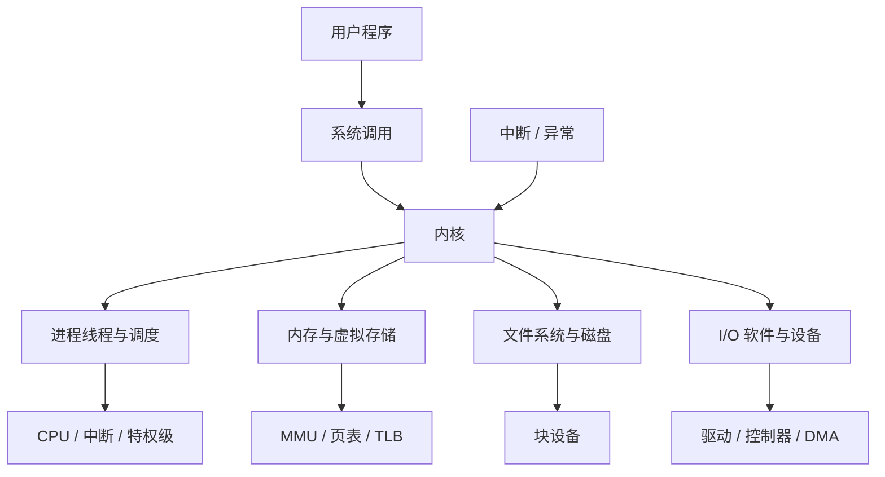
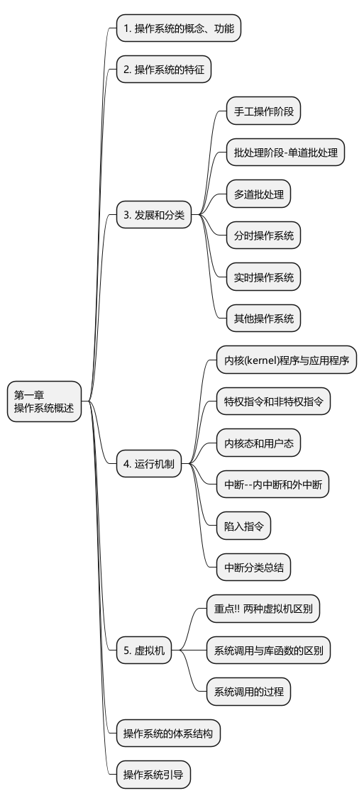
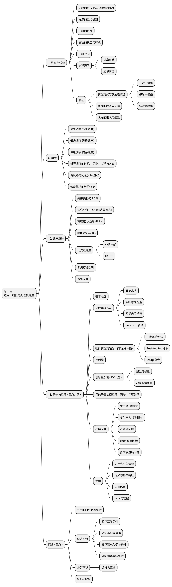
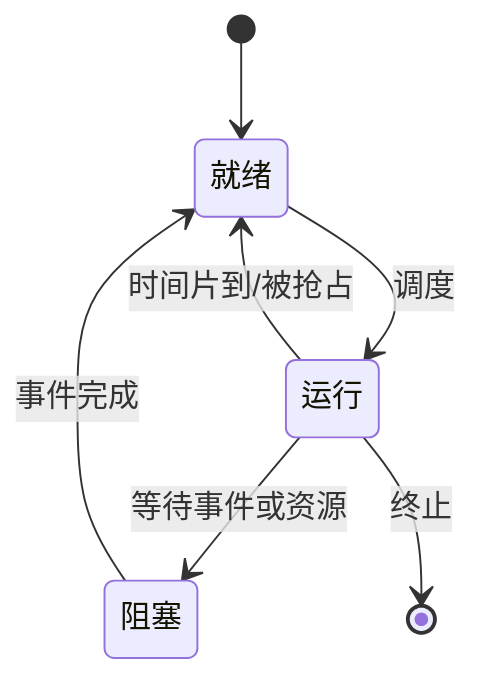
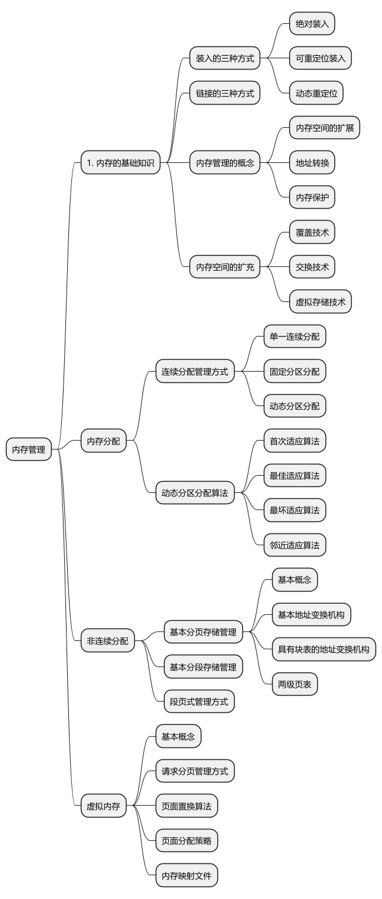
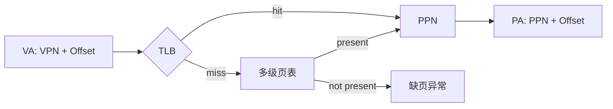
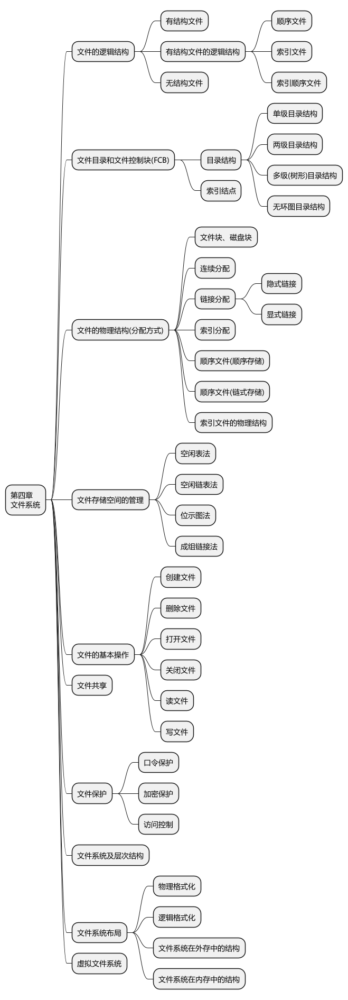
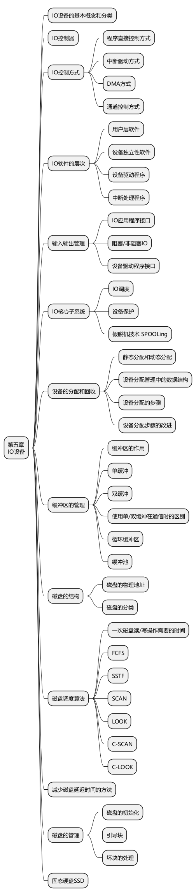

# 408 操作系统高密度总览

> 总主线：操作系统把 CPU、内存、文件和设备抽象成可安全共享的资源；每类资源都由控制结构记录状态，由算法完成分配与回收，并通过系统调用、中断、异常和特权级受控地修改。

## 0. 统一模型



任一机制都问四件事：

1. 管理对象是什么？
2. 状态放在哪个数据结构？
3. 哪个事件触发修改？
4. 失败或性能瓶颈由什么后继机制弥补？

## 1. 概述、运行机制与引导



### 1.1 用户态、内核态与特权指令

- CPU 用特权级或状态位区分用户态与内核态。
- 会影响全局资源或系统控制状态的操作只能由内核执行，如直接 I/O、修改关键控制寄存器、管理中断状态等；具体指令集合由体系结构决定。
- 用户程序通过系统调用受控地请求内核服务，不能直接跳入任意内核地址执行。

### 1.2 中断、异常与系统调用

| 事件 | 来源 | 同步性 | 典型例子 |
|---|---|---|---|
| 外部中断 | CPU 外部 | 异步 | 时钟、键盘、I/O 完成 |
| 陷阱 trap | 当前指令主动触发 | 同步 | 系统调用、调试断点 |
| 故障 fault | 指令执行中检测，通常可修正后重启指令 | 同步 | 缺页、部分保护异常 |
| 终止 abort | 严重且通常无法精确恢复 | 同步 | 严重硬件或一致性错误 |

不同教材对“内中断、异常、陷入”的分类层级可能不同，以题目定义为准。除零在多数体系结构中属于同步异常，但是否称 fault/abort 取决于架构，不能一概而论。

系统调用一般流程：

```text
用户程序准备参数
→ 执行陷入指令
→ CPU 保存返回所需状态并进入内核态
→ 内核分派系统调用服务
→ 返回值写回
→ 恢复用户态继续执行
```

库函数不等于系统调用。库函数可能完全在用户态完成，也可能封装一个或多个系统调用。

### 1.3 内核结构与虚拟化

| 结构 | 特点 | 主要代价 |
|---|---|---|
| 大内核 | 大量服务运行在内核态，调用路径短 | 内核庞大、故障影响面大 |
| 微内核 | 只保留基本机制，服务尽量在用户态 | IPC 和状态切换开销 |
| 模块化内核 | 核心 + 可加载模块 | 模块接口与依赖管理 |

第一类 VMM 直接运行于硬件；第二类 VMM 运行在宿主操作系统之上。

### 1.4 引导链

教材简化链路：

```text
固件 BIOS/UEFI → 引导记录/启动管理器 → 装入内核 → 初始化 → 启动用户空间
```

传统 BIOS/MBR 模型可细化为 `BIOS → MBR → 活动分区引导块/PBR → Boot Manager → Kernel`。真实 UEFI 系统流程不同，考试按题设模型回答。

## 2. 进程、线程、调度、同步与死锁



### 2.1 程序、进程、PCB 与上下文

- 程序是静态文件；进程是程序的一次动态执行实例。
- PCB 是进程存在和内核管理该进程的核心标志。
- 进程映像通常含代码、数据、堆、用户栈、内核栈及相关管理信息。
- 上下文至少涉及 PC、通用寄存器、状态寄存器和地址空间相关寄存器；具体保存集合依体系结构和切换原因而异。

| PCB 信息 | 例子 |
|---|---|
| 标识 | PID、父子关系 |
| 状态 | 就绪、运行、阻塞等 |
| CPU 现场 | PC、寄存器、PSW |
| 调度 | 优先级、时间片、队列指针 |
| 资源 | 地址空间、打开文件、I/O 状态 |
| 通信同步 | 信号、信号量、消息等 |

### 2.2 状态转换



- 阻塞态不能直接到运行态，必须先进入就绪队列。
- 运行到阻塞通常由当前进程主动等待；阻塞到就绪由外部事件完成或其他执行实体唤醒。
- 就绪进程没有 CPU，不能主动执行阻塞操作。
- 挂起态表示进程映像全部或部分被换出；可细分就绪挂起和阻塞挂起。

### 2.3 进程控制与通信

创建、撤销、阻塞、唤醒等控制操作必须以原子方式更新相关内核结构。单核上可在很短的内核临界段结合中断控制；多核还需原子指令、自旋锁或其他同步机制，不能简单认为“关本核中断即可保证全系统互斥”。

| IPC | 特点 |
|---|---|
| 共享内存 | 数据复制少、速度快，但必须另行同步 |
| 消息传递 | 内核管理消息，可直接或经信箱间接通信 |
| 管道 | 字节流缓冲，教材常按半双工模型讨论；空读、满写可阻塞 |
| 信号 | 异步事件通知，承载信息有限 |

### 2.4 线程

- 同一进程内线程共享地址空间、代码、全局数据和打开文件。
- 每个线程私有 PC、寄存器现场和栈。
- 用户级线程由线程库管理；在多对一模型中，阻塞系统调用可能阻塞整个进程且不能利用多核并行。
- 内核级线程由内核调度，可利用多核，但创建和切换成本通常高于纯用户级线程。

多对一、一对一、多对多的区别是用户线程与内核调度实体的映射关系。

### 2.5 三级调度

| 调度 | 转移 | 频率 |
|---|---|---|
| 高级/作业 | 后备队列 → 内存 | 低 |
| 中级/内存 | 挂起 ↔ 内存 | 中 |
| 低级/进程 | 就绪 → 运行 | 高 |

进程调度是“选择谁运行”，进程切换是“保存旧上下文并恢复新上下文”，二者不是同一动作。

### 2.6 调度算法

| 算法 | 类型 | 优点 | 主要问题 |
|---|---|---|---|
| FCFS | 非抢占 | 简单公平 | 短作业等待长，护航效应 |
| SJF | 非抢占 | 已知服务时间时平均等待/周转优 | 需预知，长作业饥饿 |
| SRTN | 抢占 | SJF 抢占版 | 调度频繁，长作业饥饿 |
| HRRN | 非抢占 | 兼顾等待和服务时间 | 需动态计算响应比 |
| RR | 抢占 | 交互响应好 | 时间片过小开销大，过大趋近 FCFS |
| 优先级 | 可抢占/非抢占 | 区分紧急程度 | 低优先级饥饿，可老化 |
| MLFQ | 抢占 | 兼顾短作业、交互和公平 | 参数与队列规则复杂 |

```text
周转时间 = 完成时间 - 到达时间
带权周转时间 = 周转时间 / 服务时间
响应比 = (等待时间 + 服务时间) / 服务时间
```

### 2.7 临界区与互斥

四项准则：空闲让进、忙则等待、有限等待、让权等待。

| 方法 | 主要问题 |
|---|---|
| 单标志 | 强制轮流，违反空闲让进 |
| 双标志先检查 | 检查与置位不原子，可能同时进入 |
| 双标志后检查 | 可能双方都等待 |
| Peterson | 满足互斥等要求，但忙等 |
| 屏蔽中断 | 只适合内核短临界段；多核上仅屏蔽本核不足以全局互斥 |
| TestAndSet/Swap/CAS | 原子，但自旋会消耗 CPU |

进程在用户临界区内通常仍可被抢占；“处于任何临界区都不能调度”是错误的绝对化说法。内核是否允许抢占取决于锁和内核设计。

### 2.8 信号量与 PV

记录型信号量的概念操作：

```text
P(S): 申请资源；不足则阻塞
V(S): 释放资源；必要时唤醒等待者
```

- 互斥信号量通常初值为 1，`P(mutex)` 与 `V(mutex)` 包住临界区。
- 同步关系使用“前驱完成后 V，后继开始前 P”。
- 对一个信号量的 P/V 操作必须原子化，但两个不同 P 操作之间并不会自动构成一个不可分割事务。
- 同时需要同步和互斥时，通常先等待资源/同步条件，再取得互斥锁，避免持锁等待另一个条件导致死锁。

生产者—消费者典型结构：

```text
P(empty) → P(mutex) → 放入 → V(mutex) → V(full)
P(full)  → P(mutex) → 取出 → V(mutex) → V(empty)
```

具体生产或消费耗时操作应尽量放在临界区外。

### 2.9 管程与经典问题

管程把共享数据和操作封装，并保证同一时刻只有一个执行实体活跃于管程内部；条件变量用于在条件不满足时等待和在状态改变后通知。

经典问题：生产者—消费者、读者—写者、哲学家进餐、吸烟者。解题时先写资源数、互斥对象和前驱关系，再确定信号量初值与 P/V 位置。

### 2.10 死锁

四个必要条件：互斥、请求并保持、不可剥夺、循环等待。

| 策略 | 方法 |
|---|---|
| 预防 | 静态破坏至少一个必要条件 |
| 避免 | 运行时只进入安全状态，如银行家算法 |
| 检测 | 检查等待关系/资源分配状态 |
| 解除 | 剥夺、撤销、回滚等 |

```text
Need = Max - Allocation
```

银行家算法不断寻找 `Need <= Available` 的进程，假设其完成并归还资源；能让全部进程依次完成则存在安全序列。资源只有单实例时等待图有环可判死锁；多实例资源分配图有环不一定死锁。

## 3. 内存管理



### 3.1 装入与链接

| 装入 | 地址处理 | 主要限制 |
|---|---|---|
| 绝对装入 | 编译/链接时确定绝对地址 | 地址固定，适用范围小 |
| 静态重定位 | 装入时一次修改地址 | 装入后不能移动，常需连续空间 |
| 动态重定位 | 运行时由硬件转换 | 支持移动、分页和虚拟地址 |

链接分为静态链接、装入时动态链接和运行时动态链接。运行时动态链接按需解析共享库符号，节省空间但增加运行环境和装载器复杂度。

### 3.2 覆盖、交换与连续分配

- 覆盖：同一进程内不会同时执行的模块共享覆盖区，程序员/编译系统规划。
- 交换：把整个进程或其主要映像换入换出，和挂起、中级调度相关。
- 固定分区产生内部碎片；动态分区产生外部碎片。

| 动态分区算法 | 特点 |
|---|---|
| 首次适应 | 从低址开始找首个足够块，简单、通常综合表现好 |
| 邻近适应 | 从上次位置继续找，搜索均匀但可能破坏大块 |
| 最佳适应 | 选最小足够块，容易留下细小碎片 |
| 最坏适应 | 选最大块，可能迅速消耗大空闲区 |

回收时必须检查前后相邻空闲区并合并。紧凑需要进程可移动和动态重定位支持。

### 3.3 基本分页

```text
逻辑地址 = 页号 | 页内偏移
物理地址 = 页框号 | 页内偏移
页内偏移位数 = log2(页面大小/编址单位)
```

- 页号越界先触发地址越界异常。
- 页表基址加“页号 × 页表项长度”定位页表项。
- 无 TLB 的基本单级页表访问通常需要查页表和访问目标数据两次主存访问。
- 分页消除外部碎片，但最后一页可能有内部碎片。

### 3.4 TLB 与多级页表



- 多级页表按需建立下级页表，减少页表连续占用和未使用部分的空间。
- 无 TLB 时，N 级页表访问一个数据通常需要 `N+1` 次主存访问。
- TLB 命中时通常只需目标数据的主存访问；是否另计 TLB 查询时间按题目模型。
- 进程切换是否必须清空 TLB 取决于是否有 ASID/PCID 等地址空间标识机制。

### 3.5 分段与段页式

| 项 | 分页 | 分段 |
|---|---|---|
| 单位 | 固定大小页 | 逻辑段 |
| 地址 | 页号+偏移 | 段号+段内偏移 |
| 用户可见性 | 通常透明 | 逻辑上可见 |
| 碎片 | 内部碎片 | 外部碎片 |
| 优势 | 离散分配、管理方便 | 共享和保护自然 |

段表项含段基址、段长和权限；地址变换必须先检查段内偏移是否越界。段页式先查段表再查页表，基本模型下最后访问数据，TLB 可减少额外访存。

### 3.6 请求分页与缺页处理

```text
访问页
→ 页表项无效/不在内存
→ 缺页异常进入内核
→ 判断访问是否合法
→ 找空闲页框或选择牺牲页
→ 脏页必要时写回
→ 从外存调入目标页
→ 更新页表/TLB相关状态
→ 重启导致缺页的指令
```

页表项常含存在/状态位、访问位、修改位、权限和外存位置等。

### 3.7 页面置换

| 算法 | 特点 | 边界 |
|---|---|---|
| OPT | 缺页最少 | 需要未来访问，不可实现 |
| FIFO | 简单 | 可能出现 Belady 异常 |
| LRU | 利用最近过去 | 实现开销大，栈算法无 Belady 异常 |
| Clock | 访问位实现二次机会 | LRU 的低成本近似 |
| 改进 Clock | 同时看访问位、修改位 | 优先淘汰未访问且未修改页 |

固定分配通常只能局部置换；可变分配可配局部或全局置换。“固定分配全局置换”会破坏固定分配定义。

### 3.8 抖动与有效访问时间

当驻留集小于进程工作集时，缺页率激增，系统大量换页而很少执行有效工作，称为抖动。处理方法：降低多道程序度、工作集模型、缺页率调节等。

简化 EAT：

```text
EAT = (1-p) × 正常访问时间 + p × 缺页处理平均时间
```

缺页处理是毫秒级，正常访存是纳秒级，因此即使 `p` 很小也可能主导 EAT。题目若区分脏页概率、重启开销和多级页表路径，应分别加权。

## 4. 文件系统



### 4.1 逻辑结构、目录项、FCB 与 inode

- 逻辑结构描述用户看到的字节流或记录组织；物理结构描述逻辑文件块如何映射到磁盘块，二者正交。
- FCB 是文件控制信息的总称。
- 类 Unix 设计中目录项通常保存文件名和 inode 编号；inode 保存除文件名外的大量属性及数据块地址。
- 目录文件本身也是文件，有自己的控制信息和数据块。

```text
路径名 → 逐级目录项 → inode 编号 → inode → 数据块地址 → 文件内容
```

### 4.2 格式化与文件系统布局

```text
低级/物理格式化 → 分区 → 高级/逻辑格式化 → 创建文件系统结构
```

简化布局：引导块、超级块、inode 位图、数据块位图、inode 区、数据区。

| 结构 | 作用 |
|---|---|
| 超级块 | 记录整个文件系统的规模、布局和状态 |
| inode 位图 | 管理 inode 是否分配 |
| 数据块位图 | 管理数据区块是否分配 |
| inode 区 | 集中存放文件控制信息 |
| 数据区 | 存普通文件和目录文件内容 |

位图题必须先确认首个对象编号、保留位和一个字节内部位序，再套块号公式。

### 4.3 文件物理分配

| 方式 | 随机访问 | 增长 | 主要问题 |
|---|---|---|---|
| 连续分配 | 快 | 困难 | 外部碎片、需预知大小 |
| 隐式链接 | 慢 | 容易 | 指针开销，链断风险 |
| FAT 显式链接 | 可沿表定位 | 容易 | FAT 可能很大、占内存 |
| 单级索引 | 支持 | 容易 | 小文件索引开销，大文件容量受限 |
| 多级/混合索引 | 支持 | 强 | 间接层次增加访问开销 |

混合索引计算固定步骤：

1. 求一个间接块可存多少地址项 `K = 块大小 / 地址项大小`。
2. 直接地址覆盖 `D` 个数据块。
3. 一级间接覆盖 `K` 个；二级覆盖 `K²` 个；三级覆盖 `K³` 个。
4. 最大文件大小为可寻址数据块总数乘块大小。
5. 访问次数需按索引块是否已在内存分别讨论。

### 4.4 open、read、write 与打开文件表

```text
open(path)
→ 逐级目录检索
→ 找到 inode/FCB
→ 建立系统级和进程级打开文件表项
→ 返回 fd

read(fd)
→ 查进程打开文件表
→ 定位系统表项和 inode
→ 文件偏移对应逻辑块
→ 映射物理块并发起 I/O
```

后续 `read/write` 通过 fd 访问已打开对象，不再每次按路径重新检索。打开文件表还记录偏移、权限、引用/打开计数等，具体字段按题设。

### 4.5 硬链接与软链接

| 项 | 硬链接 | 软链接 |
|---|---|---|
| 指向 | 同一 inode | 目标路径 |
| 文件类型 | 另一个目录项 | 独立特殊文件 |
| 删除原名 | 其他硬链接仍可访问 | 可能悬空 |
| 跨文件系统 | 通常不能 | 通常可以 |

删除硬链接先删目录项并减少链接计数；链接计数为零且没有其他引用时才回收数据块和 inode，真实系统还需考虑打开引用。

### 4.6 空闲空间管理

- 空闲表：适合连续空闲区。
- 空闲链表：把空闲块或空闲区串联。
- 位图：查找和统计方便，空间固定。
- 成组链接：按组管理空闲块，减少大规模链表驻留内存的需求。

VFS 为不同具体文件系统提供统一接口和对象模型。

## 5. I/O 管理与磁盘



### 5.1 I/O 软件层次

```text
用户层 I/O 软件
→ 设备独立性软件
→ 设备驱动程序
→ 中断处理程序
→ 设备控制器与设备
```

- 设备独立性软件完成逻辑设备名映射、保护、缓冲、分配和公共差错处理。
- 驱动程序把抽象请求转换为具体控制器寄存器和命令操作。
- 中断处理程序确认完成状态、处理错误并唤醒等待执行实体。

### 5.2 I/O 控制方式

| 方式 | CPU 参与 | 适用模型 |
|---|---|---|
| 程序查询 | 忙等并执行数据传送 | 简单低速设备 |
| 中断驱动 | 启动后并行工作，完成时处理 ISR | 低中速、离散事件 |
| DMA | 初始化和结束处理，数据块由 DMAC 控制传送 | 高速大块数据 |
| 通道 | 通道程序管理一组 I/O 操作 | 大型系统 |

教材常用“中断按字、DMA 按块”帮助比较 CPU 介入粒度，但真实接口可能缓冲多个字后才中断。

### 5.3 read 数据链


是否发生从内核缓冲区到用户缓冲区的额外复制取决于具体 I/O 路径；408 常用模型按一次内核缓冲再复制讨论。

### 5.4 缓冲

- 单缓冲：设备、内核和进程部分并行。
- 双缓冲：一个缓冲输入时另一个可处理。
- 循环缓冲：多个缓冲按生产—消费循环使用。
- 缓冲池：系统统一管理多个缓冲块。

单缓冲处理一块的常见稳态近似为 `max(输入时间, 处理时间) + 搬移时间`，但首块、末块和能否真正重叠必须按题目时序图计算。

### 5.5 SPOOLing 与设备分配

SPOOLing 用外存输入井/输出井和相应进程把独占设备虚拟成可排队共享的设备。打印作业看似并发提交，实际由守护进程串行控制打印机。

设备分配常涉及：系统设备表 SDT、设备控制表 DCT、控制器控制表 COCT、通道控制表 CHCT。分配必须沿设备—控制器—通道检查可用性，使用逻辑设备名提高设备独立性。

### 5.6 磁盘调度

| 算法 | 行为 | 主要问题 |
|---|---|---|
| FCFS | 按到达顺序 | 移动距离可能大 |
| SSTF | 选最近请求 | 远端请求可能饥饿 |
| SCAN | 向一端扫描后反向 | 两端等待特性不同 |
| LOOK | 到该方向最远请求即反向 | 不走无请求端点 |
| C-SCAN | 只单向服务，回程不服务 | 等待更均匀，回程有移动 |
| C-LOOK | 只到最远请求并跳回另一端请求 | 减少无效端点移动 |

计算题必须先确认初始磁头位置、初始方向、磁道边界，以及回程移动是否计入总距离。

```text
一次磁盘访问 = 寻道 + 旋转延迟 + 传输
```

扇区交错编号、柱面/盘面布局和预读可减少旋转等待；磁盘调度主要优化寻道移动。

## 6. 四条跨章节综合链

### 6.1 程序从磁盘到运行

```text
可执行文件
→ 装入与地址映射
→ 创建进程映像和 PCB
→ 设置入口 PC、页表和用户栈
→ 调度为运行态
→ CPU 自动取指执行
```

OS 不逐条指挥普通指令执行；它建立执行环境，并在系统调用、中断、异常和调度点重新取得控制权。

### 6.2 分时并发

```text
时钟中断
→ 进入内核
→ 更新运行时间和状态
→ 调度器选择进程
→ 保存旧上下文
→ 切换地址空间与内核栈
→ 恢复新上下文
→ 返回用户态
```

### 6.3 虚拟地址访问

```text
VA → TLB
├─ 命中 → PA → Cache/主存
└─ 未命中 → 页表
   ├─ 页在内存 → 更新 TLB → PA
   └─ 页不在内存 → 缺页异常 → 调页/置换 → 重启指令
```

### 6.4 文件读取

```text
路径 → open 目录检索 → fd
→ read 查打开文件表
→ inode 把逻辑块映射到物理块
→ 驱动/控制器/DMA 发起 I/O
→ 完成中断
→ 数据交给用户进程
```

## 7. 高频陷阱速查

1. 系统调用进入内核态不等于一定发生进程切换。
2. 进程调度是选择，进程切换是保存/恢复上下文。
3. 阻塞态不能直接转运行态；就绪态不能主动执行阻塞操作。
4. 关本核中断不能在多核系统中替代全局互斥。
5. 用户临界区内并非绝对不可被抢占。
6. TLB miss、Cache miss、缺页互不等价。
7. 分页产生内部碎片；动态分区和分段可能产生外部碎片。
8. 多级页表主要节省页表实际占用，不直接减少无 TLB 时的访存次数。
9. 目录项、FCB 和 inode 不是同义词。
10. open 完成按名检索；read 通常通过 fd 和打开文件表定位文件。
11. DMA 数据阶段减少 CPU 搬运，不代表整个 I/O 过程不需要 CPU。
12. SCAN、LOOK、C-SCAN 的端点和回程规则必须按题设区分。
