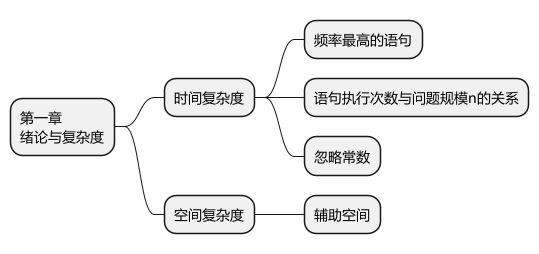
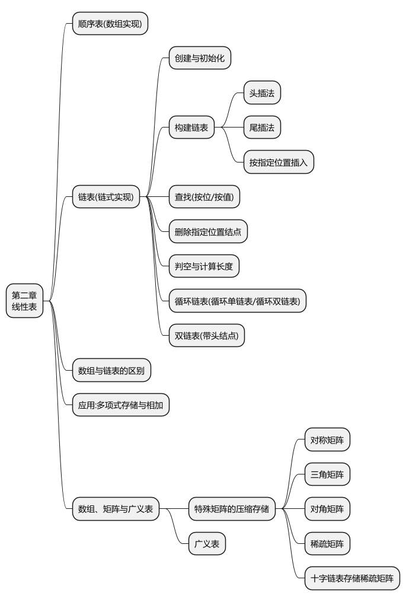
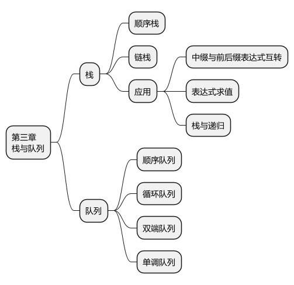
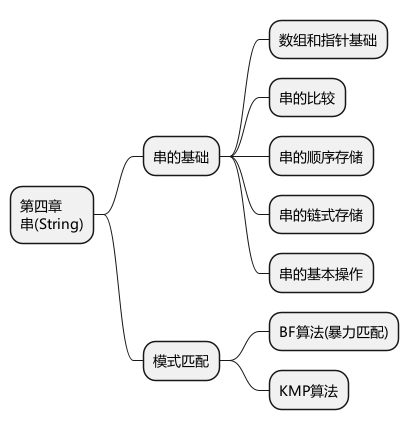
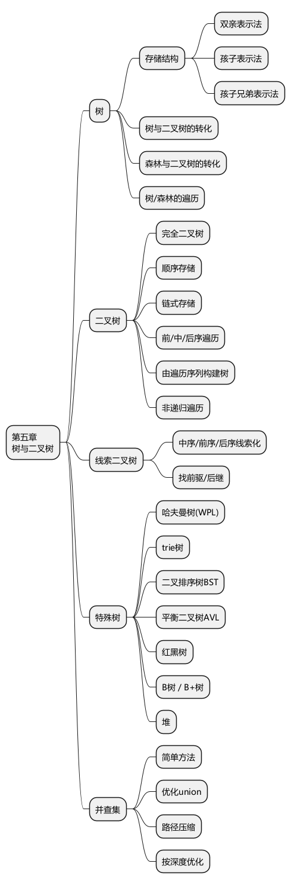
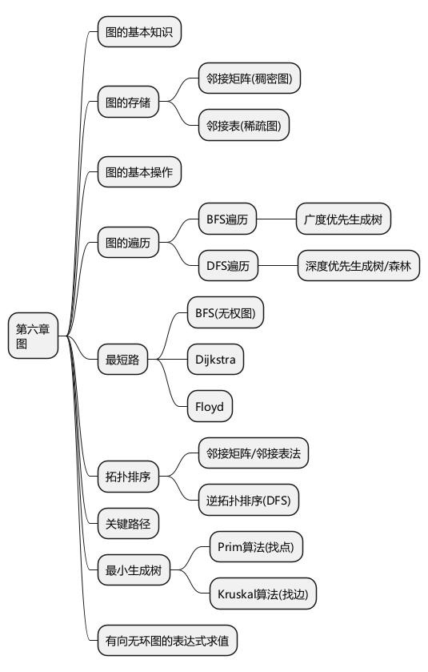
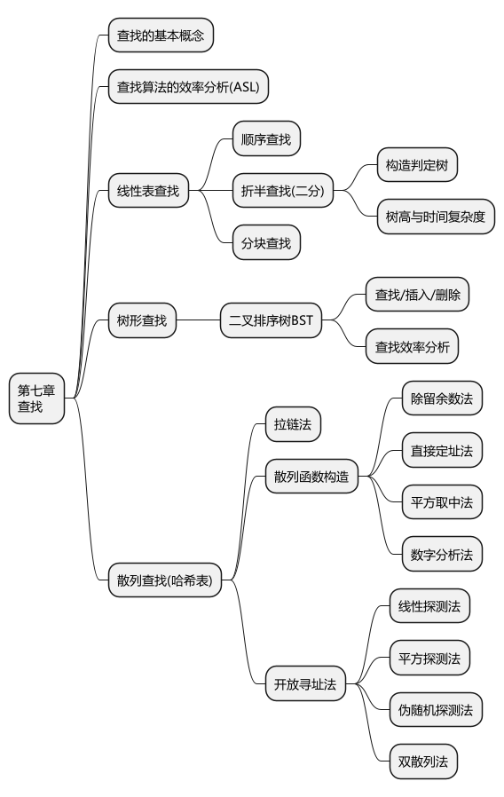
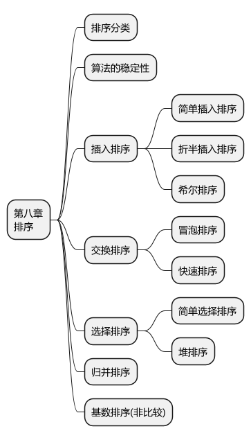

# 408 数据结构高密度总览

> 主线：先用复杂度衡量算法，再用线性结构组织顺序关系，用树和图表达层次与网络关系，最后在这些结构上完成查找与排序。

## 0. 全科导航

| 模块 | 核心问题 | 第一反应 |
|---|---|---|
| 复杂度 | 算法随规模怎样增长 | 找基本操作、最高频语句、最高阶项 |
| 线性表 | 元素如何按一对一关系组织 | 顺序表看搬移，链表看指针修改 |
| 栈与队列 | 受限线性操作怎样建模 | 栈 LIFO，队列 FIFO，先判空满条件 |
| 串 | 模式怎样在文本中定位 | BF 直接回退，KMP 利用前后缀 |
| 树 | 层次关系怎样存储和遍历 | 递归结构、遍历序列、特殊树性质 |
| 图 | 多对多关系怎样表示和求解 | 稠密图用矩阵，稀疏图用邻接表 |
| 查找 | 如何降低比较次数 | 有序表二分，动态集合用树，散列看冲突 |
| 排序 | 如何按关键字重排 | 比较次数、移动次数、稳定性、空间复杂度 |

## 1. 绪论与复杂度



### 时间复杂度

1. 确定问题规模 `n`。
2. 找随 `n` 增长而重复执行的基本操作。
3. 计算执行次数 `T(n)`。
4. 忽略常数、低阶项和最高阶项系数，写成 `O(f(n))`。

常见增长顺序：

```text
O(1) < O(log n) < O(n) < O(n log n) < O(n²) < O(n³) < O(2ⁿ) < O(n!)
```

- 顺序语句：复杂度相加，取最高阶。
- 嵌套循环：各层次数相乘，但循环变量若倍增/折半，通常产生对数级。
- 递归：先写递推式，再用展开、递归树或主定理分析。
- 最好、平均、最坏复杂度必须看题目问法，不能混用。

### 空间复杂度

空间复杂度统计算法运行时额外使用的空间。原输入存储通常不计入辅助空间；递归深度会转化为栈空间。

## 2. 线性表



### 顺序表与链表

| 对照 | 顺序表 | 链表 |
|---|---|---|
| 存储 | 连续 | 结点可离散 |
| 随机访问 | `O(1)` | `O(n)` |
| 按位插删 | 需移动元素，通常 `O(n)` | 找到位置后改指针 `O(1)` |
| 空间 | 容量固定或扩容，可能浪费 | 指针有额外开销 |
| 局部性 | 好 | 较差 |

链表题先画前驱、当前和后继结点，再改指针。删除结点必须先保存仍需访问的后继；双链表要同时维护前向和后向链接。

### 常见结构

- 单链表：头插法逆序，尾插法保持输入顺序。
- 带头结点链表：首元结点操作与其他位置统一。
- 循环链表：尾结点后继指向头结点或头结点的下一结点。
- 双链表：适合频繁向前、向后移动。
- 稀疏矩阵：三元组表便于顺序处理；十字链表同时组织行、列非零元。

### 高频算法抓手

- 双指针：快慢指针、前后指针、区间收缩。
- 删除重复/指定值：明确是否保持相对顺序。
- 合并有序表：比较当前最小元素并推进对应指针。
- 多项式相加：按指数归并，同指数项合并，系数为零时删除。

## 3. 栈与队列



### 栈

- 后进先出，操作受限在栈顶。
- 顺序栈常以 `top` 表示栈顶位置；必须先看题目约定 `top` 指向栈顶元素还是下一空位。
- 链栈通常在表头入栈、出栈，不必设置尾指针。

典型应用：括号匹配、表达式求值、中缀转后缀、函数调用、递归和深度优先搜索。

### 队列

- 先进先出，队尾入队、队头出队。
- 循环队列常用取模实现：`rear = (rear + 1) % MaxSize`。
- 牺牲一个存储单元时：队空 `front == rear`；队满 `(rear + 1) % MaxSize == front`。
- 队列长度：`(rear - front + MaxSize) % MaxSize`。
- 双端队列限制两端的插入/删除；题目常考合法输出序列。

## 4. 串与模式匹配



### BF

主串和模式串从某个起点逐字符比较；失配后主串起点后移一位，模式串回到开头。最坏复杂度 `O(nm)`。

### KMP

KMP 在失配时不回退主串指针，利用模式串已匹配部分的相同前缀与后缀移动模式串。

做题顺序：

1. 明确 `next` 或 `nextval` 的定义和下标起点。
2. 求每个前缀的最长相等真前缀/真后缀。
3. 失配时按表移动模式串指针。
4. 不同教材的 `next` 值可能整体相差 1，必须以题目定义为准。

## 5. 树与二叉树



### 基本性质

- 树中结点数等于所有结点度数之和加 1。
- 非空二叉树第 `i` 层最多有 `2^(i-1)` 个结点。
- 高度为 `h` 的二叉树最多有 `2^h - 1` 个结点。
- 任意非空二叉树中，度为 0 的结点数 `n0 = n2 + 1`。

### 遍历与还原

| 遍历 | 顺序 | 常见用途 |
|---|---|---|
| 先序 | 根—左—右 | 复制、前缀表达式 |
| 中序 | 左—根—右 | BST 得到有序序列 |
| 后序 | 左—右—根 | 删除、计算子树信息 |
| 层序 | 按层从左到右 | 队列实现、宽度问题 |

- 先序 + 中序或后序 + 中序可唯一确定二叉树（结点值互异）。
- 只给先序 + 后序通常不能唯一确定普通二叉树。
- 非递归遍历的本质是显式维护递归调用栈。

### 线索二叉树与树森林转换

- 线索化利用空指针保存前驱或后继，并用标志位区分孩子指针和线索。
- 树转二叉树采用孩子—兄弟表示：左指针指第一个孩子，右指针指下一个兄弟。
- 森林转二叉树后，各棵树根结点沿右指针连接。

### 特殊树

- Huffman：权值越小越先合并；带权路径长度 `WPL = Σ(叶权值 × 路径长度)`。
- BST：左子树关键字小于根，右子树大于根；中序有序。
- AVL：任一结点左右子树高度差绝对值不超过 1；插入后从下向上找首个失衡点旋转。
- 红黑树：以较弱平衡换取较少旋转，查找、插入、删除为 `O(log n)`。
- B/B+ 树：面向外存的多路平衡树；B+ 树数据集中于叶层，叶结点顺序连接，适合范围查询。
- 堆：完全二叉树；大根堆根最大，小根堆根最小。

### 并查集

- `find` 查代表元，`union` 合并集合。
- 按秩/规模合并避免高树；路径压缩使后续查询接近常数时间。

## 6. 图



### 存储与遍历

| 项 | 邻接矩阵 | 邻接表 |
|---|---|---|
| 空间 | `O(V²)` | `O(V+E)` |
| 判边 | `O(1)` | 与顶点度相关 |
| 适合 | 稠密图 | 稀疏图 |
| 遍历 | `O(V²)` | `O(V+E)` |

- BFS 使用队列，可求无权图单源最短路和广度优先生成树。
- DFS 使用递归或栈，可求深度优先森林、连通性和拓扑相关问题。

### 核心算法

| 问题 | 算法 | 关键边界 |
|---|---|---|
| 无权单源最短路 | BFS | 按层首次到达即最短 |
| 非负权单源最短路 | Dijkstra | 不能处理负权边 |
| 多源最短路 | Floyd | 动态规划，允许负边但不能有负环 |
| 最小生成树 | Prim | 逐步扩顶点，适合稠密图 |
| 最小生成树 | Kruskal | 按边权选边并查集判环，适合稀疏图 |
| 拓扑排序 | 入度法 / DFS | 仅有向无环图；结果可能不唯一 |
| 关键路径 | AOE 网 | 关键活动时差为 0 |

## 7. 查找



### 线性与树形查找

- 顺序查找不要求有序，平均比较次数为线性级。
- 折半查找要求顺序存储且有序；判定树用于计算成功/失败 ASL。
- 分块查找由索引表和块内顺序查找组成，块间有序、块内可无序。
- BST 的效率取决于树高；极端情况下退化为链表。

### 散列表

装填因子 `α = 表中记录数 / 表长`。`α` 越大，空间利用率越高，但冲突通常越多。

常见构造：除留余数、直接定址、数字分析、平方取中。冲突处理：拉链法、线性探测、平方探测、伪随机探测、双散列。

开放定址删除不能直接清空槽位，通常设置删除标记，否则会截断后续探测路径。

## 8. 排序



| 算法 | 平均时间 | 最坏时间 | 辅助空间 | 稳定性 | 关键特征 |
|---|---:|---:|---:|---|---|
| 直接插入 | `O(n²)` | `O(n²)` | `O(1)` | 稳定 | 基本有序时快 |
| 折半插入 | `O(n²)` | `O(n²)` | `O(1)` | 稳定 | 只减少比较，不减少移动 |
| 希尔 | 依增量而定 | 依增量而定 | `O(1)` | 不稳定 | 分组插入 |
| 冒泡 | `O(n²)` | `O(n²)` | `O(1)` | 稳定 | 可提前终止 |
| 快速 | `O(n log n)` | `O(n²)` | 平均 `O(log n)` | 不稳定 | 递归深度、枢轴选择 |
| 简单选择 | `O(n²)` | `O(n²)` | `O(1)` | 不稳定 | 移动次数少 |
| 堆排序 | `O(n log n)` | `O(n log n)` | `O(1)` | 不稳定 | 适合求 Top-K |
| 归并 | `O(n log n)` | `O(n log n)` | `O(n)` | 稳定 | 外部排序基础 |
| 基数 | `O(d(n+r))` | 同左 | `O(r)` | 稳定 | 非比较排序 |

### 一眼判断

- 要稳定：插入、冒泡、归并、基数。
- 基本有序：直接插入、带提前终止的冒泡。
- 最坏仍需 `O(n log n)`：堆、归并。
- 辅助空间严格 `O(1)`：堆排序优于归并。
- 大数据外存排序：多路归并；减少初始归并段、增大归并路数可降低趟数，但归并路数越大内部缓冲和比较组织越复杂。

## 9. 跨章节解题链

```text
抽象数据类型
→ 选择存储结构
→ 写出核心操作
→ 证明正确性
→ 分析时间/空间复杂度
→ 对照题目约束优化
```

做综合算法题时先写不变量和边界，再写代码或伪代码。链表先画指针，树图先定遍历状态，查找排序先说明前置条件，复杂度最后逐层核算。
