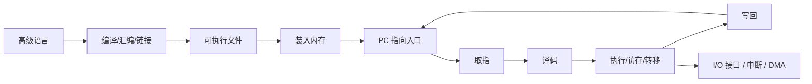
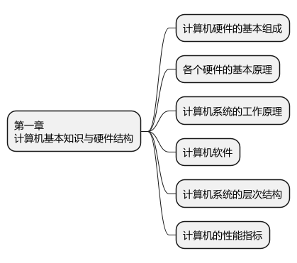
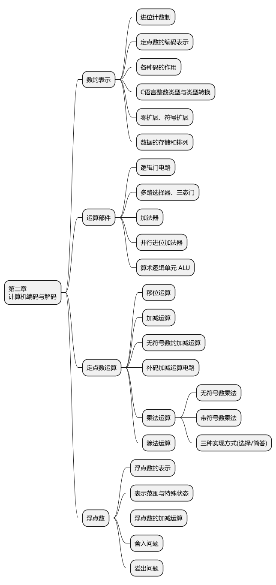
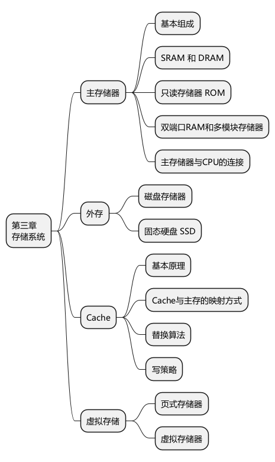
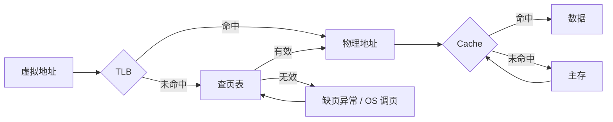
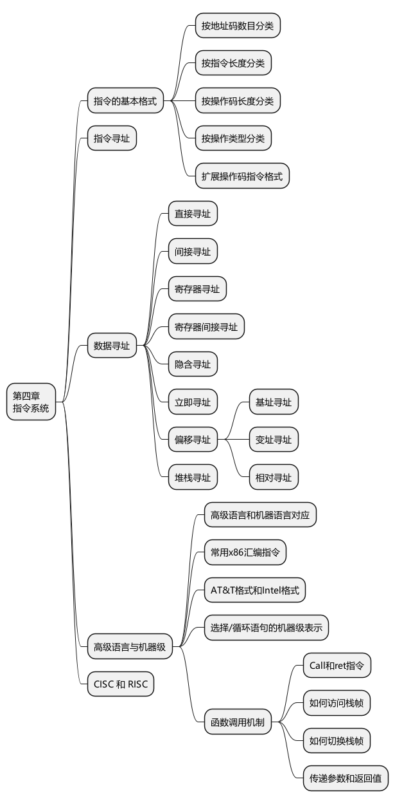
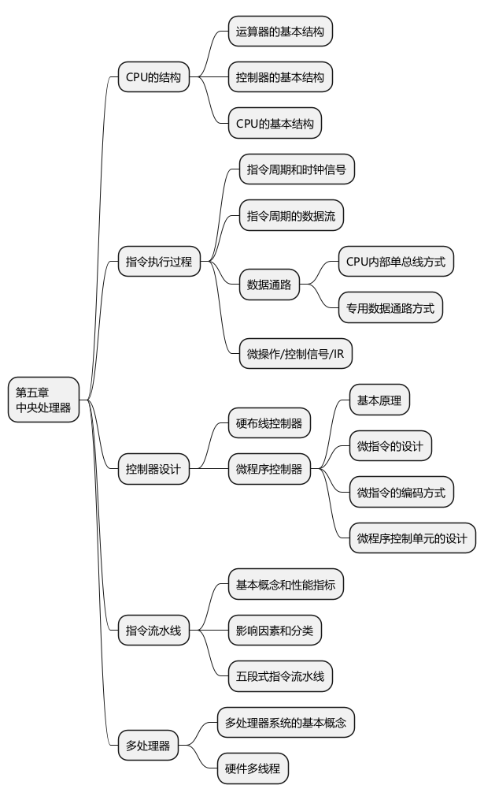
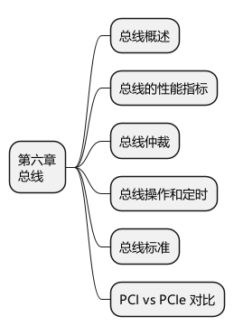
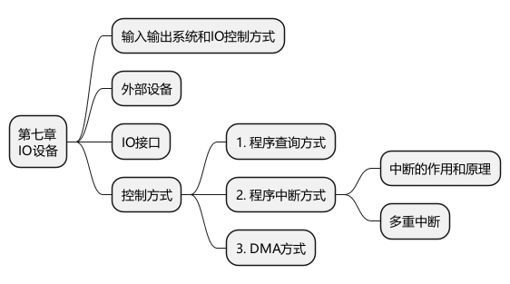
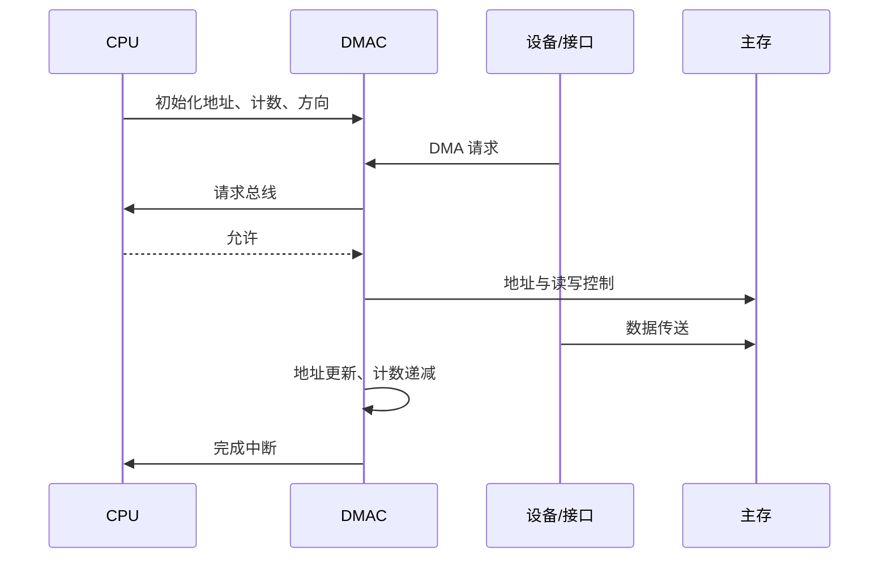

# 408 计算机组成原理高密度总览

> 总主线：高级语言经过编译形成机器指令；指令和数据进入存储系统；CPU 按 PC 取指、译码并驱动数据通路；访存经过地址转换和 Cache；I/O 通过接口、中断与 DMA 完成。性能最终由指令数、CPI、时钟周期、访存和 I/O 共同决定。

## 0. 整机执行链



四个总问题：

1. 数据和指令在哪里？
2. 谁产生控制信号？
3. 地址、数据和控制走哪条通路？
4. CPU、存储器、DMA 和外设分别参与到什么程度？

## 1. 计算机系统概述



### 1.1 存储程序与整机结构

- 指令和数据都以二进制形式存放在存储器中，区别取决于取出时的解释方式。
- CPU 由运算器、控制器和寄存器组成；主存保存当前可直接访问的程序与数据；外设经 I/O 接口接入总线。
- PC 保存下一条待取指令地址，IR 保存当前指令，MAR 保存访存地址，MDR 保存访存数据。
- 现代结构以存储器为中心，CPU、主存和 I/O 通过总线协同。

### 1.2 软件到硬件

```text
C 源程序 → 预处理 → 编译 → 汇编 → 目标文件 → 链接 → 可执行文件 → 装入 → 机器指令执行
```

- `if/while/for`：比较、条件转移和回跳。
- 数组：基地址 + 下标缩放后的偏移。
- 指针：地址和间接寻址。
- 函数：参数传递、返回地址、栈帧建立与恢复。

### 1.3 性能公式

```text
CPU 执行时间 = 指令条数 × CPI × 时钟周期
             = 指令条数 × CPI / 主频

MIPS = 指令条数 / (执行时间 × 10^6)
     = 主频 / (CPI × 10^6)
```

- 主频高不等于程序一定快；指令数、CPI、Cache 未命中和流水线停顿都会改变结果。
- 吞吐率关心单位时间完成多少任务；响应时间关心一个任务多久完成。
- MIPS 不适合跨指令集直接比较；FLOPS 更适合浮点密集任务。
- 容量换算通常按 2 的幂；频率、传输率等题目按题设单位换算，不能机械套 1000 或 1024。

### 1.4 易混对象

| 对象 | 含义 |
|---|---|
| 机器字长 | CPU 一次能处理的基本二进制位数 |
| 存储字长 | 一个存储单元包含的位数 |
| 指令字长 | 一条指令的位数，可定长或变长 |
| 地址总线宽度 | 决定可表示多少地址 |
| 数据总线宽度 | 决定一次总线传输的数据位数 |

## 2. 数据的表示与运算



### 2.1 数制、编码与类型转换

- `n` 位无符号数范围：`0 ~ 2^n - 1`。
- `n` 位补码范围：`-2^(n-1) ~ 2^(n-1)-1`。
- 原码直观但有两个零；补码零唯一、符号位参与运算，并把减法统一为加法。
- 移码常用于浮点阶码，便于按无符号形式比较阶的大小。
- 零扩展用于无符号数；符号扩展复制补码符号位；窄化转换会截断高位。
- C 中有符号与无符号混合运算要先判断整型提升和通常算术转换，不能按数学直觉比较。

### 2.2 补码运算与标志位

```text
A - B = A + [-B]补
```

| 标志 | 典型意义 |
|---|---|
| OF | 有符号溢出 |
| CF | 无符号加法进位/减法借位的硬件表示，具体语义看 ISA |
| ZF | 结果为 0 |
| SF | 结果最高位 |

有符号加法中，同号相加结果异号表示溢出；也可用符号位进位与最高数值位进位异或判断。正负数相加不会发生有符号加法溢出。

### 2.3 加法器、ALU、乘除与移位

- 串行进位结构简单但进位逐级传播；先行进位用生成/传递信号并行计算进位。
- ALU 完成算术、逻辑、比较和移位，并产生状态标志。
- 逻辑移位通常补 0；算术右移复制符号位；左移可能溢出，不能无条件等同于乘 2。
- 乘法建立在部分积、移位和加法上；除法建立在试商、移位和加减上。

### 2.4 IEEE 754

单精度：1 位符号、8 位阶码、23 位尾数字段；双精度：1、11、52。

规格化单精度真值：

```text
(-1)^S × 1.M × 2^(E-127)
```

| 阶码 | 尾数 | 含义 |
|---|---|---|
| 全 0 | 全 0 | ±0 |
| 全 0 | 非 0 | 非规格化数 |
| 1～254 | 任意 | 规格化数 |
| 全 1 | 全 0 | ±∞ |
| 全 1 | 非 0 | NaN |

浮点加减：对阶 → 尾数运算 → 规格化 → 舍入 → 判断上溢/下溢。小阶向大阶对齐，尾数右移会损失精度；浮点运算不保证实数意义下的结合律。

### 2.5 大小端与对齐

- 大端：高有效字节放低地址；小端：低有效字节放低地址。
- 对齐会引入填充，但能减少一次访问跨越多个存储单位的概率。
- 做内存题先写每个字节地址，再按端序组合，避免直接在脑中翻转十六进制串。

## 3. 存储系统



### 3.1 层次与局部性

```text
寄存器 → Cache → 主存 → SSD/磁盘
速度递减，容量递增，单位成本递减
```

- 时间局部性：最近访问的内容可能再次访问。
- 空间局部性：某地址被访问后，附近地址可能被访问。
- Cache—主存主要缓解速度矛盾；主存—辅存层次与虚拟存储主要缓解容量和地址空间矛盾。

### 3.2 SRAM、DRAM、Flash

| 类型 | 特点 | 常见用途 |
|---|---|---|
| SRAM | 双稳态存储，不需周期刷新，快、贵、密度低 | Cache |
| DRAM | 电容存储，读出后恢复且需周期刷新，密度高 | 主存 |
| Flash | 非易失，擦除粒度大于写入粒度 | SSD、固件 |

DRAM 刷新按行进行。集中刷新有集中死时间；分散刷新把刷新分散到各周期；异步刷新按最大刷新间隔均匀安排。

### 3.3 主存扩展与多模块

- 位扩展：增加每个存储字的位数，各芯片并行提供不同数据位。
- 字扩展：增加存储字数量，用高位地址译码选择芯片组。
- 字位同时扩展：先按位组成一组，再按字扩展多组。
- 低位交叉多模块使连续地址轮流落在不同模块，可流水启动，提高连续访问带宽。

若 `m` 个模块可每隔 `r` 启动一次，单模块周期为 `T`，连续取 `n` 个字的模型常写为：

```text
T + (n - 1)r
```

具体是否成立必须满足模块数和连续启动条件。

### 3.4 Cache 基本量

若 Cache 与主存串行查找：

```text
平均访问时间 = 命中时间 + 缺失率 × 缺失代价
```

若题目把命中与未命中路径的总时间分别给出，则按条件概率加权，不能混用两种公式口径。

### 3.5 Cache 映射

| 映射 | 地址划分 | 特点 |
|---|---|---|
| 直接 | Tag + 行号 + 块内偏移 | 简单快，冲突多，无替换选择 |
| 全相联 | Tag + 块内偏移 | 冲突少，比较硬件多 |
| 组相联 | Tag + 组号 + 块内偏移 | 两者折中 |

```text
块内偏移位数 = log2(块大小/编址单位)
组号位数 = log2(组数)
组数 = Cache 行数 / 相联路数
Tag 位数 = 地址总位数 - 组号位数 - 块内偏移位数
```

Cache 总位数还要计入 Tag、有效位、脏位和替换状态位，按题目要求判断是否包含这些开销。

### 3.6 替换与写策略

- FIFO：按进入先后替换。
- LRU：替换最长时间未访问的块；只在存在多个候选行时需要。
- 写直达：Cache 和下层同时更新，常配写缓冲。
- 写回：只更新 Cache 并置脏位，换出时写回下层。
- 写分配：写未命中时先调块；通常与写回搭配。
- 非写分配：写未命中时直接写下层；通常与写直达搭配。

### 3.7 虚拟地址、TLB、页表与 Cache



- TLB 缓存地址映射；Cache 缓存数据或指令块，二者不是同一种缓存。
- TLB 未命中不等于缺页；页表项有效时只需完成页表查询。
- Cache 未命中不等于缺页；物理页仍可能在主存中。
- 缺页必须转入操作系统处理；页表遍历由硬件还是软件完成取决于体系结构，408 题通常按题设模型计算。

### 3.8 磁盘与 SSD

```text
磁盘访问时间 = 寻道时间 + 旋转延迟 + 传输时间
平均旋转延迟通常按半圈估计
```

- CHS 表示柱面/磁头/扇区；题目也可能直接给逻辑块地址。
- SSD 无机械寻道，但有页写入、块擦除、写放大和磨损均衡问题。

## 4. 指令系统



### 4.1 指令格式与扩展操作码

- 指令通常由操作码与地址字段组成。
- 地址数越多，每个字段可用位数越少；零、一、二、三地址结构是在指令长度、访存和寄存器使用之间取舍。
- 扩展操作码让少地址指令使用更长操作码；任一短操作码不能成为长操作码的完整前缀，否则译码歧义。

### 4.2 寻址方式

| 方式 | 操作数/有效地址 | 取操作数的额外访存 |
|---|---|---:|
| 立即 | 操作数在指令中 | 0 |
| 直接 | `EA=A` | 1 |
| 一次间接 | `EA=(A)` | 2 |
| 寄存器 | 操作数在寄存器 | 0 |
| 寄存器间接 | `EA=(Ri)` | 1 |
| 基址 | `EA=(BR)+A` | 1 |
| 变址 | `EA=(IX)+A` | 1 |
| 相对 | `EA=(PC)+A` | 1 |
| 堆栈 | SP 隐含 | 依操作而定 |

表中不含取指访存；多级间接需增加访存次数。相对寻址通常使用已经按当前指令长度更新后的 PC，必须服从题目给定时序。

### 4.3 CISC 与 RISC

| 项 | CISC | RISC |
|---|---|---|
| 指令 | 多且复杂，常变长 | 精简、常定长 |
| 寻址方式 | 多 | 较少 |
| 访存 | 指令形式较灵活 | 典型 Load/Store |
| 控制 | 常见微程序 | 常见硬布线 |
| 流水 | 译码和执行较复杂 | 更规整 |

这是设计倾向，不是绝对规则；现代处理器常混合多种实现思想。

## 5. 中央处理器



### 5.1 取指—执行数据流

```text
取指：PC → MAR → 存储器 → MDR → IR，PC 更新
译码：OP(IR) → 指令译码/控制器
执行：寄存器/立即数 → ALU 或地址生成
访存：有效地址 → Cache/主存
写回：结果 → 寄存器或状态位
```

指令周期可含取指、间址、执行和中断周期；机器周期由若干时钟周期组成；微操作是寄存器级的基本动作。

### 5.2 数据通路

- 单总线数据通路硬件少，但同一时刻只能完成有限的数据传送，微操作常需分拍。
- 专用数据通路允许更多并行传送，但硬件和控制更复杂。
- 分析题固定问：源数据在哪、经过什么部件、哪个控制信号有效、结果写到哪。

### 5.3 控制器

| 项 | 硬布线 | 微程序 |
|---|---|---|
| 生成方式 | 逻辑电路直接生成控制信号 | 执行控制存储器中的微指令 |
| 速度 | 快 | 相对慢 |
| 修改 | 困难 | 规整、相对灵活 |
| 常见倾向 | RISC | CISC |

- 水平型微指令并行性强、字段长；垂直型编码程度高、字段短、并行性较弱。
- 微命令是控制信号，微操作是其控制的动作，微指令是一组微命令的编码，微程序完成一条或一类机器指令。

### 5.4 流水线

典型五段：`IF → ID → EX → MEM → WB`。

理想等长 `k` 段流水执行 `n` 个任务：

```text
T流水 = (k + n - 1)Δt
吞吐率 = n / T流水
加速比 = T顺序 / T流水
效率 = 有效时空面积 / 总时空面积
```

| 冒险 | 原因 | 常见处理 |
|---|---|---|
| 结构 | 同周期争同一硬件 | 资源复制、分离指令/数据通路、停顿 |
| 数据 | 指令间数据依赖 | 转发、停顿、编译调度 |
| 控制 | 分支目标/方向未定 | 预测、提前判定、延迟槽、冲刷 |

转发通常不能完全消除紧邻的 load-use 冒险，因为数据产生时机可能晚于下一条指令需要的时机。

### 5.5 中断与异常

- 外部可屏蔽中断通常在一条指令完成后的规定检查点响应。
- 异常与当前指令同步，可分故障、陷阱和终止等类别；具体分类以体系结构和题目定义为准。
- 硬件完成的动作通常包括保存断点/关键状态、切换控制流和特权级；通用寄存器通常由处理程序软件保存。
- 响应优先级决定多个请求同时出现时先响应谁；处理优先级/屏蔽关系决定服务过程中谁可嵌套谁。

## 6. 总线



| 总线 | 内容 | 方向特点 |
|---|---|---|
| 地址 | 存储单元或端口地址 | 主设备发出 |
| 数据 | 数据和指令机器码 | 通常双向 |
| 控制 | 读写、请求、应答、中断、时序等 | 依具体信号 |

指令从存储器到 CPU 时是二进制数据，经数据总线传输，不是通过控制总线。

### 6.1 总线事务

```text
读：获得总线 → 发地址 → 发读命令 → 等待 → 从设备给数据 → 主设备接收
写：获得总线 → 发地址/数据 → 发写命令 → 从设备接收并应答
```

- 同步定时用统一时钟，结构简单但适应速度差异的能力有限。
- 异步定时依靠请求—应答握手，适合速度差异大的设备。
- 突发传送只发一次起始地址，随后连续传多个数据单元。

### 6.2 带宽

在每周期传一次且无编码/协议损耗的简化模型下：

```text
理论带宽 = 总线频率 × 每次传输字节数
```

若双沿、一次多传、存在编码或协议开销，必须按题目条件修正。平均传输率还要计入仲裁、等待和地址阶段。

PCI 是并行共享总线；PCIe 是串行、点对点、全双工链路，通过 lane 扩展。有效带宽要考虑 lane 数、单 lane 速率和编码效率。

## 7. 输入输出系统



### 7.1 I/O 接口

I/O 接口通常含数据缓冲、状态寄存器、控制/命令寄存器、地址译码和控制逻辑。统一编址让端口占用存储地址空间并使用访存指令；独立编址使用独立 I/O 地址空间和专用指令。

### 7.2 三种核心控制方式

| 方式 | CPU 行为 | 数据传送主体 | 特点 |
|---|---|---|---|
| 程序查询 | 反复检查状态 | CPU 执行指令 | 简单但忙等 |
| 程序中断 | 启动后做其他工作，设备完成后中断 | 通常仍由 CPU/接口完成一次服务的数据传送 | 减少忙等，有中断开销 |
| DMA | 初始化参数并在结束时处理 | DMAC 控制设备与主存成块传送 | 适合高速、大批量数据 |

“中断方式每次传一个字、DMA 每次传一个块”是教材常用对比模型，不应扩展为所有真实设备必然逐字节中断。

### 7.3 DMA 流程



- 停止 CPU 访存：DMA 传送期间 CPU 不能访存。
- 周期窃取：DMA 每次取得一个或若干存储周期。
- 交替访问：硬件预先划分 CPU 与 DMA 的访存时隙。
- DMA 绕过 CPU Cache 时可能产生一致性问题，需要硬件一致性机制或软件维护，具体取决于系统。

## 8. 一个程序如何串起全科

以数组求和为例：

```c
int sum(int *a, int n) {
    int s = 0;
    for (int i = 0; i < n; i++) {
        s += a[i];
    }
    return s;
}
```

| 程序现象 | 计组落点 |
|---|---|
| `int` | 补码、字长、溢出 |
| `a[i]` | 基址+变址/偏移、对齐、Cache 块 |
| 加法 | ALU、标志位、寄存器写回 |
| 循环 | 比较、条件转移、PC 更新、控制冒险 |
| 连续数组 | 空间局部性、Cache 命中 |
| 函数调用 | 参数、返回地址、栈帧 |
| 文件输入 | 磁盘、I/O 接口、DMA、中断 |
| 运行时间 | 指令数、CPI、主频、访存和流水线停顿 |

### 最终复述

```text
程序形成机器指令并装入内存
→ PC 给出指令地址
→ TLB/页表完成地址翻译
→ Cache/主存返回指令
→ IR 保存，控制器译码
→ 数据通路从寄存器取数，ALU/访存部件执行
→ 结果写回，PC 顺序更新或被转移/中断改写
→ 外设通过接口、中断或 DMA 与主存和 CPU 协同
```

## 9. 高频陷阱速查

1. 指令机器码从主存到 CPU 走数据总线。
2. PC 通常保存下一条待取指令地址，不保存当前指令内容。
3. TLB 缓存地址映射，Cache 缓存数据/指令块。
4. TLB miss、Cache miss 和缺页是三个不同事件。
5. DMA 传送主体不由 CPU 逐字搬运，但初始化和完成处理仍需 CPU。
6. 直接映射无替换选择；组相联和全相联才需要选择组内/全体牺牲块。
7. 流水线主要提高吞吐率，不保证缩短单条指令延迟。
8. 写回需要脏位；写直达常配写缓冲。
9. 相对寻址基准 PC 的取值必须服从题目给定时序。
10. 总线理论带宽与实际平均传输率不是同一概念。
