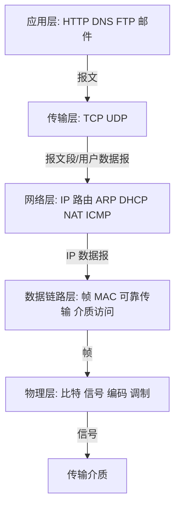
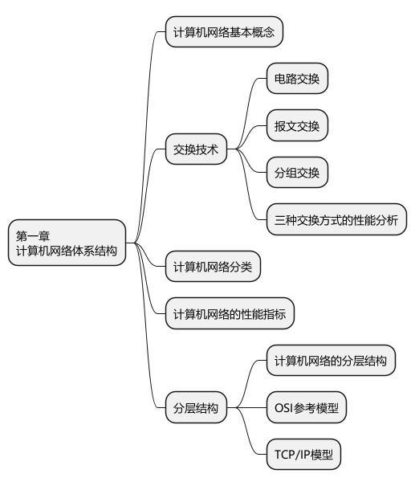
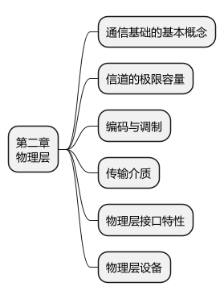
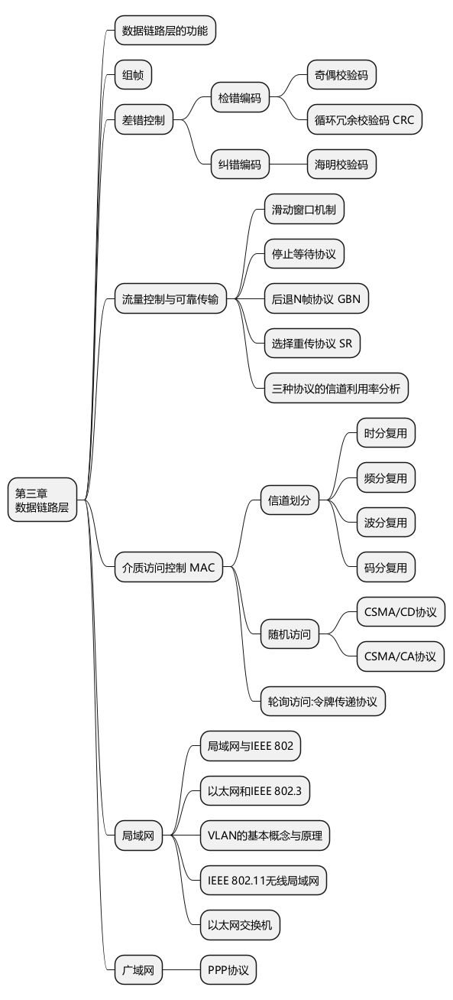
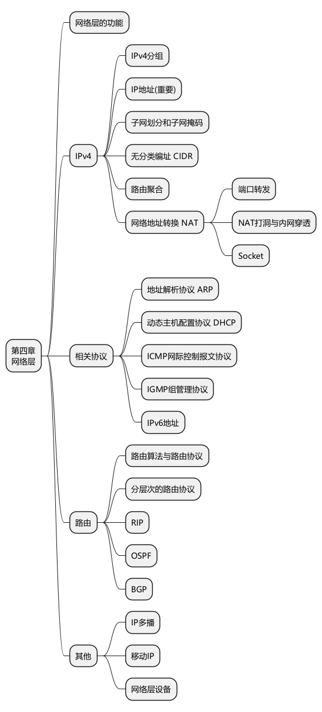
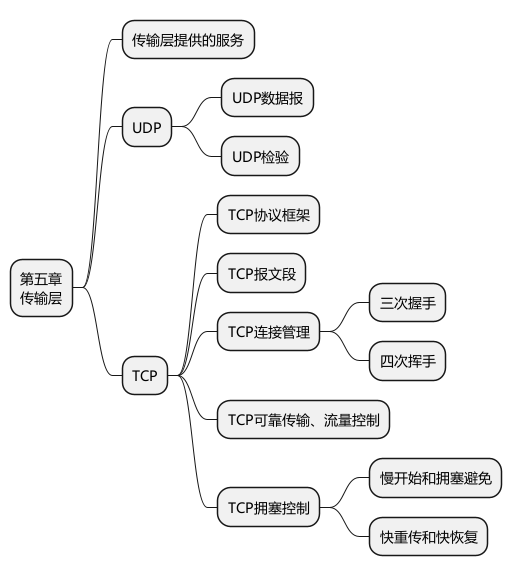
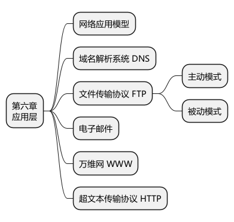

# 408 计算机网络高密度总览

> 总主线：应用进程产生报文，传输层用端口实现进程到进程通信，网络层用 IP 和路由把分组送到目标网络，数据链路层用帧和 MAC 完成相邻节点传输，物理层把比特编码成信号。每层只处理自己的 PDU、地址、控制字段和相邻层服务。

## 0. 分层与端到端总图



| 层 | 标识/地址 | 核心任务 |
|---|---|---|
| 应用 | 域名、URL、应用协议字段 | 提供具体网络应用 |
| 传输 | 端口号 | 进程到进程、可靠性、流控拥塞 |
| 网络 | IP 地址 | 主机/接口寻址、路由与转发 |
| 链路 | MAC 地址 | 相邻节点成帧、差错检测、介质访问 |
| 物理 | 无逻辑地址 | 透明传输比特和信号 |

## 1. 体系结构、交换与时延



### 1.1 协议、服务、接口与 PDU

- 协议：同层对等实体之间的规则。
- 服务：下层向上层提供的能力。
- 接口：相邻层交换服务的边界。
- PDU：某层协议实体交换的数据单位。

关键词定位：端口→传输层；IP/路由→网络层；MAC/帧→链路层；编码/电信号→物理层；HTTP/DNS/SMTP→应用层。

### 1.2 交换方式

| 方式 | 建立连接 | 资源 | 典型特点 |
|---|---|---|---|
| 电路交换 | 先建立 | 通常预留 | 连续稳定，建立有时延，突发数据利用率低 |
| 报文交换 | 不必 | 存储转发整报文 | 缓冲要求大、时延大 |
| 分组交换 | 不必或建立虚电路 | 统计复用 | 粒度小、可流水，存在首部和排队开销 |

### 1.3 时延

```text
发送时延 = 数据长度 L / 发送速率 R
传播时延 = 链路距离 / 信号传播速度
节点时延 = 处理 + 排队 + 发送 + 传播
```

单个长度为 `L` 的分组经过 `k` 条等速链路，忽略传播、排队和处理，存储转发时间约为：

```text
kL/R
```

连续发送 `n` 个等长分组并形成理想流水：

```text
(k + n - 1)L/R
```

发送速率描述发送端把比特推上链路的速度；传播速度描述信号在介质中前进的速度，二者不能混淆。

## 2. 物理层



### 2.1 奈奎斯特与香农

| 场景 | 公式 | 条件 |
|---|---|---|
| 理想低通信道 | `C = 2W log2(V)` | 带宽 `W`，每码元 `V` 种状态 |
| 有噪声信道 | `C = W log2(1+S/N)` | `S/N` 为普通功率比 |
| 分贝转换 | `dB = 10 log10(S/N)` | 30 dB 对应 1000 |

若奈奎斯特和香农都构成限制，实际极限不能超过二者给出的较小值。

### 2.2 比特率、波特率、编码与调制

```text
比特率 = 波特率 × 每码元携带比特数
每码元比特数 = log2(V)
```

- 编码：常指数字数据变数字信号。
- 调制：把数据映射到模拟载波的幅度、频率或相位等参数。
- 曼彻斯特编码每比特中间必有跳变，可自同步；若每个比特用两个信号间隔表示，波特率通常是数据率的 2 倍。
- 差分曼彻斯特用相邻电平变化关系编码，具体 0/1 规则按题设。

### 2.3 复用与物理设备

- FDM：不同频带。
- TDM：不同时间片；统计时分复用按需分配时隙。
- WDM：光波长维度的复用。
- CDM/CDMA：用正交或低相关码片序列区分用户。
- 中继器、集线器工作在物理层，转发信号/比特，不识别 MAC 帧。

## 3. 数据链路层



### 3.1 功能与成帧

链路层处理相邻节点间的帧传输，核心包括成帧、差错检测、流量控制、可靠传输和介质访问控制。它不负责跨网络路由，也不提供端到端进程通信。

成帧方法可包括字符计数、字节填充和比特填充。HDLC 比特填充常见规则是在连续 5 个 `1` 后插入一个 `0`，接收端反向删除。

### 3.2 差错控制

- 奇偶校验能检测部分错误，不能纠错。
- CRC 采用模 2 除法。生成多项式最高次数为 `r` 时，在数据后补 `r` 个 0 做除法，将余数附加到帧后。
- 海明码通过多个校验位定位单比特错误；满足 `2^r >= k + r + 1` 的常见模型可覆盖 `k` 个数据位和 `r` 个校验位。

CRC“余数为 0”表示在该检错模型下未检测到错误，不等于绝对无误。

### 3.3 停止等待、GBN 与 SR

| 协议 | 发送窗口 | 接收窗口 | 确认 | 出错处理 |
|---|---:|---:|---|---|
| 停止等待 | 1 | 1 | 逐帧 | 重传当前帧 |
| GBN | 可大于 1 | 通常 1 | 累积确认 | 从未确认的最早帧起回退重传 |
| SR | 可大于 1 | 可大于 1 | 单独确认 | 只重传缺失/出错帧 |

`m` 位序号的常用约束：

- GBN：发送窗口通常 `W_T <= 2^m - 1`。
- SR：为避免新旧帧混淆，常要求发送窗口和接收窗口均不超过 `2^(m-1)`，具体以题设协议为准。

窗口利用率题先标：帧发送时间、单向传播时延、ACK 发送时间、处理时间和窗口大小。能连续发出的总时长覆盖一个确认周期时，链路才可能保持忙碌。

### 3.4 CSMA/CD 与 CSMA/CA

CSMA/CD：先听后发、边发边听、冲突停止、随机退避。

最小帧长来自最远冲突必须在发送结束前返回：

```text
最小帧长 >= 2 × 单程最大传播时延 × 数据率
```

经典共享以太网使用二进制指数退避。现代全双工交换式以太网链路没有冲突，不使用 CSMA/CD 争用。

无线局域网难以边发边可靠检测冲突，因此使用 CSMA/CA，通过等待、随机退避、确认以及可选 RTS/CTS 尽量避免冲突。

### 3.5 交换机、VLAN 与设备边界

交换机收到帧后：

1. 学习源 MAC 与入端口。
2. 查目的 MAC。
3. 已知且不在入端口则定向转发；未知则向其他相关端口泛洪；目的就在入端口则过滤。

- 每个交换机端口通常形成独立冲突域。
- 普通二层交换机默认不隔离广播域；VLAN 可在二层划分广播域。
- 路由器隔离广播域并按 IP 转发。

### 3.6 PPP

PPP 面向点到点链路，提供成帧、链路控制和网络层协议配置，不提供可靠重传。其透明传输方式取决于所用链路类型。

## 4. 网络层



### 4.1 IPv4 地址、子网与 CIDR

前缀长度为 `/n`：前 `n` 位是网络前缀，后 `32-n` 位是主机部分。

```text
地址块大小 = 2^(32-n)
网络地址 = IP AND 掩码
广播地址 = 网络地址 OR 反掩码
```

传统普通子网中可用主机数常写为 `2^(主机位数)-2`，但 `/31` 点到点链路、`/32` 主机路由等场景不能机械减 2，按题目背景判断。

CIDR 聚合要求候选网络块连续、大小合计为 2 的幂并按该大小边界对齐。最长前缀匹配选择匹配位数最多的路由项；默认路由只在无更具体匹配时使用。

### 4.2 ARP 与逐跳转发

ARP 根据同一链路上的下一跳 IPv4 地址获得 MAC 地址。

- 目的与本机同网段：下一跳是目的主机。
- 目的不在同网段：下一跳是默认网关。
- 每过一个路由器，链路层帧被拆除并重新封装，源/目的 MAC 改变。
- 无 NAT 等改写时，IP 源/目的地址通常端到端保持不变；TTL 和首部校验和等字段会变化。

### 4.3 路由器转发模板

```text
收到帧并校验
→ 取出 IP 数据报
→ 检查首部与 TTL
→ TTL 减 1，必要时更新校验和
→ 对目的 IP 最长前缀匹配
→ 确定出接口和下一跳
→ 用 ARP/邻居表得到下一跳 MAC
→ 重新封装链路层帧并发送
```

### 4.4 IPv4 分片

核心字段：总长度、首部长度、标识、DF、MF、片偏移、TTL、协议、首部校验和。

- 同一原始数据报的各分片标识相同。
- 片偏移单位为 8 字节。
- 除最后一片外，分片数据长度必须是 8 的整数倍。
- MF=1 表示后面还有分片；最后一片 MF=0。
- IPv4 重组通常只在最终目的主机进行。

计算顺序：`MTU - 首部长度` 得单片最大数据，再向下取为 8 的整数倍，最后计算偏移和总长度。

### 4.5 DHCP、NAT、ICMP 与 IPv6

DHCP DORA：Discover → Offer → Request → ACK。客户端最初可能用源地址 `0.0.0.0` 和广播目的地址；DHCP 通常基于 UDP，服务器 67、客户端 68。

NAT/NAPT 出方向改写源 IP，常同时改写源端口并记录映射；返回流量按表改写目的 IP/端口。NAT 是地址转换机制，不是路由协议。

ICMP 用于差错报告和询问，如目的不可达、超时、参数问题、回送请求/回答。ICMP 差错报文不对某些特殊报文继续发送差错，具体规则按教材。

IPv6 使用 128 位地址，基本首部简化；中间路由器不进行 IPv6 分片，需要时由源主机使用分片扩展首部。

### 4.6 RIP、OSPF、BGP

| 协议 | 范围 | 类型 | 承载 | 核心特点 |
|---|---|---|---|---|
| RIP | AS 内 | 距离向量 | UDP | 跳数，16 不可达，周期交换，收敛慢 |
| OSPF | AS 内 | 链路状态 | 直接封装于 IP | 洪泛链路状态，Dijkstra，支持区域 |
| BGP | AS 间 | 路径向量 | TCP | AS 路径与策略，不单纯追求最短 |

RIP 交换“我到各目的网络的距离”；OSPF 传播链路状态并让路由器各自构造拓扑；BGP 在自治系统间通告可达前缀和路径属性。

## 5. 传输层



### 5.1 UDP

UDP 无连接、尽力而为、保留报文边界，不提供重传、流量控制和拥塞控制。首部固定 8 字节：源端口、目的端口、长度、校验和。

UDP 校验和使用伪首部参与计算；伪首部不实际传输，用于检查端点 IP、协议号和长度等信息。

### 5.2 TCP 首部与字节流

核心字段：源/目的端口、序号、确认号、数据偏移、标志位、窗口、校验和、紧急指针、选项。

- TCP 面向字节流，序号给字节编号。
- ACK 号表示期望收到的下一个字节序号。
- SYN 和 FIN 各消耗一个序号；不带数据的普通 ACK 通常不消耗新序号。
- 接收方可以累计确认连续收到的数据。

### 5.3 三次握手

```text
客户端 → SYN=1, seq=x
服务器 → SYN=1, ACK=1, seq=y, ack=x+1
客户端 → ACK=1, seq=x+1, ack=y+1
```

三次握手让双方确认各自发送、接收能力和初始序号。第三次握手可携带数据，此时序号按数据长度继续增加。

### 5.4 四次挥手与 TIME_WAIT

TCP 全双工，两个方向独立关闭，因此通常需要分别发送 FIN 和确认。主动关闭方进入 TIME_WAIT，等待 `2MSL`，用于让迟到报文消失并能重发最后 ACK。

服务器可把 ACK 与自己的 FIN 合并，抓包中不一定总表现为严格四个独立报文段。

### 5.5 流量控制

接收窗口 `rwnd` 反映接收方缓冲能力。发送方维护可发送但未确认的字节范围；实际可用窗口还受已发送未确认数据量影响。

零窗口后发送方可用持续计时器和窗口探测避免双方永久等待。

### 5.6 拥塞控制

```text
发送限制 = min(rwnd, cwnd)
```

| 阶段/事件 | 典型行为 |
|---|---|
| 慢开始 | cwnd 按 RTT 近似指数增长 |
| 拥塞避免 | cwnd 近似线性增长 |
| 超时 | ssthresh 通常减小，cwnd 回到较小初值重新慢开始 |
| 三个重复 ACK | 快重传；之后按题设版本执行快恢复 |

不同教材可能采用 Tahoe、Reno 或简化算法，`cwnd` 与 `ssthresh` 的具体更新值必须按题目给出的规则，不要跨版本套公式。

TCP 大题先画时间轴，标出每段的 `seq、len、ack、rwnd、cwnd` 和丢失点。

## 6. 应用层



### 6.1 DNS

- 层次：根、顶级域、权威域、本地域名服务器。
- 递归查询要求被询问者继续代查；迭代查询返回下一步应询问的服务器。
- DNS 通常用 UDP 53；区域传送、报文过大或特定操作可用 TCP。
- 实际解析还会受本机、浏览器、递归解析器缓存影响。

### 6.2 HTTP

- HTTP 是应用层协议；可靠字节传输通常由 TCP 提供，HTTP/3 则运行在基于 UDP 的 QUIC 上。408 传统题通常讨论 HTTP/1.x 或 HTTP/2 与 TCP。
- 非持久 HTTP 为对象反复建立连接；持久连接复用连接。
- 是否流水线、并行连接、缓存命中、DNS 是否已解析都会改变 RTT 计算。
- HTTP 无状态指协议本身不自动保存应用会话状态，不等于底层无连接。

传统非持久 HTTP 获取单个对象且忽略发送时间时，常见模型约为：建立 TCP 1 RTT + 请求/首字节返回 1 RTT；DNS、对象传输和多对象调度另算。

### 6.3 FTP 与电子邮件

FTP 分控制连接和数据连接。主动模式由服务器从约定端口主动连接客户端数据端口；被动模式由客户端连接服务器给出的数据端口。具体端口和连接方向按题目模型。

邮件：SMTP 负责提交和服务器间传送；POP3/IMAP 用于用户读取和管理邮箱；MIME 扩展非 ASCII 正文和附件格式。

### 6.4 C/S 与 P2P

- C/S：服务器长期提供服务，管理集中，但服务器可能成为瓶颈。
- P2P：端系统既可请求也可提供资源，扩展性好，但管理、发现和一致性更复杂。

## 7. 三个综合题模板

### 7.1 从输入域名到收到网页

```text
检查浏览器/主机 DNS 缓存
→ DNS 查询得到服务器 IP
→ 判断目的是否同子网
→ ARP 获得目的主机或默认网关 MAC
→ 建立 TCP 连接（传统 HTTP 模型）
→ 发送 HTTP 请求
→ 每跳路由器最长前缀匹配并重封装链路层帧
→ 服务器返回 HTTP 响应
→ TCP 可靠交付并由应用解析
```

回答时逐步标注域名、端口、IP、MAC 和 PDU；MAC 每跳改变，端口和 IP 通常端到端不变，NAT 等设备除外。

### 7.2 网络层转发题

1. 用掩码判断源、目的是否同子网。
2. 确定直接交付还是交给默认网关。
3. 到路由器后对目的 IP 做最长前缀匹配。
4. 确定下一跳与出接口。
5. 用 ARP 获得下一跳 MAC。
6. 重封装帧；必要时按 MTU 分片。
7. 若经过 NAT，单独记录地址和端口改写。

### 7.3 TCP 序号窗口题

1. 写初始序号和 SYN/FIN 是否占序号。
2. 对每个数据段用 `下一序号 = 当前序号 + 数据长度`。
3. ACK 写连续收到后期望的下一个字节。
4. 计算 `rwnd`、`cwnd` 及已发送未确认数据。
5. 遇到超时或重复 ACK，按题设拥塞控制版本更新窗口。
6. 再把 TCP 段封装到 IP，处理 MSS、MTU 和分片边界。

## 8. 高频陷阱速查

1. 发送速率不等于信号传播速度。
2. 协议是同层规则，服务是下层给上层的能力，接口是相邻层边界。
3. 链路层可靠传输不等于 TCP 端到端可靠传输。
4. CSMA/CD 最小帧长来自双程传播时延。
5. 交换机按源 MAC 学习，按目的 MAC 转发。
6. ARP 查下一跳 MAC，不一定查最终目的主机 MAC。
7. 最长前缀匹配优先于度量“看起来更近”的较短前缀项。
8. IPv4 片偏移单位是 8 字节。
9. DHCP 是地址配置协议，NAT 是地址转换机制，二者都不是路由协议。
10. RIP/OSPF/BGP 分别是距离向量、链路状态、路径向量。
11. TCP ACK 号是期望的下一个字节；SYN/FIN 消耗序号。
12. TCP 发送限制同时受 `rwnd` 和 `cwnd` 约束。
13. DNS 通常用 UDP，但不能绝对化。
14. HTTP 无状态不等于 HTTP 不使用连接。
15. SMTP 负责发送，POP3/IMAP 负责读取，MIME 处理内容格式扩展。
