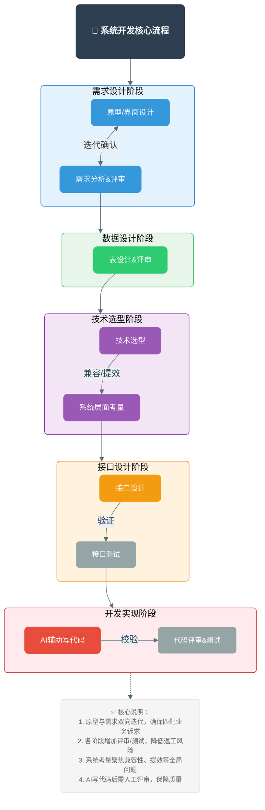

# 核心流程



# 前端开发规范
```ad-attention
# 前端项目开发规范
## 一、文件夹结构
~~~
├── mock                       # 项目mock 模拟数据
├── public                     # 静态资源
│   ├── theme-green            # 主题文件（命名规则：theme-主题色）
│   ├── favicon.ico            # favicon图标
│   └── index.html             # html模板
├── src                        # 源代码
│   ├── api                    # 所有接口请求
│   ├── assets                 # 主题、字体等静态资源
│   ├── components             # 全局公用组件
│   ├── directive              # 全局指令
│   ├── filters                # 全局过滤器
│   ├── icons                  # 项目所有svg icons
│   ├── lang                   # 国际化配置
│   ├── layout                 # 全局布局
│   ├── router                 # 路由配置
│   ├── store                  # 全局状态管理
│   ├── styles                 # 全局样式
│   ├── utils                  # 全局公用方法
│   ├── vendor                 # 公用第三方依赖
│   ├── views                  # 业务页面
│   ├── App.vue                # 入口页面
│   ├── main.js                # 入口文件（加载组件、初始化）
│   ├── common-config.js       # 基础自定义配置
│   ├── permission.js          # 权限管理
│   └── setting.js             # 页面全局设置
├── tests                      # 测试用例
├── .env.xxx                   # 环境变量配置（多环境区分）
├── .eslintrc.js               # eslint 规则配置
├── .babelrc                   # babel-loader 配置
├── .travis.yml                # 自动化CI配置
├── vue.config.js              # vue-cli 全局配置
├── postcss.config.js          # postcss 配置
└── package.json               # 依赖/脚本配置
~~~

## 二、UI规范（基于ElementUI 2.x）
### 1. 组件通用规则
- 所有ElementUI组件默认使用 `size: small`，无size属性的组件以产品经理要求为准；
- 组件size统一在 `src/theme-setting.js` 中配置，避免页面硬编码；
- 对话框（Dialog）：无需全屏，按钮固定在弹窗右下角，遮罩为全局遮罩；
- 表格：
  - 操作列使用文字说明，禁止使用纯图标；
  - 表格右上方操作按钮需「图标+文字」组合，右对齐表格，与表格间距8px；
- 多按钮间距统一为15px。

### 2. 搜索区域规范（参考：vue-element-admin 复杂表格）
- 查询字段不显示前置说明文字，通过 `placeholder` 提示含义；
- 查询字段之间间隔10px；
- 查询按钮紧跟表单右侧，新增/导出等操作按钮另起一行；
- 搜索区域自适应屏幕宽度，不固定显示字段数量。

### 3. 主题色规范
~~~css
/* 全局色值配置（建议在src/styles/variables.scss中定义） */
$--color-primary: #1C5A9E;  // 主色
$--color-success: #62B259;  // 成功色
$--color-warning: #DF861D;  // 警告色
$--color-danger: #B82D2E;   // 危险色
$--color-info: #909399;     // 信息色
~~~

## 三、命名规范
### 1. 文件命名
| 文件类型       | 命名规则                                  | 示例                  |
|----------------|-------------------------------------------|-----------------------|
| .js/.scss      | 小写单单词，多单词用 `-` 连接             | permission.js、common-config.js |
| .vue（非index）| 大驼峰命名                                | AppMain.vue、UserList.vue |
| .vue（入口）   | 固定为 index.vue                          | views/test-page/index.vue |

### 2. 组件存放规则
- 全局公用组件：`components/大驼峰组件名/index.vue`（例：`components/UploadFile/index.vue`）；
- 页面级私有组件：`views/页面文件夹/components/大驼峰组件名.vue`（例：`views/test-page/components/TableSearch.vue`）。

### 3. 模块文件存放规则
- 全局文件直接放对应文件夹根目录，模块专属文件放在对应文件夹的 `modules` 子目录（无则新建）；
- 模块文件命名与路由页面名称一致（例：api/modules/test-page.js、mock/modules/test-page.js）；
- API方法命名建议与后端接口名称保持一致。

## 四、开发步骤（以新增test-page页面为例）
### 步骤1：创建页面文件
- 有页面私有组件：`src/views/test-page/components/[大驼峰组件名].vue` + `src/views/test-page/index.vue`；
- 无页面私有组件：仅创建 `src/views/test-page/index.vue`；
- **强制要求**：页面文件第一行添加注释，注明菜单路径+页面说明  
  示例：`// 企业中心->企业资料->基本信息`

### 步骤2：配置路由
新建路由文件：`src/router/modules/test-page.js`，并在路由入口文件中引入该模块。

### 步骤3：编写接口请求
新建API文件：`src/api/modules/test-page.js`，统一管理该页面所有接口请求。

### 步骤4：编写模拟数据
新建mock文件：`mock/modules/test-page.js`，实现前端数据模拟。

## 五、开发注意事项
1. **主题适配**：避免页面硬编码主题样式，需自定义主题样式时，在对应主题文件（如theme-green）中提供覆盖入口；
2. **请求规范**：接口参数、请求逻辑统一放在api目录下，页面中仅调用api方法；
3. **Mock调试**：前端开发完成后，先通过mock数据自测，联调/提测时切换为正式请求并提交Git；
4. **配置文件提交**：非变量新增/修改场景，禁止提交本地开发配置文件（如.env.local、vue.config.js本地修改版）；
5. **页面布局**：所有页面最外层必须包裹 `<div class="app-container"></div>`（统一控制页面边距）；
6. **样式隔离**：页面样式优先使用 `scoped` 属性，避免样式污染；
<mark style="background: #FFF3A3A6;"> **代码提交**：不同模块的文件分开提交，提交说明需清晰（例：「test-page：新增表格查询功能」）；</mark>
7. **工具方法复用**：非业务类通用方法（如日期格式化、数据校验）需提取到 `src/utils` 目录，按功能命名（例：formatDate.js、validate.js）。
```


```ad-info
联调和测试的具体流程
场景 1：本地联调（你 + 后端同事）
你的电脑                          后端同事电脑
┌─────────────┐                  ┌─────────────┐
│ 前端 Vue    │ ───请求───────▶  │ 后端服务    │
│ localhost:9528                 │ 192.168.x.x:8290
└─────────────┘                  └─────────────┘

你的 .env.local:
VUE_APP_API_BASE_REQUEST = 'http://192.168.x.x:8290'
场景 2：连测试环境（最常见）
你的电脑                          测试服务器
┌─────────────┐                  ┌─────────────┐
│ 前端 Vue    │ ───请求───────▶  │ 后端服务    │
│ localhost:9528                 │ 10.1.12.191:9081
└─────────────┘                  └─────────────┘

你的 .env.local:
VUE_APP_API_BASE_REQUEST = 'http://10.1.12.191:9081'
后端部署到测试服务器，你本地前端直接连测试服务器的后端。

场景 3：提测（前后端都部署）
测试服务器
┌─────────────────────────────────┐
│  Nginx                          │
│    │                            │
│    ├── /uipmp-web  → 前端静态文件│
│    └── /uipmp/svc  → 后端服务   │
└─────────────────────────────────┘

测试人员访问: http://10.1.12.191/uipmp-web
前端打包 npm run build:test，把 dist 部署上去。


### 提测的完整逻辑是：

1. **你先完成开发 + 自测**：
    
    比如你开发完`test-page`页面，先在本地用`mock`模拟数据自己测一遍（比如点搜索、点新增按钮、看表格能不能加载，确保自己写的功能逻辑是通的）
2. **联调（对接后台正式接口）**：
    
    把`mock`模拟数据切换成**后台真实的接口**（就是把请求地址从 mock 地址改成后台给的正式接口地址），和后台开发一起验证：前端发的请求后台能收到，后台返回的数据前端能正常展示
3. **提测（交给测试）**：
    
    把已经联调好的代码，提交到团队的代码仓库，然后告诉测试人员：「我这个`test-page`页面开发完了，你可以在测试环境里测了」
```


```ad-note
# git 小技巧


~~~bash
# - **适用场景**：Windows PowerShell 终端下，验证哪些文件被标记为 `--assume-unchanged`（假装未变更），避免本地修改被误提交；
git ls-files -v | Select-String '^h'
~~~


~~~bash
# Windows 系统下，标记指定本地配置文件（如 `.env.local`），让 Git 忽略其后续所有修改，确保本地修改（b 版）不会被提交到远程仓库（保留远程 a 版）；
git update-index --assume-unchanged UIPMP-WEB\uipmp-web\.env.local
~~~


```

# **低流量期间DO**
```ad-info
1. **数据层维护**
    - **数据备份与归档**：执行全量 / 增量数据备份，将冷数据归档至低成本存储（如对象存储），同时校验备份的完整性和可恢复性，避免数据丢失风险。
    - **数据库优化**：进行索引重建、SQL 语句优化、分表分库扩容 / 迁移，以及数据库版本升级、主从切换演练，提升数据库性能和稳定性。
    - **数据清洗与同步**：清理无效 / 冗余数据、修复数据一致性问题，完成跨系统数据同步（如业务库与数仓的批量同步）。
2. **基础设施与服务维护**
    - **服务器 / 容器维护**：进行服务器操作系统补丁更新、内核升级，容器集群（K8s 等）版本迭代、节点扩容 / 缩容，以及云服务器 / 物理机的硬件检测与更换。
    - **中间件 / 组件升级**：对 Redis、MQ、Elasticsearch 等中间件进行版本更新、配置调优，同时完成集群的分片迁移、副本重平衡。
    - **网络与安全维护**：调整网络拓扑、更新防火墙策略，进行 CDN 节点配置同步，以及 SSL 证书更换、安全漏洞扫描与修复。
3. **应用层与业务维护**
    - **版本发布与灰度**：部署新的应用版本（尤其是大版本迭代），开展灰度发布验证，若出现问题可快速回滚，减少对用户的影响。
    - **系统扩容 / 迁移**：完成应用服务的实例扩容、机房迁移、异地多活架构搭建，以及域名解析切换、负载均衡策略调整。
    - **性能压测与演练**：进行全链路压测验证系统极限承载能力，开展故障演练（如服务熔断、节点宕机），检验容灾和应急响应能力。
4. **监控与日志维护**
    - **监控体系优化**：升级监控组件、新增监控指标、调整告警阈值，修复监控盲区，确保系统异常能被及时感知。
    - **日志清理与分析**：清理过期日志、扩容日志存储，对历史日志进行批量分析，定位潜在的系统隐患或业务异常。
```

# Excel 导出
```ad-info
后端导出 Excel 的性能瓶颈主要集中在「数据读取」「文件生成」「传输下载」三个环节，高性能方案的核心是**减少内存占用、避免同步阻塞、优化传输方式**  (核心注意点)

|整体场景|数据量|后端返回内容|前端核心动作|
|---|---|---|---|
|同步导出|小数据量（≤1 万条）|文件二进制流|直接接收 Blob 并触发下载|
|异步导出|大数据量（>1 万条）|任务 ID → 下载链接|轮询 / 监听任务状态 → 下载文件|
~~~mermaid

~~~
```

# **接口联调**
```ad-attention
### 一、事前：从源头消除 70% 联调阻塞（核心是 “标准化与隔离”）

1. **契约驱动，统一接口预期**
    - 用 OpenAPI/Protobuf 定义接口（入参、出参、异常码、超时），同步到共享平台（YApi/Apifox），所有方按契约并行开发，冻结接口变更时间。
    - 明确异常处理（重试、降级、默认值）与版本兼容规则，避免理解偏差。
2. **Mock / 桩服务隔离依赖**
    - 前端用 Mock.js/Apifox Mock 独立开发；后端用 WireMock/Mockito 模拟跨部门服务，覆盖正常与异常场景（500、超时、空值）。
    - 提前申请沙箱 / 测试环境权限，确保网络与数据访问通畅。
3. **环境与数据标准化**
    - 搭建 “本地→联调→测试” 分层环境，配置统一托管（Nacos/Apollo），跨地域用 VPN 访问。
    - 准备标准化测试数据集（如测试商户号、脱敏用户数据），所有方共用，避免数据不一致。
4. **拆分任务与排期对齐**
    - 拆成最小可联调单元（单接口 / 功能点），按优先级交付，避免全量等待。
    - 约定联调窗口期（跨时区选重叠时段），明确负责人与问题对接人，用共享日历同步关键节点。

---

### 二、事中：高效协作，快速定位问题（核心是 “聚焦与管控”）

1. **单节点验证先行**
    - 先自测服务独立运行正常；再验证网络 / 权限连通；最后从简单接口开始单步联调，不直接跑全流程。
2. **标准化问题定位**
    - 日志含请求 ID + 服务名 + 参数 + 异常栈，用 APM（SkyWalking/Zipkin）全链路追踪，快速定位故障节点。
    - 按 “契约匹配→数据正确→逻辑实现” 三步排查，避免甩锅。
3. **轻量化结构化沟通**
    - 日常用 “场景 + 步骤 + 日志 + 预期” 异步反馈；紧急问题在窗口期开 15-30 分钟短会。
    - 结论同步到共享文档，避免反复确认。
4. **最小化变更管控**
    - 非核心问题先记录后统一处理；核心变更先确认再同步契约并通知，修改后本地自测再部署。

---

### 三、事后：沉淀与固化，避免重复踩坑（核心是 “复盘与自动化”）

1. **明确验收标准并确认**
    - 全接口按契约通过（含异常场景），全流程无报错，性能 / 容错达标，双方负责人确认联调通过。
2. **复盘与知识沉淀**
    - 记录卡壳原因（文档不一致、环境不通），制定改进措施（如接口评审后发布）。
    - 更新接口文档，编写踩坑指南，沉淀 Mock / 测试数据到共享库。
3. **自动化固化流程**
    - 基于契约与测试数据搭建接口自动化测试（Postman/Newman/JMeter），纳入 CI/CD，后续迭代自动验证，减少人工联调。
```

**数据字典**
```ad-note
数据字典是存储系统配置项、枚举值、常量的表，避免硬编码。

作用：
配置管理：系统参数可以动态修改，无需改代码
下拉选项：性别、状态等下拉框的选项来源
业务规则：如密码复杂度规则、验证码有效期等
国际化：不同语言的文本映射
```

**配置参数**
```ad-tip
- application.yml           # 主配置文件
- application-dev.yml       # 开发环境
- application-test.yml      # 测试环境
- application-prod.yml      # 生产环境
- application-local.yml     # 本地环境
  
  
==激活方式==
**命令行参数 > JVM参数 > 环境变量 > 配置文件**

```


**网络问题**
```ad-warning
### 一、网络波动下的可靠性保障（Web/APP/ 桌面端）

网络波动是分布式系统的常态（如弱网、断网、延迟、丢包），核心保障思路是 **“前端容错 + 后端幂等 + 数据一致性 + 重试降级”**，不同终端需结合自身特性适配：

#### 1. 通用核心原则（所有终端）

|核心策略|具体实现|
|---|---|
|接口幂等设计|所有写接口（如提交补贴申报）加幂等标识（UUID / 订单号），避免重复提交导致数据错乱；<br><br>后端基于幂等标识校验，重复请求仅处理一次。|
|请求超时控制|所有接口设置合理超时（Web / 桌面端 3-5s，移动端 2-3s），避免无限等待；<br><br>超时后提示用户 “网络异常，请重试”。|
|数据本地缓存|核心数据（如用户信息、已填写的申报表单）本地缓存（Web 用 localStorage，APP 用沙盒存储，桌面端用本地文件 / 数据库），断网时可查看 / 编辑，联网后同步。|
|重试机制|非写接口（查询类）：失败后自动重试 2-3 次（递增间隔，如 1s→2s→4s）；<br><br>写接口：失败后不自动重试，提示用户手动确认重试（避免重复写）。|
|降级策略|核心功能（如登录、查询）失败后，降级为 “基础模式”（如仅展示缓存数据）；非核心功能（如消息通知）直接隐藏。|
|状态同步校验|关键操作（如提交申报）后，前端主动轮询 / 后端推送状态，确认操作是否成功（避免 “提交成功但后端未处理” 的感知不一致）。|

#### 2. 分终端适配方案

##### （1）Web 端（浏览器环境）

- **网络状态监听**：通过`navigator.onLine`监听网络连接状态，断网时显示全局提示，联网后自动刷新核心数据；
- **请求中断处理**：用 Axios 拦截器捕获`Network Error`，统一弹窗提示，避免单个请求失败导致页面崩溃；
- **表单防重复提交**：提交按钮置灰 + 前端防抖，结合后端幂等，杜绝网络波动时用户多次点击；
- **长连接优化**：查询类场景用 SSE/WebSocket 替代轮询，减少请求数，提升弱网下的实时性（如补贴审核状态推送）。

##### （2）移动端 APP（iOS/Android）

- **原生网络能力**：优先用原生网络框架（如 OkHttp）替代 WebView 的 JS 请求，原生框架自带弱网优化（如 TCP 重传、连接池）；
- **离线操作支持**：核心表单支持离线填写，数据存本地数据库（如 Room/SQLite），联网后通过 “上传队列” 批量同步，同步失败则标记异常，提醒用户处理；
- **网络类型适配**：区分 WiFi/4G/5G / 弱网，弱网下自动压缩请求数据（如图片压缩、只传核心字段），减少流量和传输时间；
- **WebView 兜底**：内嵌 WebView 的请求，通过原生 JS 桥接，复用原生网络的重试 / 超时逻辑（避免 WebView 自身请求无管控）。

##### （3）桌面端（Windows/macOS）

- **本地数据库缓存**：核心数据（如申报记录、用户配置）存本地轻量数据库（如 SQLite、H2），断网时可离线查询 / 编辑，联网后增量同步；
- **请求队列化**：写操作失败后，将请求加入本地队列，定时（如 1 分钟）重试，直到成功 / 用户手动取消；
- **网络诊断能力**：提供基础网络诊断功能（如 ping 闽政通 / 业务服务器），方便用户排查问题（尤其政企用户，网络环境复杂）；
- **长连接稳定性**：用 TCP 长连接替代 HTTP 短连接，减少握手开销，提升大文件上传（如补贴证明材料）的可靠性。
```


**代码质量检查**
```ad-tip
#### SonarQube 是什么？

- 开源的代码质量检测平台，能自动扫描代码中的：
    - Bug（程序错误）、漏洞（安全风险，如 SQL 注入、未授权访问）；
    - 代码异味（不规范写法、性能问题、冗余代码）；
    - 重复代码、注释率、代码规范合规性（如阿里 Java 规范、PMD 规则）。
- 扫描结果会在 SonarQube 网页控制台展示，方便开发 / 运维查看代码质量报告。
```


# **架构全景图**


```
┌─────────────────────────────────────────────────────────────┐
│                      前端应用层                              │
│  ┌──────────────┐  ┌──────────────┐  ┌──────────────┐     │
│  │   Web前端    │  │  移动端App   │  │  第三方应用   │     │
│  └──────┬───────┘  └──────┬───────┘  └──────┬───────┘     │
└─────────┼──────────────────┼──────────────────┼─────────────┘
          │                  │                  │
          └──────────────────┼──────────────────┘
                             │
                             ▼
┌─────────────────────────────────────────────────────────────┐
│                    API网关层（Zuul）                         │
│  ┌───────────────────────────────────────────────────────┐ │
│  │  • 统一入口（8290端口）                                │ │
│  │  • 路由转发                                            │ │
│  │  • 跨域处理                                            │ │
│  │  • 日志记录                                            │ │
│  └───────────────────────────────────────────────────────┘ │
└──────────┬──────────────────────┬──────────────────────────┘
           │                      │
           ▼                      ▼
┌──────────────────┐    ┌──────────────────┐
│   SSO服务        │    │  SysManage服务   │
│  (5001端口)      │◄───┤  (5000端口)      │
│                  │    │                  │
│  • 用户认证      │    │  • 用户管理      │
│  • Token管理     │    │  • 权限管理      │
│  • 会话管理      │    │  • 组织管理      │
│  • 权限加载      │    │  • 字典管理      │
└────────┬─────────┘    └────────┬─────────┘
         │                       │
         └───────────┬───────────┘
                     │
                     ▼
         ┌───────────────────────┐
         │      Redis集群        │
         │  • 会话存储           │
         │  • 缓存管理           │
         │  • 分布式锁           │
         └───────────────────────┘
                     │
                     ▼
         ┌───────────────────────┐
         │    达梦数据库         │
         │  • 用户数据           │
         │  • 权限数据           │
         │  • 业务数据           │
         └───────────────────────┘

         ┌───────────────────────┐
         │    RPC框架（可选）     │
         │  • 服务注册           │
         │  • 服务发现           │
         │  • 远程调用           │
         └───────────────────────┘
                     │
                     ▼
         ┌───────────────────────┐
         │     Zookeeper         │
         │  • 服务注册中心       │
         └───────────────────────┘
```


# SystemManage

```java title:参数日期格式化
import org.springframework.context.annotation.Bean;
import org.springframework.context.annotation.Configuration;
import org.springframework.core.convert.converter.Converter;
import org.springframework.format.FormatterRegistry;
import org.springframework.web.servlet.config.annotation.WebMvcConfigurer;
import com.fasterxml.jackson.databind.ObjectMapper;
import com.fasterxml.jackson.datatype.jsr310.JavaTimeModule;
import com.fasterxml.jackson.datatype.jsr310.deser.LocalDateDeserializer;
import com.fasterxml.jackson.datatype.jsr310.deser.LocalDateTimeDeserializer;
import com.fasterxml.jackson.datatype.jsr310.ser.LocalDateSerializer;
import com.fasterxml.jackson.datatype.jsr310.ser.LocalDateTimeSerializer;

import java.time.LocalDate;
import java.time.LocalDateTime;
import java.time.format.DateTimeFormatter;

@Configuration
public class DateConfig implements WebMvcConfigurer {

    // 1. 定义日期格式常量
    public static final String DATE_FORMAT = "yyyy-MM-dd";
    public static final String DATE_TIME_FORMAT = "yyyy-MM-dd HH:mm:ss";

    // 2. 配置 Jackson 序列化/反序列化（处理 @RequestBody JSON 参数）
    @Bean
    public ObjectMapper objectMapper() {
        ObjectMapper objectMapper = new ObjectMapper();
        JavaTimeModule javaTimeModule = new JavaTimeModule();

        // LocalDate 序列化/反序列化
        javaTimeModule.addSerializer(LocalDate.class, new LocalDateSerializer(DateTimeFormatter.ofPattern(DATE_FORMAT)));
        javaTimeModule.addDeserializer(LocalDate.class, new LocalDateDeserializer(DateTimeFormatter.ofPattern(DATE_FORMAT)));

        // LocalDateTime 序列化/反序列化
        javaTimeModule.addSerializer(LocalDateTime.class, new LocalDateTimeSerializer(DateTimeFormatter.ofPattern(DATE_TIME_FORMAT)));
        javaTimeModule.addDeserializer(LocalDateTime.class, new LocalDateTimeDeserializer(DateTimeFormatter.ofPattern(DATE_TIME_FORMAT)));

        objectMapper.registerModule(javaTimeModule);
        return objectMapper;
    }

    // 3. 配置 Spring 转换器（处理 URL 参数/表单参数）
    @Override
    public void addFormatters(FormatterRegistry registry) {
        // LocalDate 转换器（前端字符串 → LocalDate）
        registry.addConverter(new Converter<String, LocalDate>() {
            @Override
            public LocalDate convert(String source) {
                if (source == null || source.isBlank()) {
                    return null;
                }
                return LocalDate.parse(source, DateTimeFormatter.ofPattern(DATE_FORMAT));
            }
        });

        // LocalDateTime 转换器
        registry.addConverter(new Converter<String, LocalDateTime>() {
            @Override
            public LocalDateTime convert(String source) {
                if (source == null || source.isBlank()) {
                    return null;
                }
                return LocalDateTime.parse(source, DateTimeFormatter.ofPattern(DATE_TIME_FORMAT));
            }
        });
    }
}
```
**controller 也可以继承（BaseContorller） 巧用继承机制 实现复用**

**零拷贝**
```ad-note
零拷贝是**减少数据在 “内核态” 和 “用户态” 之间拷贝次数**的传输技术，核心是 “让 CPU 少干活，直接在内核态完成数据传输”，大幅提升大文件 / 高并发传输效率。
#### 1. 先懂：传统数据拷贝（比如 “磁盘读文件→发网络”）

传统流程要 4 次拷贝（2 次 CPU 拷贝 + 2 次 DMA 硬件拷贝）：

① 磁盘 → 内核态缓冲区（DMA 拷贝，硬件干）；

② 内核态 → 用户态缓冲区（CPU 拷贝，CPU 干）；

③ 用户态 → 内核态 Socket 缓冲区（CPU 拷贝，CPU 干）；

④ 内核态 Socket 缓冲区 → 网卡（DMA 拷贝，硬件干）。

#### 2. 零拷贝的优化（核心：干掉 CPU 拷贝）

以 Linux 的`sendfile`为例，零拷贝流程仅 2 次 DMA 拷贝（无 CPU 拷贝）：

① 磁盘 → 内核态缓冲区（DMA）；

② 内核态缓冲区 → 内核态 Socket 缓冲区（仅拷贝 “数据描述符”，无实际数据拷贝）；

③ 内核态 Socket 缓冲区 → 网卡（DMA）。

“零拷贝” 的 “零” 指**CPU 拷贝次数为零**，不是完全无拷贝。

#### 3. 应用场景与价值

- 场景：Nginx 文件服务器、Hadoop 大数据传输、视频流 / 网盘服务、容器镜像传输；
- 价值：提升传输速度（比如大文件下载快 50%+）、降低 CPU 占用（减少内存拷贝开销）、支撑更高并发。
```

**零信任**

```ad-success
零信任是**打破 “内网 = 可信、外网 = 不可信” 传统边界思维**的安全理念，核心原则：

✅ 无默认信任：不管是内网 / 外网设备 / 用户，都不默认可信；

✅ 最小权限：只给完成任务必需的权限（比如仅能访问指定内网系统）；

✅ 持续验证：每次请求都要验身份、验设备、验权限、验行为；

✅ 动态管控：根据设备安全状态（有无病毒）、登录位置（异地？）、行为风险（异常访问？）动态调整权限。
```

## **功能模块：**

~~~css
### 2.1 系统管理（sysmanage）

负责系统基础配置和权限管理：

#### 主要功能

- **用户管理** (`SysUserController`)
  - 用户增删改查
  - 用户状态管理（启用/禁用/锁定）
  - 用户密码管理
  - 用户权限分配

- **角色管理** (`SysRoleController`)
  - 角色定义与维护
  - 角色权限配置
  - 角色用户关联

- **部门管理** (`SysDeptController`)
  - 组织架构树形管理
  - 部门层级关系维护
  - 部门用户关联

- **菜单管理** (`SysModuleController`)
  - 菜单树形结构维护
  - 菜单权限配置
  - 按钮权限管理 (`SysModuleBtnController`)

- **字典管理** (`SysDictController`)
  - 系统字典维护
  - 字典项配置

- **日志管理**
  - 登录日志 (`SysLoginLogController`)
  - 操作日志 (`SysOperLogController`)
  - 异常日志 (`SysExceptionLogController`)
  - 应用日志 (`SysAppLogController`)

### 2.2 数字身份管理（digitalIdentityManagement）

与数字身份服务管理平台对接：

#### 主要功能

- **用户同步** (`SyncUserFromDigitalIdentityController`)
  - 从数字身份平台同步用户信息
  - 用户数据映射与转换
  - 定时同步任务 (`SyncDiDataTask`)

- **部门同步** (`SyncDeptFromDigitalIdentityService`)
  - 组织架构同步
  - 部门层级关系维护

- **加密工具** (`Sm4Utils`)
  - SM4国密算法支持
  - 数据加解密处理

### 2.3 信息发布管理（dismanage）

负责系统内信息发布与展示：

#### 主要功能

- **通知公告** (`DisNoticeController`)
  - 通知发布与管理
  - 通知阅读状态跟踪

- **新闻资讯** (`DisNewsController`)
  - 新闻发布管理
  - 新闻分类管理

- **问答管理** (`DisQaController`)
  - 常见问题维护
  - 问答分类管理

- **待办事项** (`DisTodoItemController`)
  - 待办任务管理
  - 任务状态跟踪

- **问题反馈** (`DisProblemFeedbackController`)
  - 用户问题收集
  - 问题处理跟踪

- **系统访问权限申请** (`DisSystemAccessRightsApplyController`)
  - 权限申请流程
  - 申请审批管理

### 2.4 邮件管理（email）

提供邮件收发功能：

#### 主要功能

- **邮件收发** (`MailController`)
  - 邮件发送
  - 草稿箱管理
  - 邮件附件处理

### 2.5 第三方集成

#### 闽政通集成（mzt/mztOauth2）

- **OAuth2认证** (`MztOauth2Controller`)
  - 闽政通OAuth2登录
  - 用户信息获取
  - Token管理

- **传统认证** (`MZTController`)
  - 闽政通传统登录方式
  - 回调处理

### 2.6 开放API（openapi）

对外提供API接口：

#### 主要功能

- **数据接收** (`DigitalIdentityServiceManagementPlatformDataReceiveController`)
  - 接收数字身份平台推送数据
  - 数据验证与处理

- **限流控制** (`LimiterController`)
  - API访问频率限制
  - 防刷机制

- **开放接口** (`SysOpenApiController`)
  - 对外开放的标准API
  - 接口鉴权
~~~

## **RBAC**

```ad-info
这是一个关于**基于角色的访问控制（RBAC）**如何根据业务需求从基础模型逐步演进到高级模型的开发故事。

---

## 🚀 RBAC 演进的故事：从基础到高级

### 第一阶段：初创期 - 基础 RBAC (RBAC0)

#### 场景：小型初创公司

公司规模小，应用功能简单，用户数量不多。访问控制需求最基本，只需要区分**“能做什么”**和**“不能做什么”**。

#### 方案：RBAC0 (基本模型)

- **核心思想：** 用户 $\rightarrow$ 角色 $\rightarrow$ 权限。
    
- **结构：** 只有用户（User）、角色（Role）和权限（Permission）三个基本要素。一个用户可以有多个角色，一个角色可以有多个权限。
    
    - **示例角色：** `Admin` (所有权限), `User` (读、写自己的数据), `Guest` (只读)。
        
- **为什么选择这个方案？**
    
    - **需求简单：** 满足了最基本的隔离和授权需求。
        
    - **实施简单：** 模型最简单，开发和维护成本最低，快速上线。
        
- **遇到的问题（促使变化）：**
    
    - 随着公司发展，用户组增多，出现“高级用户”和“普通用户”的职责划分。例如，高级用户应该拥有普通用户的所有权限，外加一些额外权限。现在必须**重复**为高级用户定义和管理普通用户已有的权限。
        

---

### 第二阶段：成长期 - 分层 RBAC (RBAC1)

#### 场景：业务线增加，层级分明

公司规模扩大，组织结构开始分层，出现了明确的**上下级**和**继承关系**的工作职能。希望权限管理能反映这种层级关系，减少重复授权。

#### 方案：RBAC1 (角色层次结构)

- **核心思想：** 引入**角色继承**（Hierarchy）。
    
- **结构：** 在 RBAC0 的基础上，允许角色之间定义父子关系。子角色自动继承父角色的所有权限。
    
    - **示例：** 定义一个 `高级管理员` 角色，让它**继承** `普通管理员` 角色。现在，`高级管理员` 自动拥有 `普通管理员` 的所有权限，只需要单独配置其特有的高级权限。
        
- **为什么选择这个方案？**
    
    - **解决重复授权：** 当角色权限有重叠和继承关系时，极大地简化了权限配置和维护。
        
    - **符合组织结构：** 权限模型与现实中的上下级/职责分层结构相匹配。
        
- **遇到的问题（促使变化）：**
    
    - 虽然权限定义更清晰，但无法防止**风险操作**。例如，公司规定“负责审批的人不能是负责操作的人”（职责分离，SoD）。现有模型无法在角色分配时进行校验和限制。
        

---

### 第三阶段：成熟期 - 受限/职责分离 RBAC (RBAC2)

#### 场景：需要高安全和内控要求

业务涉及敏感数据或金融操作，需要满足严格的内部控制和合规性要求，**防止权限滥用**和**操作风险**。

#### 方案：RBAC2 (约束/限制)

- **核心思想：** 引入**静态职责分离 (SSD)** 和**动态职责分离 (DSD)** 等约束。
    
- **结构：** 在 RBAC1 的基础上，添加**约束**规则来限制角色的分配和使用。
    
    - **静态约束 (SSD)：** 规定一个用户不能同时拥有冲突的两个角色。
        
        - **示例：** 规定用户不能同时拥有 `创建订单` 角色 和 `审批订单` 角色。
            
    - **动态约束 (DSD)：** 规定用户在同一会话中不能同时激活两个冲突的角色。
        
- **为什么选择这个方案？**
    
    - **满足合规性：** 强制实施**职责分离 (Separation of Duties, SoD)**，降低内部欺诈和操作风险。
        
    - **提升安全性：** 确保关键操作必须由不同的人执行，满足审计和内控要求。
        
- **遇到的问题（促使变化）：**
    
    - 权限粒度仍然是**“能不能做”**，但缺少**“在什么条件下能做”**。例如，一个医生应该只能查看**自己的**病人的病历，而 `读病历` 这个权限对所有病历都有效。
        

---

### 第四阶段：复杂业务期 - 整合或引入 ABAC

#### 场景：高度复杂的业务规则和数据隔离

系统需要处理海量数据，访问控制需要精确到**数据级别**或**记录级别**，并且授权的条件是动态的、基于环境的。

#### 方案：RBAC3 (RBAC1+RBAC2 整合) 或 引入 ABAC/关系级权限

- **RBAC3 (整合模型)：** 将层次结构（RBAC1）和约束（RBAC2）整合在一起，是 NIST RBAC 的最高标准。
    
- **关系级权限/引入 ABAC 的理念：**
    
    - 当权限需要基于**属性 (Attributes)** 来判断时，单纯的 RBAC 已经不足以支撑。
        
    - **属性为基础的访问控制 (ABAC)** 允许授权基于**用户属性**（如部门、地区）、**资源属性**（如病历的创建者）、**环境属性**（如时间、IP地址）等动态条件进行判断。
        
    - **示例：** 授权规则变为：“允许用户（**属性：** `部门=销售`）对资源（**属性：** `地区=华东`）在（**环境：** `时间=工作日`）执行 `修改` 操作。”
        

|**特征**|**RBAC (角色)**|**ABAC (属性)**|
|---|---|---|
|**授权基础**|用户的“职责/工作职能”|用户的“属性/环境/资源属性”|
|**核心问题**|谁能**做什么**？|谁能在**什么情况下**对**什么数据**做**什么**？|
|**灵活性**|较低，需预定义角色|极高，规则可以动态组合|

- **为什么选择这个方案？**
    
    - **解决数据隔离：** 实现了**数据级权限**控制，如“只能访问自己创建或负责的数据”。
        
    - **满足复杂规则：** 应对多维度、动态变化的业务规则。
        
    - **最佳实践：** 许多现代系统采用**RBAC**进行宏观的角色/职能授权，并结合**ABAC**的理念进行微观的数据过滤和环境限制，形成一个混合授权模型。
        
**数据隔离的实现：** 在执行权限检查后，还需要额外的**数据过滤器（Data Filter）**层

**多租户是比部门隔离**更强硬、更绝对**的隔离，通常是系统的**第一道安全边界**。**

---

```


| 方案                      | 核心定位     | 触发时机                                 | 作用范围                                           |
| ------------------------- | ------------ | ---------------------------------------- | -------------------------------------------------- |
| 拦截器（后端）            | 被动兜底拦截 | 用户发起接口请求后，后端处理前           | 仅覆盖 “后端接口请求”（比如访问 `/svc/user/list`） |
| logincheckUrl（前端调用） | 主动提前校验 | 用户切换菜单 / 刷新页面 / 长时间无操作后 | 覆盖 “前端交互场景”（比如页面渲染前、菜单点击后）  |

系统必然会经历「开发环境 → 测试环境 → 生产环境」，不同环境的接口地址、Redis 地址等参数完全不同：

| 环境     | loginUrl 示例               | Redis 服务器示例             |
| -------- | --------------------------- | ---------------------------- |
| 开发环境 | http://127.0.0.1:8290/...   | 10.1.12.191:8379（内网测试） |
| 测试环境 | http://10.1.10.50:8290/...  | 10.1.20.88:8379（测试集群）  |
| 生产环境 | http://10.1.30.100:8290/... | 172.16.5.20:8379（生产集群） |

如果 URL 硬编码在代码里：

- 每次切换环境，都要修改代码中的 URL（比如把 `127.0.0.1` 改成 `10.1.30.100`）；
- 改完代码需要重新编译、打包、测试，极易出错（比如漏改某个 URL 导致生产环境调用开发接口）；
- 开发、测试、生产的代码版本会混在一起，难以管理。


**解耦**

preLoginUrl 是 UIPMP 门户登录流程的 “安全前置环节”，核心价值是：

- **安全兜底**：通过非对称加密、防重放参数，杜绝密码泄露、暴力破解等攻击；
- **体验优化**：提前校验账号有效性，减少用户无效操作；
- **逻辑解耦**：把登录前的预处理和核心登录逻辑分离，便于维护和扩展。


- **含义**：系统后台配置一个「定时任务」（比如每小时执行一次，或每天凌晨 2 点执行），自动触发身份同步流程，无需人工操作。
- **作用**：保证数据的 “定期更新”，避免门户数据和身份平台数据长期不一致（比如员工入职 / 离职 / 调岗后，门户能自动同步，不用管理员手动改）。

- 同步完成后，记录详细的同步日志到 UIPMP 数据库 / 日志文件，日志内容至少包含：

  - 同步时间、触发方式（定时任务）；
  - 拉取数据总量、成功同步量、失败量；
  - 失败原因（比如某用户解密失败、字段转换错误）；
  - 操作人（系统定时任务）。

  

  1. 审计合规：满足等保 “操作可追溯” 的要求，审计时能查看到每一次同步的详情；
  2. 问题排查：同步失败时，管理员可通过日志快速定位原因（比如 “用户 EMP002 解密失败，原因是 SM4 密钥不匹配”）；
  3. 数据对账：若发现 UIPMP 数据异常，可通过日志核对同步记录，确认是哪一次同步出了问题。


# SSO 模块

~~~css
sso/
├── nl-sso/                  # SSO核心模块
│   ├── nl-sso-core/        # SSO核心组件
│   ├── nl-sso-server/      # SSO服务端
│   └── nl-sso-demo/        # SSO示例
├── nl-rpc/                  # RPC框架（详见RPC模块文档）
└── nl-registry/             # 服务注册中心
~~~

```ad-note
SSO是围绕「**身份凭证的生成、传递、验证**」这一核心逻辑

SSO（单点登录）的成熟实现方案，是围绕「**统一身份信任、跨系统凭证传递、全局会话管理**」三大核心，针对不同的系统架构、部署场景衍生的，可按照「适用场景」和「核心实现逻辑」分为5大类，每类方案都有明确的落地边界和优缺点：

---

## 一、按「系统域名范围」分类的方案
### 1. 主域名Cookie共享SSO
#### 核心逻辑
利用浏览器**主域名Cookie的跨子域名共享特性**，将用户登录凭证存入主域名Cookie（如`domain=.company.com`），所有同主域名的子系统直接读取Cookie完成鉴权。
#### 落地流程
1.  用户访问子系统→无Cookie→跳转IdP登录；
2.  IdP登录成功→写入主域名Cookie；
3.  所有同主域名子系统读取Cookie即可完成鉴权。
#### 适用场景
- 所有子系统属于**同一主域名**（如`oa.company.com`/`crm.company.com`）；
- 传统服务端渲染的Web系统。
#### 优缺点
- ✅ 实现成本为0，无额外依赖；
- ❌ 仅支持同主域名，跨域名无效；安全性一般（需配合XSS防护）。

---

### 2. Redis+JWT跨域SSO（前后端分离首选）
#### 核心逻辑
结合`Redis`的全局状态管控和`JWT`的自验证特性：
1.  IdP生成**JWT格式的全局Token**（含用户ID、过期时间，私钥签名）；
2.  Token存入Redis（用于登出/过期管控），前端存入`localStorage`；
3.  所有子系统前端统一携带Token到Header，后端做「JWT验签+Redis存在性验证」。
#### 落地流程
1.  登录：子系统无Token→跳转IdP登录→IdP返回Token并存Redis；
2.  鉴权：子系统后端本地验签JWT+查Redis验证Token；
3.  登出：前端删Token+IdP删Redis中Token。
#### 适用场景
- 子系统**跨主域名**（如`a.com`/`b.com`）；
- 前后端分离架构（Vue/React）；
- 需要Token过期自动刷新的场景。
#### 优缺点
- ✅ 支持跨域、前后端分离友好，安全性高；
- ❌ 需要维护Redis集群，JWT过期时间不可动态修改。

---

## 二、按「系统架构类型」分类的方案
### 3. 微服务网关统一鉴权SSO
#### 核心逻辑
基于微服务的API网关做**统一鉴权层**，所有子系统的API请求先经过网关，网关统一验证SSO Token，子系统后端无需再做鉴权。
#### 落地流程
1.  登录流程和Redis+JWT方案一致；
2.  鉴权：网关读取Token→JWT验签+Redis验证→通过后将用户ID注入请求头，转发给子系统。
#### 适用场景
- 子系统是**微服务架构**（Spring Cloud/K8S）；
- 子系统数量多，需要统一管控鉴权逻辑。
#### 优缺点
- ✅ 子系统无侵入，统一管控鉴权规则；
- ❌ 依赖网关的稳定性，网关会成为性能瓶颈。

---

### 4. 微前端主应用统一SSO
#### 核心逻辑
微前端的**主应用**作为统一登录入口，维护全局会话，子应用通过主应用的通信机制（如qiankun的`globalState`）获取Token，无需单独处理登录。
#### 落地流程
1.  主应用完成登录→存入Token到全局状态；
2.  子应用通过主应用获取Token，请求自动携带；
3.  登出：主应用删Token+通知所有子应用。
#### 适用场景
- 子系统是**微前端架构**（qiankun/Module Federation）；
- 希望子应用完全不关心登录逻辑。
#### 优缺点
- ✅ 子应用零侵入，全局会话统一管理；
- ❌ 依赖微前端框架的通信机制。

---

## 三、按「身份源类型」分类的方案
### 5. 第三方OAuth2.0/OIDC SSO（联合登录）
#### 核心逻辑
将第三方平台（微信/钉钉/企业微信）作为**外部IdP**，自己的IdP作为中间层对接第三方，再给子系统提供统一SSO：
1.  用户选择第三方登录→跳转第三方授权页→第三方返回Code；
2.  自有IdP用Code换第三方Access Token→获取用户信息→生成全局Token并存Redis；
3.  后续流程和Redis+JWT方案一致。
#### 适用场景
- 需要支持**第三方账号登录**的内部系统；
- 无需自己维护账号体系的场景。
#### 优缺点
- ✅ 无需维护账号体系，用户体验好；
- ❌ 依赖第三方API稳定性，用户信息受第三方限制。

---

### 6. SAML2.0企业级跨组织SSO
#### 核心逻辑
基于XML的企业级SSO标准，通过**加密SAML断言**传递用户身份，两个组织的IdP提前交换公钥/证书建立信任关系，实现跨组织登录。
#### 落地流程
1.  信任配置：企业A/B交换IdP的公钥/回调地址；
2.  登录：用户访问A子系统→A的IdP生成SAML断言→跳转B的IdP验签→B返回Token。
#### 适用场景
- 跨企业/跨组织的SSO（如企业对接政务/供应商系统）；
- 金融/政企等需要合规的场景。
#### 优缺点
- ✅ 安全性极高，符合企业合规；
- ❌ 实现复杂，不适合前后端分离场景。

---

## 三、所有方案的通用核心规则
不管选择哪种方案，必须遵守以下规则保证SSO的安全性：
1.  **Token加密传输**：所有请求用HTTPS，防止Token被劫持；
2.  **防CSRF**：登录跳转必须携带`state`参数，验证请求来源；
3.  **Token过期管控**：设置合理过期时间，配合刷新Token优化体验；
4.  **单点登出**：登出时必须同步删除全局会话（Redis/主域名Cookie）；
5.  **后端鉴权为核心**：前端鉴权只是体验优化，核心验证必须在后端完成。

---

## 四、方案选型快速参考
| 场景类型                | 最优方案                     |
|-------------------------|------------------------------|
| 同主域名内部Web系统      | 主域名Cookie方案             |
| 跨主域名/前后端分离系统  | Redis+JWT方案                |
| 微服务架构               | 微服务网关统一鉴权SSO         |
| 微前端架构               | 微前端主应用统一SSO           |
| 对接第三方登录           | OAuth2.0/OIDC方案            |
| 跨企业/组织SSO           | SAML2.0方案                  |

根据自己的系统架构、域名范围、对接需求，直接选择对应的方案落地。
```

## **功能模块**

~~~css
redis配置管理（conf）
会话存储（SsoLoginStore）
登录助手（SsoTokenLoginHelper）
工具类
- **JedisUtil**: Redis操作工具
- **StringUtils**: 字符串工具
- **Md5Utils**: MD5加密工具
~~~

## 请求优化

```
┌──────────────────────────────────────────┐
│          请求优化策略                     │
│                                          │
│  1. 接口合并                              │
│     - 减少HTTP请求次数                    │
│     - 一次性获取所需数据                  │
│                                          │
│  2. 数据压缩                              │
│     - Gzip压缩响应                       │
│     - 减少传输数据量                      │
│                                          │
│  3. 异步处理                              │
│     - 非关键业务异步执行                  │
│     - 提升响应速度                        │
│                                          │
│  4. 批量操作                              │
│     - 批量查询                            │
│     - 批量更新                            │
│     - 减少数据库交互                      │
└──────────────────────────────────────────┘
```

## 多层防护体系

```
┌──────────────────────────────────────────────────────┐
│                  安全防护层次                         │
│                                                      │
│  第一层：网关层（Zuul）                               │
│    ├─> CORS跨域控制                                  │
│    ├─> 请求日志记录                                  │
│    └─> 基础参数验证                                  │
│         │                                            │
│         ▼                                            │
│  第二层：认证层（SSO）                                │
│    ├─> Token验证                                     │
│    ├─> 会话管理                                      │
│    ├─> 账号锁定                                      │
│    └─> IP锁定                                        │
│         │                                            │
│         ▼                                            │
│  第三层：权限层（SysManage）                          │
│    ├─> 菜单权限验证                                  │
│    ├─> 按钮权限验证                                  │
│    ├─> 数据权限验证                                  │
│    └─> XSS防护                                       │
│         │                                            │
│         ▼                                            │
│  第四层：数据层                                       │
│    ├─> SQL注入防护                                   │
│    ├─> 数据加密（国密SM4）                           │
│    └─> 审计日志                                      │
└──────────────────────────────────────────────────────┘
```

## 日志体系

```
┌──────────────────────────────────────────┐
│            日志分类与用途                 │
│                                          │
│  访问日志 (Access Log)                   │
│    - 记录所有HTTP请求                     │
│    - 用于流量分析                        │
│                                          │
│  业务日志 (Business Log)                 │
│    - 记录关键业务操作                     │
│    - 用于业务审计                        │
│                                          │
│  错误日志 (Error Log)                    │
│    - 记录系统异常                        │
│    - 用于问题排查                        │
│                                          │
│  性能日志 (Performance Log)              │
│    - 记录接口耗时                        │
│    - 用于性能优化                        │
│                                          │
│  安全日志 (Security Log)                 │
│    - 记录安全事件                        │
│    - 用于安全审计                        │
└──────────────────────────────────────────┘
```

## 多端管控

| 管控模式             | 适用场景                 | 核心逻辑                                                |
| -------------------- | ------------------------ | ------------------------------------------------------- |
| 单端独占登录（默认） | 企业内网门户、高安全场景 | 同一账号新渠道登录→自动踢掉所有旧渠道登录态             |
| 多端允许登录         | 普通办公场景             | 同一账号可在 PC + 小程序 + APP 同时登录，各端登录态独立 |
| 精准踢下线           | 安全管控场景             | 管理员可指定 “某设备 / 某渠道” 踢下线，不影响其他端     |


# UIPMP-Zuul 模块

## 功能模块

~~~css
路由配置
请求过滤
闽政通集成
日志审计
~~~


# Oauth2.0具体

~~~mermaid
sequenceDiagram
    participant U as 用户浏览器
    participant F as 农业云前端
    participant B as 农业云后端
    participant R as Redis
    participant M as 闽政通OAuth2平台

    %% 1. 访问首页 & 检测未登录
    U->>F: 1. 访问首页
    F-->>U: 2. 检测未登录（无token）

    %% 2. 构造授权URL
    U->>F: 3. 请求授权URL
    F->>B: POST /mzt/oauth2/authorize-url
    B-->>F: 4. 构造授权URL<br/>返回：https://iam.e-govt.cn:8901/login?<br/>response_type=code&appId=xxx&<br/>redirect_uri=http://xxx/cwb/index.html&<br/>state=xxx
    F->>U: 返回授权URL

    %% 3. 闽政通登录授权
    U->>M: 5. 重定向到闽政通登录页
    M-->>U: 6. 显示登录页面
    U->>M: 7. 用户输入账号密码
    M-->>U: 8. 验证成功，返回授权码<br/>重定向：http://xxx/cwb/index.html?code=AUTH_CODE&state=xxx

    %% 4. 授权码换Token流程
    U->>F: 9. 携带code回调前端
    F->>B: 10. 用code换token<br/>POST /mzt/oauth2/login {code, userType}
    
    %% 4.1 获取App Token并缓存
    B->>M: 11. 获取App Token<br/>POST /outside/oauth2/getAppToken<br/>{appId, appSecret}+SM3签名+一体化签名
    M-->>B: 12. 返回App Token {app_token, expires_in}
    B->>R: 13. 缓存App Token<br/>SET app-token
    R-->>B: 缓存成功

    %% 4.2 用code换Access Token
    B->>M: 14. 用code换Access Token<br/>POST /outside/oauth2/token<br/>Header: App-Token
    M-->>B: 15. 返回Access Token {access_token, refresh_token, expires_in}

    %% 4.3 获取并解密用户信息
    B->>M: 16. 获取用户信息<br/>GET /outside/oauth2/getUserInfo<br/>Header: Authorization=access_token
    M-->>B: 17. 返回加密的用户信息 {userInfoStr: "AES加密数据"}
    B-->>B: 18. AES解密用户信息（姓名/身份证/手机号等）

    %% 4.4 生成本地Token并缓存会话
    B-->>B: 19. 生成本地Token<br/>token = "mzt-oauth2-" + SHA256(userId+access_token)
    B->>R: 20. 存储会话到Redis<br/>SET 10000:SSO:ENV_SSO_{token} {用户信息}<br/>TTL: 1800秒
    R-->>B: 存储成功

    %% 5. 返回Token并验证
    B-->>F: 21. 返回本地Token {status:200, data:token}
    F->>U: 22. 重定向带token<br/>index.html?token=xxx
    
    U->>F: 23. 验证token
    F->>B: POST /mzt/valid
    B->>R: 24. 从Redis获取用户信息<br/>GET ENV_SSO_xxx
    R-->>B: 返回用户信息
    B-->>F: 25. 返回用户信息
    F-->>U: 26. 登录成功，显示用户名

    note over U,M: 核心流程：OAuth2.0授权码模式 + 本地会话管理
~~~


~~~mermaid
flowchart LR
    RO[Resource Owner<br/>资源所有者/用户]
    Client[Client<br/>客户端应用]
    AS[Authorization Server<br/>授权服务器]
    RS[Resource Server<br/>资源服务器]
    
    RO -- 授权 --> Client
    Client -- 请求授权码/令牌 --> AS
    AS -- 认证用户+颁发令牌 --> Client
    Client -- 携带令牌请求资源 --> RS
    RS -- 验证令牌+返回资源 --> Client
    
    style RO fill:#e8f4f8,stroke:#2196f3,stroke-width:2px
    style Client fill:#f3e5f5,stroke:#9c27b0,stroke-width
~~~


---


~~~mermaid
sequenceDiagram
    participant RO as 用户浏览器<br/>(Resource Owner)
    participant Client as 客户端应用<br/>(Client)
    participant AS as 授权服务器<br/>(Authorization Server)
    participant RS as 资源服务器<br/>(Resource Server)

    %% ========== 第一步：初始访问应用 & 重定向授权 ==========
    RO->>Client: 1.访问应用
    Note over Client: 2.检测未授权<br/>需要用户授权
    Client->>RO: 3.重定向到授权页面<br/>(带上client_id, redirect_uri,<br/>scope, state)
    RO->>AS: 4.请求授权页面<br/>GET /authorize?<br/>  response_type=code&<br/>  client_id=CLIENT_ID&<br/>  redirect_uri=CALLBACK_URL&<br/>  scope=read_user&<br/>  state=RANDOM_STRING
    AS->>RO: 5.显示登录页面<br/>(要求用户输入账号密码)
    RO->>AS: 6.用户输入账号密码<br/>POST /login<br/>  username=user@example.com<br/>  password=******
    Note over AS: 7.验证用户身份<br/>(查询数据库)
    AS->>RO: 8.显示授权确认页面<br/>"某应用想要访问你的：<br/> ☑ 基本信息 ☑ 头像<br/> [同意] [拒绝]"
    RO->>AS: 9.用户点击"同意"<br/>POST /authorize/confirm
    Note over AS: 10.生成授权码<br/>code=AUTH_CODE<br/>(有效期10分钟)
    AS->>RO: 11.重定向回客户端<br/>(带上授权码)<br/>302 Redirect<br/>Location: CALLBACK_URL?<br/>  code=AUTH_CODE&<br/>  state=RANDOM_STRING

    %% ========== 第二步：授权码换 Access Token ==========
    RO->>Client: 12.访问回调地址<br/>GET /callback?<br/>  code=AUTH_CODE&<br/>  state=xxx
    Note over Client: 13.验证state<br/>(防CSRF攻击)
    Client->>AS: 14.用授权码换取访问令牌<br/>POST /token<br/>  grant_type=authorization_code<br/>  code=AUTH_CODE<br/>  client_id=CLIENT_ID<br/>  client_secret=CLIENT_SECRET<br/>  redirect_uri=CALLBACK_URL
    Note over AS: 15.验证授权码<br/>- 检查code是否有效<br/>- 检查client_id和secret<br/>- 检查redirect_uri是否匹配
    Note over AS: 16.生成访问令牌<br/>access_token (2小时有效)<br/>refresh_token (30天有效)
    AS->>Client: 17.返回令牌<br/>{<br/>  "access_token": "ACCESS_TOKEN",<br/>  "token_type": "Bearer",<br/>  "expires_in": 7200,<br/>  "refresh_token": "REFRESH_TOKEN",<br/>  "scope": "read_user"<br/>}
    Note over Client: 18.存储令牌<br/>(Session/DB)
    Client->>RO: 19.登录成功<br/>显示用户信息

    %% ========== 第三步：使用 Access Token 访问资源 ==========
    RO->>Client: 20.访问需要授权的功能
    Client->>RS: 21.使用访问令牌获取用户资源<br/>GET /api/user<br/>Authorization: Bearer ACCESS_TOKEN
    Note over RS: 22.验证令牌<br/>- 检查签名<br/>- 检查过期时间<br/>- 检查权限范围
    RS->>Client: 23.返回用户资源<br/>{<br/>  "id": "123",<br/>  "name": "张三",<br/>  "avatar": "http://..."<br/>}
    Client->>RO: 24.展示用户数据

    %% ========== 第四步：Refresh Token 刷新令牌 ==========
    Note over Client: 1.access_token过期
    Client->>AS: 2.使用refresh_token刷新<br/>POST /token<br/>  grant_type=refresh_token<br/>  refresh_token=REFRESH_TOKEN<br/>  client_id=CLIENT_ID<br/>  client_secret=CLIENT_SECRET
    Note over AS: 3.验证refresh_token
    AS->>Client: 4.返回新的令牌<br/>{<br/>  "access_token": "NEW_ACCESS_TOKEN",<br/>  "expires_in": 7200,<br/>  "refresh_token": "NEW_REFRESH_TOKEN"<br/>}
~~~

