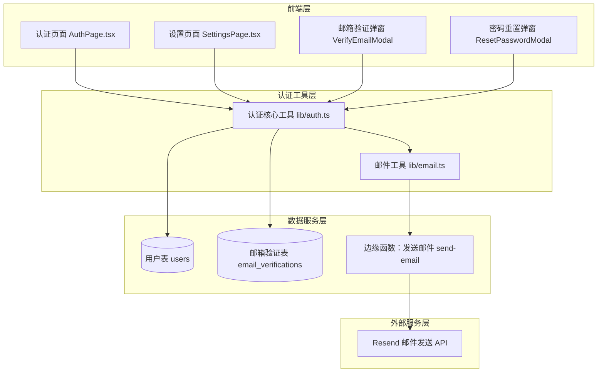
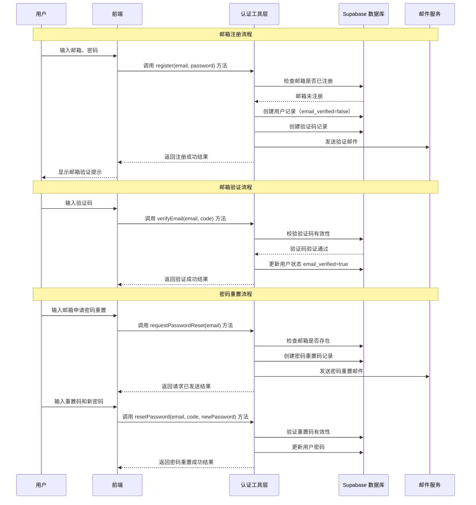

# 邮箱系统原理

## 一、邮件系统核心概念

### 1.1 邮件地址结构

```
Lumina <noreply@luminaio.dpdns.org>
  ↑              ↑         ↑
显示名称      用户名      域名
```

- **用户名**：可以是任意名称，如 `noreply`、`support`、`lumina`
- **域名**：你拥有的域名
- `noreply` 是行业惯例，表示"这是自动邮件，不要回复"

### 1.2 域名层级

```
org                      ← 顶级域名 (TLD)
dpdns.org                ← 一级域名 / 根域名
luminaio.dpdns.org       ← 二级域名 / 子域名
www.luminaio.dpdns.org   ← 三级域名
```

- **根域名**：你购买的域名，如 `example.com`
- **子域名**：在根域名前加前缀，如 `www.example.com`、`api.example.com`

---

## 二、邮件系统核心组件

### 2.1 SMTP 服务器（邮件发送/接收核心）

**核心作用**：相当于邮件的"邮局"，负责邮件的投递、转发和接收

**核心协议**：SMTP（Simple Mail Transfer Protocol）

**常用端口**：

| 端口 | 用途                 |
| ---- | -------------------- |
| 25   | 默认端口（常被封禁） |
| 465  | SSL 加密             |
| 587  | TLS 加密（推荐）     |

**工作流程**：

```
发送：用户 → 本地SMTP → 查询收件人MX记录 → 连接对方SMTP → 投递
接收：外部SMTP → 查询你的MX记录 → 连接你的SMTP → 存入邮箱
```

**主流软件**：Postfix（主流）、Sendmail（老牌）、Exim

### 2.2 IMAP/POP3 服务器（邮件读取）

**核心作用**：让用户通过客户端（Outlook、手机邮件App）读取邮件

| 协议     | 特点                                         |
| -------- | -------------------------------------------- |
| **IMAP** | 邮件保留在服务器，多设备同步，支持文件夹管理 |
| **POP3** | 下载到本地，可选择是否保留服务器副本         |

**主流软件**：Dovecot

### 2.3 邮件存储系统

**核心作用**：持久化保存邮件内容、附件和元数据

| 格式        | 特点                                         |
| ----------- | -------------------------------------------- |
| **Maildir** | 每封邮件一个文件（推荐，易管理、高并发友好） |
| **mbox**    | 所有邮件在一个大文件（简单但易损坏）         |

### 2.4 Web 邮件界面（可选）

**核心作用**：提供网页版邮箱界面，类似 Gmail 网页版

**主流软件**：Roundcube、Rainloop

---

## 三、DNS 邮件相关记录

### 3.1 记录类型详解

| 记录      | 作用                      | 示例                                   |
| --------- | ------------------------- | -------------------------------------- |
| **A**     | 域名 → IPv4 地址          | `example.com` → `1.2.3.4`              |
| **AAAA**  | 域名 → IPv6 地址          | 同上，用于 IPv6                        |
| **CNAME** | 域名 → 另一个域名（别名） | `www` → `example.com`                  |
| **MX**    | 指定邮件服务器            | 告诉别人"发给我的邮件投递到这个服务器" |
| **TXT**   | 存储文本信息              | 用于 SPF、DKIM、DMARC 验证             |

### 3.2 邮件安全记录

| 记录      | 作用                                 | 不配置的后果             |
| --------- | ------------------------------------ | ------------------------ |
| **SPF**   | 声明"只有这些服务器可以代表我发邮件" | 邮件可能被拒收或进垃圾箱 |
| **DKIM**  | 邮件数字签名，防伪造篡改             | 邮件服务商可能拒绝发送   |
| **DMARC** | 定义验证失败时的处理规则             | 邮件更容易进垃圾箱       |

### 3.3 DNS 记录使用流程（故事版）

**场景**：用户点击"发送验证码"

```
第1步：用户操作
━━━━━━━━━━━━━━━━━━━━━━━━━━━━━━━━━━━━━━━━━━━━━━━━━━━━
用户在网站点击"发送验证码"
                    ↓

第2步：应用调用邮件服务
━━━━━━━━━━━━━━━━━━━━━━━━━━━━━━━━━━━━━━━━━━━━━━━━━━━━
Edge Function 调用 Resend API：
"请用 lumina@luminaio.dpdns.org 发邮件给 user@qq.com"
                    ↓

第3步：邮件服务发出邮件
━━━━━━━━━━━━━━━━━━━━━━━━━━━━━━━━━━━━━━━━━━━━━━━━━━━━
Resend 服务器：
- 盖上 DKIM 签名
- 发送邮件到 QQ 邮箱服务器
                    ↓

第4步：收件方验证邮件 ⭐ DNS 在这里被查询
━━━━━━━━━━━━━━━━━━━━━━━━━━━━━━━━━━━━━━━━━━━━━━━━━━━━
QQ 邮箱服务器收到邮件，开始验证：

  ┌─ 查询 SPF ─────────────────────────────────────┐
  │ QQ → DNS：luminaio.dpdns.org 的 SPF 记录？      │
  │ DNS → QQ：允许 amazonses.com 发邮件             │
  │ QQ：Resend 用的是 Amazon SES，✅ 匹配           │
  └────────────────────────────────────────────────┘

  ┌─ 查询 DKIM ────────────────────────────────────┐
  │ QQ → DNS：luminaio.dpdns.org 的 DKIM 公钥？     │
  │ DNS → QQ：公钥是 p=MIGfMA0GCS...               │
  │ QQ：用公钥验证签名，✅ 签名有效                  │
  └────────────────────────────────────────────────┘
                    ↓

第5步：验证通过，投递邮件
━━━━━━━━━━━━━━━━━━━━━━━━━━━━━━━━━━━━━━━━━━━━━━━━━━━━
QQ 邮箱：所有验证通过 ✅ → 放入用户收件箱
```

**如果骗子冒充你发邮件**：

```
骗子 → 用自己服务器发信 → 假装是 lumina@你的域名

收件方检查：
- SPF：这个服务器有权发信吗？❌ 没有
- DKIM：有签名吗？❌ 没有
- 结论：扔进垃圾箱或拒收 🗑️
```

---

## 四、自建邮箱服务器

### 4.1 完整步骤

1. 准备一台具备公网 IP 的服务器（阿里云、腾讯云等）
2. 确认 25 端口未被封禁（多数云厂商默认封禁，需申请解封）
3. 安装并配置 Postfix（SMTP 服务）
4. 安装并配置 Dovecot（IMAP/POP3 服务）
5. 配置 SSL/TLS 证书
6. 配置 DNS 记录：MX、SPF、DKIM、DMARC
7. 部署反垃圾邮件工具（如 SpamAssassin）
8. （可选）安装网页版邮件客户端（如 Roundcube）

### 4.2 自建邮箱的故事

想象你要在自己家里开一个**私人邮局**：

**第一步：租办公室（服务器）**

```
你：我要租一间有固定地址的办公室
云服务商：给你一台服务器，IP 是 123.45.67.89
```

**第二步：挂招牌（MX 记录）**

```
你去 DNS（全球地址簿）登记：
"发给 @lumina.com 的信，请送到 123.45.67.89"
```

**第三步：雇员工（安装软件）**

```
门卫（Postfix）：接收外面的信，把你的信送出去
信箱管理员（Dovecot）：让你能查看自己的信箱
前台（Roundcube）：提供网页版界面
```

**第四步：办证件（DNS 安全记录）**

```
SPF：只有这台服务器可以代表我发信
DKIM：这是我的官方印章
DMARC：没有印章的信请扔掉
```

### 4.3 为什么不建议自建？

| 问题         | 说明                                 |
| ------------ | ------------------------------------ |
| **IP 信誉**  | 新服务器 IP 容易被标记为垃圾邮件源   |
| **维护成本** | 需要 24/7 运行、安全更新、防垃圾邮件 |
| **端口封禁** | 云厂商默认封禁 25 端口               |
| **合规配置** | SPF、DKIM、DMARC 配置复杂            |

---

## 五、企业邮箱服务（推荐）

如果需要真正的邮箱（能收发邮件、有收件箱）：

| 服务                         | 价格          | 特点                   |
| ---------------------------- | ------------- | ---------------------- |
| **Cloudflare Email Routing** | 免费          | 只能转发到现有邮箱     |
| **Zoho Mail**                | 免费（5用户） | 完整邮箱功能，有网页版 |
| **Google Workspace**         | $6/月/用户    | Gmail 界面，功能强大   |
| **Microsoft 365**            | $6/月/用户    | Outlook 界面           |

---

## 六、前后端分离邮件发送方案

### 6.1 方案对比

| 方案                         | 优点               | 缺点             |
| ---------------------------- | ------------------ | ---------------- |
| **Resend + Edge Function**   | 简单、免费额度够用 | 需要域名验证     |
| **QQ邮箱 SMTP + Nodemailer** | 无需域名验证       | 发件人是 QQ 邮箱 |
| **SendGrid/Mailgun**         | 支持自定义域名     | 需要域名验证     |

### 6.2 为什么用 Edge Function？

**核心原因：保护 API Key**

```
❌ 错误：前端直接调用
前端代码（用户可见）→ API Key 暴露！

✅ 正确：通过 Edge Function
前端 → Edge Function（API Key 在这里）→ Resend
         ↑
    用户看不到这里的代码
```

### 6.3 方案 A：Resend + Supabase Edge Function（当前项目）

**架构**：

```
前端 → Supabase Edge Function → Resend API → 收件人邮箱
```

**配置步骤**：

1. 在 Resend 添加域名
2. 在 Cloudflare 添加 DNS 记录（DKIM、SPF）
3. 等待 Resend 验证通过
4. 在 Supabase Secrets 配置 `RESEND_API_KEY` 和 `FROM_EMAIL`

### 6.4 方案 B：QQ邮箱 SMTP + Nodemailer

**架构**：

```
前端 → 后端 API → Nodemailer → QQ SMTP → 收件人邮箱
```

**配置步骤**：

1. 开启 QQ 邮箱 SMTP：设置 → 账户 → POP3/SMTP服务 → 开启 → 获取授权码
2. 后端代码：

```javascript
import nodemailer from 'nodemailer';

const transporter = nodemailer.createTransport({
  host: 'smtp.qq.com',
  port: 465,
  secure: true,
  auth: {
    user: 'your-qq-email@qq.com',
    pass: 'your-authorization-code' // 授权码，不是QQ密码
  }
});

await transporter.sendMail({
  from: '"Lumina" <your-qq-email@qq.com>',
  to: 'user@example.com',
  subject: '验证码',
  html: '<p>你的验证码是：<strong>123456</strong></p>'
});
```

### 6.5 免费 SMTP 服务对比

| 服务            | 免费额度 | 特点                           |
| --------------- | -------- | ------------------------------ |
| **QQ邮箱 SMTP** | 无限制   | 无需域名验证，发件人是 QQ 邮箱 |
| **Gmail SMTP**  | 500封/天 | 需要应用专用密码               |
| **SendGrid**    | 100封/天 | 需域名验证                     |
| **Mailgun**     | 100封/天 | 需域名验证                     |
| **Resend**      | 100封/天 | 需域名验证，API 简洁           |

---

## 七、Resend 域名验证配置

### 7.1 在 Resend 添加域名

1. 登录 [Resend Dashboard](https://resend.com/domains)
2. 点击 "Add Domain"
3. 输入你的域名（如 `luminaio.dpdns.org`）

### 7.2 在 Cloudflare 添加 DNS 记录

根据 Resend 显示的要求添加：

| Type | Name                | Content                             | 必须？ |
| ---- | ------------------- | ----------------------------------- | ------ |
| TXT  | `resend._domainkey` | `p=MIGfMA0GCS...`                   | ✅ 必须 |
| MX   | `send`              | `feedback-smtp.xxx.amazonses.com`   | ✅ 必须 |
| TXT  | `send`              | `v=spf1 include:amazonses.com ~all` | ✅ 必须 |
| TXT  | `_dmarc`            | `v=DMARC1; p=none;`                 | ⚠️ 推荐 |

**注意**：

- Cloudflare 会自动加上域名后缀，只需填前缀
- Proxy status 必须关闭（灰色云朵）

### 7.3 配置 Supabase Secrets

验证通过后，在 Supabase Dashboard → Settings → Edge Functions → Secrets：

```
RESEND_API_KEY = re_xxxxxxxx
FROM_EMAIL = Lumina <lumina@luminaio.dpdns.org>
```

### 7.4 快速测试（跳过域名验证）

如果只是测试功能，可以用 Resend 的测试邮箱：

```
FROM_EMAIL = onboarding@resend.dev
```

---

## 八、常见问题

### Q1：有域名就有邮箱吗？

不是。域名和邮箱是两个概念：

| 功能     | 需要什么                       |
| -------- | ------------------------------ |
| 网站访问 | 域名 + A/CNAME 记录            |
| 收邮件   | 域名 + MX 记录 + 邮件服务器    |
| 发邮件   | 域名 + SPF/DKIM + 邮件发送服务 |

### Q2：DNS 记录 Pending 怎么办？

1. 确认在 Cloudflare 添加了正确的记录
2. Name 字段不要加域名后缀（Cloudflare 自动加）
3. Proxy status 要关闭（灰色云朵）
4. DNS 传播需要时间（几分钟到 24 小时）
5. 用 [dnschecker.org](https://dnschecker.org) 检查记录是否生效

### Q3：500 错误怎么办？

通常是 `FROM_EMAIL` 的域名没验证。先用 `onboarding@resend.dev` 测试。

### Q4：Cloudflare Proxy 要开还是关？

邮件相关的 DNS 记录（MX、TXT）必须关闭 Proxy（灰色云朵），否则验证会失败。

---

## 九、总结

| 场景             | 推荐方案                     |
| ---------------- | ---------------------------- |
| 只需发验证码邮件 | Resend + Edge Function       |
| 快速测试         | QQ邮箱 SMTP + Nodemailer     |
| 需要自定义域名   | Resend/SendGrid + 域名验证   |
| 需要完整邮箱     | Zoho Mail / Google Workspace |
| 完全自主控制     | 自建邮箱服务器（不推荐）     |

# 需求文档

## 一、概述
为 **Lumina 应用**新增**邮箱注册、登录及密码找回**功能。当前系统仅支持「用户名+密码」登录方式，需扩展为支持邮箱注册、邮箱登录、邮箱验证和密码重置能力，且需遵循行业最佳实践。

## 二、术语表
| 术语                     | 定义                                                      |
| ------------------------ | --------------------------------------------------------- |
| **Auth_System**          | Lumina 应用的认证系统，负责用户注册、登录、验证及密码管理 |
| **User**                 | 系统用户实体，包含用户名、邮箱、密码等核心信息            |
| **Email_Service**        | 邮件发送服务，负责发送验证码、密码重置链接等邮件          |
| **Verification_Code**    | 6位数字验证码，用于邮箱验证和密码重置流程                 |
| **Password_Reset_Token** | 密码重置令牌，用于验证密码重置请求的合法性                |

## 三、功能需求
### 需求1：邮箱注册
**用户故事**：作为新用户，我希望通过邮箱注册账号，以便创建账户并在忘记密码时进行找回。

#### 验收标准
1.  当用户在注册表单中输入**合法邮箱**和**合规密码**时，认证系统应创建新用户账户，并将该邮箱作为主标识。
2.  当用户使用**已注册邮箱**尝试注册时，认证系统应显示错误提示，明确告知该邮箱已被占用。
3.  当用户输入**非法格式邮箱**时，认证系统应在表单提交前触发校验，并显示格式错误提示。
4.  认证系统要求密码长度**至少为 6 位**。
5.  注册成功后，认证系统应向用户邮箱发送**验证邮件**。
6.  认证系统需采用**安全哈希算法**存储密码（基于盐值的 SHA-256 哈希）。

### 需求2：邮箱登录
**用户故事**：作为已注册用户，我希望通过邮箱和密码登录，以便访问我的账户。

#### 验收标准
1.  当用户输入**正确的邮箱和密码**时，认证系统应完成用户身份认证并创建会话。
2.  当用户输入**错误凭据**时，认证系统应返回**通用错误提示**，不泄露具体是邮箱错误还是密码错误。
3.  认证系统需同时支持**邮箱和用户名**两种登录方式（保障向后兼容性）。
4.  登录成功后，认证系统应将用户会话信息存储至 `localStorage`。
5.  若用户邮箱**未验证**，认证系统仍允许登录，但需显示「请验证邮箱」的提醒。

### 需求3：邮箱验证
**用户故事**：作为已注册用户，我希望验证我的邮箱，以便证明邮箱归属权并启用密码找回功能。

#### 验收标准
1.  当用户发起邮箱验证请求时，邮件服务应向用户邮箱发送**6位数字验证码**。
2.  验证码有效期为 **10 分钟**，超时自动失效。
3.  当用户输入**正确的验证码**时，认证系统应将该邮箱标记为「已验证」状态。
4.  当用户输入**错误或过期的验证码**时，认证系统应显示对应的错误提示。
5.  认证系统应支持用户**重新请求发送验证码**。
6.  同一邮箱在**60 秒内**，若存在有效未过期的验证码，不允许重复请求新验证码。

### 需求4：找回密码
**用户故事**：作为忘记密码的用户，我希望通过邮箱重置密码，以便重新获取账户访问权限。

#### 验收标准
1.  当用户使用**已注册邮箱**发起密码重置请求时，邮件服务应向该邮箱发送**6位数字重置码**。
2.  当用户使用**未注册邮箱**发起密码重置请求时，认证系统应返回**成功提示**（防止邮箱枚举攻击）。
3.  密码重置码有效期为 **10 分钟**，超时自动失效。
4.  当用户输入**正确的重置码和合规新密码**时，认证系统应更新用户密码，并将该重置码标记为作废。
5.  当用户输入**错误或过期的重置码**时，认证系统应显示对应的错误提示。
6.  新密码需满足与注册流程相同的要求（长度至少 6 位）。

### 需求5：用户资料管理
**用户故事**：作为已登录用户，我希望在设置页面管理我的邮箱和密码，以便保障账户安全。

#### 验收标准
1.  当用户在设置页面修改邮箱时，认证系统应要求**先验证新邮箱**，验证通过后再更新用户邮箱。
2.  当用户修改密码时，认证系统应要求输入**原密码**进行身份验证。
3.  认证系统应在设置页面**显示用户邮箱的验证状态**。
4.  若用户邮箱未验证，认证系统应提供**重新发送验证邮件**的按钮。

### 需求6：安全性要求
**用户故事**：作为系统管理员，我希望认证系统遵循安全最佳实践，以便保障用户账户安全。

#### 验收标准
1.  认证系统需对登录尝试实现**频率限制**：单个 IP/邮箱 15 分钟内最多允许 5 次登录尝试。
2.  认证系统需对验证码请求实现**频率限制**：单个邮箱 10 分钟内最多允许 3 次验证码请求。
3.  认证系统需采用**安全随机算法**生成验证码。
4.  当出现多次登录失败时，认证系统应**临时锁定该账户**。

### 需求7：UI/UX 要求
**用户故事**：作为用户，我希望拥有流畅、直观的认证操作体验，以便轻松完成注册、登录及账户找回。

#### 验收标准
1.  认证系统在所有认证操作流程中，应提供**清晰的视觉反馈**。
2.  异步操作（如发送邮件、验证信息）过程中，应显示**加载状态**。
3.  对邮箱、密码等表单字段提供**实时内联校验**。
4.  切换登录模式（邮箱/用户名）时，应**保留已输入的表单数据**（如适用）。
5.  认证界面需支持**键盘导航**，并满足可访问性标准。
6.  验证码有效期内，应显示**倒计时计时器**，提示用户剩余有效时间。

---

# 设计文档
## 一、概述
本文档详细描述了 **Lumina 应用邮箱认证系统** 的技术实现方案。该系统将在现有「用户名认证」的基础上进行功能扩展，新增**邮箱注册、邮箱登录、邮箱验证及密码重置**能力。设计遵循**渐进式增强原则**，确保对现有功能的向后兼容性。

## 二、系统架构
### 2.1 系统架构图


### 2.2 认证流程图


## 三、组件与接口设计
### 3.1 认证工具扩展（lib/auth.ts）
```typescript
// 扩展用户信息接口
export interface User {
  id: string;
  username: string;
  email: string | null;
  email_verified: boolean;
  created_at: string;
}

// 新增核心功能函数声明
export async function registerWithEmail(email: string, password: string, username?: string): Promise<User>;
export async function loginWithEmail(emailOrUsername: string, password: string): Promise<User>;
export async function requestEmailVerification(email: string): Promise<void>;
export async function verifyEmail(email: string, code: string): Promise<void>;
export async function requestPasswordReset(email: string): Promise<void>;
export async function resetPassword(email: string, code: string, newPassword: string): Promise<void>;
export async function updateEmail(userId: string, newEmail: string, password: string): Promise<void>;
export async function resendVerificationCode(email: string): Promise<void>;
```

### 3.2 邮件服务（lib/email.ts + Supabase 边缘函数）
邮件发送采用 **Supabase 边缘函数 + Resend API** 方案实现，具体代码如下：

```typescript
// lib/email.ts - 前端邮件发送接口封装
export async function sendVerificationEmail(email: string, code: string): Promise<void> {
  const response = await fetch(`${SUPABASE_URL}/functions/v1/send-email`, {
    method: 'POST',
    headers: {
      'Content-Type': 'application/json',
      'Authorization': `Bearer ${SUPABASE_ANON_KEY}`,
    },
    body: JSON.stringify({
      type: 'verification',
      to: email,
      code: code,
    }),
  });
  if (!response.ok) throw new Error('发送邮件失败');
}

// 密码重置邮件发送函数
export async function sendPasswordResetEmail(email: string, code: string): Promise<void>;
// 邮箱修改验证邮件发送函数
export async function sendEmailChangeVerification(email: string, code: string): Promise<void>;
```

```typescript
// supabase/functions/send-email/index.ts - 边缘函数核心逻辑
import { Resend } from 'resend';

// 初始化 Resend 客户端
const resend = new Resend(Deno.env.get('RESEND_API_KEY'));

// 启动边缘函数服务
Deno.serve(async (req) => {
  const { type, to, code } = await req.json();
  
  // 邮件模板配置
  const templates = {
    verification: {
      subject: 'Lumina - 验证您的邮箱',
      html: `<p>您的验证码是：<strong>${code}</strong></p><p>验证码10分钟内有效。</p>`,
    },
    password_reset: {
      subject: 'Lumina - 重置密码',
      html: `<p>您的密码重置验证码是：<strong>${code}</strong></p><p>验证码10分钟内有效。</p>`,
    },
  };
  
  // 获取对应模板并发送邮件
  const template = templates[type];
  await resend.emails.send({
    from: 'Lumina <noreply@yourdomain.com>', // 发件人邮箱（需配置 Resend 域名）
    to: [to],                                // 收件人邮箱
    subject: template.subject,               // 邮件主题
    html: template.html,                     // 邮件正文（HTML 格式）
  });
  
  // 返回成功响应
  return new Response(JSON.stringify({ success: true }));
});
```

#### 配置要求
1.  在 Resend 平台注册账号并获取 API Key
2.  在 Supabase 控制台为边缘函数配置环境变量 `RESEND_API_KEY`
3.  部署边缘函数：执行命令 `supabase functions deploy send-email`

### 3.3 认证页面组件扩展
```typescript
// 认证页面模式枚举
type AuthMode = 'login' | 'register' | 'forgot-password' | 'verify-email' | 'reset-password';

// 认证页面状态接口
interface AuthPageState {
  mode: AuthMode;          // 当前认证模式
  email: string;           // 邮箱输入值
  username: string;        // 用户名输入值
  password: string;        // 密码输入值
  confirmPassword: string; // 确认密码输入值
  verificationCode: string;// 验证码输入值
  loading: boolean;        // 加载状态
  countdown: number;       // 验证码倒计时（秒）
}
```

### 3.4 设置页面组件扩展
新增「邮箱管理」功能区域，包含以下核心能力：
- 展示当前绑定邮箱及验证状态
- 提供邮箱修改功能入口
- 提供「重新发送验证邮件」按钮

## 四、数据模型设计
### 4.1 数据库表结构变更
#### （1）用户表（users）扩展
```sql
-- 添加邮箱相关字段
ALTER TABLE users ADD COLUMN IF NOT EXISTS email varchar(255) UNIQUE;
ALTER TABLE users ADD COLUMN IF NOT EXISTS email_verified boolean DEFAULT false;
ALTER TABLE users ADD COLUMN IF NOT EXISTS login_attempts integer DEFAULT 0;
ALTER TABLE users ADD COLUMN IF NOT EXISTS locked_until timestamptz;

-- 创建邮箱索引提升查询效率
CREATE INDEX IF NOT EXISTS idx_users_email ON users(email);
```

#### （2）邮箱验证表（email_verifications）- 新建
```sql
CREATE TABLE IF NOT EXISTS email_verifications (
  id uuid PRIMARY KEY DEFAULT gen_random_uuid(),       -- 主键ID（自动生成）
  email varchar(255) NOT NULL,                        -- 关联邮箱
  code varchar(6) NOT NULL,                           -- 6位验证码
  type varchar(20) NOT NULL,                          -- 验证码类型：registration/password_reset/email_change
  expires_at timestamptz NOT NULL,                     -- 过期时间
  used boolean DEFAULT false,                         -- 是否已使用
  created_at timestamptz DEFAULT now()                -- 创建时间
);

-- 创建索引提升查询性能
CREATE INDEX IF NOT EXISTS idx_email_verifications_email ON email_verifications(email);
CREATE INDEX IF NOT EXISTS idx_email_verifications_expires ON email_verifications(expires_at);
```

### 4.2 数据模型关系图
```mermaid
erDiagram
    users ||--o{ email_verifications : "关联拥有"
    
    users {
        uuid id PK                -- 主键
        varchar username UK       -- 用户名（唯一）
        varchar email UK          -- 邮箱（唯一）
        varchar password_hash     -- 密码哈希
        boolean email_verified    -- 邮箱验证状态
        integer login_attempts    -- 登录失败次数
        timestamptz locked_until  -- 账户锁定截止时间
        timestamptz created_at    -- 创建时间
        timestamptz updated_at    -- 更新时间
    }
    
    email_verifications {
        uuid id PK                -- 主键
        varchar email             -- 关联邮箱
        varchar code              -- 验证码
        varchar type              -- 验证码类型
        timestamptz expires_at    -- 过期时间
        boolean used              -- 是否已使用
        timestamptz created_at    -- 创建时间
    }
```

## 五、正确性约束
> **约束定义**：约束是系统在所有合法执行场景下必须满足的特性或行为，是连接自然语言需求与机器可验证正确性的桥梁。

| 约束编号 | 约束描述                                                     | 验证对应需求  |
| -------- | ------------------------------------------------------------ | ------------- |
| 1        | 对于任意合法的邮箱和密码组合，注册新用户后使用相同凭据登录，必须成功且返回相同用户ID | 需求 1.1、2.1 |
| 2        | 对于任意已注册邮箱，使用该邮箱再次注册新账号，必须返回错误提示 | 需求 1.2      |
| 3        | 对于任意不符合邮箱格式（xxx@xxx.xxx）的字符串，注册表单必须在提交前拦截 | 需求 1.3      |
| 4        | 对于任意长度小于 6 位的密码，注册和密码重置操作必须返回验证错误 | 需求 1.4、4.6 |
| 5        | 对于任意存储的用户记录，password_hash 字段不得等于明文密码，且必须符合 SHA-256 哈希格式（64 位十六进制字符） | 需求 1.6      |
| 6        | 对于任意邮箱错误或密码错误的登录请求，认证系统必须返回相同的通用错误提示 | 需求 2.2      |
| 7        | 对于任意同时设置邮箱和用户名的用户，使用任一标识配合正确密码登录，必须成功 | 需求 2.3      |
| 8        | 对于任意 email_verified=false 的用户，使用正确凭据登录，必须成功 | 需求 2.5      |
| 9        | 对于任意生成的验证码，必须为 6 位数字（000000-999999）       | 需求 3.1、4.1 |
| 10       | 对于任意有效的验证码，提交正确验证码必须将邮箱标记为已验证；对于错误或过期的验证码，验证操作必须返回错误 | 需求 3.3、3.4 |
| 11       | 对于任意存在有效未过期验证码的邮箱，60 秒内重复请求新验证码，必须被拒绝 | 需求 3.6      |
| 12       | 对于任意邮箱（无论是否注册），申请密码重置必须返回成功，且不泄露邮箱是否存在 | 需求 4.2      |
| 13       | 对于任意有效的重置码，提交正确重置码和合规新密码必须更新密码并作废该重置码；对于错误或过期的重置码，重置操作必须失败 | 需求 4.4、4.5 |
| 14       | 对于任意密码修改请求，若提供的原密码错误，操作必须返回错误   | 需求 5.2      |
| 15       | 对于任意 N 个生成的验证码集合，其分布必须在 000000-999999 范围内近似均匀，无可预测规律 | 需求 6.4      |

## 六、错误处理设计
### 6.1 错误类型与提示信息
| 错误码                | 中文提示信息             | 适用场景                        |
| --------------------- | ------------------------ | ------------------------------- |
| `INVALID_EMAIL`       | 请输入有效的邮箱地址     | 邮箱格式验证失败                |
| `EMAIL_EXISTS`        | 该邮箱已被注册           | 使用已注册邮箱注册新账号        |
| `USERNAME_EXISTS`     | 用户名已被使用           | 使用已存在用户名注册            |
| `INVALID_CREDENTIALS` | 邮箱或密码错误           | 邮箱/密码错误的登录请求         |
| `PASSWORD_TOO_SHORT`  | 密码至少需要6位          | 密码长度小于 6 位               |
| `PASSWORDS_NOT_MATCH` | 两次密码不一致           | 注册/重置时密码与确认密码不匹配 |
| `INVALID_CODE`        | 验证码错误或已过期       | 验证码错误、过期或已被使用      |
| `RATE_LIMITED`        | 请求过于频繁，请稍后再试 | 触发接口频率限制                |
| `ACCOUNT_LOCKED`      | 账户已被锁定，请稍后再试 | 登录失败次数过多导致账户锁定    |
| `EMAIL_NOT_VERIFIED`  | 请先验证邮箱             | 执行需要验证邮箱的操作          |

### 6.2 错误处理策略
1.  **验证类错误**：立即返回错误，并明确标注错误字段（如邮箱格式错误）
2.  **认证类错误**：使用通用提示信息，防止账户信息枚举攻击（如不区分“邮箱错误”和“密码错误”）
3.  **频率限制错误**：返回 429 状态码，并附带重试等待时间（Retry-After）
4.  **服务端错误**：详细记录错误日志，向用户返回通用错误提示（避免泄露系统细节）

## 七、测试策略
### 7.1 单元测试
1.  **邮箱格式验证测试**
    - 覆盖合法邮箱格式（如 `user@domain.com`、`user.name+tag@domain.co`）
    - 覆盖非法邮箱格式（如缺少 @ 符号、缺少域名、特殊字符等）
2.  **密码验证测试**
    - 验证密码最小长度（6 位）校验逻辑
    - 验证密码哈希生成与验证逻辑（确保哈希值与明文不一致）
3.  **验证码功能测试**
    - 验证验证码生成规则（确保为 6 位数字）
    - 验证验证码过期逻辑（10 分钟后失效）
    - 验证验证码有效性校验逻辑

### 7.2 基于约束的测试
使用属性化测试库（如 TypeScript 的 fast-check），针对核心约束自动化测试：
1.  **注册-登录闭环测试**（约束 1）
    - 生成随机合法邮箱/密码 → 注册 → 登录 → 验证用户 ID 一致性
2.  **密码哈希安全性测试**（约束 5）
    - 生成随机密码 → 验证哈希值 ≠ 明文 → 验证哈希格式符合 SHA-256 规范
3.  **双标识登录测试**（约束 7）
    - 生成含邮箱+用户名的测试用户 → 分别用邮箱/用户名登录 → 验证均成功
4.  **验证码格式测试**（约束 9）
    - 生成大量验证码 → 验证所有验证码均为 6 位数字
5.  **认证错误一致性测试**（约束 6）
    - 测试“邮箱错误”“密码错误”场景 → 验证返回错误提示完全一致

### 7.3 集成测试
1.  **完整注册流程测试**
    - 流程覆盖：注册 → 接收验证邮件 → 验证邮箱 → 登录系统
2.  **完整密码重置流程测试**
    - 流程覆盖：申请重置 → 接收重置邮件 → 重置密码 → 新密码登录
3.  **频率限制功能测试**
    - 多次登录失败 → 验证账户锁定逻辑
    - 短时间内重复请求验证码 → 验证频率限制逻辑

## 八、代码变更影响评估
### 8.1 待修改文件
| 文件路径                      | 变更内容                         | 影响程度              |
| ----------------------------- | -------------------------------- | --------------------- |
| `lib/auth.ts`                 | 新增邮箱认证函数、扩展 User 接口 | 高 - 核心认证逻辑变更 |
| `components/AuthPage.tsx`     | 新增邮箱注册/找回密码/验证 UI    | 高 - 核心认证页面变更 |
| `components/SettingsPage.tsx` | 新增邮箱管理区域                 | 中 - 设置页面功能扩展 |
| `supabase/schema.sql`         | 新增邮箱字段、创建验证表         | 高 - 数据库结构变更   |
| `types.ts`                    | 按需更新 User 类型定义           | 低 - 类型定义微调     |

### 8.2 待创建新文件
| 文件路径                                 | 功能用途                          |
| ---------------------------------------- | --------------------------------- |
| `lib/email.ts`                           | 邮件发送工具类（调用边缘函数）    |
| `supabase/functions/send-email/index.ts` | Supabase 边缘函数（邮件发送核心） |
| `supabase/plus/007_add_email_auth.sql`   | 邮箱认证功能数据库迁移脚本        |
| `shared/VerificationInput.tsx`           | 通用 6 位验证码输入组件           |

### 8.3 向后兼容性
1.  **存量用户兼容**：存量用户的 `email` 字段为 `null`，`email_verified` 字段为 `false`，不影响现有功能
2.  **登录功能兼容**：继续支持原有的用户名登录方式
3.  **注册功能兼容**：同时支持用户名注册和邮箱注册两种模式
4.  **数据迁移兼容**：无需迁移历史数据，新增字段均为可空

### 8.4 风险评估
| 风险点           | 发生概率 | 影响程度 | 缓解措施                                 |
| ---------------- | -------- | -------- | ---------------------------------------- |
| 邮件发送失败     | 中       | 高       | 实现邮件重发机制，提供手动触发验证的选项 |
| 频率限制策略过严 | 低       | 中       | 将限制阈值配置化，提供清晰的限制提示     |
| 存量用户使用困惑 | 低       | 低       | 在 UI 上明确标注邮箱功能为可选扩展功能   |

---


# Task文档

## Overview

本实现计划将邮箱认证功能分解为可执行的编码任务，按照数据库 → 后端逻辑 → 前端 UI 的顺序实现，确保每个步骤都可以独立验证。

## Tasks

- [x] 1. 数据库迁移 - 添加邮箱认证相关表和字段
  - [x] 1.1 创建数据库迁移文件 `supabase/plus/007_add_email_auth.sql`
    - 扩展 users 表添加 email, email_verified, login_attempts, locked_until 字段
    - 创建 email_verifications 表
    - 添加索引和 RLS 策略
    - _Requirements: 1.1, 3.1, 4.1_

- [x] 2. 邮件服务实现
  - [x] 2.1 创建 Supabase Edge Function `supabase/functions/send-email/index.ts`
    - 实现 Resend API 调用
    - 支持 verification 和 password_reset 两种邮件类型
    - _Requirements: 1.5, 3.1, 4.1_
  
  - [x] 2.2 创建邮件服务库 `lib/email.ts`
    - 实现 sendVerificationEmail 函数
    - 实现 sendPasswordResetEmail 函数
    - 添加开发模式下的模拟邮件功能（console 输出验证码）
    - _Requirements: 1.5, 3.1, 4.1_

- [-] 3. 认证库扩展 - 扩展 lib/auth.ts
  - [ ] 3.1 扩展 User 接口和基础函数
    - 更新 User 接口添加 email, email_verified 字段
    - 添加邮箱格式验证函数 validateEmail
    - 添加验证码生成函数 generateVerificationCode
    - _Requirements: 1.3, 3.1_
  
  - [x] 3.2 实现邮箱注册功能
    - 实现 registerWithEmail 函数
    - 检查邮箱是否已存在
    - 创建用户并发送验证邮件
    - _Requirements: 1.1, 1.2, 1.4, 1.5, 1.6_
  
  - [ ]* 3.3 编写邮箱注册属性测试
    - **Property 1: Registration-Login Round Trip**
    - **Property 2: Duplicate Email Prevention**
    - **Validates: Requirements 1.1, 1.2, 2.1**
  
  - [x] 3.4 实现邮箱登录功能
    - 修改 login 函数支持邮箱或用户名登录
    - 实现登录失败计数和账户锁定
    - _Requirements: 2.1, 2.2, 2.3, 2.5, 6.1_
  
  - [ ]* 3.5 编写登录功能属性测试
    - **Property 6: Credential Error Uniformity**
    - **Property 7: Dual Identifier Login**
    - **Property 8: Unverified Email Login**
    - **Validates: Requirements 2.2, 2.3, 2.5**
  
  - [x] 3.6 实现邮箱验证功能
    - 实现 requestEmailVerification 函数
    - 实现 verifyEmail 函数
    - 添加验证码过期检查和速率限制
    - _Requirements: 3.1, 3.2, 3.3, 3.4, 3.5, 3.6_
  
  - [ ]* 3.7 编写邮箱验证属性测试
    - **Property 9: Verification Code Format**
    - **Property 10: Verification Code Validation**
    - **Property 11: Verification Code Rate Limiting**
    - **Validates: Requirements 3.1, 3.3, 3.4, 3.6**
  
  - [x] 3.8 实现密码重置功能
    - 实现 requestPasswordReset 函数
    - 实现 resetPassword 函数
    - 确保不泄露邮箱是否存在
    - _Requirements: 4.1, 4.2, 4.3, 4.4, 4.5, 4.6_
  
  - [ ]* 3.9 编写密码重置属性测试
    - **Property 12: Password Reset Security**
    - **Property 13: Password Reset Code Validation**
    - **Validates: Requirements 4.2, 4.4, 4.5**

- [ ] 4. Checkpoint - 后端功能验证
  - 确保所有认证函数可以正常调用
  - 验证数据库操作正确
  - 确保所有测试通过，如有问题请询问用户

- [x] 5. 共享组件 - 创建验证码输入组件
  - [x] 5.1 创建 `shared/VerificationInput.tsx`
    - 6位数字输入框，自动聚焦下一个
    - 支持粘贴完整验证码
    - 显示倒计时和重新发送按钮
    - _Requirements: 7.1, 7.2, 7.6_

- [x] 6. AuthPage 重构 - 添加邮箱认证 UI
  - [x] 6.1 重构 AuthPage 状态管理
    - 添加新的 AuthMode: 'forgot-password', 'verify-email', 'reset-password'
    - 添加 email, verificationCode, countdown 状态
    - _Requirements: 7.1, 7.4_
  
  - [x] 6.2 更新注册表单
    - 添加邮箱输入字段
    - 添加邮箱格式验证
    - 注册成功后跳转到邮箱验证页面
    - _Requirements: 1.1, 1.3, 7.3_
  
  - [x] 6.3 更新登录表单
    - 支持邮箱或用户名登录
    - 添加"忘记密码"链接
    - 未验证邮箱时显示验证提醒
    - _Requirements: 2.3, 2.5, 7.4_
  
  - [x] 6.4 实现邮箱验证页面
    - 显示验证码输入组件
    - 显示倒计时和重新发送按钮
    - 验证成功后跳转登录
    - _Requirements: 3.1, 3.3, 3.5, 7.6_
  
  - [x] 6.5 实现忘记密码页面
    - 邮箱输入表单
    - 发送重置码后跳转到重置页面
    - _Requirements: 4.1, 4.2_
  
  - [x] 6.6 实现密码重置页面
    - 验证码输入
    - 新密码输入和确认
    - 重置成功后跳转登录
    - _Requirements: 4.4, 4.6_

- [ ] 7. Checkpoint - 认证流程验证
  - 测试完整注册流程：注册 → 验证邮箱 → 登录
  - 测试密码重置流程：忘记密码 → 输入验证码 → 重置 → 登录
  - 确保所有测试通过，如有问题请询问用户

- [ ] 8. SettingsPage 扩展 - 邮箱管理
  - [x] 8.1 添加邮箱管理区域
    - 显示当前邮箱和验证状态
    - 未验证时显示"重新发送验证邮件"按钮
    - 添加"修改邮箱"功能入口
    - _Requirements: 5.3, 5.4_
  
  - [x] 8.2 实现修改邮箱功能
    - 输入新邮箱和当前密码
    - 发送验证码到新邮箱
    - 验证成功后更新邮箱
    - _Requirements: 5.1_
  
  - [x] 8.3 更新密码修改功能
    - 确保需要输入当前密码
    - 添加密码强度提示
    - _Requirements: 5.2_

- [ ] 9. Final Checkpoint - 完整功能验证
  - 测试所有认证流程
  - 测试设置页面邮箱管理
  - 确保所有测试通过，如有问题请询问用户

## Notes

- 任务标记 `*` 的为可选测试任务，可跳过以加快 MVP 开发
- 每个 Checkpoint 用于验证阶段性成果
- Edge Function 需要在 Supabase Dashboard 配置 RESEND_API_KEY 环境变量
- 开发阶段可使用模拟邮件功能（验证码输出到 console）

