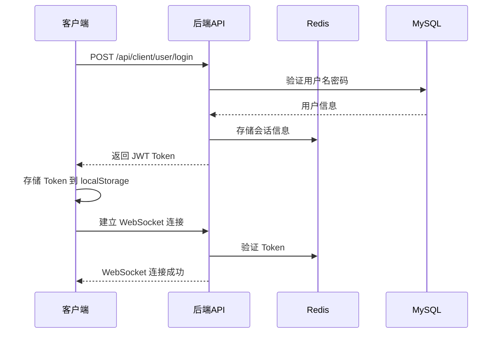
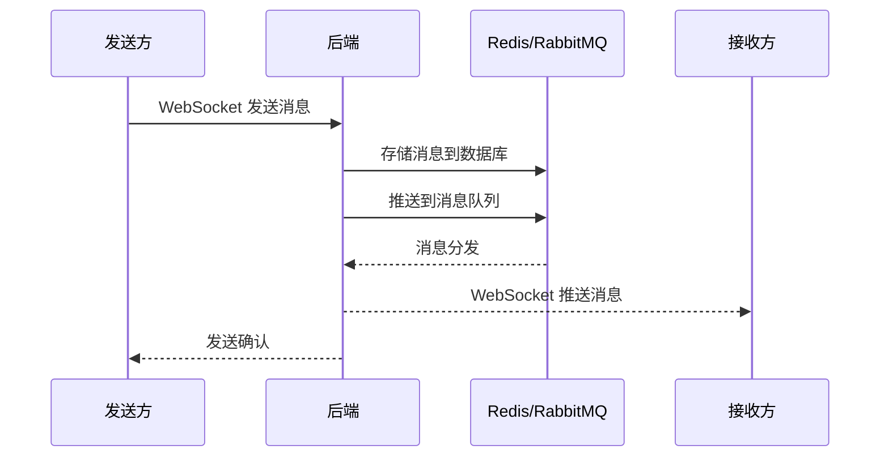

# 1. 项目快速概览

## 1.1 仓库结构与模块划分

### 1.1.1 顶层结构

```text
ArcHat/
├─ .env                          # 顶层环境变量配置
├─ docker-compose.yml            # 本地开发环境编排
├─ docker-compose.prod.yml       # 生产环境编排
├─ 启动.txt                      # 启动说明文档
├─ mysql-data/                   # MySQL 数据持久化目录
├─ Client-site/                  # Web 前端项目
└─ ARCHAT/                       # 后端项目
   ├─ archat-server/             # Spring Boot 服务
   ├─ sql/archat.sql             # 数据库初始化脚本
   └─ README.md                  # 后端项目说明
```

### 1.1.2 Web 前端结构：`Client-site/`

```text
Client-site/
├─ package.json                  # 依赖管理：Vue3 + Vite + Pinia + Element Plus
├─ vite.config.js               # 构建配置：代理、插件、优化
├─ .env.development             # 开发环境变量
├─ .env.production              # 生产环境变量
├─ public/
│  ├─ favicon.ico               # 应用图标
│  └─ heartbeat-worker.js       # Web Worker 心跳脚本
├─ src/
│  ├─ main.js                   # 应用入口：Vue 实例 + 路由 + 状态管理
│  ├─ App.vue                   # 根组件
│  ├─ router/
│  │  └─ index.js               # 路由配置：登录、聊天、用户中心等
│  ├─ api/                      # API 接口层
│  │  ├─ chat.js                # WebSocket 封装类
│  │  ├─ user.js                # 用户相关 API
│  │  └─ ...                    # 其他业务 API
│  ├─ stores/                   # Pinia 状态管理
│  │  ├─ user.js                # 用户信息 + WebSocket 连接管理
│  │  ├─ contact.js             # 联系人 & 群聊数据管理
│  │  ├─ aiChat.js              # AI 聊天状态
│  │  ├─ call.js                # 语音通话状态
│  │  ├─ videoCall.js           # 视频通话状态
│  │  ├─ theme.js               # 主题配置
│  │  └─ todo.js                # 待办事项
│  ├─ utils/                    # 工具函数
│  │  ├─ request.js             # Axios 封装：拦截器、错误处理
│  │  ├─ ArcMessage.js          # 全局消息提示封装
│  │  ├─ webrtc.js              # 语音通话 WebRTC 逻辑
│  │  ├─ videoWebrtc.js         # 视频通话 WebRTC 逻辑
│  │  ├─ notificationManager.js # 通知管理
│  │  ├─ eventBus.js            # 事件总线
│  │  └─ ...                    # 时间、文件、等级等工具
│  ├─ components/               # 组件库
│  │  ├─ chat/                  # 聊天相关组件
│  │  ├─ call/                  # 通话相关组件
│  │  ├─ editor/                # 富文本编辑器
│  │  ├─ feedback/              # 反馈组件（Loading、Dialog 等）
│  │  ├─ form/                  # 表单组件
│  │  ├─ interaction/           # 交互组件（Emoji、右键菜单等）
│  │  └─ layout/                # 布局组件
│  ├─ views/                    # 页面组件
│  │  ├─ user/                  # 用户相关页面
│  │  │  ├─ Login.vue           # 登录注册页
│  │  │  └─ UserHub.vue         # 用户中心
│  │  ├─ chat/                  # 聊天相关页面
│  │  │  ├─ Chat.vue            # 私聊页面
│  │  │  ├─ GroupChat.vue       # 群聊页面
│  │  │  └─ StartPage.vue       # 聊天起始页
│  │  ├─ AiChatView.vue         # AI 聊天页面
│  │  ├─ ArchivesView.vue       # 归档页面
│  │  ├─ home.vue               # 首页
│  │  └─ mail/                  # 邮件相关页面
│  └─ tests/                    # 测试文件（目前为空骨架）
└─ Dockerfile                   # 前端容器化配置
```

### 1.1.3 后端结构：`ARCHAT/archat-server/`

```text
ARCHAT/archat-server/
├─ pom.xml                      # Maven 依赖配置
├─ Dockerfile                   # 后端容器化配置
├─ src/
│  ├─ main/
│  │  ├─ java/com/senjay/archat/
│  │  │  ├─ ArchatApplication.java    # Spring Boot 启动类
│  │  │  ├─ config/                   # 配置类
│  │  │  ├─ filter/                   # 过滤器
│  │  │  ├─ aspect/                   # AOP 切面
│  │  │  ├─ module/
│  │  │  │  ├─ chat/                  # 聊天模块
│  │  │  │  │  ├─ controller/         # 聊天相关 API
│  │  │  │  │  ├─ service/            # 聊天业务逻辑
│  │  │  │  │  ├─ mapper/             # 数据访问层
│  │  │  │  │  └─ entity/             # 实体类
│  │  │  │  └─ user/                  # 用户模块
│  │  │  │     ├─ controller/         # 用户相关 API
│  │  │  │     ├─ service/            # 用户业务逻辑
│  │  │  │     ├─ mapper/             # 数据访问层
│  │  │  │     └─ entity/             # 实体类
│  │  │  ├─ netty/                    # Netty WebSocket 服务
│  │  │  │  ├─ NettyWebSocketServer.java
│  │  │  │  └─ NettyWebSocketServerHandler.java
│  │  │  ├─ webrtc/                   # WebRTC 信令处理
│  │  │  ├─ rag/                      # RAG 相关功能
│  │  │  └─ llm/                      # LLM 集成
│  │  └─ resources/
│  │     ├─ mapper/                   # MyBatis XML 映射文件
│  │     │  ├─ chat/
│  │     │  └─ user/
│  │     ├─ logback.xml               # 日志配置
│  │     ├─ systemMsg.txt             # 系统消息模板
│  │     └─ store/knowledge/          # 知识库存储
│  └─ test/                           # 测试代码
├─ target/                            # 编译输出目录
└─ data/logs/                         # 运行时日志
```

## 1.2 关键技术栈与依赖分析

### 1.2.1 Web 前端技术栈

#### 核心框架
```json
{
  "vue": "^3.5.13",
  "vue-router": "^4.5.0",
  "pinia": "^3.0.1",
  "pinia-plugin-persistedstate": "^4.4.1"
}
```

#### 构建工具
```json
{
  "vite": "^6.2.4",
  "@vitejs/plugin-vue": "^5.2.3",
  "terser": "^5.44.1"
}
```

#### UI 组件库
```json
{
  "element-plus": "^2.9.10",
  "@element-plus/icons-vue": "^2.3.1",
  "lucide-vue-next": "^0.533.0"
}
```

#### 网络通信
```json
{
  "axios": "^1.9.0"
}
```
- **自定义 WebSocket 类**：`src/api/chat.js` 中的 `ChatWebSocket`
- **特性**：心跳检测、自动重连、网络状态监听、页面可见性处理

#### 富文本编辑
```json
{
  "@tiptap/starter-kit": "^3.0.7",
  "@tiptap/vue-3": "^3.0.7",
  "highlight.js": "^11.11.1",
  "markdown-it": "^14.1.0"
}
```

#### 状态管理特点
- **Pinia**：现代化 Vue 状态管理
- **持久化**：使用 `pinia-plugin-persistedstate` 实现本地存储
- **模块化**：按功能拆分 store（用户、联系人、通话、AI 等）

### 1.2.2 后端技术栈

#### Spring Boot 基础
```xml
<dependency>
    <groupId>org.springframework.boot</groupId>
    <artifactId>spring-boot-starter-web</artifactId>
</dependency>
<dependency>
    <groupId>org.springframework.boot</groupId>
    <artifactId>spring-boot-starter-validation</artifactId>
</dependency>
<dependency>
    <groupId>org.springframework.boot</groupId>
    <artifactId>spring-boot-starter-data-redis</artifactId>
</dependency>
<dependency>
    <groupId>org.springframework.boot</groupId>
    <artifactId>spring-boot-starter-amqp</artifactId>
</dependency>
```

#### 数据访问层
```xml
<dependency>
    <groupId>com.baomidou</groupId>
    <artifactId>mybatis-plus-spring-boot3-starter</artifactId>
</dependency>
<dependency>
    <groupId>mysql</groupId>
    <artifactId>mysql-connector-java</artifactId>
</dependency>
```

#### 实时通信
```xml
<dependency>
    <groupId>io.netty</groupId>
    <artifactId>netty-all</artifactId>
</dependency>
```

#### 安全认证
```xml
<dependency>
    <groupId>io.jsonwebtoken</groupId>
    <artifactId>jjwt-api</artifactId>
</dependency>
<dependency>
    <groupId>io.jsonwebtoken</groupId>
    <artifactId>jjwt-impl</artifactId>
</dependency>
```

#### AI 集成
```xml
<dependency>
    <groupId>dev.langchain4j</groupId>
    <artifactId>langchain4j-spring-boot-starter</artifactId>
</dependency>
<dependency>
    <groupId>dev.langchain4j</groupId>
    <artifactId>langchain4j-open-ai-spring-boot-starter</artifactId>
</dependency>
<dependency>
    <groupId>dev.langchain4j</groupId>
    <artifactId>langchain4j-easy-rag</artifactId>
</dependency>
```

### 1.2.3 基础设施依赖

#### 数据库
- **MySQL 8.0.39**：主数据库
- **Redis**：缓存、会话存储、消息队列
- **RabbitMQ 3.8**：消息队列、异步处理

#### 容器化
- **Docker Compose**：本地开发环境编排
- **多阶段构建**：前后端分别容器化

## 1.3 最小可行运行步骤

### 1.3.1 Docker 一键启动（推荐）

#### 动手步骤

1. **环境检查**
```bash
# 检查 Docker 版本
docker --version
docker compose version

# 检查端口占用
netstat -an | findstr "80 8180 8090 3308 6379 5677 15672"
```

2. **启动服务**
```bash
# 进入项目根目录
cd d:/Desktop/ArcHat

# 启动完整环境
docker compose up -d

# 查看服务状态
docker compose ps
```

3. **等待服务就绪**
```bash
# 查看后端启动日志
docker compose logs -f backend

# 等待看到类似日志：
# "Started ArchatApplication in X.XXX seconds"
```

#### 示例命令

```bash
# 完整启动命令序列
cd d:/Desktop/ArcHat
docker compose up -d
docker compose logs -f backend | grep "Started ArchatApplication"

# 服务健康检查
curl http://localhost:8180/health
curl http://localhost/
```

#### 验收准则

- [ ] `docker compose ps` 显示 5 个服务全部为 `Up` 状态
- [ ] 浏览器访问 `http://localhost` 显示 ArcHat 登录页面
- [ ] 后端日志无 ERROR 级别错误
- [ ] 可以完成注册 → 登录 → 进入聊天界面的完整流程

#### 回滚方案

```bash
# 停止所有服务
docker compose down

# 清理数据（可选，会丢失数据）
docker compose down -v
rm -rf mysql-data/

# 重新启动
docker compose up -d
```

### 1.3.2 本地分离式启动

#### 动手步骤

**步骤 1：启动基础设施**
```bash
# 仅启动 MySQL、Redis、RabbitMQ
docker compose up -d mysql redis rabbitmq

# 等待 MySQL 初始化完成
docker compose logs mysql | grep "ready for connections"
```

**步骤 2：初始化数据库**
```bash
# 连接 MySQL 并导入初始数据
mysql -h127.0.0.1 -P3308 -uroot -proot < ARCHAT/sql/archat.sql

# 或使用 Docker 内执行
docker exec -i mysql mysql -uroot -proot archat < ARCHAT/sql/archat.sql
```

**步骤 3：启动后端**
```bash
cd ARCHAT/archat-server

# 使用 Maven 启动
mvn spring-boot:run

# 或先打包再运行
mvn clean package -DskipTests
java -jar target/archat-server.jar
```

**步骤 4：启动前端**
```bash
cd Client-site

# 安装依赖
npm install

# 配置环境变量
cp .env.development .env

# 启动开发服务器
npm run dev
```

#### 示例命令

```bash
# 后端启动检查
curl http://localhost:8080/health

# 前端访问
# 浏览器打开 Vite 输出的地址，通常是 http://localhost:5173
```

#### 验收准则

- [ ] 后端在 8080 端口正常响应
- [ ] WebSocket 在 8090 端口可连接
- [ ] 前端开发服务器正常启动
- [ ] 浏览器控制台无 WebSocket 连接错误
- [ ] 可以完成登录并建立 WebSocket 连接

#### 回滚方案

```bash
# 停止前端开发服务器
# Ctrl+C 终止 npm run dev

# 停止后端
# Ctrl+C 终止 Maven 进程或 Java 进程

# 停止基础设施
docker compose down mysql redis rabbitmq
```

## 1.4 核心业务流程分析

### 1.4.1 用户认证流程



### 1.4.2 消息发送流程



### 1.4.3 关键数据结构

#### WebSocket 消息格式
```json
{
  "type": 1000,  // 消息类型：1000=聊天消息, 1001=好友申请, 4=群消息, 5=上下线, 9=撤回, 12=WebRTC
  "data": {
    "fromUserId": "123",
    "toUserId": "456",
    "content": "消息内容",
    "messageType": 1,  // 1=文本, 2=图片, 3=文件
    "timestamp": 1700000000000
  }
}
```

#### 用户状态管理
```javascript
// src/stores/user.js 核心状态
{
  userInfo: {
    id: "123",
    username: "用户名",
    avatar: "头像URL",
    token: "JWT_TOKEN"
  },
  chatWS: WebSocketInstance,
  connectionStatus: "connected" // connected/disconnected/connecting
}
```

## 1.5 移动端迁移关键点

### 1.5.1 可直接复用的部分

- **后端 API 完全复用**：所有 HTTP 接口保持不变
- **WebSocket 协议复用**：消息格式、类型定义完全一致
- **业务逻辑复用**：认证流程、消息处理逻辑、状态流转
- **数据结构复用**：实体模型、API 响应格式

### 1.5.2 需要重新实现的部分

- **UI 组件**：从 Element Plus 迁移到 Flutter Material/Cupertino
- **路由系统**：从 Vue Router 迁移到 Flutter Navigator
- **状态管理**：从 Pinia 迁移到 Provider/Bloc/GetX
- **本地存储**：从 localStorage 迁移到 SharedPreferences/Hive
- **WebRTC**：从 Web API 迁移到 Flutter WebRTC 插件
- **通知系统**：从浏览器 Notification 迁移到 Flutter Local Notifications

### 1.5.3 技术选型建议

基于当前架构分析，推荐技术栈：

- **主框架**：Flutter（跨平台、性能优秀、生态成熟）
- **状态管理**：Provider + ChangeNotifier（简单易用，与 Pinia 概念相近）
- **网络库**：Dio（功能强大，类似 Axios）
- **WebSocket**：web_socket_channel（官方推荐）
- **本地存储**：shared_preferences + hive（轻量 + 复杂数据）
- **UI 组件**：Material Design 3（符合 Android 设计规范）

---

**下一章节**：[02-可行性评估.md](./02-可行性评估.md) - 详细分析迁移的可行性和风险点。
