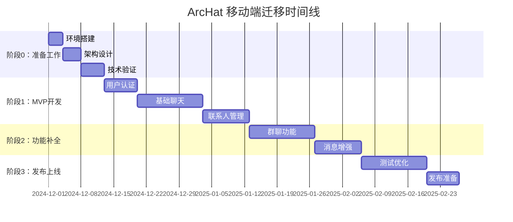

# 4. 迁移实施路线（阶段 0-3）

## 4.1 总体时间规划

### 4.1.1 项目里程碑



### 4.1.2 人力资源配置

| 角色 | 人数 | 主要职责 | 参与阶段 |
|------|------|----------|----------|
| **Flutter 开发工程师** | 2 | 移动端开发、UI 实现 | 全程 |
| **后端工程师** | 1 | API 优化、问题修复 | 阶段 1-3 |
| **测试工程师** | 1 | 功能测试、兼容性测试 | 阶段 2-3 |
| **产品经理** | 1 | 需求确认、体验优化 | 阶段 1-3 |
| **UI/UX 设计师** | 1 | 移动端设计规范 | 阶段 0-1 |

## 4.2 阶段 0：准备工作（2 周）

### 4.2.1 环境搭建与工具链

#### 动手步骤

**1. Flutter 开发环境**
```bash
# 下载 Flutter SDK
git clone https://github.com/flutter/flutter.git -b stable
export PATH="$PATH:`pwd`/flutter/bin"

# 验证环境
flutter doctor

# 创建项目
flutter create archat_mobile
cd archat_mobile
```

**2. IDE 配置**
```bash
# VS Code 插件安装
code --install-extension Dart-Code.dart-code
code --install-extension Dart-Code.flutter

# Android Studio 配置
# 安装 Flutter 和 Dart 插件
```

**3. 项目初始化**
```yaml
# pubspec.yaml 核心依赖
dependencies:
  flutter:
    sdk: flutter
  provider: ^6.1.1
  dio: ^5.3.2
  web_socket_channel: ^2.4.0
  shared_preferences: ^2.2.2
  hive: ^2.2.3
  hive_flutter: ^1.1.0

dev_dependencies:
  flutter_test:
    sdk: flutter
  flutter_lints: ^3.0.1
  build_runner: ^2.4.7
  hive_generator: ^2.0.1
```

#### 验收准则
- [ ] `flutter doctor` 无错误提示
- [ ] 能够成功运行 Hello World 应用
- [ ] 所有核心依赖安装成功
- [ ] 代码格式化和 lint 规则配置完成

#### 回滚方案
```bash
# 如果环境有问题，重新安装
flutter clean
flutter pub get
flutter doctor --verbose
```

### 4.2.2 架构设计与代码规范

#### 项目结构设计
```text
lib/
├─ main.dart
├─ app.dart
├─ core/
│  ├─ constants/
│  │  ├─ api_constants.dart
│  │  ├─ app_constants.dart
│  │  └─ message_types.dart
│  ├─ errors/
│  │  ├─ exceptions.dart
│  │  └─ failures.dart
│  ├─ network/
│  │  ├─ api_client.dart
│  │  └─ websocket_client.dart
│  └─ utils/
│     ├─ date_utils.dart
│     └─ validators.dart
├─ data/
│  ├─ models/
│  │  ├─ user_model.dart
│  │  ├─ message_model.dart
│  │  └─ contact_model.dart
│  ├─ repositories/
│  │  ├─ auth_repository_impl.dart
│  │  ├─ chat_repository_impl.dart
│  │  └─ user_repository_impl.dart
│  └─ datasources/
│     ├─ local/
│     └─ remote/
├─ domain/
│  ├─ entities/
│  ├─ repositories/
│  └─ usecases/
├─ presentation/
│  ├─ pages/
│  │  ├─ auth/
│  │  ├─ chat/
│  │  └─ profile/
│  ├─ widgets/
│  │  ├─ common/
│  │  ├─ chat/
│  │  └─ auth/
│  ├─ providers/
│  │  ├─ auth_provider.dart
│  │  ├─ chat_provider.dart
│  │  └─ user_provider.dart
│  └─ themes/
│     ├─ app_theme.dart
│     └─ colors.dart
└─ services/
   ├─ api_service.dart
   ├─ websocket_service.dart
   ├─ storage_service.dart
   └─ notification_service.dart
```

#### 代码规范制定
```dart
// 命名规范示例
class UserModel {
  final String userId;
  final String username;
  final String? avatarUrl;
  
  const UserModel({
    required this.userId,
    required this.username,
    this.avatarUrl,
  });
  
  factory UserModel.fromJson(Map<String, dynamic> json) {
    return UserModel(
      userId: json['id'] as String,
      username: json['username'] as String,
      avatarUrl: json['avatar'] as String?,
    );
  }
}
```

#### 验收准则
- [ ] 项目结构清晰，职责分离明确
- [ ] 代码规范文档完成
- [ ] 静态分析工具配置完成
- [ ] Git 提交规范制定

### 4.2.3 技术验证与风险评估

#### 关键技术验证

**1. API 连接验证**
```dart
class ApiConnectionTest {
  static Future<void> testApiConnection() async {
    try {
      final dio = Dio();
      final response = await dio.get('http://your-server:8180/api/client/health');
      print('API 连接成功: ${response.statusCode}');
    } catch (e) {
      print('API 连接失败: $e');
    }
  }
}
```

**2. WebSocket 连接验证**
```dart
class WebSocketConnectionTest {
  static Future<void> testWebSocketConnection() async {
    try {
      final channel = WebSocketChannel.connect(
        Uri.parse('ws://your-server:8090?token=test')
      );
      
      channel.stream.listen((message) {
        print('收到消息: $message');
      });
      
      channel.sink.add(jsonEncode({'type': 2})); // 心跳包
      
      await Future.delayed(Duration(seconds: 5));
      channel.sink.close();
      print('WebSocket 连接测试完成');
    } catch (e) {
      print('WebSocket 连接失败: $e');
    }
  }
}
```

**3. 本地存储验证**
```dart
class StorageTest {
  static Future<void> testStorage() async {
    await Hive.initFlutter();
    
    // 测试简单存储
    final prefs = await SharedPreferences.getInstance();
    await prefs.setString('test_key', 'test_value');
    final value = prefs.getString('test_key');
    print('SharedPreferences 测试: $value');
    
    // 测试复杂存储
    final box = await Hive.openBox('test_box');
    await box.put('test_object', {'name': 'test', 'value': 123});
    final object = box.get('test_object');
    print('Hive 测试: $object');
  }
}
```

#### 验收准则
- [ ] API 连接正常
- [ ] WebSocket 连接稳定
- [ ] 本地存储功能正常
- [ ] 性能基准测试完成

## 4.3 阶段 1：MVP 开发（5 周）

### 4.3.1 用户认证模块（1 周）

#### 功能范围
- 登录页面 UI
- 注册页面 UI
- Token 管理
- 自动登录
- 登录状态持久化

#### 详细任务

**Day 1-2: UI 开发**
```dart
// lib/presentation/pages/auth/login_page.dart
class LoginPage extends StatefulWidget {
  @override
  _LoginPageState createState() => _LoginPageState();
}

class _LoginPageState extends State<LoginPage> {
  final _formKey = GlobalKey<FormState>();
  final _usernameController = TextEditingController();
  final _passwordController = TextEditingController();
  
  @override
  Widget build(BuildContext context) {
    return Scaffold(
      body: Form(
        key: _formKey,
        child: Column(
          children: [
            TextFormField(
              controller: _usernameController,
              decoration: InputDecoration(labelText: '用户名'),
              validator: (value) {
                if (value?.isEmpty ?? true) {
                  return '请输入用户名';
                }
                return null;
              },
            ),
            TextFormField(
              controller: _passwordController,
              decoration: InputDecoration(labelText: '密码'),
              obscureText: true,
              validator: (value) {
                if (value?.isEmpty ?? true) {
                  return '请输入密码';
                }
                return null;
              },
            ),
            ElevatedButton(
              onPressed: _handleLogin,
              child: Text('登录'),
            ),
          ],
        ),
      ),
    );
  }
  
  void _handleLogin() {
    if (_formKey.currentState?.validate() ?? false) {
      context.read<AuthProvider>().login(
        _usernameController.text,
        _passwordController.text,
      );
    }
  }
}
```

**Day 3-4: 业务逻辑**
```dart
// lib/presentation/providers/auth_provider.dart
class AuthProvider with ChangeNotifier {
  final AuthRepository _authRepository;
  
  User? _currentUser;
  bool _isLoading = false;
  String? _errorMessage;
  
  User? get currentUser => _currentUser;
  bool get isLoading => _isLoading;
  String? get errorMessage => _errorMessage;
  bool get isAuthenticated => _currentUser != null;
  
  AuthProvider(this._authRepository);
  
  Future<void> login(String username, String password) async {
    _setLoading(true);
    _clearError();
    
    try {
      final user = await _authRepository.login(username, password);
      _currentUser = user;
      await _saveUserSession(user);
      notifyListeners();
    } catch (e) {
      _setError(e.toString());
    } finally {
      _setLoading(false);
    }
  }
  
  Future<void> logout() async {
    _currentUser = null;
    await _clearUserSession();
    notifyListeners();
  }
  
  void _setLoading(bool loading) {
    _isLoading = loading;
    notifyListeners();
  }
  
  void _setError(String error) {
    _errorMessage = error;
    notifyListeners();
  }
  
  void _clearError() {
    _errorMessage = null;
  }
}
```

**Day 5-7: 集成测试**
```dart
// test/auth_test.dart
void main() {
  group('Auth Tests', () {
    testWidgets('登录页面显示正确', (WidgetTester tester) async {
      await tester.pumpWidget(MyApp());
      
      expect(find.text('用户名'), findsOneWidget);
      expect(find.text('密码'), findsOneWidget);
      expect(find.text('登录'), findsOneWidget);
    });
    
    testWidgets('登录功能正常', (WidgetTester tester) async {
      await tester.pumpWidget(MyApp());
      
      await tester.enterText(find.byType(TextFormField).first, 'testuser');
      await tester.enterText(find.byType(TextFormField).last, 'password');
      await tester.tap(find.text('登录'));
      
      await tester.pumpAndSettle();
      
      // 验证登录成功后的状态
    });
  });
}
```

#### 验收准则
- [ ] 登录页面 UI 完整美观
- [ ] 登录功能正常工作
- [ ] 注册功能正常工作
- [ ] Token 自动管理
- [ ] 登录状态持久化
- [ ] 单元测试覆盖率 > 80%

### 4.3.2 基础聊天模块（2 周）

#### 功能范围
- 聊天页面 UI
- 消息列表显示
- 消息发送功能
- WebSocket 连接管理
- 消息本地缓存

#### 详细任务

**Week 1: WebSocket 集成**
```dart
// lib/services/websocket_service.dart
class WebSocketService {
  WebSocketChannel? _channel;
  StreamController<Map<String, dynamic>>? _messageController;
  Timer? _heartbeatTimer;
  
  Stream<Map<String, dynamic>> get messageStream => 
      _messageController?.stream ?? Stream.empty();
  
  Future<void> connect(String token) async {
    try {
      _channel = WebSocketChannel.connect(
        Uri.parse('ws://your-server:8090?token=$token')
      );
      
      _messageController = StreamController<Map<String, dynamic>>.broadcast();
      
      _channel!.stream.listen(
        (message) {
          final data = jsonDecode(message);
          _messageController?.add(data);
        },
        onError: (error) {
          print('WebSocket 错误: $error');
          _reconnect(token);
        },
        onDone: () {
          print('WebSocket 连接关闭');
          _reconnect(token);
        },
      );
      
      _startHeartbeat();
    } catch (e) {
      print('WebSocket 连接失败: $e');
    }
  }
  
  void sendMessage(Map<String, dynamic> message) {
    if (_channel != null) {
      _channel!.sink.add(jsonEncode(message));
    }
  }
  
  void _startHeartbeat() {
    _heartbeatTimer = Timer.periodic(Duration(seconds: 20), (timer) {
      sendMessage({'type': 2}); // 心跳包
    });
  }
  
  Future<void> _reconnect(String token) async {
    await Future.delayed(Duration(seconds: 3));
    connect(token);
  }
  
  void dispose() {
    _heartbeatTimer?.cancel();
    _channel?.sink.close();
    _messageController?.close();
  }
}
```

**Week 2: 聊天 UI 实现**
```dart
// lib/presentation/pages/chat/chat_page.dart
class ChatPage extends StatefulWidget {
  final String contactId;
  
  const ChatPage({Key? key, required this.contactId}) : super(key: key);
  
  @override
  _ChatPageState createState() => _ChatPageState();
}

class _ChatPageState extends State<ChatPage> {
  final _messageController = TextEditingController();
  final _scrollController = ScrollController();
  
  @override
  Widget build(BuildContext context) {
    return Scaffold(
      appBar: AppBar(
        title: Consumer<ChatProvider>(
          builder: (context, chatProvider, child) {
            final contact = chatProvider.getContact(widget.contactId);
            return Text(contact?.username ?? '聊天');
          },
        ),
      ),
      body: Column(
        children: [
          Expanded(
            child: Consumer<ChatProvider>(
              builder: (context, chatProvider, child) {
                final messages = chatProvider.getMessages(widget.contactId);
                return ListView.builder(
                  controller: _scrollController,
                  itemCount: messages.length,
                  itemBuilder: (context, index) {
                    return MessageBubble(message: messages[index]);
                  },
                );
              },
            ),
          ),
          MessageInput(
            controller: _messageController,
            onSend: _sendMessage,
          ),
        ],
      ),
    );
  }
  
  void _sendMessage(String content) {
    if (content.trim().isNotEmpty) {
      context.read<ChatProvider>().sendMessage(
        widget.contactId,
        content.trim(),
      );
      _messageController.clear();
      _scrollToBottom();
    }
  }
  
  void _scrollToBottom() {
    WidgetsBinding.instance.addPostFrameCallback((_) {
      if (_scrollController.hasClients) {
        _scrollController.animateTo(
          _scrollController.position.maxScrollExtent,
          duration: Duration(milliseconds: 300),
          curve: Curves.easeOut,
        );
      }
    });
  }
}
```

#### 验收准则
- [ ] WebSocket 连接稳定
- [ ] 消息收发正常
- [ ] 消息列表流畅滚动
- [ ] 消息本地缓存工作
- [ ] 网络断开重连正常

### 4.3.3 联系人管理（1 周）

#### 功能范围
- 联系人列表页面
- 添加好友功能
- 好友搜索功能
- 联系人状态同步

#### 验收准则
- [ ] 联系人列表显示正常
- [ ] 添加好友功能完整
- [ ] 搜索功能正常
- [ ] 在线状态实时更新

## 4.4 阶段 2：功能补全（4 周）

### 4.4.1 群聊功能（2 周）
- 群聊列表
- 群消息收发
- 群成员管理
- 群聊创建

### 4.4.2 消息增强（2 周）
- 图片消息
- 文件传输
- 消息撤回
- 消息状态

## 4.5 阶段 3：发布上线（3 周）

### 4.5.1 测试优化（2 周）
- 功能测试
- 性能测试
- 兼容性测试
- 用户体验优化

### 4.5.2 发布准备（1 周）
- 应用签名
- 应用商店资料准备
- 发布流程执行

---

**下一章节**：[05-代码迁移实战.md](./05-代码迁移实战.md) - 具体的代码迁移示例和最佳实践。
