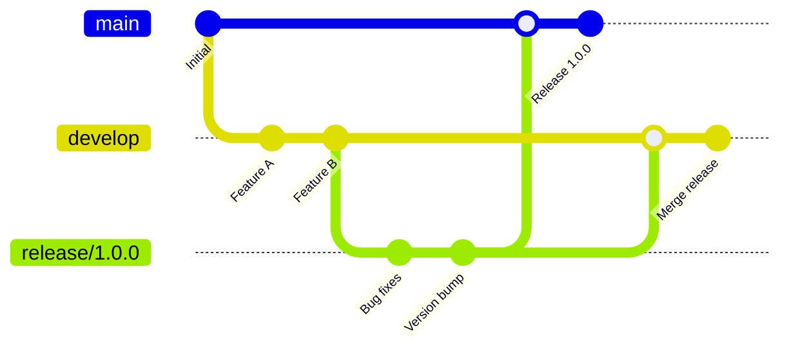

# 8. CI/CD 与发布

## 8.1 构建流水线配置

### 8.1.1 GitHub Actions 配置

#### 完整 CI/CD 流水线
```yaml
# .github/workflows/flutter-ci-cd.yml
name: Flutter CI/CD

on:
  push:
    branches: [ main, develop ]
  pull_request:
    branches: [ main ]
  release:
    types: [ published ]

env:
  FLUTTER_VERSION: '3.16.0'
  JAVA_VERSION: '17'

jobs:
  test:
    name: 代码质量检查与测试
    runs-on: ubuntu-latest
    
    steps:
    - name: 检出代码
      uses: actions/checkout@v4
      
    - name: 设置 Java 环境
      uses: actions/setup-java@v3
      with:
        distribution: 'zulu'
        java-version: ${{ env.JAVA_VERSION }}
        
    - name: 设置 Flutter 环境
      uses: subosito/flutter-action@v2
      with:
        flutter-version: ${{ env.FLUTTER_VERSION }}
        channel: 'stable'
        cache: true
        
    - name: 获取依赖
      run: flutter pub get
      
    - name: 代码格式检查
      run: flutter format --set-exit-if-changed .
      
    - name: 静态代码分析
      run: flutter analyze
      
    - name: 运行单元测试
      run: flutter test --coverage
      
    - name: 上传测试覆盖率
      uses: codecov/codecov-action@v3
      with:
        file: coverage/lcov.info
        
  build-android:
    name: 构建 Android 应用
    runs-on: ubuntu-latest
    needs: test
    if: github.event_name == 'push' || github.event_name == 'release'
    
    steps:
    - name: 检出代码
      uses: actions/checkout@v4
      
    - name: 设置 Java 环境
      uses: actions/setup-java@v3
      with:
        distribution: 'zulu'
        java-version: ${{ env.JAVA_VERSION }}
        
    - name: 设置 Flutter 环境
      uses: subosito/flutter-action@v2
      with:
        flutter-version: ${{ env.FLUTTER_VERSION }}
        channel: 'stable'
        cache: true
        
    - name: 获取依赖
      run: flutter pub get
      
    - name: 配置签名密钥
      run: |
        echo "${{ secrets.ANDROID_KEYSTORE_BASE64 }}" | base64 -d > android/app/keystore.jks
        echo "storePassword=${{ secrets.KEYSTORE_PASSWORD }}" >> android/key.properties
        echo "keyPassword=${{ secrets.KEY_PASSWORD }}" >> android/key.properties
        echo "keyAlias=${{ secrets.KEY_ALIAS }}" >> android/key.properties
        echo "storeFile=keystore.jks" >> android/key.properties
        
    - name: 构建 APK (Debug)
      if: github.ref != 'refs/heads/main'
      run: flutter build apk --debug
      
    - name: 构建 APK (Release)
      if: github.ref == 'refs/heads/main'
      run: flutter build apk --release
      
    - name: 构建 App Bundle (Release)
      if: github.event_name == 'release'
      run: flutter build appbundle --release
      
    - name: 上传构建产物
      uses: actions/upload-artifact@v3
      with:
        name: android-builds
        path: |
          build/app/outputs/flutter-apk/*.apk
          build/app/outputs/bundle/release/*.aab
          
  deploy-internal:
    name: 部署到内测渠道
    runs-on: ubuntu-latest
    needs: build-android
    if: github.ref == 'refs/heads/main'
    
    steps:
    - name: 下载构建产物
      uses: actions/download-artifact@v3
      with:
        name: android-builds
        
    - name: 部署到 Firebase App Distribution
      uses: wzieba/Firebase-Distribution-Github-Action@v1
      with:
        appId: ${{ secrets.FIREBASE_APP_ID }}
        serviceCredentialsFileContent: ${{ secrets.FIREBASE_SERVICE_ACCOUNT }}
        groups: internal-testers
        file: build/app/outputs/flutter-apk/app-release.apk
        releaseNotes: |
          自动构建版本
          提交: ${{ github.sha }}
          分支: ${{ github.ref }}
          
  deploy-production:
    name: 部署到生产环境
    runs-on: ubuntu-latest
    needs: build-android
    if: github.event_name == 'release'
    
    steps:
    - name: 下载构建产物
      uses: actions/download-artifact@v3
      with:
        name: android-builds
        
    - name: 发布到 Google Play
      uses: r0adkll/upload-google-play@v1
      with:
        serviceAccountJsonPlainText: ${{ secrets.GOOGLE_PLAY_SERVICE_ACCOUNT }}
        packageName: com.archat.mobile
        releaseFiles: build/app/outputs/bundle/release/app-release.aab
        track: production
        status: completed
```

### 8.1.2 GitLab CI 配置

```yaml
# .gitlab-ci.yml
stages:
  - test
  - build
  - deploy

variables:
  FLUTTER_VERSION: "3.16.0"
  ANDROID_COMPILE_SDK: "34"
  ANDROID_BUILD_TOOLS: "34.0.0"

before_script:
  - apt-get update -qq && apt-get install -y -qq git curl unzip
  - git clone https://github.com/flutter/flutter.git -b stable --depth 1
  - export PATH="$PATH:`pwd`/flutter/bin"
  - flutter doctor -v

test:
  stage: test
  script:
    - flutter pub get
    - flutter analyze
    - flutter test --coverage
  coverage: '/lines......: \d+\.\d+\%/'
  artifacts:
    reports:
      coverage_report:
        coverage_format: cobertura
        path: coverage/cobertura.xml

build_android:
  stage: build
  script:
    - flutter pub get
    - flutter build apk --release
    - flutter build appbundle --release
  artifacts:
    paths:
      - build/app/outputs/flutter-apk/app-release.apk
      - build/app/outputs/bundle/release/app-release.aab
    expire_in: 1 week
  only:
    - main
    - tags

deploy_internal:
  stage: deploy
  script:
    - echo "部署到内测环境"
    # 这里添加部署到内测环境的脚本
  only:
    - main

deploy_production:
  stage: deploy
  script:
    - echo "部署到生产环境"
    # 这里添加部署到应用商店的脚本
  only:
    - tags
  when: manual
```

## 8.2 自动化测试集成

### 8.2.1 单元测试配置

```dart
// test/widget_test.dart
import 'package:flutter/material.dart';
import 'package:flutter_test/flutter_test.dart';
import 'package:provider/provider.dart';
import 'package:mockito/mockito.dart';
import 'package:mockito/annotations.dart';

import 'package:archat_mobile/main.dart';
import 'package:archat_mobile/presentation/providers/auth_provider.dart';
import 'package:archat_mobile/data/repositories/auth_repository.dart';

import 'widget_test.mocks.dart';

@GenerateMocks([AuthRepository])
void main() {
  group('登录页面测试', () {
    late MockAuthRepository mockAuthRepository;
    late AuthProvider authProvider;

    setUp(() {
      mockAuthRepository = MockAuthRepository();
      authProvider = AuthProvider(mockAuthRepository);
    });

    testWidgets('登录页面显示正确的UI元素', (WidgetTester tester) async {
      await tester.pumpWidget(
        ChangeNotifierProvider<AuthProvider>(
          create: (_) => authProvider,
          child: MaterialApp(
            home: LoginPage(),
          ),
        ),
      );

      // 验证UI元素存在
      expect(find.text('用户名'), findsOneWidget);
      expect(find.text('密码'), findsOneWidget);
      expect(find.text('登录'), findsOneWidget);
      expect(find.byType(TextFormField), findsNWidgets(2));
    });

    testWidgets('成功登录后导航到主页', (WidgetTester tester) async {
      // 模拟成功登录
      when(mockAuthRepository.login(any, any))
          .thenAnswer((_) async => User(id: '1', username: 'test'));

      await tester.pumpWidget(
        ChangeNotifierProvider<AuthProvider>(
          create: (_) => authProvider,
          child: MaterialApp(
            home: LoginPage(),
            routes: {
              '/home': (context) => HomePage(),
            },
          ),
        ),
      );

      // 输入用户名和密码
      await tester.enterText(find.byType(TextFormField).first, 'testuser');
      await tester.enterText(find.byType(TextFormField).last, 'password');

      // 点击登录按钮
      await tester.tap(find.text('登录'));
      await tester.pumpAndSettle();

      // 验证导航到主页
      expect(find.byType(HomePage), findsOneWidget);
    });

    testWidgets('登录失败显示错误信息', (WidgetTester tester) async {
      // 模拟登录失败
      when(mockAuthRepository.login(any, any))
          .thenThrow(Exception('用户名或密码错误'));

      await tester.pumpWidget(
        ChangeNotifierProvider<AuthProvider>(
          create: (_) => authProvider,
          child: MaterialApp(
            home: LoginPage(),
          ),
        ),
      );

      // 输入错误的用户名和密码
      await tester.enterText(find.byType(TextFormField).first, 'wronguser');
      await tester.enterText(find.byType(TextFormField).last, 'wrongpass');

      // 点击登录按钮
      await tester.tap(find.text('登录'));
      await tester.pump();

      // 验证错误信息显示
      expect(find.text('用户名或密码错误'), findsOneWidget);
    });
  });
}
```

### 8.2.2 集成测试配置

```dart
// integration_test/app_test.dart
import 'package:flutter/material.dart';
import 'package:flutter_test/flutter_test.dart';
import 'package:integration_test/integration_test.dart';

import 'package:archat_mobile/main.dart' as app;

void main() {
  IntegrationTestWidgetsFlutterBinding.ensureInitialized();

  group('端到端测试', () {
    testWidgets('完整的登录到聊天流程', (WidgetTester tester) async {
      app.main();
      await tester.pumpAndSettle();

      // 1. 验证启动页面
      expect(find.text('ArcHat'), findsOneWidget);

      // 2. 导航到登录页面
      await tester.tap(find.text('登录'));
      await tester.pumpAndSettle();

      // 3. 输入登录信息
      await tester.enterText(
        find.byKey(const Key('username_field')), 
        'testuser'
      );
      await tester.enterText(
        find.byKey(const Key('password_field')), 
        'testpass'
      );

      // 4. 执行登录
      await tester.tap(find.byKey(const Key('login_button')));
      await tester.pumpAndSettle(const Duration(seconds: 3));

      // 5. 验证登录成功，进入主页
      expect(find.text('聊天'), findsOneWidget);
      expect(find.text('联系人'), findsOneWidget);

      // 6. 进入聊天页面
      await tester.tap(find.text('聊天'));
      await tester.pumpAndSettle();

      // 7. 选择一个联系人
      await tester.tap(find.text('测试联系人').first);
      await tester.pumpAndSettle();

      // 8. 发送消息
      await tester.enterText(
        find.byKey(const Key('message_input')), 
        '这是一条测试消息'
      );
      await tester.tap(find.byKey(const Key('send_button')));
      await tester.pumpAndSettle();

      // 9. 验证消息发送成功
      expect(find.text('这是一条测试消息'), findsOneWidget);
    });

    testWidgets('网络断开重连测试', (WidgetTester tester) async {
      app.main();
      await tester.pumpAndSettle();

      // 模拟网络断开
      await tester.binding.defaultBinaryMessenger.setMockMethodCallHandler(
        const MethodChannel('connectivity_plus'),
        (MethodCall methodCall) async {
          if (methodCall.method == 'check') {
            return 'none';
          }
          return null;
        },
      );

      // 验证断网提示
      await tester.pump(const Duration(seconds: 1));
      expect(find.text('网络连接已断开'), findsOneWidget);

      // 模拟网络恢复
      await tester.binding.defaultBinaryMessenger.setMockMethodCallHandler(
        const MethodChannel('connectivity_plus'),
        (MethodCall methodCall) async {
          if (methodCall.method == 'check') {
            return 'wifi';
          }
          return null;
        },
      );

      // 验证重连成功
      await tester.pump(const Duration(seconds: 2));
      expect(find.text('网络连接已恢复'), findsOneWidget);
    });
  });
}
```

## 8.3 应用签名与打包

### 8.3.1 Android 签名配置

#### 生成签名密钥
```bash
# 生成发布密钥
keytool -genkey -v -keystore ~/archat-release-key.keystore \
  -alias archat -keyalg RSA -keysize 2048 -validity 10000

# 查看密钥信息
keytool -list -v -keystore ~/archat-release-key.keystore -alias archat
```

#### 配置签名文件
```properties
# android/key.properties
storePassword=your_store_password
keyPassword=your_key_password
keyAlias=archat
storeFile=/path/to/archat-release-key.keystore
```

#### 修改 build.gradle
```gradle
// android/app/build.gradle
def keystoreProperties = new Properties()
def keystorePropertiesFile = rootProject.file('key.properties')
if (keystorePropertiesFile.exists()) {
    keystoreProperties.load(new FileInputStream(keystorePropertiesFile))
}

android {
    compileSdkVersion 34
    ndkVersion flutter.ndkVersion

    compileOptions {
        sourceCompatibility JavaVersion.VERSION_1_8
        targetCompatibility JavaVersion.VERSION_1_8
    }

    defaultConfig {
        applicationId "com.archat.mobile"
        minSdkVersion 21
        targetSdkVersion 34
        versionCode flutterVersionCode.toInteger()
        versionName flutterVersionName
        
        // 多语言支持
        resConfigs "zh", "en"
        
        // 启用混淆
        proguardFiles getDefaultProguardFile('proguard-android-optimize.txt'), 'proguard-rules.pro'
    }

    signingConfigs {
        release {
            keyAlias keystoreProperties['keyAlias']
            keyPassword keystoreProperties['keyPassword']
            storeFile keystoreProperties['storeFile'] ? file(keystoreProperties['storeFile']) : null
            storePassword keystoreProperties['storePassword']
        }
    }

    buildTypes {
        release {
            signingConfig signingConfigs.release
            minifyEnabled true
            shrinkResources true
            proguardFiles getDefaultProguardFile('proguard-android-optimize.txt'), 'proguard-rules.pro'
        }
        debug {
            signingConfig signingConfigs.debug
            debuggable true
        }
    }

    flavorDimensions "environment"
    productFlavors {
        dev {
            dimension "environment"
            applicationIdSuffix ".dev"
            versionNameSuffix "-dev"
            resValue "string", "app_name", "ArcHat Dev"
        }
        staging {
            dimension "environment"
            applicationIdSuffix ".staging"
            versionNameSuffix "-staging"
            resValue "string", "app_name", "ArcHat Staging"
        }
        prod {
            dimension "environment"
            resValue "string", "app_name", "ArcHat"
        }
    }
}
```

### 8.3.2 代码混淆配置

```proguard
# android/app/proguard-rules.pro

# Flutter 相关
-keep class io.flutter.app.** { *; }
-keep class io.flutter.plugin.** { *; }
-keep class io.flutter.util.** { *; }
-keep class io.flutter.view.** { *; }
-keep class io.flutter.** { *; }
-keep class io.flutter.plugins.** { *; }

# Gson 相关
-keepattributes Signature
-keepattributes *Annotation*
-dontwarn sun.misc.**
-keep class com.google.gson.** { *; }
-keep class * implements com.google.gson.TypeAdapterFactory
-keep class * implements com.google.gson.JsonSerializer
-keep class * implements com.google.gson.JsonDeserializer

# 网络请求相关
-dontwarn okhttp3.**
-dontwarn okio.**
-dontwarn javax.annotation.**
-keepnames class okhttp3.internal.publicsuffix.PublicSuffixDatabase

# 项目特定的类
-keep class com.archat.mobile.** { *; }

# WebRTC 相关
-keep class org.webrtc.** { *; }
-dontwarn org.webrtc.**
```

## 8.4 国内应用市场发布

### 8.4.1 主要应用商店对比

| 应用商店 | 市场份额 | 审核周期 | 特殊要求 |
|----------|----------|----------|----------|
| 华为应用市场 | 25% | 1-3 天 | 需要华为开发者认证 |
| 小米应用商店 | 15% | 1-2 天 | 需要小米开发者账号 |
| OPPO 软件商店 | 12% | 2-5 天 | 需要 OPPO 开发者认证 |
| vivo 应用商店 | 10% | 1-3 天 | 需要 vivo 开发者账号 |
| 腾讯应用宝 | 8% | 3-7 天 | 需要腾讯开发者认证 |
| 360 手机助手 | 5% | 1-2 天 | 相对宽松 |

### 8.4.2 应用商店适配脚本

```bash
#!/bin/bash
# scripts/deploy_to_stores.sh

set -e

# 配置变量
APP_NAME="ArcHat"
VERSION_NAME=$(grep 'version:' pubspec.yaml | cut -d ' ' -f 2 | cut -d '+' -f 1)
VERSION_CODE=$(grep 'version:' pubspec.yaml | cut -d '+' -f 2)

echo "准备发布 $APP_NAME v$VERSION_NAME ($VERSION_CODE)"

# 构建不同渠道的 APK
echo "构建华为应用市场版本..."
flutter build apk --release --flavor prod --dart-define=STORE=huawei

echo "构建小米应用商店版本..."
flutter build apk --release --flavor prod --dart-define=STORE=xiaomi

echo "构建 OPPO 软件商店版本..."
flutter build apk --release --flavor prod --dart-define=STORE=oppo

echo "构建 vivo 应用商店版本..."
flutter build apk --release --flavor prod --dart-define=STORE=vivo

# 重命名 APK 文件
mv build/app/outputs/flutter-apk/app-prod-release.apk \
   "build/app/outputs/flutter-apk/${APP_NAME}-v${VERSION_NAME}-huawei.apk"

echo "所有版本构建完成！"
echo "APK 文件位置: build/app/outputs/flutter-apk/"
ls -la build/app/outputs/flutter-apk/
```

### 8.4.3 应用商店元数据模板

```yaml
# store_metadata.yaml
app_info:
  name: "ArcHat"
  short_description: "现代化即时通讯应用"
  description: |
    ArcHat 是一款功能强大的即时通讯应用，支持：
    • 实时聊天：文字、图片、文件、语音消息
    • 群聊功能：创建群组，多人协作
    • 音视频通话：高清语音和视频通话
    • AI 助手：智能聊天机器人
    • 多端同步：手机、平板、电脑无缝切换
    
  keywords: 
    - 聊天
    - 即时通讯
    - 社交
    - 通话
    - 协作
    
  category: "社交通讯"
  age_rating: "4+"
  
screenshots:
  - path: "screenshots/login.png"
    description: "登录界面"
  - path: "screenshots/chat_list.png"
    description: "聊天列表"
  - path: "screenshots/chat_detail.png"
    description: "聊天详情"
  - path: "screenshots/group_chat.png"
    description: "群聊功能"
  - path: "screenshots/voice_call.png"
    description: "语音通话"

privacy_policy: "https://archat.com/privacy"
terms_of_service: "https://archat.com/terms"
support_url: "https://archat.com/support"
```

### 8.4.4 自动化上传脚本

```python
#!/usr/bin/env python3
# scripts/upload_to_stores.py

import os
import sys
import requests
import json
from pathlib import Path

class StoreUploader:
    def __init__(self, config_file):
        with open(config_file, 'r') as f:
            self.config = json.load(f)
    
    def upload_to_huawei(self, apk_path):
        """上传到华为应用市场"""
        print("正在上传到华为应用市场...")
        
        # 华为应用市场 API 调用
        headers = {
            'Authorization': f'Bearer {self.config["huawei"]["access_token"]}',
            'Content-Type': 'application/json'
        }
        
        # 实际的上传逻辑
        # ...
        
        print("华为应用市场上传完成")
    
    def upload_to_xiaomi(self, apk_path):
        """上传到小米应用商店"""
        print("正在上传到小米应用商店...")
        
        # 小米应用商店 API 调用
        # ...
        
        print("小米应用商店上传完成")
    
    def upload_all(self, apk_path):
        """上传到所有应用商店"""
        stores = ['huawei', 'xiaomi', 'oppo', 'vivo']
        
        for store in stores:
            try:
                method = getattr(self, f'upload_to_{store}')
                method(apk_path)
            except Exception as e:
                print(f"上传到 {store} 失败: {e}")

if __name__ == "__main__":
    if len(sys.argv) != 2:
        print("用法: python upload_to_stores.py <apk_path>")
        sys.exit(1)
    
    apk_path = sys.argv[1]
    uploader = StoreUploader('config/store_config.json')
    uploader.upload_all(apk_path)
```

## 8.5 版本管理与发布策略

### 8.5.1 语义化版本控制

```yaml
# pubspec.yaml
name: archat_mobile
description: ArcHat 移动端应用
publish_to: 'none'

# 版本格式: MAJOR.MINOR.PATCH+BUILD_NUMBER
# 1.0.0+1 -> 1.0.0 版本，构建号 1
version: 1.0.0+1

environment:
  sdk: '>=3.0.0 <4.0.0'
  flutter: ">=3.16.0"
```

#### 版本号自动管理脚本
```bash
#!/bin/bash
# scripts/bump_version.sh

BUMP_TYPE=${1:-patch}  # major, minor, patch

# 读取当前版本
CURRENT_VERSION=$(grep 'version:' pubspec.yaml | cut -d ' ' -f 2)
VERSION_NAME=$(echo $CURRENT_VERSION | cut -d '+' -f 1)
BUILD_NUMBER=$(echo $CURRENT_VERSION | cut -d '+' -f 2)

# 解析版本号
IFS='.' read -ra VERSION_PARTS <<< "$VERSION_NAME"
MAJOR=${VERSION_PARTS[0]}
MINOR=${VERSION_PARTS[1]}
PATCH=${VERSION_PARTS[2]}

# 根据类型增加版本号
case $BUMP_TYPE in
  major)
    MAJOR=$((MAJOR + 1))
    MINOR=0
    PATCH=0
    ;;
  minor)
    MINOR=$((MINOR + 1))
    PATCH=0
    ;;
  patch)
    PATCH=$((PATCH + 1))
    ;;
esac

# 增加构建号
BUILD_NUMBER=$((BUILD_NUMBER + 1))

# 新版本号
NEW_VERSION="${MAJOR}.${MINOR}.${PATCH}+${BUILD_NUMBER}"

# 更新 pubspec.yaml
sed -i "s/version: $CURRENT_VERSION/version: $NEW_VERSION/" pubspec.yaml

echo "版本号已更新: $CURRENT_VERSION -> $NEW_VERSION"

# 创建 Git 标签
git add pubspec.yaml
git commit -m "chore: bump version to $NEW_VERSION"
git tag -a "v$NEW_VERSION" -m "Release version $NEW_VERSION"

echo "Git 标签已创建: v$NEW_VERSION"
```

### 8.5.2 发布分支策略



#### 发布流程自动化
```bash
#!/bin/bash
# scripts/release_flow.sh

set -e

RELEASE_VERSION=$1
if [ -z "$RELEASE_VERSION" ]; then
  echo "用法: ./release_flow.sh <version>"
  exit 1
fi

echo "开始发布流程: v$RELEASE_VERSION"

# 1. 创建发布分支
git checkout develop
git pull origin develop
git checkout -b "release/$RELEASE_VERSION"

# 2. 更新版本号
./scripts/bump_version.sh

# 3. 运行测试
echo "运行测试..."
flutter test

# 4. 构建应用
echo "构建应用..."
flutter build apk --release
flutter build appbundle --release

# 5. 推送发布分支
git push origin "release/$RELEASE_VERSION"

# 6. 合并到主分支
git checkout main
git merge "release/$RELEASE_VERSION"
git push origin main

# 7. 创建发布标签
git tag -a "v$RELEASE_VERSION" -m "Release version $RELEASE_VERSION"
git push origin "v$RELEASE_VERSION"

# 8. 合并回开发分支
git checkout develop
git merge "release/$RELEASE_VERSION"
git push origin develop

# 9. 删除发布分支
git branch -d "release/$RELEASE_VERSION"
git push origin --delete "release/$RELEASE_VERSION"

echo "发布流程完成: v$RELEASE_VERSION"
```

---

**下一章节**：[09-性能调优.md](./09-性能调优.md) - 详细的性能优化策略和实践。
