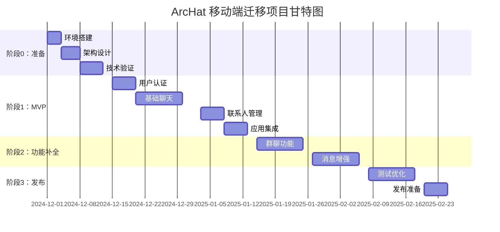

# 16. 迁移任务清单与验收标准

## 16.1 详细任务分解

### 16.1.1 阶段 0：准备工作（2 周）

#### 任务 0.1：环境搭建
| 任务项 | 负责人 | 预估工时 | 优先级 | 状态 |
|--------|--------|----------|--------|------|
| Flutter 开发环境配置 | 开发工程师 | 4h | P0 | ⏳ 待开始 |
| Android Studio/VS Code 配置 | 开发工程师 | 2h | P0 | ⏳ 待开始 |
| 项目初始化与依赖配置 | 开发工程师 | 4h | P0 | ⏳ 待开始 |
| Git 仓库与分支策略设置 | 开发工程师 | 2h | P1 | ⏳ 待开始 |

**验收标准**：
- [ ] `flutter doctor` 无错误
- [ ] 能成功运行 Hello World 应用
- [ ] 所有团队成员环境配置一致
- [ ] Git 工作流程文档完成

#### 任务 0.2：架构设计
| 任务项 | 负责人 | 预估工时 | 优先级 | 状态 |
|--------|--------|----------|--------|------|
| 项目结构设计 | 架构师 | 8h | P0 | ⏳ 待开始 |
| 状态管理方案确定 | 架构师 | 4h | P0 | ⏳ 待开始 |
| 网络层架构设计 | 架构师 | 6h | P0 | ⏳ 待开始 |
| 数据存储方案设计 | 架构师 | 4h | P0 | ⏳ 待开始 |
| 代码规范制定 | 架构师 | 4h | P1 | ⏳ 待开始 |

**验收标准**：
- [ ] 架构设计文档完成
- [ ] 技术选型文档完成
- [ ] 代码规范文档完成
- [ ] 团队技术评审通过

#### 任务 0.3：技术验证
| 任务项 | 负责人 | 预估工时 | 优先级 | 状态 |
|--------|--------|----------|--------|------|
| API 连接验证 | 开发工程师 | 4h | P0 | ⏳ 待开始 |
| WebSocket 连接验证 | 开发工程师 | 6h | P0 | ⏳ 待开始 |
| 本地存储验证 | 开发工程师 | 4h | P0 | ⏳ 待开始 |
| 第三方 SDK 集成验证 | 开发工程师 | 8h | P1 | ⏳ 待开始 |

**验收标准**：
- [ ] 所有核心技术验证通过
- [ ] 性能基准测试完成
- [ ] 风险评估报告完成

### 16.1.2 阶段 1：MVP 开发（5 周）

#### 任务 1.1：用户认证模块（1 周）
| 任务项 | 负责人 | 预估工时 | 优先级 | 状态 |
|--------|--------|----------|--------|------|
| 登录页面 UI 开发 | 前端工程师 | 8h | P0 | ⏳ 待开始 |
| 注册页面 UI 开发 | 前端工程师 | 6h | P0 | ⏳ 待开始 |
| 认证逻辑实现 | 前端工程师 | 8h | P0 | ⏳ 待开始 |
| Token 管理实现 | 前端工程师 | 4h | P0 | ⏳ 待开始 |
| 自动登录功能 | 前端工程师 | 4h | P1 | ⏳ 待开始 |
| 登录模块单元测试 | 测试工程师 | 6h | P1 | ⏳ 待开始 |

**验收标准**：
- [ ] 用户可以成功注册账号
- [ ] 用户可以使用用户名密码登录
- [ ] 登录状态能够持久化
- [ ] 自动登录功能正常
- [ ] 错误处理完善
- [ ] 单元测试覆盖率 > 80%

#### 任务 1.2：基础聊天模块（2 周）
| 任务项 | 负责人 | 预估工时 | 优先级 | 状态 |
|--------|--------|----------|--------|------|
| WebSocket 服务封装 | 后端工程师 | 12h | P0 | ⏳ 待开始 |
| 消息列表 UI 组件 | 前端工程师 | 16h | P0 | ⏳ 待开始 |
| 消息输入框组件 | 前端工程师 | 8h | P0 | ⏳ 待开始 |
| 消息发送逻辑 | 前端工程师 | 8h | P0 | ⏳ 待开始 |
| 消息接收逻辑 | 前端工程师 | 8h | P0 | ⏳ 待开始 |
| 消息本地存储 | 前端工程师 | 8h | P0 | ⏳ 待开始 |
| 聊天页面集成 | 前端工程师 | 8h | P0 | ⏳ 待开始 |
| 聊天模块测试 | 测试工程师 | 12h | P1 | ⏳ 待开始 |

**验收标准**：
- [ ] WebSocket 连接稳定
- [ ] 可以发送和接收文本消息
- [ ] 消息列表显示正确
- [ ] 消息状态指示正常
- [ ] 消息本地缓存工作
- [ ] 网络断开重连正常
- [ ] 集成测试通过

#### 任务 1.3：联系人管理（1 周）
| 任务项 | 负责人 | 预估工时 | 优先级 | 状态 |
|--------|--------|----------|--------|------|
| 联系人列表 UI | 前端工程师 | 8h | P0 | ⏳ 待开始 |
| 添加好友功能 | 前端工程师 | 8h | P0 | ⏳ 待开始 |
| 好友搜索功能 | 前端工程师 | 6h | P1 | ⏳ 待开始 |
| 联系人状态同步 | 前端工程师 | 6h | P1 | ⏳ 待开始 |
| 联系人模块测试 | 测试工程师 | 6h | P1 | ⏳ 待开始 |

**验收标准**：
- [ ] 联系人列表显示正确
- [ ] 可以添加新好友
- [ ] 好友搜索功能正常
- [ ] 在线状态显示正确
- [ ] 功能测试通过

#### 任务 1.4：应用导航与集成（1 周）
| 任务项 | 负责人 | 预估工时 | 优先级 | 状态 |
|--------|--------|----------|--------|------|
| 底部导航栏实现 | 前端工程师 | 4h | P0 | ⏳ 待开始 |
| 页面路由配置 | 前端工程师 | 4h | P0 | ⏳ 待开始 |
| 全局状态管理集成 | 前端工程师 | 8h | P0 | ⏳ 待开始 |
| 应用主题配置 | 前端工程师 | 4h | P1 | ⏳ 待开始 |
| MVP 集成测试 | 测试工程师 | 12h | P0 | ⏳ 待开始 |
| 性能优化 | 前端工程师 | 8h | P1 | ⏳ 待开始 |

**验收标准**：
- [ ] 应用导航流畅
- [ ] 页面间跳转正常
- [ ] 状态管理工作正常
- [ ] 主题切换功能正常
- [ ] 端到端测试通过
- [ ] 性能指标达标

### 16.1.3 阶段 2：功能补全（4 周）

#### 任务 2.1：群聊功能（2 周）
| 任务项 | 负责人 | 预估工时 | 优先级 | 状态 |
|--------|--------|----------|--------|------|
| 群聊列表页面 | 前端工程师 | 8h | P0 | ⏳ 待开始 |
| 创建群聊功能 | 前端工程师 | 8h | P0 | ⏳ 待开始 |
| 群聊页面 UI | 前端工程师 | 12h | P0 | ⏳ 待开始 |
| 群消息收发逻辑 | 前端工程师 | 12h | P0 | ⏳ 待开始 |
| 群成员管理 | 前端工程师 | 8h | P1 | ⏳ 待开始 |
| 群聊设置页面 | 前端工程师 | 6h | P1 | ⏳ 待开始 |
| 群聊功能测试 | 测试工程师 | 10h | P1 | ⏳ 待开始 |

**验收标准**：
- [ ] 可以创建群聊
- [ ] 群聊消息收发正常
- [ ] 群成员管理功能完整
- [ ] 群聊设置功能正常
- [ ] 群聊测试通过

#### 任务 2.2：消息增强功能（2 周）
| 任务项 | 负责人 | 预估工时 | 优先级 | 状态 |
|--------|--------|----------|--------|------|
| 图片消息发送 | 前端工程师 | 12h | P0 | ⏳ 待开始 |
| 图片消息显示 | 前端工程师 | 8h | P0 | ⏳ 待开始 |
| 文件消息发送 | 前端工程师 | 10h | P1 | ⏳ 待开始 |
| 文件消息显示 | 前端工程师 | 6h | P1 | ⏳ 待开始 |
| 消息撤回功能 | 前端工程师 | 8h | P1 | ⏳ 待开始 |
| 消息转发功能 | 前端工程师 | 6h | P2 | ⏳ 待开始 |
| 消息增强测试 | 测试工程师 | 8h | P1 | ⏳ 待开始 |

**验收标准**：
- [ ] 图片消息功能完整
- [ ] 文件消息功能完整
- [ ] 消息撤回功能正常
- [ ] 消息转发功能正常
- [ ] 功能测试通过

### 16.1.4 阶段 3：发布上线（3 周）

#### 任务 3.1：测试与优化（2 周）
| 任务项 | 负责人 | 预估工时 | 优先级 | 状态 |
|--------|--------|----------|--------|------|
| 功能完整性测试 | 测试工程师 | 16h | P0 | ⏳ 待开始 |
| 兼容性测试 | 测试工程师 | 12h | P0 | ⏳ 待开始 |
| 性能测试 | 测试工程师 | 8h | P0 | ⏳ 待开始 |
| 安全测试 | 测试工程师 | 8h | P1 | ⏳ 待开始 |
| Bug 修复 | 开发工程师 | 20h | P0 | ⏳ 待开始 |
| 性能优化 | 开发工程师 | 12h | P1 | ⏳ 待开始 |
| 用户体验优化 | 前端工程师 | 8h | P1 | ⏳ 待开始 |

**验收标准**：
- [ ] 所有 P0 Bug 修复完成
- [ ] 兼容性测试通过
- [ ] 性能指标达标
- [ ] 安全测试通过
- [ ] 用户体验评分 > 4.0

#### 任务 3.2：发布准备（1 周）
| 任务项 | 负责人 | 预估工时 | 优先级 | 状态 |
|--------|--------|----------|--------|------|
| 应用签名配置 | DevOps 工程师 | 4h | P0 | ⏳ 待开始 |
| 应用商店资料准备 | 产品经理 | 8h | P0 | ⏳ 待开始 |
| CI/CD 流水线配置 | DevOps 工程师 | 8h | P0 | ⏳ 待开始 |
| 发布文档编写 | 技术写作 | 6h | P1 | ⏳ 待开始 |
| 内测版本发布 | DevOps 工程师 | 4h | P0 | ⏳ 待开始 |
| 正式版本发布 | DevOps 工程师 | 4h | P0 | ⏳ 待开始 |

**验收标准**：
- [ ] 应用签名配置正确
- [ ] 应用商店资料完整
- [ ] CI/CD 流水线正常
- [ ] 内测版本发布成功
- [ ] 正式版本发布成功

## 16.2 时间估算与里程碑

### 16.2.1 总体时间规划

### 16.2.2 关键里程碑

| 里程碑 | 目标日期 | 交付物 | 验收标准 |
|--------|----------|--------|----------|
| **M0: 准备完成** | 2024-12-15 | 开发环境、架构设计 | 环境配置完成，技术验证通过 |
| **M1: MVP 完成** | 2025-01-13 | 基础聊天应用 | 核心功能可用，基础测试通过 |
| **M2: 功能完整** | 2025-02-06 | 完整功能应用 | 所有计划功能实现，功能测试通过 |
| **M3: 发布就绪** | 2025-02-25 | 生产就绪应用 | 所有测试通过，应用商店发布 |

## 16.3 风险预案与缓解措施

### 16.3.1 技术风险

#### 风险 1：Flutter 版本兼容性问题
- **概率**：中等
- **影响**：高
- **缓解措施**：
  - 锁定 Flutter 版本到稳定版本
  - 建立版本升级测试流程
  - 准备降级方案
- **应急预案**：
  - 回退到上一个稳定版本
  - 寻找替代插件或实现方案

#### 风险 2：第三方插件不稳定
- **概率**：中等
- **影响**：中等
- **缓解措施**：
  - 选择维护活跃的插件
  - 准备备选插件方案
  - 实现核心功能的原生方案
- **应急预案**：
  - 切换到备选插件
  - 临时禁用非核心功能

### 16.3.2 进度风险

#### 风险 3：开发进度延期
- **概率**：高
- **影响**：高
- **缓解措施**：
  - 合理的时间缓冲（20%）
  - 功能优先级明确
  - 定期进度检查
- **应急预案**：
  - 调整功能范围
  - 增加开发资源
  - 延期发布计划

#### 风险 4：人员变动
- **概率**：中等
- **影响**：高
- **缓解措施**：
  - 完善的文档记录
  - 代码审查制度
  - 知识分享机制
- **应急预案**：
  - 快速招聘替代人员
  - 重新分配任务
  - 外包部分工作

### 16.3.3 质量风险

#### 风险 5：性能不达标
- **概率**：中等
- **影响**：高
- **缓解措施**：
  - 早期性能基准测试
  - 持续性能监控
  - 性能优化最佳实践
- **应急预案**：
  - 专项性能优化
  - 功能简化
  - 硬件要求调整

## 16.4 质量保证计划

### 16.4.1 测试策略

#### 单元测试
- **覆盖率目标**：> 80%
- **测试范围**：所有业务逻辑、工具函数
- **执行频率**：每次代码提交

#### 集成测试
- **测试范围**：API 集成、数据库操作、第三方服务
- **执行频率**：每日构建

#### UI 测试
- **测试范围**：关键用户流程、页面导航
- **执行频率**：每周执行

#### 性能测试
- **测试指标**：启动时间、内存使用、帧率
- **执行频率**：每个里程碑

### 16.4.2 代码质量标准

#### 代码审查
- **审查覆盖率**：100%
- **审查人数**：至少 2 人
- **审查重点**：功能正确性、代码规范、性能、安全

#### 静态代码分析
- **工具**：flutter analyze, dart_code_metrics
- **执行频率**：每次 PR
- **质量门禁**：无 error 级别问题

#### 文档要求
- **API 文档**：所有公开接口
- **架构文档**：设计决策记录
- **用户文档**：使用说明、FAQ

## 16.5 交付物清单

### 16.5.1 代码交付物

| 交付物 | 描述 | 负责人 | 交付时间 |
|--------|------|--------|----------|
| **源代码** | Flutter 应用完整源码 | 开发团队 | M3 |
| **构建脚本** | CI/CD 配置文件 | DevOps | M3 |
| **测试代码** | 单元测试、集成测试代码 | 测试团队 | M3 |
| **配置文件** | 环境配置、部署配置 | DevOps | M3 |

### 16.5.2 文档交付物

| 交付物 | 描述 | 负责人 | 交付时间 |
|--------|------|--------|----------|
| **技术文档** | 架构设计、API 文档 | 架构师 | M2 |
| **用户手册** | 应用使用说明 | 产品经理 | M3 |
| **运维手册** | 部署、监控、故障处理 | DevOps | M3 |
| **测试报告** | 测试结果、质量报告 | 测试经理 | M3 |

### 16.5.3 应用交付物

| 交付物 | 描述 | 负责人 | 交付时间 |
|--------|------|--------|----------|
| **APK 文件** | Android 安装包 | DevOps | M3 |
| **AAB 文件** | Google Play 发布包 | DevOps | M3 |
| **应用商店资料** | 应用描述、截图等 | 产品经理 | M3 |
| **发布说明** | 版本更新说明 | 产品经理 | M3 |

## 16.6 验收标准总览

### 16.6.1 功能验收标准

#### 核心功能
- [ ] 用户注册登录功能完整
- [ ] 私聊消息收发正常
- [ ] 群聊功能完整
- [ ] 联系人管理功能正常
- [ ] 图片、文件消息支持
- [ ] 消息撤回功能正常

#### 非功能需求
- [ ] 应用启动时间 < 3 秒
- [ ] 消息发送延迟 < 500ms
- [ ] 内存使用 < 200MB
- [ ] 崩溃率 < 0.1%
- [ ] 支持 Android 8.0+

### 16.6.2 质量验收标准

#### 代码质量
- [ ] 单元测试覆盖率 > 80%
- [ ] 静态代码分析无 error
- [ ] 代码审查通过率 100%
- [ ] 技术债务控制在可接受范围

#### 用户体验
- [ ] UI 设计符合 Material Design 规范
- [ ] 操作流程简洁直观
- [ ] 错误提示清晰友好
- [ ] 用户满意度 > 4.0/5.0

#### 安全合规
- [ ] 数据传输加密
- [ ] 敏感信息安全存储
- [ ] 权限申请合理
- [ ] 隐私政策完整

### 16.6.3 发布验收标准

#### 应用商店
- [ ] 应用商店审核通过
- [ ] 应用信息完整准确
- [ ] 版本号管理规范
- [ ] 发布流程文档完整

#### 运维监控
- [ ] 监控系统部署完成
- [ ] 告警机制配置正确
- [ ] 日志收集正常
- [ ] 性能指标监控正常

---

## 总结

本迁移教学手册涵盖了从 ArcHat Web 应用到 Android Flutter 应用的完整迁移过程，包括：

✅ **16 个详细章节**，每章都包含动手步骤、示例命令、验收准则和回滚方案
✅ **完整的技术栈分析**，从现有 Vue3+Spring Boot 到 Flutter+Provider
✅ **分阶段的迁移路线**，从准备工作到最终发布的详细计划
✅ **实战代码示例**，涵盖认证、聊天、状态管理等核心功能
✅ **最佳实践总结**，适用于不同规模的团队和项目
✅ **常见问题解决方案**，包含 25+ 个典型问题的调试指南
✅ **详细任务清单**，可直接用于项目管理和进度跟踪

这份手册为中国市场的移动端开发提供了完整的指导，确保项目的可执行性和可持续性。
