# IOT-探究华为问界M7自动检测报警--Java程序员玩转IOT


## 1 物联网简介


### 1.1 物联网概念

​			**物联网**（英文：*Internet of Things*，缩写：[IoT](https://baike.baidu.com/item/IoT/552548?fromModule=lemma_inlink)）起源于传媒领域，是信息科技产业的第三次革命。[物联网](https://baike.baidu.com/item/物联网/7306589?fromModule=lemma_inlink)是指通过信息[传感设备](https://baike.baidu.com/item/传感设备/18653387?fromModule=lemma_inlink)，按约定的协议，将任何物体与网络相连接，物体通过信息[传播媒介](https://baike.baidu.com/item/传播媒介/8394646?fromModule=lemma_inlink)进行[信息交换](https://baike.baidu.com/item/信息交换/716328?fromModule=lemma_inlink)和通信，以实现智能化识别、定位、跟踪、监管等功能。


### 1.2  物联网应用分层

​             在[物联网应用](https://baike.baidu.com/item/物联网应用/16920234?fromModule=lemma_inlink)中有三层，分别是[感知层](https://baike.baidu.com/item/感知层/7158810?fromModule=lemma_inlink)、网络[传输层](https://baike.baidu.com/item/传输层/4329536?fromModule=lemma_inlink)和应用层。


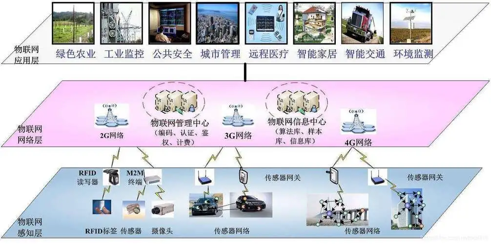


来看一个智能水表的例子：

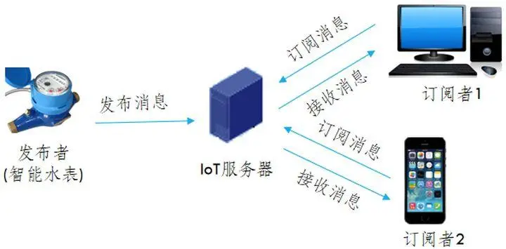


智能水表---IOT服务器  如何进行数据交互？ 

- 协议来进行规范，比如MQTT协议

IOT服务器---应用/用户  如何进行数据交互？

- 协议来进行规范，比如AMQP 、HTTP


### 1.3  Java工程师如何入局物联网开发


物联网开发一般涉及以下三个方面：

物联网产品开发：

​	主要呈现物联网平台的界面查询与操作，包括产品管理、产品模型开发、插件开发、在线调试等。

物联网设备开发：

​	主要为业务应用与物联网平台的集成对接开发，包括API接口调用、业务数据获取和HTTPS证书管理。

物联网应用开发：

​	主要为设备与物联网平台的集成对接开发，包括设备接入物联网平台、业务数据上报和对平台下发控制命令的处理。


是不是觉得脑袋很大！没关系，国内的互联网大厂，已经提供了一些物联网集成开发平台，可以供我们选择使用。


## 2 阿里云IOT平台

在开发智能监测之前，我们必须要先熟悉和掌握阿里云IOT平台的使用及对接。

### 2.1 IOT平台简介

产品文档：https://help.aliyun.com/zh/iot/product-overview/?spm=a2c4g.11186623.0.0.32d844a6NPRO9e

阿里云物联网平台是一个集成了设备管理、数据安全通信、消息订阅和数据服务等能力的一体化平台。向下支持连接海量设备，采集设备数据上云；向上提供云端API，服务端可通过调用云端API将指令下发至设备端，实现远程控制。

我们作为一个开发者，基本的设备与后台调度思路，如下：

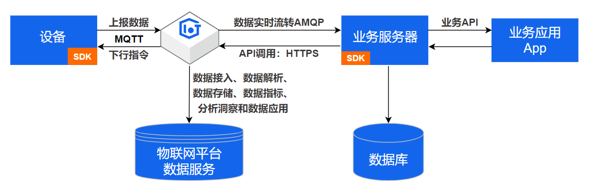

>更多的介绍可以阅读官方产品文档

### 2.2 开通物联网平台

#### 2.2.1 开通阿里云账号

前往[阿里云官网](https://www.aliyun.com/)注册账号。如果已有注册账号，请跳过此步骤。

进入阿里云首页后，如果没有阿里云的账户需要先进行注册，才可以进行登录。由于注册较为简单，课程和讲义不在进行体现（注册可以使用多种方式，如淘宝账号、支付宝账号等...）。

需要实名认证和活体认证。

#### 2.2.2 开通物理网平台

登录账号以后，我们可以在产品中搜索物联网平台

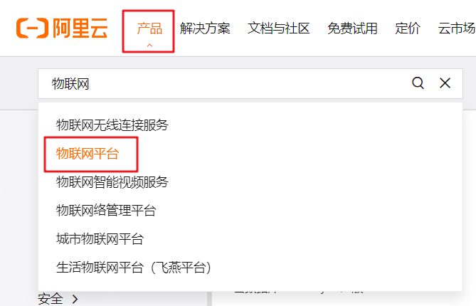

打开之后，点击管理控制台

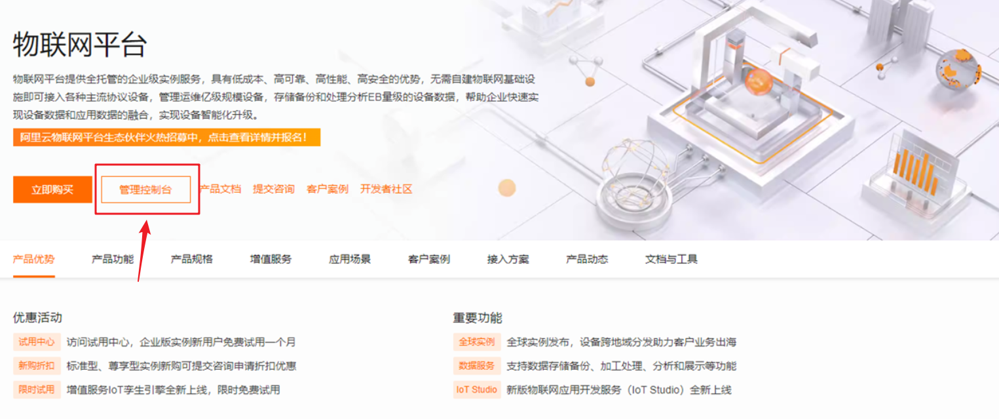

如果没有开通的话，会提示你开通物联网平台，如下图，直接开通即可

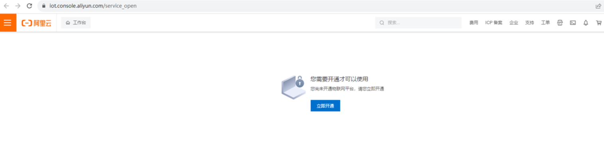

#### 2.2.3 申请公共实例

在IOT中分为了两种实例，一个是**公共实例**，另外一个是**企业实例**，不同的实例收费标准和功能是不一样的

- 公共实例，免费，使用地域为**上海**，支持同时在线设备数为50个，最多可创建500个设备，消息通信TPS为5条/秒
- 企业实例，如果公共实例超出了业务需求资源，可以使用企业实例，企业实例可以按照包年包月方式计算

在我们教学阶段，可以申请使用公共实例使用，如下图

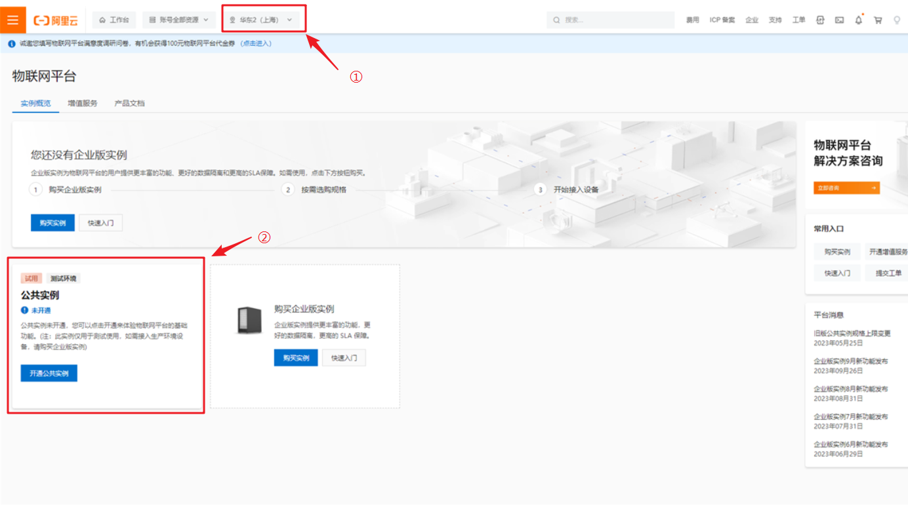

<font color='red'>注意：地域必须选择**上海**才能申请公共实例</font>


产品 ：某一类设备集合


物模型：描述产品属性或者服务事件


设备：具体的某一款产品


设备-------IOT平台------应用


### 2.3 产品

一旦拥有了公共实例，我们就可以使用临时实例来进行开发，我们先来介绍产品和设备

#### 2.3.1 创建产品

https://help.aliyun.com/zh/iot/user-guide/create-a-product?spm=a2c4g.11186623.0.0.6ac7133dbo6zWV

产品：设备的集合，通常指一组具有相同功能的设备。物联网平台为每个产品颁发全局唯一的ProductKey。

简单说就是某一类产品，比如，手表、大门通道门禁、紧急呼叫报警器、滞留报警器、跌倒报警器

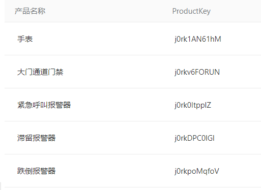

现在我们可以创建产品，找到产品-->创建产品

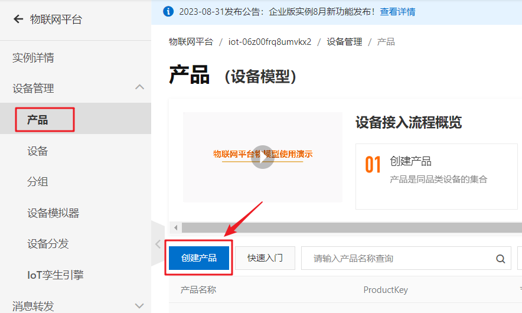

如下图，输入产品名称，然后选择平台提供好的分类，其他选择默认即可，然后确认创建

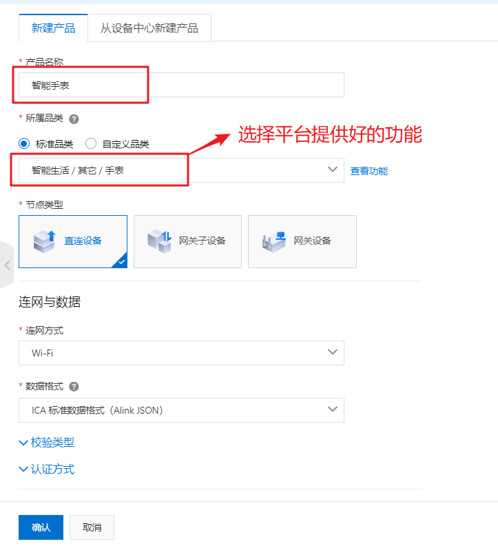

创建成功之后，如下图

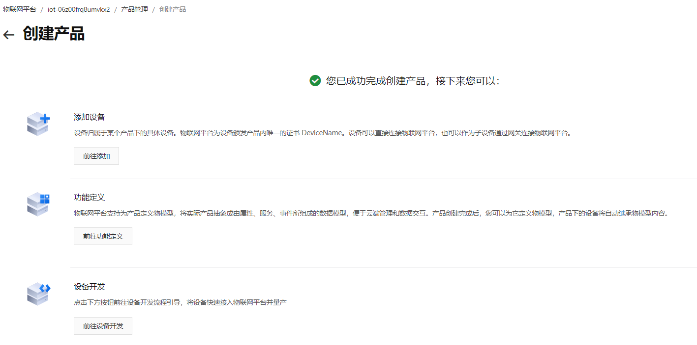

在产品列表中也可以查看，刚刚创建的产品

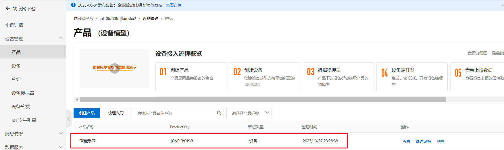

#### 2.3.2 物模型

https://help.aliyun.com/zh/iot/user-guide/add-a-tsl-feature?spm=a2c4g.11186623.0.0.9abf6ec2jkNsER

产品创建好之后，可以给产品添加物模型，也就是给产品定义功能。

比如我们刚才创建的手表产品，可以定义功能，功能也可以分为两类，一个是监测手表本身，一个是因为指标数据

- 手表本身：耗电量，使用时间

- 指标数据：身体血压、血氧、体温数据

像这些耗电量、血压、血氧数据都属于产品的功能，也叫做物模型

在IOT平台的物模型中，分为了三类：

| 功能类型         | 说明                                                         |
| ---------------- | ------------------------------------------------------------ |
| 属性（Property） | 用于描述设备运行时具体信息和状态。例如，环境监测设备所读取的当前环境温度、智能灯开关状态、电风扇风力等级等。属性可分为读写和只读两种类型。读写类型支持读取和设置属性值，只读类型仅支持读取属性值。 |
| 服务（Service）  | 指设备可供外部调用的指令或方法。服务调用中可设置输入和输出参数。输入参数是服务执行时的参数，输出参数是服务执行后的结果。相比于属性，服务可通过一条指令实现更复杂的业务逻辑，例如执行某项特定的任务。 |
| 事件（Event）    | 设备运行时，主动上报给云端的信息，一般包含需要被外部感知和处理的信息、告警和故障。事件中可包含多个输出参数。<br />例如，某项任务完成后的通知信息；设备发生故障时的温度、时间信息；设备告警时的运行状态等。 |

创建手表产品的**耗电量**物模型，如下图：


### 2.4 设备

https://help.aliyun.com/zh/iot/user-guide/create-a-device?spm=a2c4g.11186623.0.0.4f1b12ackrzdOs

产品是设备的集合，通常指一组具有相同功能的设备。创建产品完成后，需在产品下添加设备，获取设备证书。您可在物联网平台上，同时创建一个或多个设备

前提条件：设备是绑定在产品上的，所以必须先创建产品才行

操作步骤：

1. 在左侧导航栏，选择**设备管理**> **设备**。
2. 在**设备**页面，单击**添加设备**。
3. 在**添加设备**对话框中，输入设备信息，单击**确认**。

如下图：


在添加设备的时候有三个参数，解释如下：

| 参数       | 描述                                                         |
| ---------- | ------------------------------------------------------------ |
| 产品       | 选择产品。新创建的设备会继承该产品定义好的功能和特性。       |
| DeviceName | 设置设备名称。 设备名称在产品内具有唯一性。支持英文字母、数字、短划线（-）、下划线（_）、at（@）、英文句号（.）和英文冒号（:），长度限制为4~32个字符。 |
| 备注名称   | 设置备注名称。支持中文、英文字母、日文、数字和下划线（_），长度限制为4~64个字符，一个中文或日文占2个字符。 |

创建设备成功后，会自动弹出**添加完成**对话框。您可以查看、复制设备证书信息。设备证书由设备的ProductKey、DeviceName和DeviceSecret组成，是设备与物联网平台进行通信的重要身份认证。

| 参数         | 说明                                                         |
| ------------ | ------------------------------------------------------------ |
| ProductKey   | 设备所属产品的ProductKey，即物联网平台为产品颁发的全局唯一标识符。 |
| DeviceName   | 设备在产品内的唯一标识符。DeviceName与设备所属产品的ProductKey组合，作为设备标识，用来与物联网平台进行连接认证和通信。 |
| DeviceSecret | 物联网平台为设备颁发的设备密钥，用于认证加密。需与DeviceName成对使用。 |

### 2.5 设备数据上报

https://help.aliyun.com/zh/iot/user-guide/devices-retrieve-certificates/?spm=a2c4g.11186623.0.0.671b53felMSmzL

物理设备可通过两种方式获取物联网平台颁发的设备证书（ProductKey、DeviceName和DeviceSecret）：设备厂商在产线上将证书烧录到设备上和设备上电联网后从厂商云服务中获取证书。

>物联网烧录：是指将特定的程序或数据写入物联网设备中的过程。这些设备可能包括智能家居设备、智能穿戴设备、智能传感器等。通过烧录，可以实现设备的特定功能，例如控制灯光、监测温度、收集数据等。物联网烧录需要使用专业的工具和技术，确保烧录信息的完整性和准确性，以保证设备的正常工作和稳定性。

我们在开发阶段可以使用联网的电脑，来模拟设备的数据上报，比较简单的方式可以使用node来进行链接上报数据，参考代码如下：

```javascript
const mqtt = require('aliyun-iot-mqtt');
// 1. 设备身份信息
var options = {
  productKey: "j0rk1AN61hM",
  deviceName: "watch001",
  deviceSecret: "ea94110e5495bb04b0a7b35b9535a50c",
  host: "iot-06z00frq8umvkx2.mqtt.iothub.aliyuncs.com"
};

// 2. 建立MQTT连接
const client = mqtt.getAliyunIotMqttClient(options);
//订阅云端指令Topic
client.subscribe(`/${options.productKey}/${options.deviceName}/user/get`)
client.subscribe(`/sys/${options.productKey}/${options.deviceName}/thing/event/property/post_reply`)
client.on('message', function (topic, message) {
  console.log("topic " + topic)
  console.log("message " + message)
})

setInterval(function () {
  // 3.定时上报温湿度数据
  client.publish(`/sys/${options.productKey}/${options.deviceName}/thing/event/property/post`, getPostData(), { qos: 0 });
}, 5 * 1000);

var power = 1000;

function getPostData () {
  const payloadJson = {
    id: Date.now(),
    version: "1.0",
    params: {
      PowerConsumption: power--
    },
    method: "thing.event.property.post"

  }
  console.log("payloadJson " + JSON.stringify(payloadJson))
  return JSON.stringify(payloadJson);
}
```

把上述代码保存到一个文件夹下，以js为后缀名，如：iot_device_01.js

然后在js所在的文件夹下，打开cmd窗口，分别执行

```js
node -i

node iot_device_01.js
```

启动之后的效果如下：

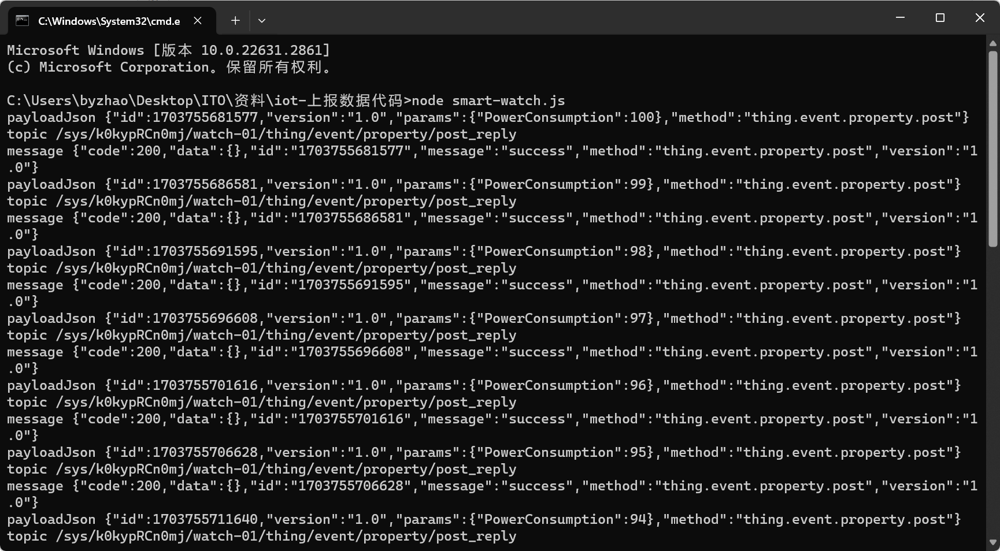

设备启动后，可以在物联网平台查看刚才创建的设备，现在已在线

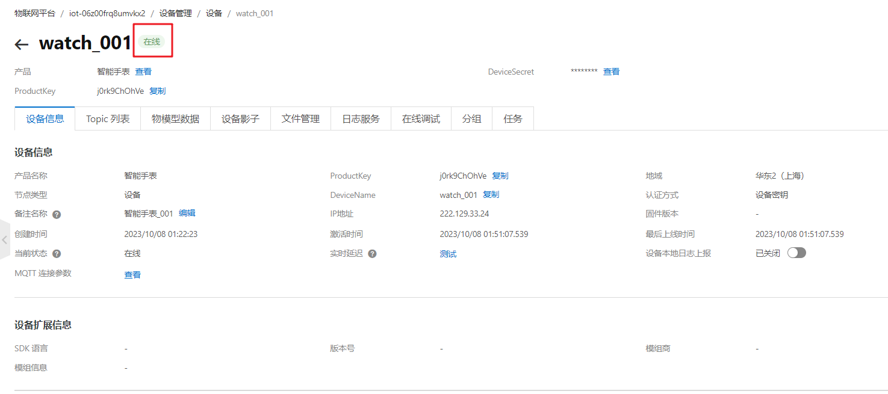

找到物模型数据，可以看到上报之后的数据

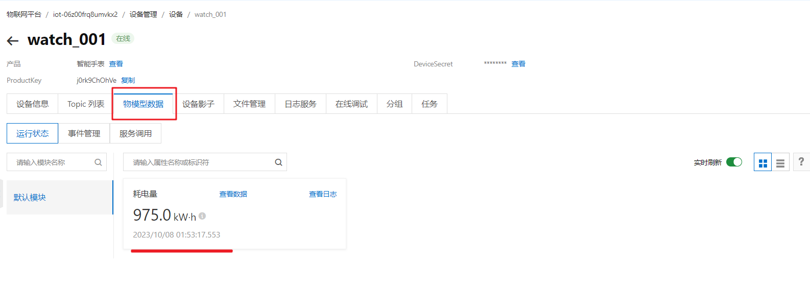


## 3 设备数据消费

​		AMQP全称Advanced Message Queuing Protocol，是一种网络协议，用于在应用程序之间传递消息。它是一种开放标准的消息传递协议，可以在不同的系统之间实现可靠、安全、高效的消息传递。

AMQP协议的实现包括多种消息队列软件，例如RabbitMQ、Apache ActiveMQ**、Apache Qpid**等。这些软件提供了可靠、高效的消息传递服务，广泛应用于分布式系统、云计算、物联网等领域。

> 我们这次课程并不会详细讲解这些软件的使用，其中关于RabbitMQ我们后期的课程中会详细的，重点的去讲解。

今天我们会在课程中快速使用Apache Qpid软件来接收IOT中的数据，如下图

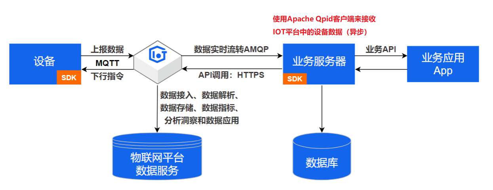


在IOT官方文档中，已经提供了对应的接收数据的解决方案，如下链接：

https://help.aliyun.com/zh/iot/developer-reference/connect-a-client-to-iot-platform-by-using-the-sdk-for-java?spm=a2c4g.11186623.0.0.7d7234bdQCi7MQ

### 3.1 官网Java SDK接入

#### 3.1.1 导入pom依赖

```xml
<!-- amqp 1.0 qpid client -->
 <dependency>
   <groupId>org.apache.qpid</groupId>
   <artifactId>qpid-jms-client</artifactId>
   <version>0.57.0</version>
 </dependency>
 <!-- util for base64-->
 <dependency>
   <groupId>commons-codec</groupId>
  <artifactId>commons-codec</artifactId>
  <version>1.10</version>
</dependency>
```

#### 3.1.2 下载Demo代码包

下载地址：https://linkkit-export.oss-cn-shanghai.aliyuncs.com/amqp/amqp-demo.zip


代码包可以资料中找到

### 3.2 SDK改造

下载完成以后，里面有一个AmqpClient.java文件，我们需要改造这个类，改造内容如下：

- 让spring进行管理和监听，一旦有数据变化之后，就可以马上消费，可以让这个类实现ApplicationRunner接口，重新run方法
- 可以在项目中自己配置线程池的使用
- 所有的可变参数，如实例id、accessKey、accessSecret、consumerGroupId这些统一在配置文件中维护

#### 3.2.1 application.yml文件中添加IOT配置

```yaml
zzyl:
  aliyun:
    accessKeyId: xxxxx
    accessKeySecret: yyyyy
    consumerGroupId: DEFAULT_GROUP
    regionId: cn-shanghai
    iotInstanceId: zzzz
    host: ddddddddd.amqp.iothub.aliyuncs.com

```

在zzyl-framework中添加读取文件配置类

```java
package com.itheima.properties;

import lombok.Getter;
import lombok.NoArgsConstructor;
import lombok.Setter;
import lombok.ToString;
import org.springframework.boot.context.properties.ConfigurationProperties;
import org.springframework.context.annotation.Configuration;

/**
 */

@Setter
@Getter
@NoArgsConstructor
@ToString
@Configuration
@ConfigurationProperties(prefix = "iot.aliyun")
public class AliIoTConfigProperties {

    /**
     * 访问Key
     */
    private String accessKeyId;
    /**
     * 访问秘钥
     */
    private String accessKeySecret;
    /**
     * 区域id
     */
    private String regionId;
    /**
     * 实例id
     */
    private String iotInstanceId;
    /**
     * 域名
     */
    private String host;

    /**
     * 消费组
     */
    private String consumerGroupId;

}
```


#### 3.2.2 常见线程池配置类

在项目中添加配置类，如下

```java
package com.itheima.config;

import org.springframework.context.annotation.Bean;
import org.springframework.context.annotation.Configuration;

import java.util.concurrent.ExecutorService;
import java.util.concurrent.LinkedBlockingQueue;
import java.util.concurrent.ThreadPoolExecutor;
import java.util.concurrent.TimeUnit;
import java.util.concurrent.atomic.AtomicInteger;

@Configuration
public class ThreadPoolConfig {

    /**
     * 核心线程池大小
     */
    private static final int CORE_POOL_SIZE = Runtime.getRuntime().availableProcessors();

    /**
     * 最大可创建的线程数
     */
    private static final int MAX_POOL_SIZE = Runtime.getRuntime().availableProcessors() * 2;

    /**
     * 队列最大长度
     */
    private static final int QUEUE_CAPACITY = 50000;

    /**
     * 线程池维护线程所允许的空闲时间
     */
    private static final int KEEP_ALIVE_SECONDS = 60;

    @Bean
    public ExecutorService executorService(){
        AtomicInteger c = new AtomicInteger(1);
        LinkedBlockingQueue<Runnable> queue = new LinkedBlockingQueue<Runnable>(QUEUE_CAPACITY);
        return new ThreadPoolExecutor(
                CORE_POOL_SIZE,
                MAX_POOL_SIZE,
                KEEP_ALIVE_SECONDS,
                TimeUnit.MILLISECONDS,
                queue,
                r -> new Thread(r, "itheima-pool-" + c.getAndIncrement()),
                new ThreadPoolExecutor.DiscardPolicy()
        );
    }
}
```

#### 3.2.3 改造之后的AmqpClient

```java
package com.itheima.job;

import com.heima.properties.AliIoTConfigProperties;
import org.apache.commons.codec.binary.Base64;
import org.apache.qpid.jms.JmsConnection;
import org.apache.qpid.jms.JmsConnectionListener;
import org.apache.qpid.jms.message.JmsInboundMessageDispatch;
import org.slf4j.Logger;
import org.slf4j.LoggerFactory;
import org.springframework.beans.factory.annotation.Autowired;
import org.springframework.boot.ApplicationArguments;
import org.springframework.boot.ApplicationRunner;
import org.springframework.stereotype.Component;

import javax.crypto.Mac;
import javax.crypto.spec.SecretKeySpec;
import javax.jms.*;
import javax.naming.Context;
import javax.naming.InitialContext;
import java.net.InetAddress;
import java.net.URI;
import java.net.UnknownHostException;
import java.util.ArrayList;
import java.util.Hashtable;
import java.util.List;
import java.util.concurrent.ExecutorService;

@Component
public class AmqpClient implements ApplicationRunner {
    private final static Logger logger = LoggerFactory.getLogger(AmqpClient2.class);

    @Autowired
    private AliIoTConfigProperties aliIoTConfigProperties;

    //控制台服务端订阅中消费组状态页客户端ID一栏将显示clientId参数。
    
    //建议使用机器UUID、MAC地址、IP等唯一标识等作为clientId。便于您区分识别不同的客户端。
    private static String clientId;

    static {
        try {
            clientId = InetAddress.getLocalHost().getHostAddress();
        } catch (UnknownHostException e) {
            e.printStackTrace();
        }
    }

    // 指定单个进程启动的连接数
    // 单个连接消费速率有限，请参考使用限制，最大64个连接
    // 连接数和消费速率及rebalance相关，建议每500QPS增加一个连接
    private static int connectionCount = 4;

    //业务处理异步线程池，线程池参数可以根据您的业务特点调整，或者您也可以用其他异步方式处理接收到的消息。
    @Autowired
    private ExecutorService executorService;

    public void start() throws Exception {
        List<Connection> connections = new ArrayList<>();

        //参数说明，请参见AMQP客户端接入说明文档。
        for (int i = 0; i < connectionCount; i++) {
            long timeStamp = System.currentTimeMillis();
            //签名方法：支持hmacmd5、hmacsha1和hmacsha256。
            String signMethod = "hmacsha1";

            //userName组装方法，请参见AMQP客户端接入说明文档。
            String userName = clientId + "-" + i + "|authMode=aksign"
                    + ",signMethod=" + signMethod
                    + ",timestamp=" + timeStamp
                    + ",authId=" + aliIoTConfigProperties.getAccessKeyId()
                    + ",iotInstanceId=" + aliIoTConfigProperties.getIotInstanceId()
                    + ",consumerGroupId=" + aliIoTConfigProperties.getConsumerGroupId()
                    + "|";
            //计算签名，password组装方法，请参见AMQP客户端接入说明文档。
            String signContent = "authId=" + aliIoTConfigProperties.getAccessKeyId() + "&timestamp=" + timeStamp;
            String password = doSign(signContent, aliIoTConfigProperties.getAccessKeySecret(), signMethod);
            String connectionUrl = "failover:(amqps://" + aliIoTConfigProperties.getHost() + ":5671?amqp.idleTimeout=80000)"
                    + "?failover.reconnectDelay=30";

            Hashtable<String, String> hashtable = new Hashtable<>();
            hashtable.put("connectionfactory.SBCF", connectionUrl);
            hashtable.put("queue.QUEUE", "default");
            hashtable.put(Context.INITIAL_CONTEXT_FACTORY, "org.apache.qpid.jms.jndi.JmsInitialContextFactory");
            Context context = new InitialContext(hashtable);
            ConnectionFactory cf = (ConnectionFactory) context.lookup("SBCF");
            Destination queue = (Destination) context.lookup("QUEUE");
            // 创建连接。
            Connection connection = cf.createConnection(userName, password);
            connections.add(connection);

            ((JmsConnection) connection).addConnectionListener(myJmsConnectionListener);
            // 创建会话。
            // Session.CLIENT_ACKNOWLEDGE: 收到消息后，需要手动调用message.acknowledge()。
            // Session.AUTO_ACKNOWLEDGE: SDK自动ACK（推荐）。
            Session session = connection.createSession(false, Session.AUTO_ACKNOWLEDGE);

            connection.start();
            // 创建Receiver连接。
            MessageConsumer consumer = session.createConsumer(queue);
            consumer.setMessageListener(messageListener);
        }

        logger.info("amqp  is started successfully, and will exit after server shutdown ");
    }

    private MessageListener messageListener = message -> {
        try {
            //异步处理收到的消息，确保onMessage函数里没有耗时逻辑
            executorService.submit(() -> processMessage(message));
        } catch (Exception e) {
            logger.error("submit task occurs exception ", e);
        }
    };

    /**
     * 在这里处理您收到消息后的具体业务逻辑。
     */
    private void processMessage(Message message) {
        try {
            byte[] body = message.getBody(byte[].class);
            String content = new String(body);
            String topic = message.getStringProperty("topic");
            String messageId = message.getStringProperty("messageId");
            logger.info("receive message"
                    + ",\n topic = " + topic
                    + ",\n messageId = " + messageId
                    + ",\n content = " + content);
            } catch (Exception e) {
            logger.error("processMessage occurs error ", e);
        }
    }

    private JmsConnectionListener myJmsConnectionListener = new JmsConnectionListener() {
        /**
         * 连接成功建立。
         */
        @Override
        public void onConnectionEstablished(URI remoteURI) {
            logger.info("onConnectionEstablished, remoteUri:{}", remoteURI);
        }

        /**
         * 尝试过最大重试次数之后，最终连接失败。
         */
        @Override
        public void onConnectionFailure(Throwable error) {
            logger.error("onConnectionFailure, {}", error.getMessage());
        }

        /**
         * 连接中断。
         */
        @Override
        public void onConnectionInterrupted(URI remoteURI) {
            logger.info("onConnectionInterrupted, remoteUri:{}", remoteURI);
        }

        /**
         * 连接中断后又自动重连上。
         */
        @Override
        public void onConnectionRestored(URI remoteURI) {
            logger.info("onConnectionRestored, remoteUri:{}", remoteURI);
        }

        @Override
        public void onInboundMessage(JmsInboundMessageDispatch envelope) {
        }

        @Override
        public void onSessionClosed(Session session, Throwable cause) {
        }

        @Override
        public void onConsumerClosed(MessageConsumer consumer, Throwable cause) {
        }

        @Override
        public void onProducerClosed(MessageProducer producer, Throwable cause) {
        }
    };

    /**
     * 计算签名，password组装方法，请参见AMQP客户端接入说明文档。
     */
    private static String doSign(String toSignString, String secret, String signMethod) throws Exception {
        SecretKeySpec signingKey = new SecretKeySpec(secret.getBytes(), signMethod);
        Mac mac = Mac.getInstance(signMethod);
        mac.init(signingKey);
        byte[] rawHmac = mac.doFinal(toSignString.getBytes());
        return Base64.encodeBase64String(rawHmac);
    }

    @Override
    public void run(ApplicationArguments args) throws Exception {
        start();
    }
}

```

#### 3.2.4 设备消息订阅

在接收消息之前，我们需要让设备绑定消费组列表，这样才能通过消费组去接收消息

第一：找到  **消息转发**->**服务端订阅**->**消费者组列表**

目前有一个默认的消费组

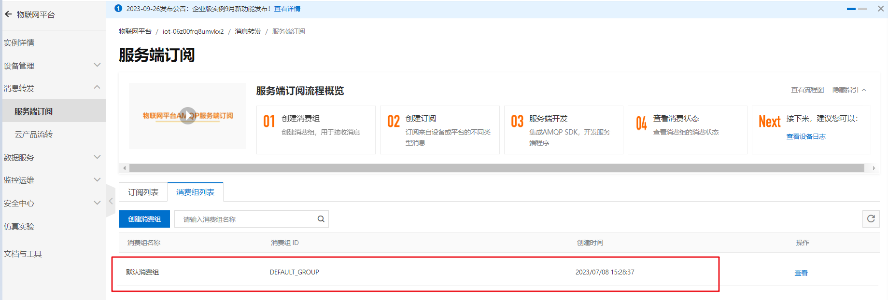

第二：创建订阅，让产品与消费组进行关联

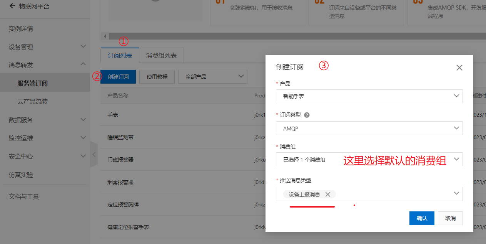

- 在**服务端订阅**页面的**订阅列表**页签下，单击**创建订阅**。

- 在**创建订阅**对话框，设置参数后单击**确认**。

  | 参数         | 说明                       |
  | ------------ | -------------------------- |
  | 产品         | 选择自己的产品（智能手表） |
  | 订阅类型     | 选择**AMQP**               |
  | 消费组       | 选择**默认消费组**         |
  | 推送消息类型 | 选择**设备上报消息**       |

### 3.3 接收设备端数据

#### 3.3.1 思路分析

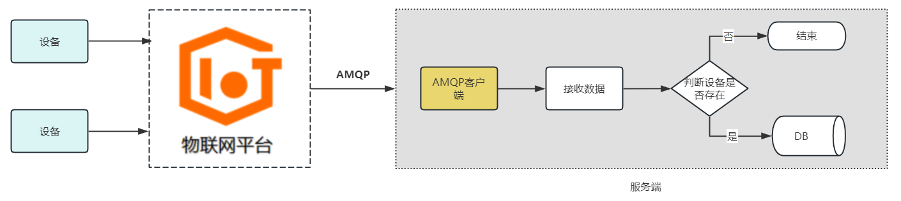

#### 3.3.2 功能实现

修改AmqpClient类中的processMessage，方法

```java
@Resource
private DeviceDataMapper deviceDataMapper;

@Resource
private DeviceMapper deviceMapper;

/**
 * 在这里处理您收到消息后的具体业务逻辑。
 */
private void processMessage(Message message) {
    try {
        byte[] body = message.getBody(byte[].class);
        String content = new String(body);
        String topic = message.getStringProperty("topic");
        String messageId = message.getStringProperty("messageId");
        logger.info("receive message"
                + ",\n topic = " + topic
                + ",\n messageId = " + messageId
                + ",\n content = " + content);
        Content c = JSONUtil.toBean(content, Content.class);
        
        //.........
     
    } catch (Exception e) {
        logger.error("processMessage occurs error ", e);
    }
}
```

#### 3.3.3 测试

（1）启动模拟设备进行上报


## 4. 数据告警

 

  	想要获取报警数据，我们首先必须先制定报警规则，会根据不同的设备，不同的物模型来定义报警规则。 比如

我们设备的电量小于30% 就告警。

​		比如，黑马研究院最新研发的一个养老项目中的业务：

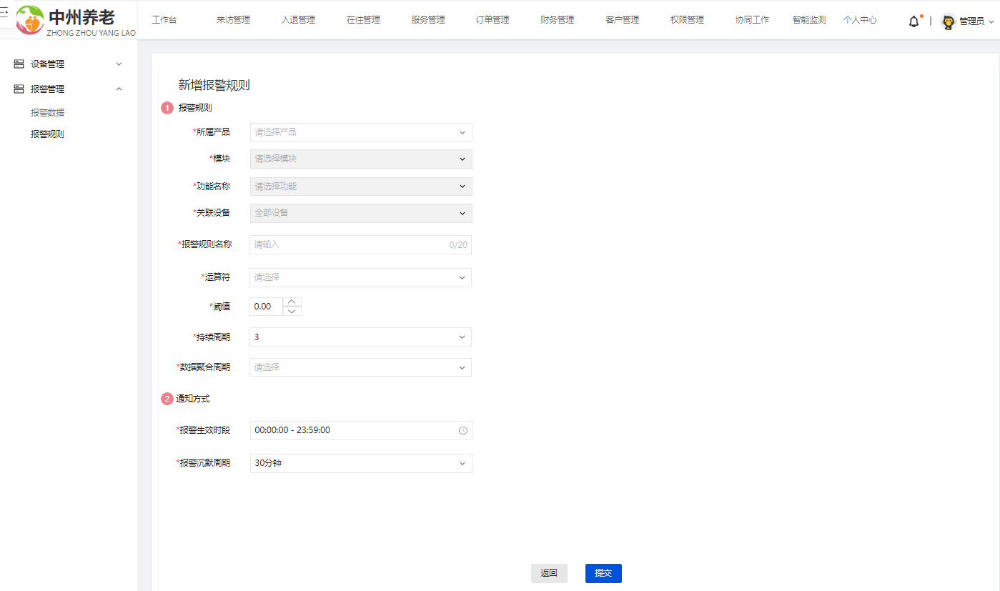

数据来源：

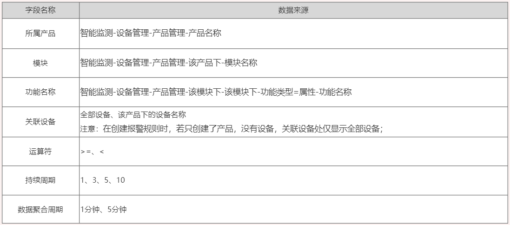

- 报警生效时间: 报警规则的生效时间，报警规则只在生效时间内才会检查监控数据是否需要报警

- 报警沉默周期: 指报警发生后如果未恢复正常，重复发送报警通知的时间间隔;
  - 数据范围：5分钟、10分钟、15分钟、30分钟、60分钟、3小时、6小时、12小时、24小时；

> **例如：**
>
> 1分钟（数据聚合周期）检查一次智能手表（所属产品）中的全部设备（关联设备）的血氧（功能名称），原值（统计字段）是否 <=90（运算符+阈值），当连续3个周期（持续周期）都满足这个规则时，触发报警；
>
> 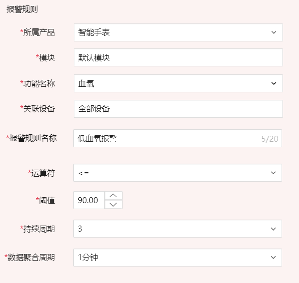


   


