# MySQL专题-02


## 1. 索引

### 1.1 索引概述

#### 1.1.1 介绍

索引（index）是帮助MySQL**高效获取数据的数据结构(有序)**。在数据之外，数据库系统还维护着满足特定查找算法的数据结构，这些数据结构以某种方式引用（指向）数据， 这样就可以在这些数据结构上实现高级查找算法，这种数据结构就是索引。

 


#### 1.2 演示

表结构及其数据如下：

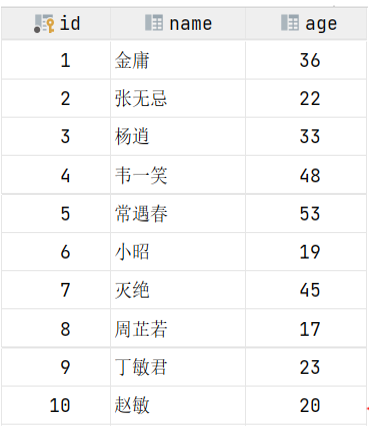 

假如我们要执行的SQL语句为 ： select * from user where age = 45;

1). 无索引情况

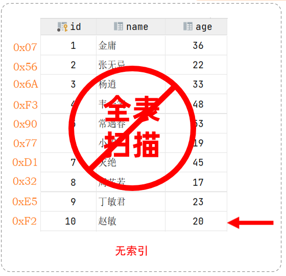 

在无索引情况下，就需要从第一行开始扫描，一直扫描到最后一行，我们称之为 全表扫描，性能很低。


2). 有索引情况

如果我们针对于这张表建立了索引，假设索引结构就是二叉树，那么也就意味着，会对age这个字段建立一个二叉树的索引结构。

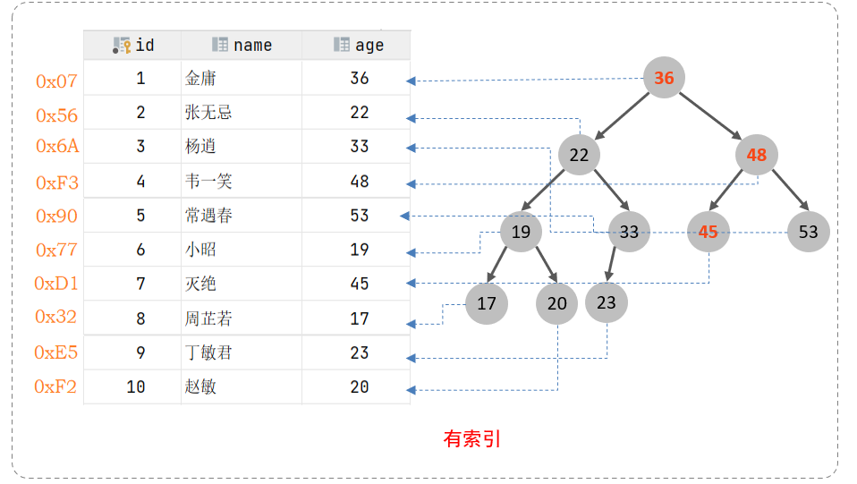 

此时我们在进行查询时，只需要扫描三次就可以找到数据了，极大的提高的查询的效率。


> 备注： 这里我们只是假设索引的结构是二叉树，介绍一下索引的大概原理，只是一个示意图，并不是索引的真实结构，索引的真实结构，后面会详细介绍。

686道Java面试题：链接: https://pan.baidu.com/s/19ZNYZFszK5fqNZnB74yQNg  密码: cffh
算法面试题：链接: https://pan.baidu.com/s/1X5PSredPlKCRPNS26WNgFQ  密码: v68f

#### 1.3 特点

| 优势                                                         | 劣势                                                         |
| ------------------------------------------------------------ | ------------------------------------------------------------ |
| 提高数据检索的效率，降低数据库的IO成本                       | 索引列也是要占用空间的。                                     |
| 通过索引列对数据进行排序，降低数据排序的成本，降低CPU的消耗。 | 索引大大提高了查询效率，同时却也降低更新表的速度，如对表进行INSERT、UPDATE、DELETE时，效率降低。 |


### 1.2 索引结构

#### 1.2.1 概述 

MySQL的索引是在存储引擎层实现的，不同的存储引擎有不同的索引结构，主要包含以下几种：

| 索引结构            | 描述                                                         |
| ------------------- | ------------------------------------------------------------ |
| B+Tree索引          | 最常见的索引类型，大部分引擎都支持 B+ 树索引                 |
| Hash索引            | 底层数据结构是用哈希表实现的, 只有精确匹配索引列的查询才有效, 不支持范围查询 |
| R-tree(空间索引）   | 空间索引是MyISAM引擎的一个特殊索引类型，主要用于地理空间数据类型，通常使用较少 |
| Full-text(全文索引) | 是一种通过建立倒排索引,快速匹配文档的方式。类似于Lucene,Solr,ES |

 

上述是MySQL中所支持的所有的索引结构，接下来，我们再来看看不同的存储引擎对于索引结构的支持情况。

| 索引         | InnoDB          | MyISAM | Memory |
| ------------ | --------------- | ------ | ------ |
| B+tree索引   | 支持            | 支持   | 支持   |
| Hash  索引   | 不支持          | 不支持 | 支持   |
| R-tree  索引 | 不支持          | 支持   | 不支持 |
| Full-text    | 5.6版本之后支持 | 支持   | 不支持 |

> 注意： 我们平常所说的索引，如果没有特别指明，都是指B+树结构组织的索引。


#### 1.2.2 二叉树

假如说MySQL的索引结构采用二叉树的数据结构，比较理想的结构如下：

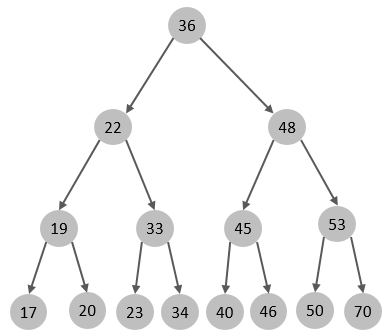  

如果主键是顺序插入的，则会形成一个单向链表，结构如下：

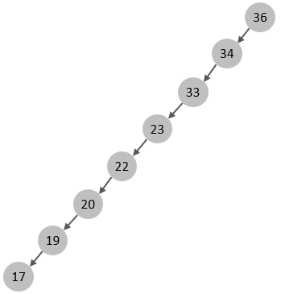 

所以，如果选择二叉树作为索引结构，会存在以下缺点：

- 顺序插入时，会形成一个链表，查询性能大大降低。 

- 大数据量情况下，层级较深，检索速度慢。


此时大家可能会想到，我们可以选择红黑树，红黑树是一颗自平衡二叉树，那这样即使是顺序插入数据，最终形成的数据结构也是一颗平衡的二叉树,结构如下:

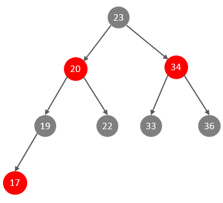 

但是，即使如此，由于红黑树也是一颗二叉树，所以也会存在一个缺点：

- 大数据量情况下，层级较深，检索速度慢。


所以，在MySQL的索引结构中，并没有选择二叉树或者红黑树，而选择的是B+Tree，那么什么是B+Tree呢？在详解B+Tree之前，先来介绍一个B-Tree。


#### 1.2.3 B-Tree 

B-Tree，B树是一种多叉路衡查找树，相对于二叉树，B树每个节点可以有多个分支，即多叉。

以一颗最大度数（max-degree）为5(5阶)的b-tree为例，那这个B树每个节点最多存储4个key，5个指针：

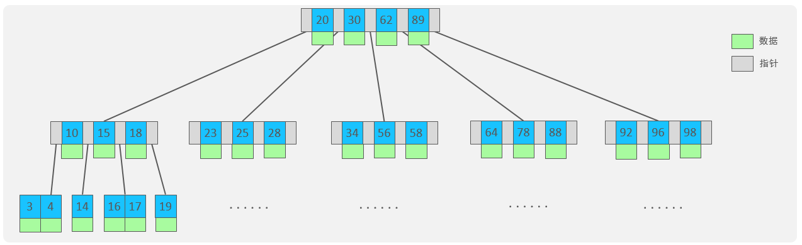 

> 知识小贴士: 树的度数指的是一个节点的子节点个数。


我们可以通过一个数据结构可视化的网站来简单演示一下。 https://www.cs.usfca.edu/~galles/visualization/BTree.html

 

插入一组数据： 100 65 169 368 900 556 780 35 215 1200 234 888 158 90 1000 88 120 268 250 。然后观察一些数据插入过程中，节点的变化情况。

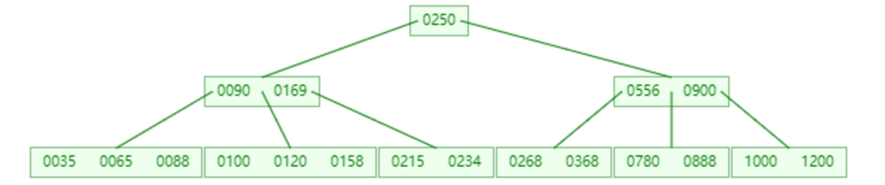 

特点： 

- 5阶的B树，每一个节点最多存储4个key，对应5个指针。
- 一旦节点存储的key数量到达5，就会裂变，中间元素向上分裂。
- 在B树中，非叶子节点和叶子节点都会存放数据。


#### 1.2.4 B+Tree

B+Tree是B-Tree的变种，我们以一颗最大度数（max-degree）为4（4阶）的b+tree为例，来看一下其结构示意图：

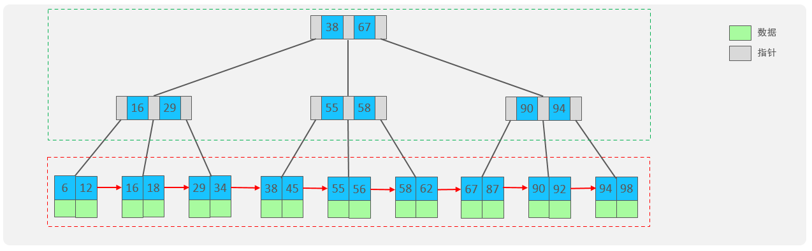 

我们可以看到，两部分：

- 绿色框框起来的部分，是索引部分，仅仅起到索引数据的作用，不存储数据。
- 红色框框起来的部分，是数据存储部分，在其叶子节点中要存储具体的数据。形成单向链表结构


我们可以通过一个数据结构可视化的网站来简单演示一下。 https://www.cs.usfca.edu/~galles/visualization/BPlusTree.html

 

插入一组数据： 100 65 169 368 900 556 780 35 215 1200 234 888 158 90 1000 88 120 268 250 。然后观察一些数据插入过程中，节点的变化情况。

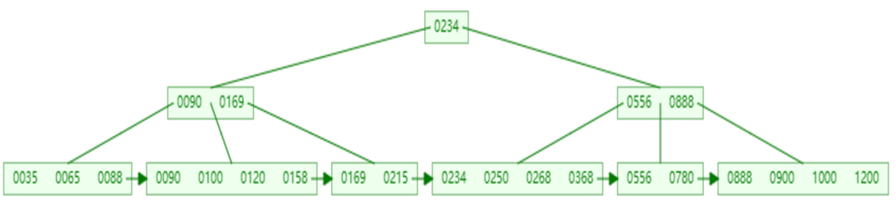 


最终我们看到，B+Tree 与 B-Tree相比，主要有以下三点区别：

- 所有的数据都会出现在叶子节点。 
- 叶子节点形成一个单向链表。
- 非叶子节点仅仅起到索引数据作用，具体的数据都是在叶子节点存放的。


上述我们所看到的结构是标准的B+Tree的数据结构，接下来，我们再来看看MySQL中优化之后的B+Tree。

MySQL索引数据结构对经典的B+Tree进行了优化。在原B+Tree的基础上，增加一个指向相邻叶子节点的链表指针，就形成了带有顺序指针的B+Tree，提高区间访问的性能，利于排序。

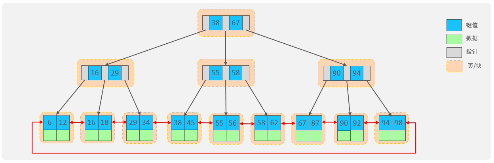 


#### 1.2.5 Hash

MySQL中除了支持B+Tree索引，还支持一种索引类型---Hash索引。

1). 结构

哈希索引就是采用一定的hash算法，将键值换算成新的hash值，映射到对应的槽位上，然后存储在hash表中。

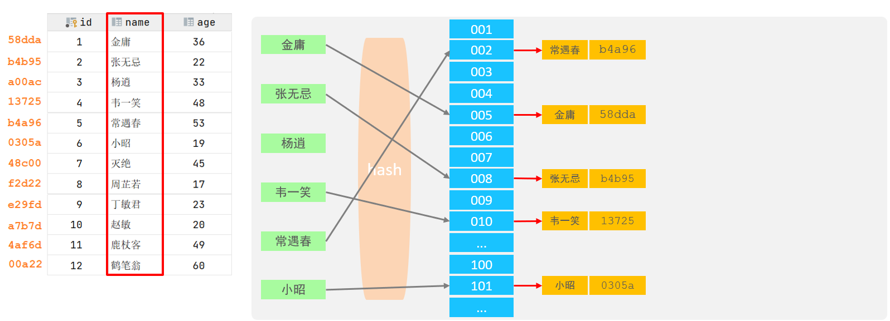 


如果两个(或多个)键值，映射到一个相同的槽位上，他们就产生了hash冲突（也称为hash碰撞），可以通过链表来解决。

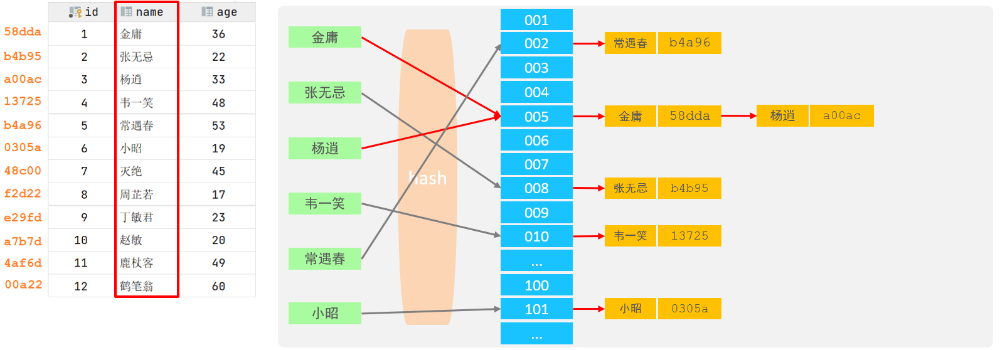 


2). 特点

A. Hash索引只能用于对等比较(=，in)，不支持范围查询（between，>，< ，...）

B. 无法利用索引完成排序操作

C. 查询效率高，通常(不存在hash冲突的情况)只需要一次检索就可以了，效率通常要高于B+tree索引


3). 存储引擎支持

在MySQL中，支持hash索引的是Memory存储引擎。 而InnoDB中具有自适应hash功能，hash索引是InnoDB存储引擎根据B+Tree索引在指定条件下自动构建的。


#### 1.2.6 面试题

> 面试题： 为什么InnoDB存储引擎选择使用B+tree索引结构?
>
> ​	A. 相对于二叉树，层级更少，搜索效率高；
>
> ​	B. 对于B-tree，无论是叶子节点还是非叶子节点，都会保存数据，这样导致一页中存储的键值减少，指针跟着减少，要同样保存大量数据，只能增加树的高度，导致性能降低；
>
> ​	C. 相对Hash索引，B+tree支持范围匹配及排序操作；


### 1.3 索引分类

#### 1.3.1 索引分类

在MySQL数据库，将索引的具体类型主要分为以下几类：主键索引、唯一索引、常规索引、全文索引。

| 分类     | 含义                                                 | 特点                     | 关键字   |
| -------- | ---------------------------------------------------- | ------------------------ | -------- |
| 主键索引 | 针对于表中主键创建的索引                             | 默认自动创建, 只能有一个 | PRIMARY  |
| 唯一索引 | 避免同一个表中某数据列中的值重复                     | 可以有多个               | UNIQUE   |
| 常规索引 | 快速定位特定数据                                     | 可以有多个               |          |
| 全文索引 | 全文索引查找的是文本中的关键词，而不是比较索引中的值 | 可以有多个               | FULLTEXT |


#### 1.3.2 聚集索引&二级索引【非聚集索引】

而在InnoDB存储引擎中，根据索引的存储形式，又可以分为以下两种：

| 分类                       | 含义                                                       | 特点                |
| -------------------------- | ---------------------------------------------------------- | ------------------- |
| 聚集索引(Clustered  Index) | 将数据存储与索引放到了一块，索引结构的叶子节点保存了行数据 | 必须有,而且只有一个 |
| 二级索引(Secondary  Index) | 将数据与索引分开存储，索引结构的叶子节点关联的是对应的主键 | 可以存在多个        |

聚集索引选取规则:

- 如果存在主键，主键索引就是聚集索引。

- 如果不存在主键，将使用第一个唯一（UNIQUE）索引作为聚集索引。

- 如果表没有主键，或没有合适的唯一索引，则InnoDB会自动生成一个rowid作为隐藏的聚集索引。


聚集索引和二级索引的具体结构如下： 

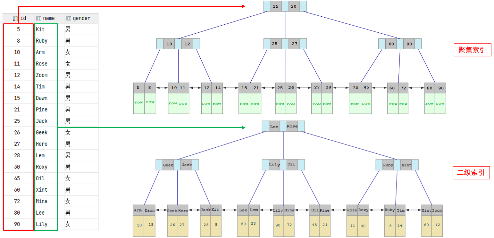 

- 聚集索引的叶子节点下挂的是这一行的数据 。
- 二级索引的叶子节点下挂的是该字段值对应的主键值。


接下来，我们来分析一下，当我们执行如下的SQL语句时，具体的查找过程是什么样子的。

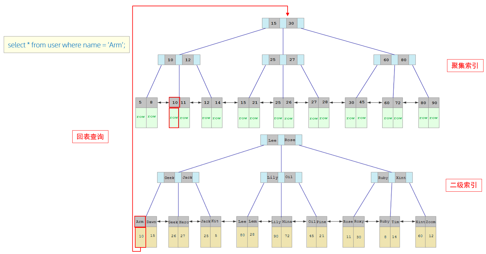 

具体过程如下:

①. 由于是根据name字段进行查询，所以先根据name='Arm'到name字段的二级索引中进行匹配查找。但是在二级索引中只能查找到 Arm 对应的主键值 10。

②. 由于查询返回的数据是*，所以此时，还需要根据主键值10，到聚集索引中查找10对应的记录，最终找到10对应的行row。 

③. 最终拿到这一行的数据，直接返回即可。 


> 回表查询： 这种先到二级索引中查找数据，找到主键值，然后再到聚集索引中根据主键值，获取数据的方式，就称之为回表查询。


> 思考题：
>
> ​	以下两条SQL语句，那个执行效率高? 为什么?
>
> ​	A. select * from user where id = 10 ; 
>
> ​	B. select * from user where name = 'Arm' ;
>
> ​	备注: id为主键，name字段创建的有索引；
>
> ​	
>
> 解答：
>
> ​	A 语句的执行性能要高于B 语句。 
>
> ​	因为A语句直接走聚集索引，直接返回数据。 而B语句需要先查询name字段的二级索引，然后再查询聚集索引，也就是需要进行回表查询。


### 1.4 索引语法

1). 创建索引

```SQL
CREATE  [ UNIQUE | FULLTEXT ]  INDEX  index_name  ON  table_name  ( index_col_name,... ) ;
```

> UNIQUE表示唯一索引，FULLTEXT表示全文索引
>
> INDEX表示索引关键字
>
> index_name设置的自定义索引名称
>
> ON表示是为哪张表设置的索引
>
> table_name表示具体设置索引的表名
>
> index_col_name表示设置索引的列名，可以设置多个列名组成联合索引

2). 查看索引

```SQL
SHOW  INDEX  FROM  table_name ;
```

3). 删除索引

```SQL
DROP  INDEX  index_name  ON  table_name ;
```


**案例演示:** 

先来创建一张表 tb_user，并且查询测试数据。

```SQL
create table tb_user(
	id int primary key auto_increment comment '主键',
	name varchar(50) not null comment '用户名',
	phone varchar(11) not null comment '手机号',
	email varchar(100) comment '邮箱',
	profession varchar(11) comment '专业',
	age tinyint unsigned comment '年龄',
	gender char(1) comment '性别 , 1: 男, 2: 女',
	status char(1) comment '状态',
	createtime datetime comment '创建时间'
) comment '系统用户表';

INSERT INTO tb_user (name, phone, email, profession, age, gender, status, createtime) VALUES ('吕布', '17799990000', 'lvbu666@163.com', '软件工程', 23, '1', '6', '2001-02-02 00:00:00');
INSERT INTO tb_user (name, phone, email, profession, age, gender, status, createtime) VALUES ('曹操', '17799990001', 'caocao666@qq.com', '通讯工程', 33, '1', '0', '2001-03-05 00:00:00');
INSERT INTO tb_user (name, phone, email, profession, age, gender, status, createtime) VALUES ('赵云', '17799990002', '17799990@139.com', '英语', 34, '1', '2', '2002-03-02 00:00:00');
INSERT INTO tb_user (name, phone, email, profession, age, gender, status, createtime) VALUES ('孙悟空', '17799990003', '17799990@sina.com', '工程造价', 54, '1', '0', '2001-07-02 00:00:00');
INSERT INTO tb_user (name, phone, email, profession, age, gender, status, createtime) VALUES ('花木兰', '17799990004', '19980729@sina.com', '软件工程', 23, '2', '1', '2001-04-22 00:00:00');
INSERT INTO tb_user (name, phone, email, profession, age, gender, status, createtime) VALUES ('大乔', '17799990005', 'daqiao666@sina.com', '舞蹈', 22, '2', '0', '2001-02-07 00:00:00');
INSERT INTO tb_user (name, phone, email, profession, age, gender, status, createtime) VALUES ('露娜', '17799990006', 'luna_love@sina.com', '应用数学', 24, '2', '0', '2001-02-08 00:00:00');
INSERT INTO tb_user (name, phone, email, profession, age, gender, status, createtime) VALUES ('程咬金', '17799990007', 'chengyaojin@163.com', '化工', 38, '1', '5', '2001-05-23 00:00:00');
INSERT INTO tb_user (name, phone, email, profession, age, gender, status, createtime) VALUES ('项羽', '17799990008', 'xiaoyu666@qq.com', '金属材料', 43, '1', '0', '2001-09-18 00:00:00');
INSERT INTO tb_user (name, phone, email, profession, age, gender, status, createtime) VALUES ('白起', '17799990009', 'baiqi666@sina.com', '机械工程及其自动化', 27, '1', '2', '2001-08-16 00:00:00');
INSERT INTO tb_user (name, phone, email, profession, age, gender, status, createtime) VALUES ('韩信', '17799990010', 'hanxin520@163.com', '无机非金属材料工程', 27, '1', '0', '2001-06-12 00:00:00');
INSERT INTO tb_user (name, phone, email, profession, age, gender, status, createtime) VALUES ('荆轲', '17799990011', 'jingke123@163.com', '会计', 29, '1', '0', '2001-05-11 00:00:00');
INSERT INTO tb_user (name, phone, email, profession, age, gender, status, createtime) VALUES ('兰陵王', '17799990012', 'lanlinwang666@126.com', '工程造价', 44, '1', '1', '2001-04-09 00:00:00');
INSERT INTO tb_user (name, phone, email, profession, age, gender, status, createtime) VALUES ('狂铁', '17799990013', 'kuangtie@sina.com', '应用数学', 43, '1', '2', '2001-04-10 00:00:00');
INSERT INTO tb_user (name, phone, email, profession, age, gender, status, createtime) VALUES ('貂蝉', '17799990014', '84958948374@qq.com', '软件工程', 40, '2', '3', '2001-02-12 00:00:00');
INSERT INTO tb_user (name, phone, email, profession, age, gender, status, createtime) VALUES ('妲己', '17799990015', '2783238293@qq.com', '软件工程', 31, '2', '0', '2001-01-30 00:00:00');
INSERT INTO tb_user (name, phone, email, profession, age, gender, status, createtime) VALUES ('芈月', '17799990016', 'xiaomin2001@sina.com', '工业经济', 35, '2', '0', '2000-05-03 00:00:00');
INSERT INTO tb_user (name, phone, email, profession, age, gender, status, createtime) VALUES ('嬴政', '17799990017', '8839434342@qq.com', '化工', 38, '1', '1', '2001-08-08 00:00:00');
INSERT INTO tb_user (name, phone, email, profession, age, gender, status, createtime) VALUES ('狄仁杰', '17799990018', 'jujiamlm8166@163.com', '国际贸易', 30, '1', '0', '2007-03-12 00:00:00');
INSERT INTO tb_user (name, phone, email, profession, age, gender, status, createtime) VALUES ('安琪拉', '17799990019', 'jdodm1h@126.com', '城市规划', 51, '2', '0', '2001-08-15 00:00:00');
INSERT INTO tb_user (name, phone, email, profession, age, gender, status, createtime) VALUES ('典韦', '17799990020', 'ycaunanjian@163.com', '城市规划', 52, '1', '2', '2000-04-12 00:00:00');
INSERT INTO tb_user (name, phone, email, profession, age, gender, status, createtime) VALUES ('廉颇', '17799990021', 'lianpo321@126.com', '土木工程', 19, '1', '3', '2002-07-18 00:00:00');
INSERT INTO tb_user (name, phone, email, profession, age, gender, status, createtime) VALUES ('后羿', '17799990022', 'altycj2000@139.com', '城市园林', 20, '1', '0', '2002-03-10 00:00:00');
INSERT INTO tb_user (name, phone, email, profession, age, gender, status, createtime) VALUES ('姜子牙', '17799990023', '37483844@qq.com', '工程造价', 29, '1', '4', '2003-05-26 00:00:00');
```

表结构中插入的数据如下：

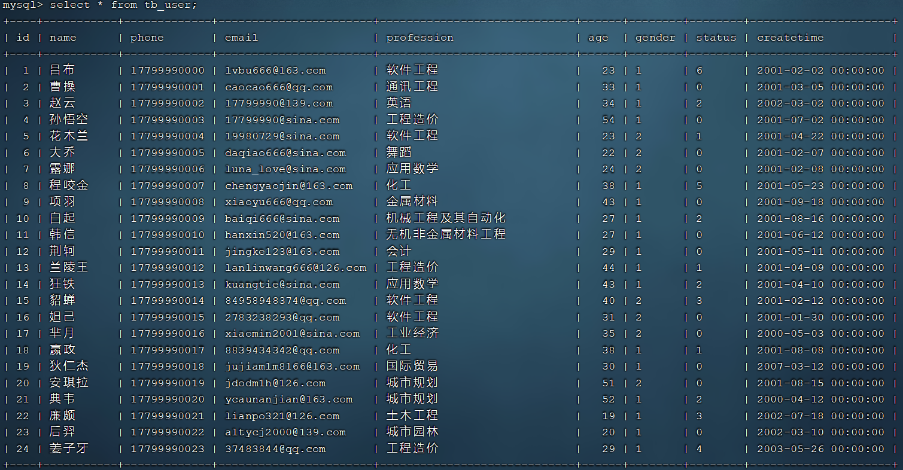 


数据准备好了之后，接下来，我们就来完成如下需求：

A. name字段为姓名字段，该字段的值可能会重复，为该字段创建索引。

```sql
CREATE INDEX idx_user_name ON tb_user(name);
```


B. phone手机号字段的值，是非空，且唯一的，为该字段创建唯一索引。

```sql
CREATE UNIQUE INDEX idx_user_phone ON tb_user(phone);
```


C. 为profession、age、status创建联合索引。

```sql
CREATE INDEX idx_user_pro_age_sta ON tb_user(profession,age,status);
```


D. 为email建立合适的索引来提升查询效率。

```sql
CREATE INDEX idx_email ON tb_user(email);
```


完成上述的需求之后，我们再查看tb_user表的所有的索引数据。

```sql
show index from tb_user;
```

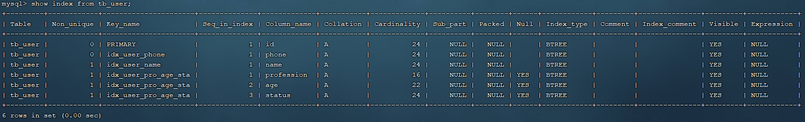 


### 1.5 SQL性能分析

#### 1.5.1 SQL执行频率

MySQL 客户端连接成功后，通过 show [session|global] status 命令可以提供服务器状态信息。通过如下指令，可以查看当前数据库的INSERT、UPDATE、DELETE、SELECT的访问频次：

```SQL
-- session 是查看当前会话 ;
-- global 是查询全局数据 ; Com后面是七个下划线
SHOW  GLOBAL STATUS LIKE  'Com_______'; 
```

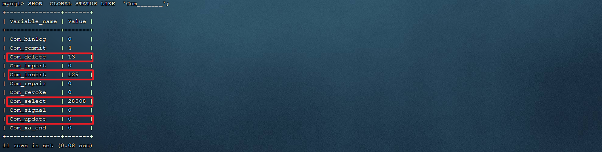 

Com_delete: 删除次数

Com_insert: 插入次数

Com_select: 查询次数

Com_update: 更新次数

我们可以在当前数据库再执行几次查询操作，然后再次查看执行频次，看看 Com_select 参数会不会变化。

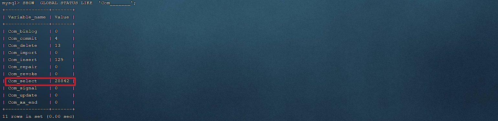 


> 通过上述指令，我们可以查看到当前数据库到底是以查询为主，还是以增删改为主，从而为数据库优化提供参考依据。 如果是以增删改为主，我们可以考虑不对其进行索引的优化。 如果是以查询为主，那么就要考虑对数据库的索引进行优化了。

那么通过查询SQL的执行频次，我们就能够知道当前数据库到底是增删改为主，还是查询为主。 那假如说是以查询为主，我们又该如何定位针对于那些查询语句进行优化呢？ 次数我们可以借助于慢查询日志。

接下来，我们就来介绍一下MySQL中的慢查询日志。


#### 1.5.2 慢查询日志

##### 开启慢查询日志

慢查询日志记录了所有执行时间超过指定参数（long_query_time，单位：秒，默认10秒）的所有SQL语句的日志。

MySQL的慢查询日志默认没有开启，我们可以查看一下系统变量 slow_query_log。

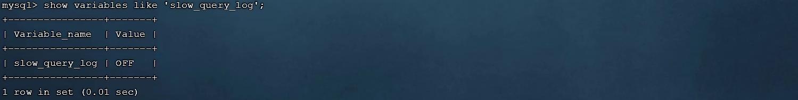 

如果要开启慢查询日志，需要在MySQL的配置文件docker容器（/root/mysql/conf/my.cnf）中配置如下信息：

```properties
[mysqld]
# 开启MySQL慢日志查询开关
slow_query_log=1
# 设置慢日志的时间为2秒，SQL语句执行时间超过2秒，就会视为慢查询，记录慢查询日志
long_query_time=2
```


配置完毕之后，通过以下指令重新启动MySQL服务器进行测试

docker方式重启mysql

```shell
docker restart mysql
```

然后，再次查看开关情况，慢查询日志就已经打开了。

```sql
-- 进入容器内部
docker exec -it mysql bash
-- 登录用户
mysql -uroot -proot
-- 执行查看慢日志
show variables like 'slow_query_log';
```

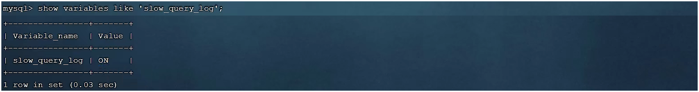 

查看慢日志文件中记录的信息 /root/mysql/data/xxx-slow.log。

```
cd /root/mysql/data
cat xxx-slow.log
```

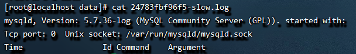

##### 测试慢查询操作：

###### 0、准备tb_sku表的sql

在资料中有1000w条数据的表，每个sql中包含了200w的数据，分五次执行。

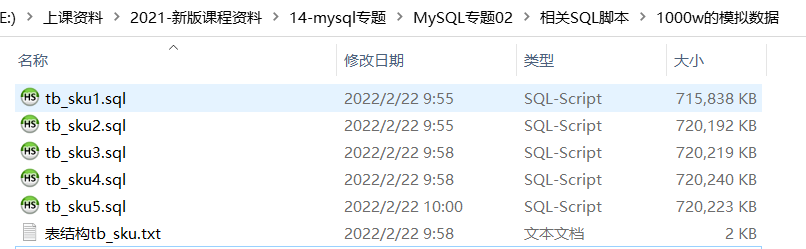

- 执行表结构创建表tb_sku
- 把这个五个sql上传到linux中的 /root/mysql/data目录下。该目录是映射docker容器内部的目录挂载的文件夹

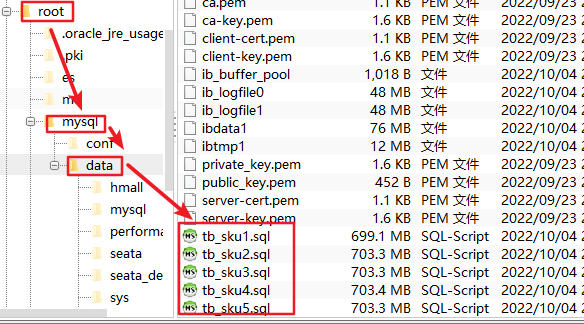

- 接下来进入容器内部，然后执行批量导入数据的操作

```sql
-- 进入容器内部
docker exec -it mysql bash
-- 登录用户名和密码
mysql -uroot -proot

-- 切换数据库
use 148test
-- 批量导入五个sql
load data local infile '/var/lib/mysql/tb_sku1.sql' into table `tb_sku` fields terminated by ',' lines terminated by '\n';

load data local infile '/var/lib/mysql/tb_sku2.sql' into table `tb_sku` fields terminated by ',' lines terminated by '\n';

load data local infile '/var/lib/mysql/tb_sku3.sql' into table `tb_sku` fields terminated by ',' lines terminated by '\n';

load data local infile '/var/lib/mysql/tb_sku4.sql' into table `tb_sku` fields terminated by ',' lines terminated by '\n';

load data local infile '/var/lib/mysql/tb_sku5.sql' into table `tb_sku` fields terminated by ',' lines terminated by '\n';
```

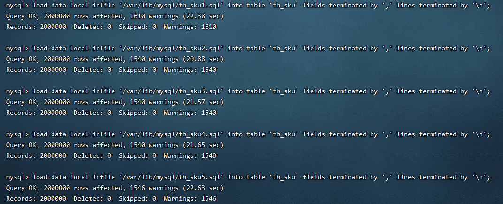


###### 1、执行如下SQL语句 ： 

```
select * from tb_user; -- 这条SQL执行效率比较高, 执行耗时 0.00sec
select count(*) from tb_sku; -- 由于tb_sku表中, 预先存入了1000w的记录, count一次,耗时 13.35sec
```

 


###### 2、检查慢查询日志 ：

最终我们发现，在慢查询日志中，只会记录执行时间超多我们预设时间（2s）的SQL，执行较快的SQL是不会记录的。 

```sql
-- 动态查询日志文件
tail -f xxx-slow.log
```

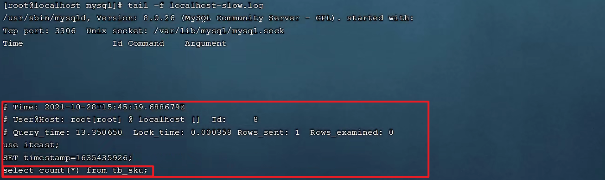 

那这样，通过慢查询日志，就可以定位出执行效率比较低的SQL，从而有针对性的进行优化。


#### 1.5.3 profile详情

show profiles 能够在做SQL优化时帮助我们了解时间都耗费到哪里去了。通过have_profiling参数，能够看到当前MySQL是否支持profile操作：

```sql
SELECT  @@have_profiling ;

select @@profiling;
```

 

可以看到，当前MySQL是支持 profile操作的，但是开关是关闭的。可以通过set语句在session/global级别开启profiling：

```
SET  profiling = 1;
```


开关已经打开了，接下来，我们所执行的SQL语句，都会被MySQL记录，并记录执行时间消耗到哪儿去了。 我们直接执行如下的SQL语句：

```sql
select * from tb_user;
select * from tb_user where id = 1;
select * from tb_user where name = '白起';
select count(*) from tb_sku;
```


执行一系列的业务SQL的操作，然后通过如下指令查看指令的执行耗时：

```sql
-- 查看每一条SQL的耗时基本情况
show profiles;

-- 查看指定query_id的SQL语句各个阶段的耗时情况
show profile  for  query query_id;

-- 查看指定query_id的SQL语句CPU的使用情况
show profile  cpu for  query query_id;
```

查看每一条SQL的耗时情况: 

 

查看指定SQL各个阶段的耗时情况 : 

** **


#### 1.5.4 explain执行计划

###### explain介绍

EXPLAIN 或者 DESC命令获取 MySQL 如何执行 SELECT 语句的信息，包括在 SELECT 语句执行过程中表如何连接和连接的顺序。

语法:

```SQL
-- 直接在select语句之前加上关键字 explain / desc
EXPLAIN   SELECT   字段列表   FROM   表名   WHERE  条件 ;
```

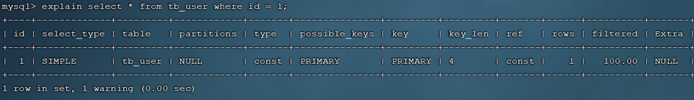 


Explain 执行计划中各个字段的含义:

| 字段         | 含义                                                         |
| ------------ | ------------------------------------------------------------ |
| id           | select查询的序列号，表示查询中执行select子句或者是操作表的顺序(id相同，执行顺序从上到下；id不同，值越大，越先执行)。 |
| select_type  | 表示 SELECT 的类型，常见的取值有 SIMPLE（简单表，即不使用表连接或者子查询）、PRIMARY（主查询，即外层的查询）、<br/>UNION（UNION 中的第二个或者后面的查询语句）、SUBQUERY（SELECT/WHERE之后包含了子查询）等 |
| type         | 表示连接类型，性能由好到差的连接类型为NULL、system、const、eq_ref、ref、range、 index、all 。 |
| possible_key | 显示可能应用在这张表上的索引，一个或多个。                   |
| key          | 实际使用的索引，如果为NULL，则没有使用索引。                 |
| key_len      | 表示索引中使用的字节数， 该值为索引字段最大可能长度，并非实际使用长度，在不损失精确性的前提下， 长度越短越好 。 |
| rows         | MySQL认为必须要执行查询的行数，在innodb引擎的表中，是一个估计值，可能并不总是准确的。 |
| filtered     | 表示返回结果的行数占需读取行数的百分比， filtered 的值越大越好。 |

###### explain详解id字段

单表查询执行计划只有一条，但是如果是多表查询的话，那么执行计划就可能是多条了。

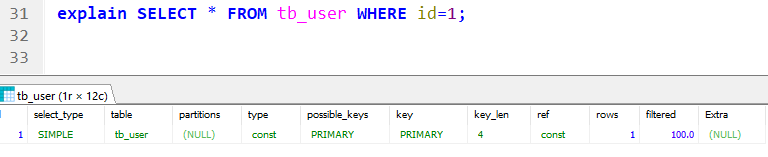

**第一步，引入多表的sql脚本，执行红框内的sql脚本**

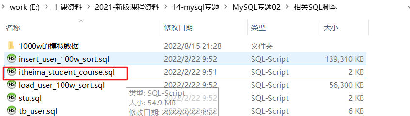

最终会生成三张表，其中student和course是多对多关系，student_course是中间表


**第二步，操作执行计划中相同id字段的情况**

需求：查询出每个学生所对应的课程情况

sql语句

```sql
SELECT s.*,c.* FROM student s,course c,student_course sc WHERE s.id=sc.studentid AND c.id=sc.courseid;
```

执行计划

```sql
EXPLAIN SELECT s.*,c.* FROM student s,course c,student_course sc WHERE s.id=sc.studentid AND c.id=sc.courseid;
```

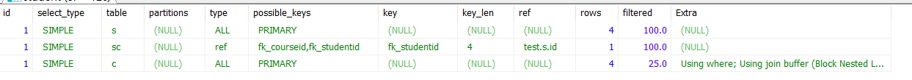

从上图上看发现id都是一样的，那么执行顺序是从上往下执行的。


**第三步，操作i执行计划中id不同的情况**

需求：查询选修了MySQL的课程的学生(使用子查询)

sql语句

```sql
-- 查询出MySQL课程的id
SELECT id FROM course c WHERE c.name='MySQL';
-- 根据课程id查询中间表,获取学生id
SELECT sc.studentid FROM student_course sc WHERE sc.courseid=3;
-- 根据学生id集合查询学生表
SELECT * FROM student s WHERE s.id IN(1,2);

-- 整体sql
SELECT * FROM student s WHERE s.id IN(SELECT sc.studentid FROM student_course sc WHERE sc.courseid=(SELECT id FROM course c WHERE c.name='MySQL'));
```

执行计划

```sql
explain SELECT * FROM student  s WHERE s.id IN(SELECT studentid FROM student_course sc WHERE sc.courseid=(SELECT id FROM course c WHERE c.name='MySQL'));
```

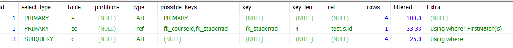

从图上来看，发现先执行id=3的c,然后在执行id=1的s,最后是sc


###### explain详解type字段

查询主键条件

```sql
EXPLAIN SELECT * FROM tb_user WHERE id=1;
```

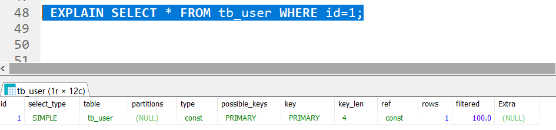

发现type类型是const的，一般是查询主键条件的时候出现


不查询任何表

```
 EXPLAIN SELECT 'A'
```

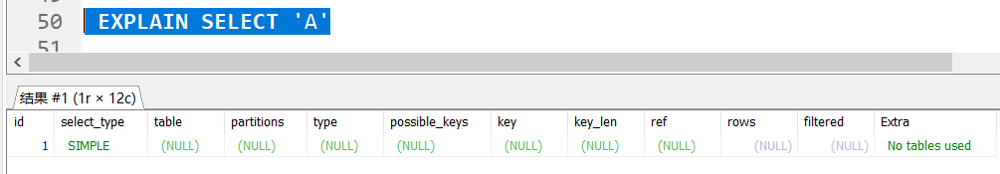

没有查询任何表的时候，type类型是NULL,性能最好


查询唯一性索引的条件，注意前提是name要设置索引

```sql
 EXPLAIN SELECT * FROM tb_user WHERE NAME='白起';
```

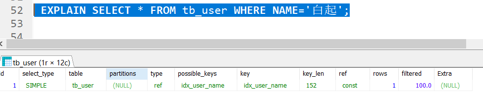

所以，当查询条件为唯一性索引的时候，type类型值是ref


### 1.6 索引使用

#### 1.6.1 验证索引效率

在讲解索引的使用原则之前，先通过一个简单的案例，来验证一下索引，看看是否能够通过索引来提升数据查询性能。在演示的时候，我们还是使用之前准备的一张表 tb_sku , 在这张表中准备了1000w的记录。

 

这张表中id为主键，有主键索引，而其他字段是没有建立索引的。 我们先来查询其中的一条记录，看看里面的字段情况，执行如下SQL：

```
select * from tb_sku where id = 1;
```

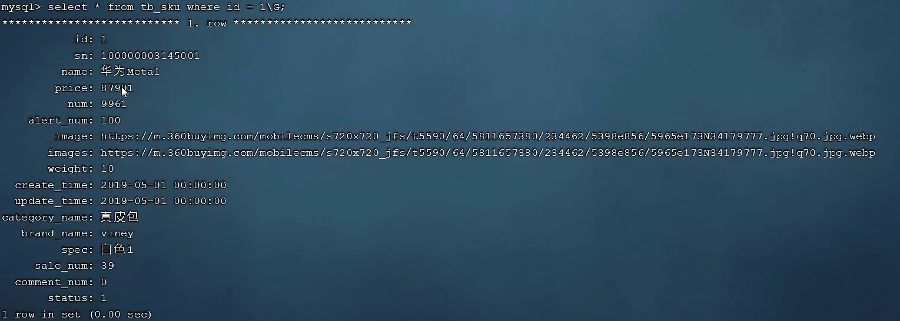 

可以看到即使有1000w的数据,根据id进行数据查询,性能依然很快，因为主键id是有索引的。 那么接下来，我们再来根据 sn 字段进行查询，执行如下SQL：

```sql
SELECT * FROM  tb_sku  WHERE sn = '100000003145001';
```

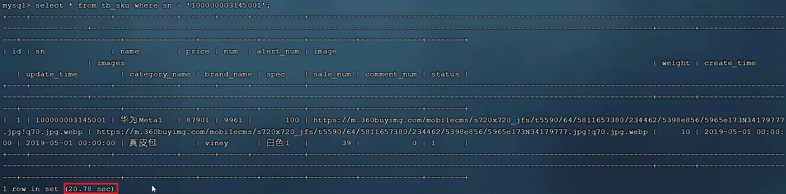 

我们可以看到根据sn字段进行查询，查询返回了一条数据，结果耗时 20.78sec，就是因为sn没有索引，而造成查询效率很低。

那么我们可以针对于sn字段，建立一个索引，建立了索引之后，我们再次根据sn进行查询，再来看一下查询耗时情况。

创建索引：

```sql
create  index  idx_sku_sn  on  tb_sku(sn) ;
```

 


然后再次执行相同的SQL语句，再次查看SQL的耗时。

```sql
SELECT * FROM  tb_sku  WHERE sn = '100000003145001';
```

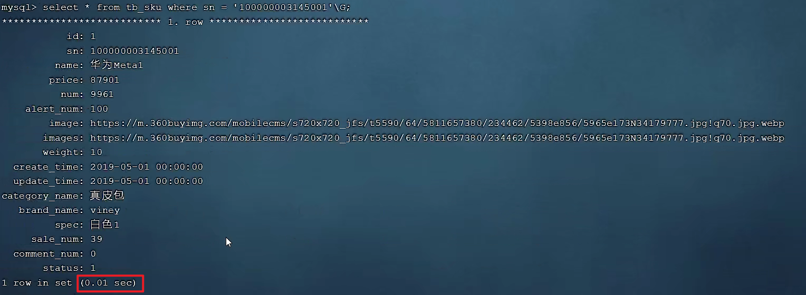 


我们明显会看到，sn字段建立了索引之后，查询性能大大提升。建立索引前后，查询耗时都不是一个数量级的。


#### 1.6.2 最左前缀法则

如果索引了多列（联合索引），要遵守最左前缀法则。最左前缀法则指的是查询从索引的最左列开始，并且不跳过索引中的列。==如果跳跃某一列，索引将会部分失效(后面的字段索引失效)==。

以 tb_user 表为例，我们先来查看一下之前 tb_user 表所创建的索引。

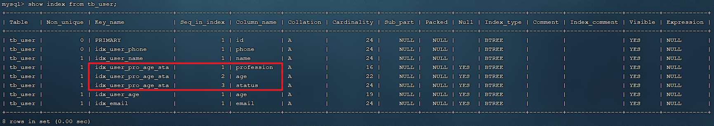 

在 tb_user 表中，有一个联合索引，这个联合索引涉及到三个字段，顺序分别为：profession，age，status。 

对于最左前缀法则指的是，查询时，最左变的列，也就是profession必须存在，否则索引全部失效。 而且中间不能跳过某一列，否则该列后面的字段索引将失效。 接下来，我们来演示几组案例，看一下具体的执行计划：

```
explain select * from tb_user where profession = '软件工程' and age = 31 and status = '0';
```

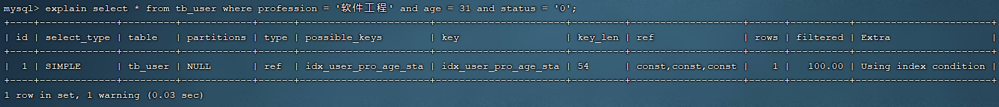 


```
explain select * from tb_user where profession = '软件工程' and age = 31;
```

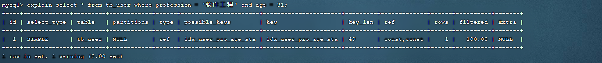 


```
explain select * from tb_user where profession = '软件工程';
```

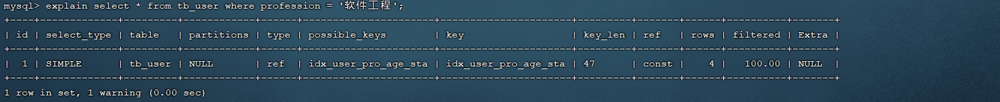  

以上的这三组测试中，我们发现只要联合索引最左边的字段 profession存在，索引就会生效，只不过索引的长度不同。 而且由以上三组测试，我们也可以推测出profession字段索引长度为47、age字段索引长度为2、status字段索引长度为5。


```
explain select * from tb_user where age = 31 and status = '0';
```

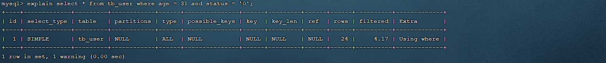 


```
explain select * from tb_user where status = '0';
```

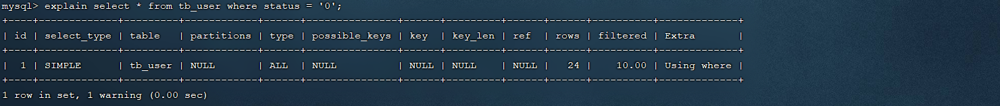 

而通过上面的这两组测试，我们也可以看到索引并未生效，原因是因为不满足最左前缀法则，联合索引最左边的列profession不存在。


```
explain select * from tb_user where profession = '软件工程' and status = '0';
```

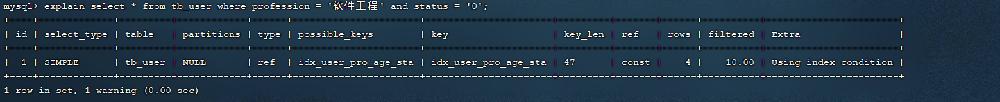

上述的SQL查询时，存在profession字段，最左边的列是存在的，索引满足最左前缀法则的基本条件。但是查询时，跳过了age这个列，所以后面的列索引是不会使用的，也就是索引部分生效，所以索引的长度就是47。


> 思考题： 
>
> ​	当执行SQL语句: explain select * from tb_user where age = 31 and status = '0' and profession = '软件工程'；  时，是否满足最左前缀法则，走不走上述的联合索引，索引长度？
>
> ​	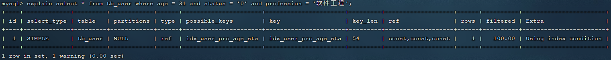 
>
> ​	可以看到，是完全满足最左前缀法则的，索引长度54，联合索引是生效的。
>
> ​	
>
> ​	注意 ： 最左前缀法则中指的最左边的列，是指在查询时，联合索引的最左边的字段(即是第一个字段)必须存在，与我们编写SQL时，条件编写的先后顺序无关。


#### 1.6.3 范围查询

联合索引中，出现范围查询(>,<)，范围查询右侧的列索引失效。

```
explain select * from tb_user where profession = '软件工程' and age > 30 and status = '0';
```

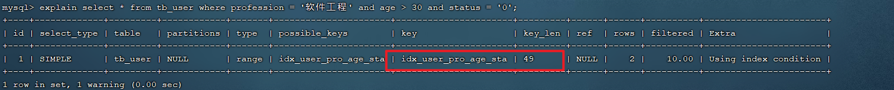 

当范围查询使用> 或 < 时，走联合索引了，但是索引的长度为49，就说明范围查询右边的status字段是没有走索引的。


```
explain select * from tb_user where profession = '软件工程' and age >= 30 and status = '0';
```

 

当范围查询使用>= 或 <= 时，走联合索引了，但是索引的长度为54，就说明所有的字段都是走索引的。


所以，在业务允许的情况下，尽可能的使用类似于 >= 或 <= 这类的范围查询，而避免使用 > 或 < 。


#### 1.6.4 索引失效情况

##### 1.6.4.1 索引列运算

不要在索引列上进行运算操作， 索引将失效。


在tb_user表中，除了前面介绍的联合索引之外，还有一个索引，是phone字段的单列索引。

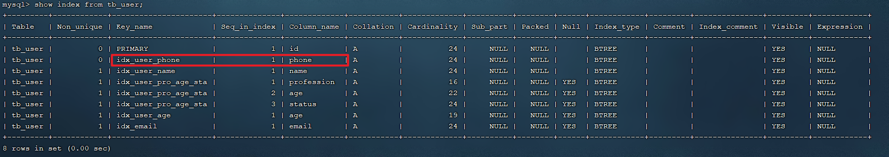 


A. 当根据phone字段进行等值匹配查询时, 索引生效。

```sql
explain select * from tb_user where phone = '17799990015';
```

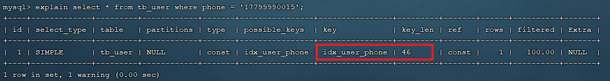 


B. 当根据phone字段进行函数运算操作之后，索引失效。

```sql
explain  select  *  from  tb_user  where  substring(phone,10,2) = '15';
```

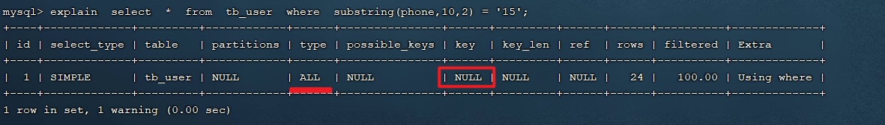 


##### 1.6.4.2 字符串不加引号

字符串类型字段使用时，不加引号，索引将失效。


接下来，我们通过两组示例，来看看对于字符串类型的字段，加单引号与不加单引号的区别：

```sql
explain select * from tb_user where profession = '软件工程' and age = 31 and status = '0';
explain select * from tb_user where profession = '软件工程' and age = 31 and status = 0;
```

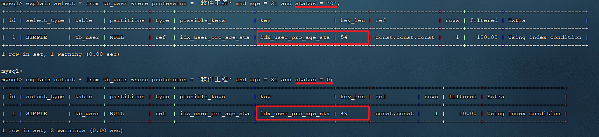 


```
explain select * from tb_user where phone = '17799990015';
explain select * from tb_user where phone = 17799990015;
```

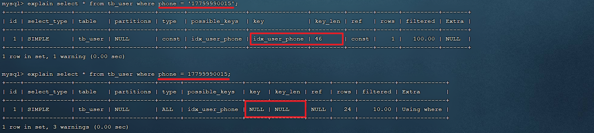 


经过上面两组示例，我们会明显的发现，如果字符串不加单引号，对于查询结果，没什么影响，但是数据库存在隐式类型转换，索引将失效。


##### 1.6.4.3 模糊查询

如果仅仅是尾部模糊匹配，索引不会失效。如果是头部模糊匹配，索引失效。


接下来，我们来看一下这三条SQL语句的执行效果，查看一下其执行计划：

由于下面查询语句中，都是根据profession字段查询，符合最左前缀法则，联合索引是可以生效的，我们主要看一下，模糊查询时，%加在关键字之前，和加在关键字之后的影响。

```SQL
explain  select  *  from  tb_user  where  profession like '软件%';
explain  select  *  from  tb_user  where  profession like '%工程';
explain  select  *  from  tb_user  where  profession like '%工%';
```

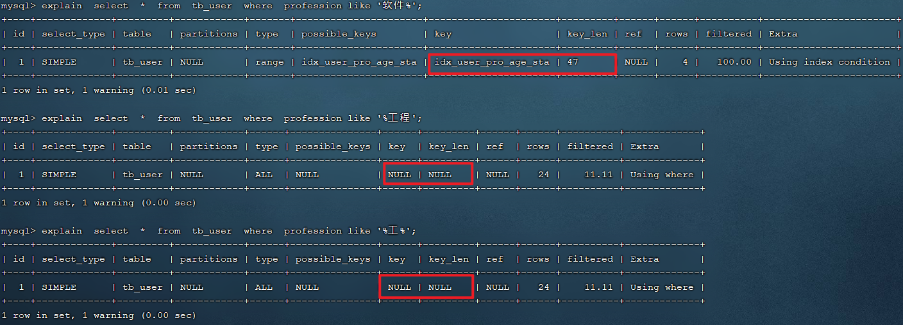 


经过上述的测试，我们发现，在like模糊查询中，在关键字后面加%，索引可以生效。而如果在关键字前面加了%，索引将会失效。


##### 1.6.4.4 or连接条件

用or分割开的条件， 如果or前的条件中的列有索引，而后面的列中没有索引，那么涉及的索引都不会被用到。

```sql
explain select * from tb_user where id = 10 or age = 23;
explain select * from tb_user where phone = '17799990017' or age = 23;
```

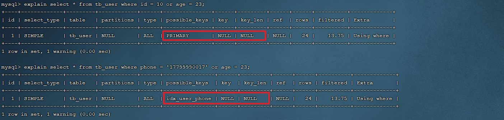 

由于age没有索引，所以即使id、phone有索引，索引也会失效。所以需要针对于age也要建立索引。


然后，我们可以对age字段建立索引。

```sql
 create index idx_user_age on tb_user(age);
```

 

建立了索引之后，我们再次执行上述的SQL语句，看看前后执行计划的变化。

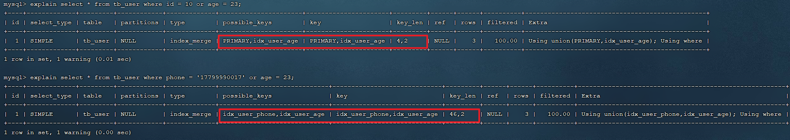 

最终，我们发现，当or连接的条件，左右两侧字段都有索引时，索引才会生效。


##### 1.6.4.5 数据分布影响

如果MySQL评估使用索引比全表更慢，则不使用索引。


```sql
explain select * from tb_user where phone >= '17799990005';
explain select * from tb_user where phone >= '17799990015';
```

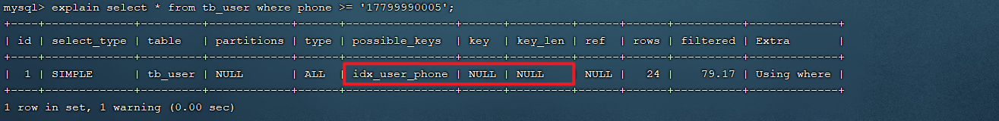 

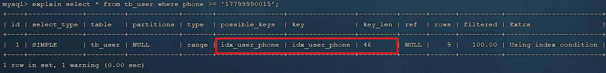 

经过测试我们发现，相同的SQL语句，只是传入的字段值不同，最终的执行计划也完全不一样，这是为什么呢？ 

就是因为MySQL在查询时，会评估使用索引的效率与走全表扫描的效率，如果走全表扫描更快，则放弃索引，走全表扫描。 因为索引是用来索引少量数据的，如果通过索引查询返回大批量的数据，则还不如走全表扫描来的快，此时索引就会失效。


接下来，我们再来看看 is null 与 is not null 操作是否走索引。

执行如下两条语句 ：

```sql
explain select * from tb_user where profession is null;
explain select * from tb_user where profession is not null;
```

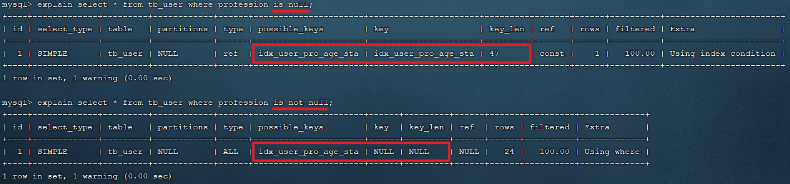 

接下来，我们做一个操作将profession字段值全部更新为null。

 

然后，再次执行上述的两条SQL，查看SQL语句的执行计划。 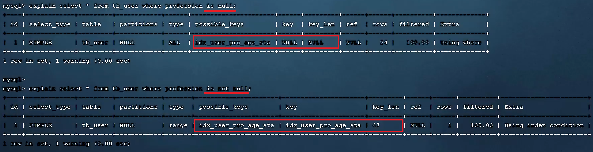

最终我们看到，一模一样的SQL语句，先后执行了两次，结果查询计划是不一样的，为什么会出现这种现象，这是和数据库的数据分布有关系。查询时MySQL会评估，走索引快，还是全表扫描快，如果全表扫描更快，则放弃索引走全表扫描。 因此，is null 、is not null是否走索引，得具体情况具体分析，并不是固定的。


#### 1.6.5 SQL提示

目前tb_user表的数据情况如下:

注意：数据profession要重新恢复

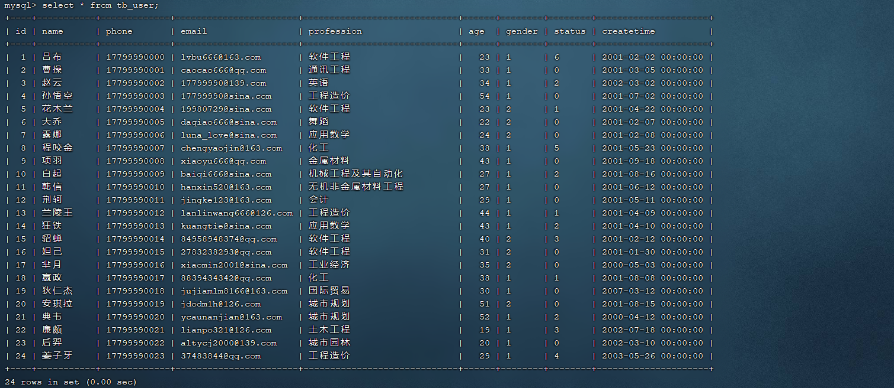 

索引情况如下:

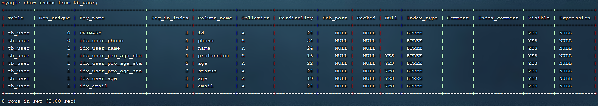 


A. 执行SQL : explain select * from tb_user where profession = '软件工程';

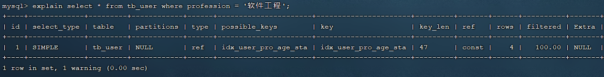 

查询走了联合索引。


B. 执行SQL，创建profession的单列索引：create index idx_user_pro on tb_user(profession);

  


C. 创建单列索引后，再次执行A中的SQL语句，查看执行计划，看看到底走哪个索引。

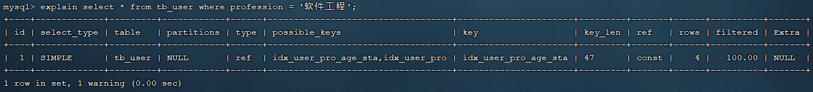 

测试结果，我们可以看到，possible_keys中 idx_user_pro_age_sta,idx_user_pro 这两个索引都可能用到，最终MySQL选择了idx_user_pro_age_sta索引。这是MySQL自动选择的结果。


那么，我们能不能在查询的时候，自己来指定使用哪个索引呢？ 答案是肯定的，此时就可以借助于MySQL的SQL提示来完成。 接下来，介绍一下SQL提示。


SQL提示，是优化数据库的一个重要手段，简单来说，就是在SQL语句中加入一些人为的提示来达到优化操作的目的。

1). use index ： 建议MySQL使用哪一个索引完成此次查询（仅仅是建议，mysql内部还会再次进行评估）。

```sql
explain select * from tb_user use index(idx_user_pro) where profession = '软件工程';
```

2). ignore index ： 忽略指定的索引。

```sql
explain select * from tb_user ignore index(idx_user_pro) where profession = '软件工程';
```

3). force index ： 强制使用索引。

```sql
explain select * from tb_user force index(idx_user_pro) where profession = '软件工程';
```


示例演示： 

A. use index 【建议使用索引】

```sql
explain select * from tb_user use index(idx_user_pro) where profession = '软件工程';
```

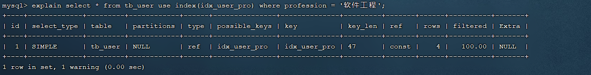 


B. ignore index 【忽略索引】

```sql
explain select * from tb_user ignore index(idx_user_pro) where profession = '软件工程';
```

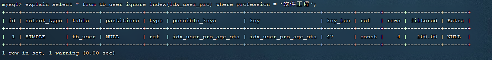 


C. force index 【强制索引】

```sql
explain select * from tb_user force index(idx_user_pro_age_sta) where profession = '软件工程';
```

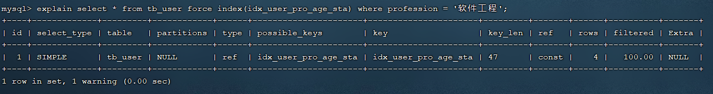 


#### 1.6.6 覆盖索引

尽量使用覆盖索引，减少select *。 那么什么是覆盖索引呢？ 覆盖索引是指 查询使用了索引，并且需要返回的列，在该索引中已经全部能够找到 。


把上述的 idx_user_age, idx_email 这两个之前测试使用过的索引直接删除。避免造成干扰

```sql
drop index idx_user_age on tb_user;
drop index idx_email on tb_user;
```


接下来，我们来看一组SQL的执行计划，看看执行计划的差别，然后再来具体做一个解析。

```SQL
explain select id, profession from tb_user where profession = '软件工程' and age = 31 and status = '0' ;

explain select id,profession,age, status from tb_user where profession = '软件工程' and age = 31 and status = '0' ;

explain select id,profession,age, status, name from tb_user where profession = '软件工程' and age = 31 and status = '0' ;

explain select * from tb_user where profession = '软件工程' and age = 31 and status = '0';
```

上述这几条SQL的执行结果为: 

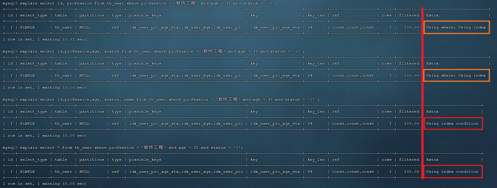 


从上述的执行计划我们可以看到，这四条SQL语句的执行计划前面所有的指标都是一样的，看不出来差异。但是此时，我们主要关注的是后面的Extra，前面两条SQL的结果为 Using where; Using Index ; 而后面两条SQL的结果为: Using index condition 。

| Extra                    | 含义                                                         |
| ------------------------ | ------------------------------------------------------------ |
| Using where; Using Index | 查找使用了索引，但是需要的数据都在索引列中能找到，所以不需要回表查询数据 |
| Using index condition    | 查找使用了索引，但是需要回表查询数据                         |


因为，在tb_user表中有一个联合索引 idx_user_pro_age_sta，该索引关联了三个字段 profession、age、status，而这个索引也是一个二级索引，所以叶子节点下面挂的是这一行的主键id。 所以当我们查询返回的数据在 id、profession、age、status 之中，则直接走二级索引直接返回数据了。 如果超出这个范围，就需要拿到主键id，再去扫描聚集索引，再获取额外的数据了，这个过程就是回表。 而我们如果一直使用select * 查询返回所有字段值，很容易就会造成回表查询（除非是根据主键查询，此时只会扫描聚集索引）。


为了大家更清楚的理解，什么是覆盖索引，什么是回表查询，我们一起再来看下面的这组SQL的执行过程。

A. 表结构及索引示意图:

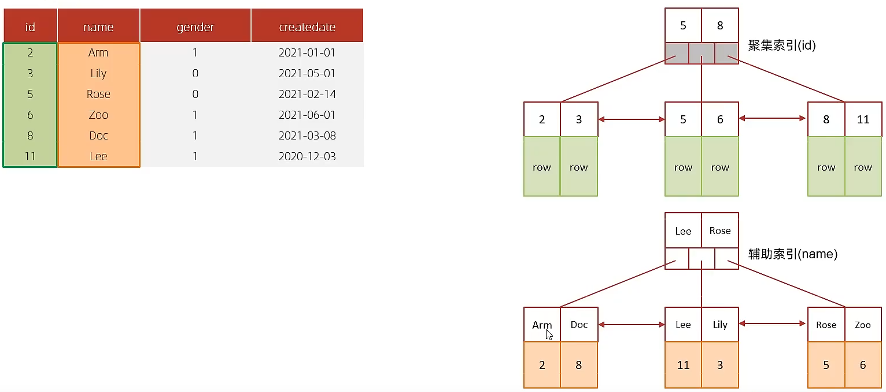   

id是主键，是一个聚集索引。 name字段建立了普通索引，是一个二级索引（辅助索引）。


B. 执行SQL : select * from tb_user where id = 2;

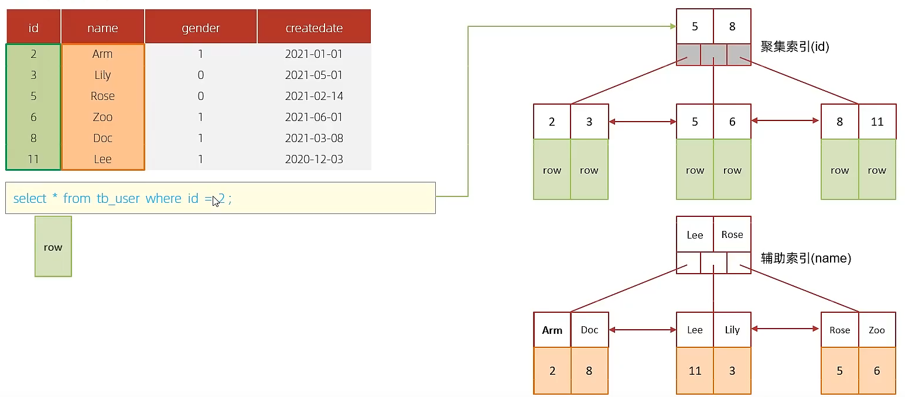 

根据id查询，直接走聚集索引查询，一次索引扫描，直接返回数据，性能高。


C. 执行SQL：selet id,name from tb_user where name = 'Arm';

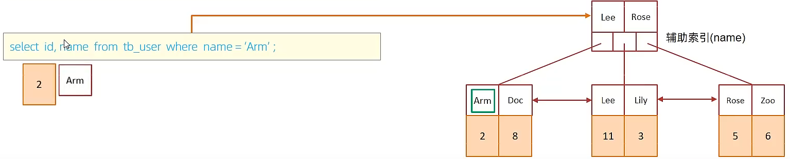 

虽然是根据name字段查询，查询二级索引，但是由于查询返回在字段为 id，name，在name的二级索引中，这两个值都是可以直接获取到的，因为覆盖索引，所以不需要回表查询，性能高。


D.  执行SQL：selet id,name,gender from tb_user where name = 'Arm';

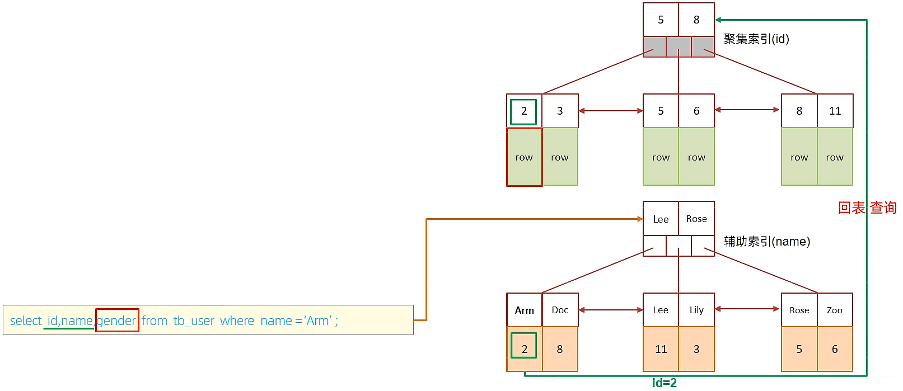  

由于在name的二级索引中，不包含gender，所以，需要两次索引扫描，也就是需要回表查询，性能相对较差一点。


> 思考题： 
>
> ​	一张表, 有四个字段(id, username, password, status), 由于数据量大, 需要对以下SQL语句进行优化, 该如何进行才是最优方案:
>
> ​	select id,username,password from tb_user where username = 'itcast';
>
> ​	
>
> ​	答案: 针对于 username, password建立联合索引, sql为: create index idx_user_name_pass on tb_user(username,password); 
>
> ​	这样可以避免上述的SQL语句，在查询的过程中，出现回表查询。


#### 1.6.7 前缀索引

当字段类型为字符串（varchar，text，longtext等）时，有时候需要索引很长的字符串，这会让索引变得很大，查询时，浪费大量的磁盘IO， 影响查询效率。此时可以只将字符串的一部分前缀，建立索引，这样可以大大节约索引空间，从而提高索引效率。

1). 语法

```sql
create index  idx_xxxx on table_name(column(n)) ;
```


示例:

为tb_user表的email字段，建立长度为5的前缀索引。 

```sql
create index idx_email_5 on tb_user(email(5));
```

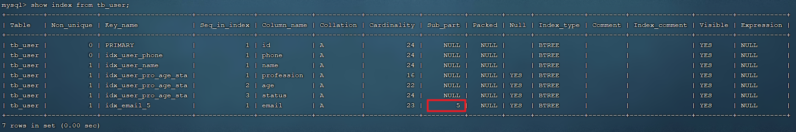 


2). 前缀长度

 可以根据索引的选择性来决定，而选择性是指不重复的索引值（基数）和数据表的记录总数的比值，索引选择性越高则查询效率越高， 唯一索引的选择性是1，这是最好的索引选择性，性能也是最好的。

```sql
select  count(distinct email) / count(*)   from  tb_user ;
select  count(distinct substring(email,1,5)) / count(*)  from  tb_user ;
```


3). 前缀索引的查询流程

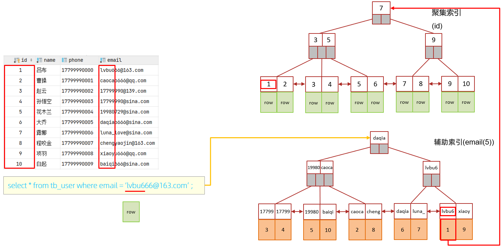 


#### 1.6.8 单列索引与联合索引

单列索引：即一个索引只包含单个列。

联合索引：即一个索引包含了多个列。


我们先来看看 tb_user 表中目前的索引情况:

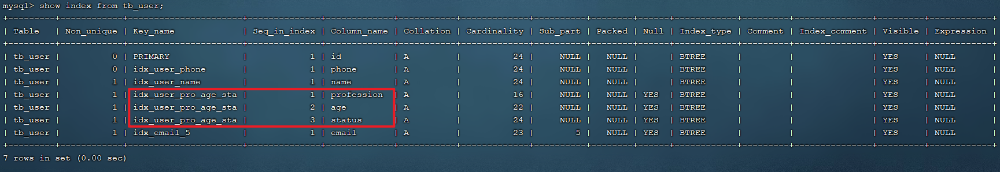 

在查询出来的索引中，既有单列索引，又有联合索引。 


接下来，我们来执行一条SQL语句，看看其执行计划：

**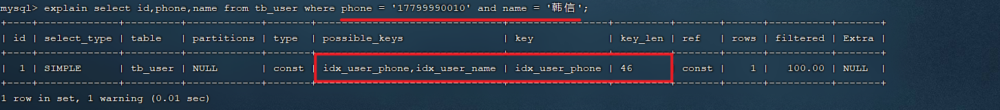 **

通过上述执行计划我们可以看出来，在and连接的两个字段 phone、name上都是有单列索引的，但是最终mysql只会选择一个索引，也就是说，只能走一个字段的索引，此时是会回表查询的。


紧接着，我们再来创建一个phone和name字段的联合索引来查询一下执行计划。

```sql
create unique index idx_user_phone_name on tb_user(phone,name);
```

 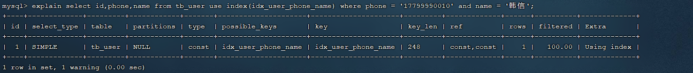 

此时，查询时，就走了联合索引，而在联合索引中包含 phone、name的信息，在叶子节点下挂的是对应的主键id，所以查询是无需回表查询的。


> 在业务场景中，如果存在多个查询条件，考虑针对于查询字段建立索引时，建议建立联合索引，而非单列索引。

如果查询使用的是联合索引，具体的结构示意图如下：

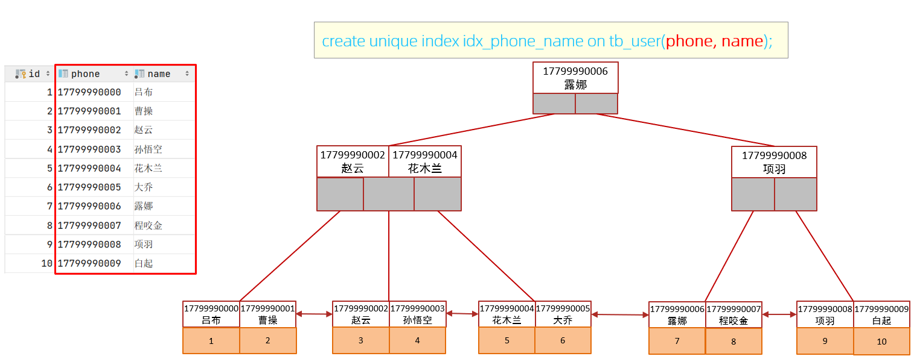 


### 1.7 索引设计原则

1). 针对于数据量较大，且查询比较频繁的表建立索引。

2). 针对于常作为查询条件（where）、排序（order by）、分组（group by）操作的字段建立索引。

3). 尽量选择区分度高的列作为索引，尽量建立唯一索引，区分度越高，使用索引的效率越高。

4). 如果是字符串类型的字段，字段的长度较长，可以针对于字段的特点，建立前缀索引。

5). 尽量使用联合索引，减少单列索引，查询时，联合索引很多时候可以覆盖索引，节省存储空间，避免回表，提高查询效率。

6). 要控制索引的数量，索引并不是多多益善，索引越多，维护索引结构的代价也就越大，会影响增删改的效率。

7). 如果索引列不能存储NULL值，请在创建表时使用NOT NULL约束它。当优化器知道每列是否包含NULL值时，它可以更好地确定哪个索引最有效地用于查询。


## 2. SQL优化

### 2.1 插入数据

#### 2.1.1 insert

如果我们需要一次性往数据库表中插入多条记录，可以从以下三个方面进行优化。

```sql
insert  into  tb_test  values(1,'tom');
insert  into  tb_test  values(2,'cat');
insert  into  tb_test  values(3,'jerry');
.....
```


1). 优化方案一

批量插入数据

```sql
Insert  into  tb_test  values(1,'Tom'),(2,'Cat'),(3,'Jerry');
```


2). 优化方案二

手动控制事务

```sql
start  transaction;
insert  into  tb_test  values(1,'Tom'),(2,'Cat'),(3,'Jerry');
insert  into  tb_test  values(4,'Tom'),(5,'Cat'),(6,'Jerry');
insert  into  tb_test  values(7,'Tom'),(8,'Cat'),(9,'Jerry');
commit;
```


3). 优化方案三

主键顺序插入，性能要高于乱序插入。

```
主键乱序插入 : 8  1  9  21  88  2  4  15  89  5  7  3  
主键顺序插入 : 1  2  3  4  5  7  8  9  15  21  88  89
```


#### 2.1.2 大批量插入数据

如果一次性需要插入大批量数据(比如: 几百万的记录)，使用insert语句插入性能较低，此时可以使用MySQL数据库提供的load指令进行插入。操作如下：

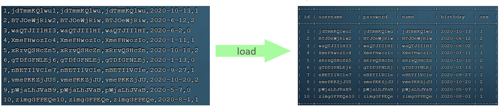 

可以执行如下指令，将数据脚本文件中的数据加载到表结构中：

```sql
-- 客户端连接服务端时，加上参数  -–local-infile
mysql –-local-infile  -u  root  -p

-- 设置全局参数local_infile为1，开启从本地加载文件导入数据的开关
set  global  local_infile = 1;

-- 执行load指令将准备好的数据，加载到表结构中
load  data  local  infile  '/root/sql1.log'  into  table  tb_user  fields  terminated  by  ','  lines  terminated  by  '\n' ; 
```

> 主键顺序插入性能高于乱序插入


示例演示: 

A. 创建表结构

```SQL
CREATE TABLE `tb_user` (
  `id` INT(11) NOT NULL AUTO_INCREMENT,
  `username` VARCHAR(50) NOT NULL,
  `password` VARCHAR(50) NOT NULL,
  `name` VARCHAR(20) NOT NULL,
  `birthday` DATE DEFAULT NULL,
  `sex` CHAR(1) DEFAULT NULL,
  PRIMARY KEY (`id`),
  UNIQUE KEY `unique_user_username` (`username`)
) ENGINE=INNODB DEFAULT CHARSET=utf8 ;
```


B. 设置参数

```sql
-- 客户端连接服务端时，加上参数  -–local-infile
mysql –-local-infile  -u  root  -p

-- 设置全局参数local_infile为1，开启从本地加载文件导入数据的开关
set  global  local_infile = 1;
```


C. load加载数据

```sql
load  data  local  infile  '/root/load_user_100w_sort.sql'  into  table  tb_user  fields  terminated  by  ','  lines  terminated  by  '\n' ; 
```

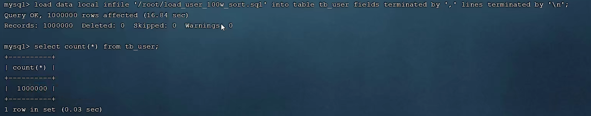 

我们看到，插入100w的记录，17s就完成了，性能很好。

> 在load时，主键顺序插入性能高于乱序插入


### 2.2 主键优化

在上一小节，我们提到，主键顺序插入的性能是要高于乱序插入的。 这一小节，就来介绍一下具体的原因，然后再分析一下主键又该如何设计。

1). 数据组织方式

在InnoDB存储引擎中，表数据都是根据主键顺序组织存放的，这种存储方式的表称为索引组织表(index organized table IOT)。

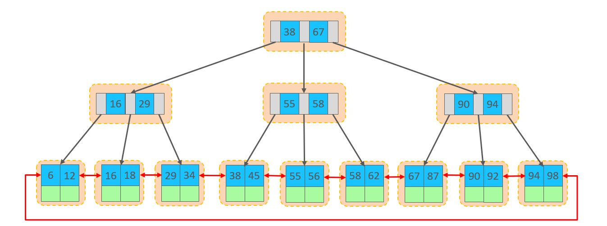 

行数据，都是存储在聚集索引的叶子节点上的。而我们之前也讲解过InnoDB的逻辑结构图：

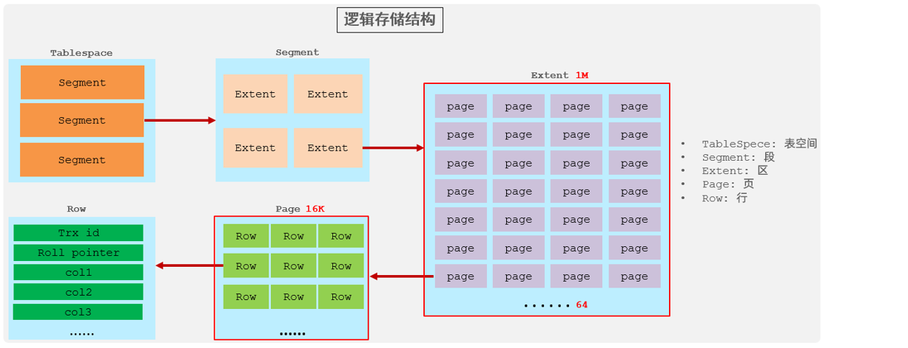 

在InnoDB引擎中，数据行是记录在逻辑结构 page 页中的，而每一个页的大小是固定的，默认16K。那也就意味着， 一个页中所存储的行也是有限的，如果插入的数据行row在该页存储不小，将会存储到下一个页中，页与页之间会通过指针连接。 


2). 页分裂

页可以为空，也可以填充一半，也可以填充100%。每个页包含了2-N行数据(如果一行数据过大，会行溢出)，根据主键排列。


A. 主键顺序插入效果

①. 从磁盘中申请页， 主键顺序插入

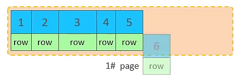 

②. 第一个页没有满，继续往第一页插入

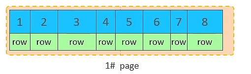 

③. 当第一个也写满之后，再写入第二个页，页与页之间会通过指针连接

 

④. 当第二页写满了，再往第三页写入

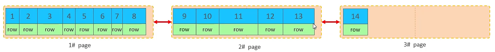 


B. 主键乱序插入效果

①. 加入1#,2#页都已经写满了，存放了如图所示的数据

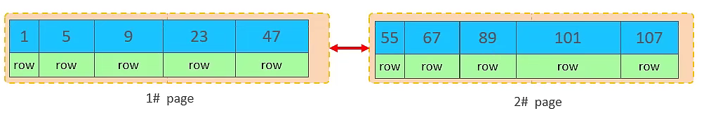 


②. 此时再插入id为50的记录，我们来看看会发生什么现象

会再次开启一个页，写入新的页中吗？ 

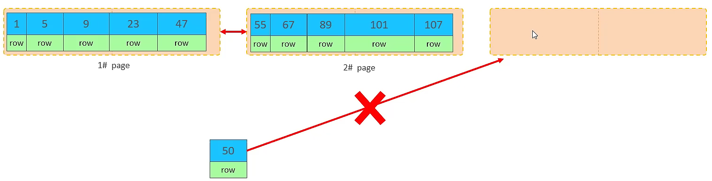 

不会。因为，索引结构的叶子节点是有顺序的。按照顺序，应该存储在47之后。

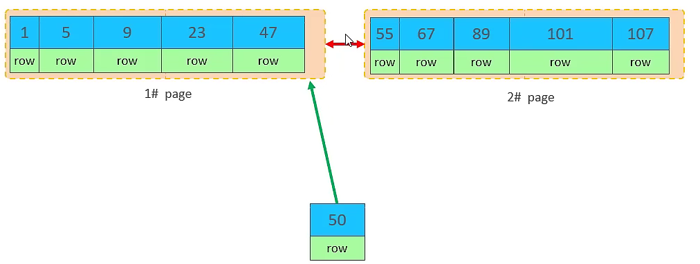 

但是47所在的1#页，已经写满了，存储不了50对应的数据了。 那么此时会开辟一个新的页 3#。

 

但是并不会直接将50存入3#页，而是会将1#页后一半的数据，移动到3#页，然后在3#页，插入50。

 

 

移动数据，并插入id为50的数据之后，那么此时，这三个页之间的数据顺序是有问题的。 1#的下一个页，应该是3#， 3#的下一个页是2#。 所以，此时，需要重新设置链表指针。

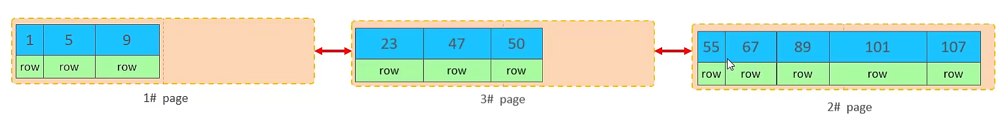 

上述的这种现象，称之为 "页分裂"，是比较耗费性能的操作。


3). 页合并

目前表中已有数据的索引结构(叶子节点)如下：

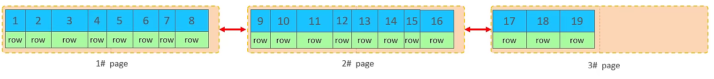 

当我们对已有数据进行删除时，具体的效果如下:

当删除一行记录时，实际上记录并没有被物理删除，只是记录被标记（flaged）为删除并且它的空间变得允许被其他记录声明使用。

 

当我们继续删除2#的数据记录

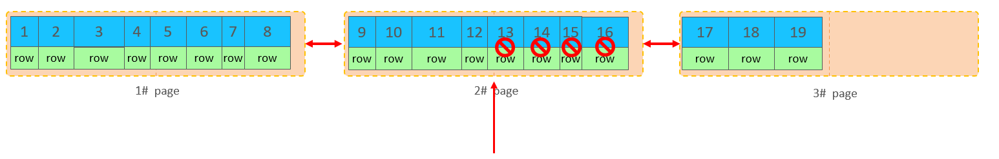 

当页中删除的记录达到 MERGE_THRESHOLD（默认为页的50%），InnoDB会开始寻找最靠近的页（前或后）看看是否可以将两个页合并以优化空间使用。

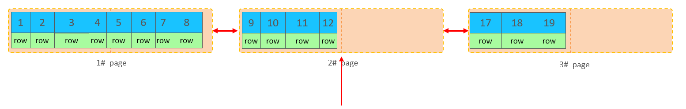 

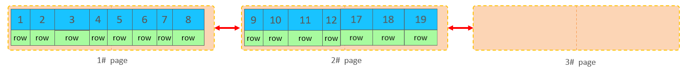 

删除数据，并将页合并之后，再次插入新的数据21，则直接插入3#页

 

这个里面所发生的合并页的这个现象，就称之为 "页合并"。

> 知识小贴士：
>
> ​    MERGE_THRESHOLD：合并页的阈值，可以自己设置，在创建表或者创建索引时指定。


4). 索引设计原则

- 满足业务需求的情况下，尽量降低主键的长度。

- 插入数据时，尽量选择顺序插入，选择使用AUTO_INCREMENT自增主键。

- 尽量不要使用UUID做主键或者是其他自然主键，如身份证号。

- 业务操作时，避免对主键的修改。

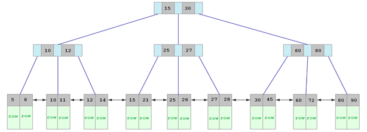 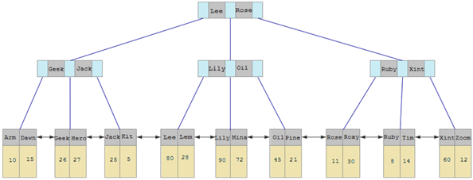


### 2.3 order by优化

MySQL的排序，有两种方式：

Using filesort : 通过表的索引或全表扫描，读取满足条件的数据行，然后在排序缓冲区sort buffer中完成排序操作，所有不是通过索引直接返回排序结果的排序都叫 FileSort 排序。

Using index : 通过有序索引顺序扫描直接返回有序数据，这种情况即为 using index，不需要额外排序，操作效率高。

对于以上的两种排序方式，Using index的性能高，而Using filesort的性能低，我们在优化排序操作时，尽量要优化为 Using index。


接下来，我们来做一个测试： 

A. 数据准备

把之前测试时，为tb_user表所建立的部分索引直接删除掉

```sql
drop index idx_user_phone on tb_user;
drop index idx_user_phone_name on tb_user;
drop index idx_user_name on tb_user;
```

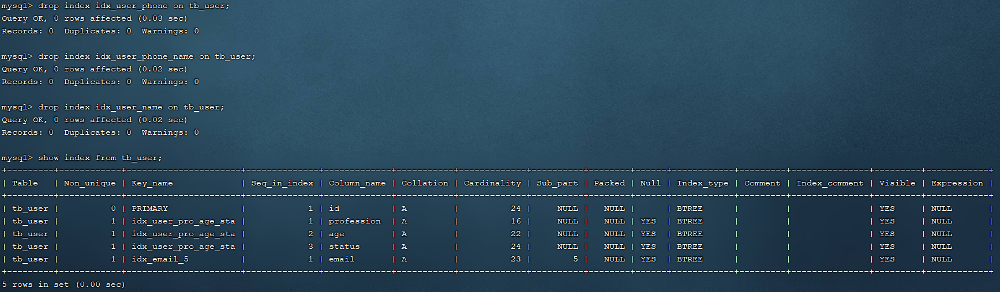 


B. 执行排序SQL

```sql
explain select  id,age,phone from tb_user order by age ;
```

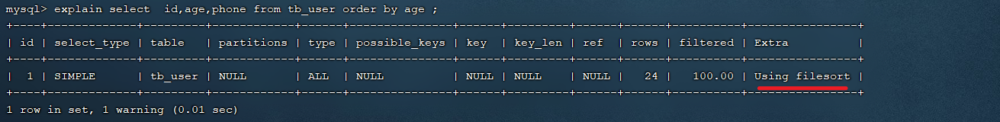 


```
explain select  id,age,phone from tb_user order by age, phone ;
```

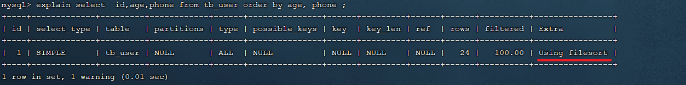 

由于 age, phone 都没有索引，所以此时再排序时，出现Using filesort， 排序性能较低。


C. 创建索引

```sql
-- 创建索引
create  index  idx_user_age_phone_aa  on  tb_user(age,phone);
```


D. 创建索引后，根据age, phone进行升序排序

```
explain select  id,age,phone from tb_user order by age;
```

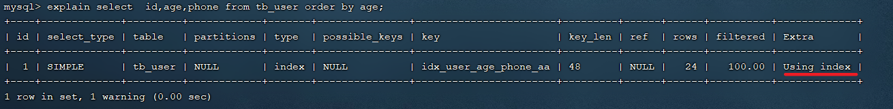 

```
explain select  id,age,phone from tb_user order by age , phone;
```

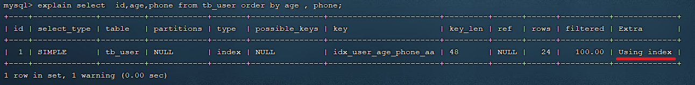 

建立索引之后，再次进行排序查询，就由原来的Using filesort， 变为了 Using index，性能就是比较高的了。


E. 创建索引后，根据age, phone进行降序排序

```sql
explain select  id,age,phone from tb_user order by age desc , phone desc ;
```

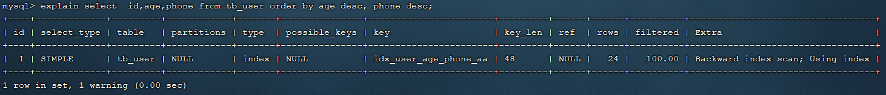 

也出现 Using index， 但是此时Extra中出现了 Backward index scan，这个代表反向扫描索引，因为在MySQL中我们创建的索引，默认索引的叶子节点是从小到大排序的，而此时我们查询排序时，是从大到小，所以，在扫描时，就是反向扫描，就会出现 Backward index scan。 在MySQL8版本中，支持降序索引，我们也可以创建降序索引。


F. 根据phone，age进行升序排序，phone在前，age在后。

```sql
explain select  id,age,phone from tb_user order by phone , age;
```

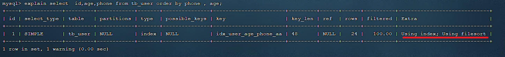 

排序时,也需要满足最左前缀法则,否则也会出现 filesort。因为在创建索引的时候， age是第一个字段，phone是第二个字段，所以排序时，也就该按照这个顺序来，否则就会出现 Using filesort。


F. 根据age, phone进行降序一个升序，一个降序

```sql
explain select  id,age,phone from tb_user order by age asc , phone  desc ;
```

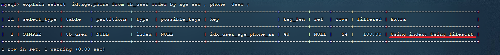 

因为创建索引时，如果未指定顺序，默认都是按照升序排序的，而查询时，一个升序，一个降序，此时就会出现Using filesort。

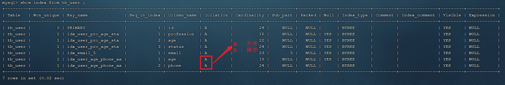 


为了解决上述的问题，我们可以创建一个索引，这个联合索引中 age 升序排序，phone 倒序排序。


G. 创建联合索引(age 升序排序，phone 倒序排序)

```sql
create  index  idx_user_age_phone_ad  on  tb_user(age asc ,phone desc);
```

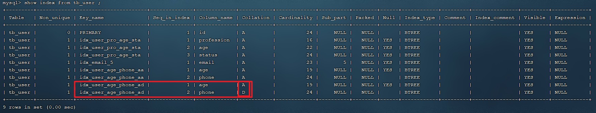 


H. 然后再次执行如下SQL

```sql
explain select  id,age,phone from tb_user order by age asc , phone  desc ;
```

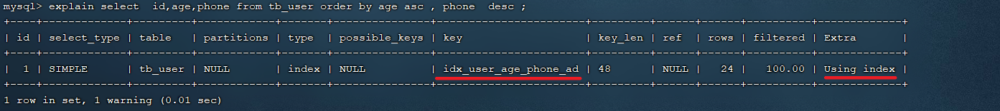 


升序/降序联合索引结构图示:

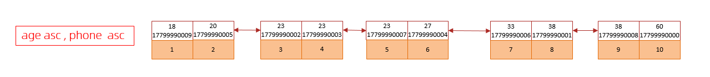  

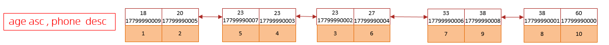 


由上述的测试,我们得出order by优化原则:

A. 根据排序字段建立合适的索引，多字段排序时，也遵循最左前缀法则。

B. 尽量使用覆盖索引。

C. 多字段排序, 一个升序一个降序，此时需要注意联合索引在创建时的规则（ASC/DESC）。

D. 如果不可避免的出现filesort，大数据量排序时，可以适当增大排序缓冲区大小 sort_buffer_size(默认256k)。


### 2.4 group by优化

分组操作，我们主要来看看索引对于分组操作的影响。 


首先我们先将 tb_user 表的索引全部删除掉 。

```SQL
 drop index idx_user_pro_age_sta on tb_user;
 drop index idx_email_5 on tb_user;
 drop index idx_user_age_phone_aa on tb_user;
 drop index idx_user_age_phone_ad on tb_user;
```

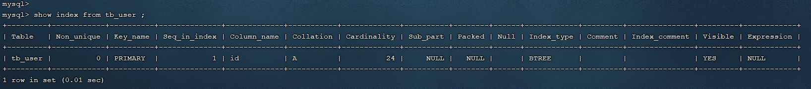 


接下来，在没有索引的情况下，执行如下SQL，查询执行计划：

```sql
explain  select  profession , count(*)  from  tb_user   group  by  profession ;
```

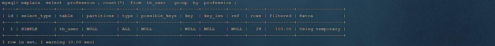 


然后，我们在针对于 profession ， age， status 创建一个联合索引。

```SQL
create  index  idx_user_pro_age_sta  on  tb_user(profession , age , status);
```


紧接着，再执行前面相同的SQL查看执行计划。

```sql
explain  select  profession , count(*)  from  tb_user   group  by  profession ;
```

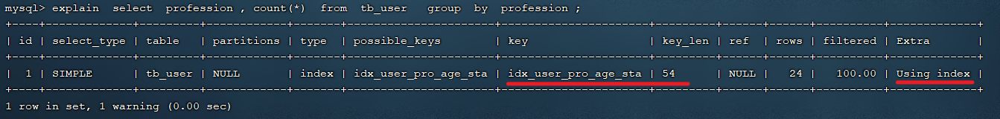 


再执行如下的分组查询SQL，查看执行计划：

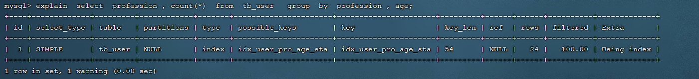 

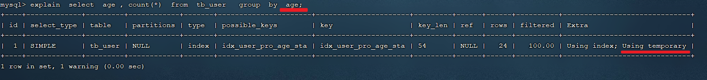 

我们发现，如果仅仅根据age分组，就会出现 Using temporary ；而如果是 根据 profession,age两个字段同时分组，则不会出现 Using temporary。原因是因为对于分组操作，在联合索引中，也是符合最左前缀法则的。


所以，在分组操作中，我们需要通过以下两点进行优化，以提升性能：

A. 在分组操作时，可以通过索引来提高效率。

B. 分组操作时，索引的使用也是满足最左前缀法则的。


### 2.5 limit优化

在数据量比较大时，如果进行limit分页查询，在查询时，越往后，分页查询效率越低。


我们一起来看看执行limit分页查询耗时对比：

 

通过测试我们会看到，越往后，分页查询效率越低，这就是分页查询的问题所在。

因为，当在进行分页查询时，如果执行 limit 2000000,10 ，此时需要MySQL排序前2000010 记录，仅仅返回 2000000 - 2000010 的记录，其他记录丢弃，查询排序的代价非常大 。


优化思路: 一般分页查询时，通过创建 覆盖索引 能够比较好地提高性能，可以通过覆盖索引加子查询形式进行优化。

```sql
explain   select  *  from  tb_sku  t  ,  (select  id  from  tb_sku  order  by  id  limit  2000000,10)  a  where t.id  =  a.id;
```


### 2.6 count优化

#### 2.6.1 概述

```
select  count(*)  from  tb_user ;
```

在之前的测试中，我们发现，如果数据量很大，在执行count操作时，是非常耗时的。 


- MyISAM 引擎把一个表的总行数存在了磁盘上，因此执行 count(*) 的时候会直接返回这个数，效率很高； 但是如果是带条件的count，MyISAM也慢。

- InnoDB 引擎就麻烦了，它执行 count(*) 的时候，需要把数据一行一行地从引擎里面读出来，然后累积计数。

如果说要大幅度提升InnoDB表的count效率，主要的优化思路：自己计数(可以借助于redis这样的数据库进行,但是如果是带条件的count又比较麻烦了)。


#### 2.6.2 count用法

count() 是一个聚合函数，对于返回的结果集，一行行地判断，如果 count 函数的参数不是 NULL，累计值就加 1，否则不加，最后返回累计值。

用法：count（*）、count（主键）、count（字段）、count（数字）

| count用法   | 含义                                                         |
| ----------- | ------------------------------------------------------------ |
| count(主键) | InnoDB 引擎会遍历整张表，把每一行的 主键id 值都取出来，返回给服务层。服务层拿到主键后，直接按行进行累加(主键不可能为null) |
| count(字段) | 没有not null 约束 : InnoDB 引擎会遍历整张表把每一行的字段值都取出来，返回给服务层，服务层判断是否为null，不为null，计数累加。<br/>有not null 约束：InnoDB 引擎会遍历整张表把每一行的字段值都取出来，返回给服务层，直接按行进行累加。 |
| count(数字) | InnoDB 引擎遍历整张表，但不取值。服务层对于返回的每一行，放一个数字“1”进去，直接按行进行累加。 |
| count(*)    | InnoDB引擎并不会把全部字段取出来，而是专门做了优化，不取值，服务层直接按行进行累加。 |


> 按照效率排序的话，count(字段) < count(主键 id) < count(1) ≈ count(\*)，所以尽量使用 count(\*)。


### 2.7 update优化

我们主要需要注意一下update语句执行时的注意事项。

```SQL
update  course  set  name = 'javaEE'  where  id  =  1 ;
```

当我们在执行删除的SQL语句时，会锁定id为1这一行的数据，然后事务提交之后，行锁释放。


但是当我们在执行如下SQL时。

```sql
update course set name = 'SpringBoot' where name = 'PHP' ;
```

当我们开启多个事务，在执行上述的SQL时，我们发现行锁升级为了表锁。 导致该update语句的性能大大降低。


> InnoDB的行锁是针对索引加的锁，不是针对记录加的锁 ,并且该索引不能失效，否则会从行锁升级为表锁 。


## 3. 视图/存储过程/触发器

### 3.1 视图

#### 3.1.1 介绍

视图（View）是一种虚拟存在的表。视图中的数据并不在数据库中实际存在，行和列数据来自定义视图的查询中使用的表，并且是在使用视图时动态生成的。

通俗的讲，视图只保存了查询的SQL逻辑，不保存查询结果。所以我们在创建视图的时候，主要的工作就落在创建这条SQL查询语句上。


#### 3.1.2 语法

1). 创建

```SQL
CREATE   [OR REPLACE]   VIEW  视图名称[(列名列表)]   AS   SELECT语句   [ WITH [ CASCADED  |  LOCAL ]  CHECK  OPTION ]
```

2). 查询

```SQL
查看创建视图语句：SHOW  CREATE  VIEW  视图名称;
查看视图数据：SELECT  *  FROM   视图名称 ...... ;
```

3). 修改

```SQL
方式一：CREATE   [OR REPLACE]   VIEW  视图名称[(列名列表)]   AS   SELECT语句   [ WITH [ CASCADED  |  LOCAL ]  CHECK  OPTION ]
方式二：ALTER   VIEW  视图名称[(列名列表)]   AS   SELECT语句   [ WITH [ CASCADED  |  LOCAL ]  CHECK  OPTION ]
```

4). 删除

```SQL
DROP  VIEW  [IF EXISTS]   视图名称   [,视图名称]  ... 
```


演示示例：

```SQL
-- 创建视图
create or replace view stu_v_1 as select id,name from student where id <= 10;

-- 查询视图
show create view stu_v_1;

select * from stu_v_1;
select * from stu_v_1 where id < 3;

-- 修改视图
create or replace view stu_v_1 as select id,name,no from student where id <= 10;

alter view stu_v_1 as select id,name from student where id <= 10;


-- 删除视图
drop view if exists stu_v_1;
```

上述我们演示了，视图应该如何创建、查询、修改、删除，那么我们能不能通过视图来插入、更新数据呢？ 接下来，做一个测试。

```sql
create or replace view stu_v_1 as select id,name from student where id <= 10 ;

select * from stu_v_1;

insert into stu_v_1 values(6,'Tom');

insert into stu_v_1 values(17,'Tom22');
```

执行上述的SQL，我们会发现，id为6和17的数据都是可以成功插入的。 但是我们执行查询，查询出来的数据，却没有id为17的记录。

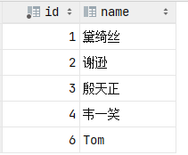 

因为我们在创建视图的时候，指定的条件为 id<=10, id为17的数据，是不符合条件的，所以没有查询出来，但是这条数据确实是已经成功的插入到了基表中。  

如果我们定义视图时，如果指定了条件，然后我们在插入、修改、删除数据时，是否可以做到必须满足条件才能操作，否则不能够操作呢？ 答案是可以的，这就需要借助于视图的检查选项了。 


#### 3.1.3 检查选项

当使用WITH CHECK OPTION子句创建视图时，MySQL会通过视图检查正在更改的每个行，例如 插入，更新，删除，以使其符合视图的定义。 MySQL允许基于另一个视图创建视图，它还会检查依赖视图中的规则以保持一致性。为了确定检查的范围，mysql提供了两个选项： CASCADED 和 LOCAL ，默认值为 CASCADED 。


1). CASCADED

级联。

比如，v2视图是基于v1视图的，如果在v2视图创建的时候指定了检查选项为 cascaded，但是v1视图创建时未指定检查选项。 则在执行检查时，不仅会检查v2，还会级联检查v2的关联视图v1。

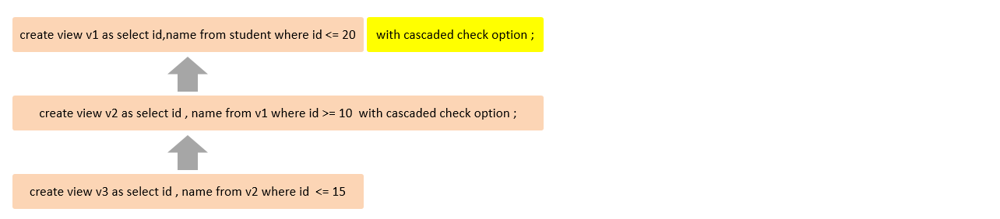 


2). LOCAL

本地。

比如，v2视图是基于v1视图的，如果在v2视图创建的时候指定了检查选项为 local ，但是v1视图创建时未指定检查选项。 则在执行检查时，知会检查v2，不会检查v2的关联视图v1。

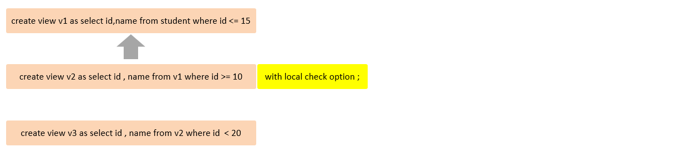 


#### 3.1.4 视图的更新

要使视图可更新，视图中的行与基础表中的行之间必须存在一对一的关系。如果视图包含以下任何一项，则该视图不可更新：

A. 聚合函数或窗口函数（SUM()、 MIN()、 MAX()、 COUNT()等）

B. DISTINCT

C. GROUP BY

D. HAVING

E. UNION 或者 UNION ALL


示例演示:

```sql
create view stu_v_count as select count(*) from student;
```

上述的视图中，就只有一个单行单列的数据，如果我们对这个视图进行更新或插入的，将会报错。

```
insert into stu_v_count values(10);
```

 


#### 3.1.5 视图作用

1). 简单

视图不仅可以简化用户对数据的理解，也可以简化他们的操作。那些被经常使用的查询可以被定义为视图，从而使得用户不必为以后的操作每次指定全部的条件。

2). 安全

数据库可以授权，但不能授权到数据库特定行和特定的列上。通过视图用户只能查询和修改他们所能见到的数据

3). 数据独立

视图可帮助用户屏蔽真实表结构变化带来的影响。


#### 3.1.6 案例

1). 为了保证数据库表的安全性，开发人员在操作tb_user表时，只能看到的用户的基本字段，屏蔽手机号和邮箱两个字段。

```SQL
create view tb_user_view as select id,name,profession,age,gender,status,createtime from tb_user;

select * from tb_user_view;
```


2). 查询每个学生所选修的课程（三张表联查），这个功能在很多的业务中都有使用到，为了简化操作，定义一个视图。

```SQL
create view tb_stu_course_view as select s.name student_name , s.no student_no , c.name course_name from student s, student_course sc , course c where s.id = sc.studentid and sc.courseid = c.id;

select * from tb_stu_course_view;
```


### 3.2 存储过程

#### 3.2.1 介绍

存储过程是事先经过编译并存储在数据库中的一段 SQL 语句的集合，调用存储过程可以简化应用开发人员的很多工作，减少数据在数据库和应用服务器之间的传输，对于提高数据处理的效率是有好处的。

存储过程思想上很简单，就是数据库 SQL 语言层面的代码封装与重用。

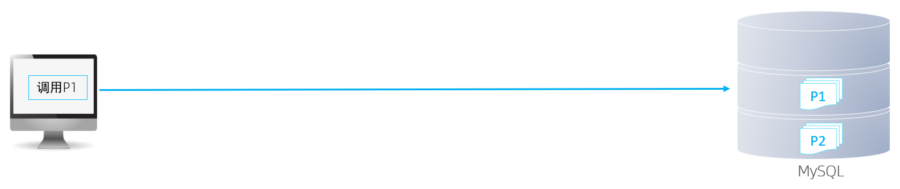 

特点:

- 封装，复用 -----------------------> 可以把某一业务SQL封装在存储过程中，需要用到的时候直接调用即可。

- 可以接收参数，也可以返回数据 --------> 再存储过程中，可以传递参数，也可以接收返回值。

- 减少网络交互，效率提升 -------------> 如果涉及到多条SQL，每执行一次都是一次网络传输。 而如果封装在存储过程中，我们只需要网络交互一次可能就可以了。


#### 3.2.2 基本语法

1). 创建

```sql
CREATE  PROCEDURE   存储过程名称 ([ 参数列表 ])
BEGIN
	-- SQL语句
END ;
```


2). 调用

```sql
CALL  名称  ([ 参数 ]); 
```


3). 查看

```sql
SELECT * FROM INFORMATION_SCHEMA.ROUTINES WHERE ROUTINE_SCHEMA = 'xxx';  -- 查询指定数据库的存储过程及状态信息
SHOW  CREATE  PROCEDURE   存储过程名称 ;  -- 查询某个存储过程的定义
```


4). 删除

```sql
DROP  PROCEDURE   [ IF EXISTS ]  存储过程名称 ；
```


> 注意: 
>
> ​	在命令行中，执行创建存储过程的SQL时，需要通过关键字 delimiter 指定SQL语句的结束符。


演示示例:

```SQL
-- 存储过程基本语法
-- 创建
create procedure p1()
begin
    select count(*) from student;
end;

-- 调用
call p1();

-- 查看
select * from information_schema.ROUTINES where ROUTINE_SCHEMA = 'itcast';

show create procedure p1;

-- 删除
drop procedure if exists p1;
```


#### 3.2.3 变量

在MySQL中变量分为三种类型: 系统变量、用户定义变量、局部变量。

##### 4.2.3.1 系统变量

系统变量 是MySQL服务器提供，不是用户定义的，属于服务器层面。分为全局变量（GLOBAL）、会话变量（SESSION）。

1). 查看系统变量

```sql
SHOW  [ SESSION | GLOBAL ]   VARIABLES ;                	-- 查看所有系统变量
SHOW  [ SESSION | GLOBAL ]   VARIABLES  LIKE  '......'; 	-- 可以通过LIKE模糊匹配方式查找变量
SELECT  @@[SESSION | GLOBAL]  系统变量名;                	--  查看指定变量的值
```


2). 设置系统变量

```sql
SET  [ SESSION | GLOBAL ]   系统变量名 = 值 ; 
SET  @@[SESSION | GLOBAL]系统变量名 = 值 ; 
```


> 注意: 
>
> ​	如果没有指定SESSION/GLOBAL，默认是SESSION，会话变量。
>
>  	mysql服务重新启动之后，所设置的全局参数会失效，要想不失效，可以在 /etc/my.cnf 中配置。
>
> ​	
>
> ​	A. 全局变量(GLOBAL): 全局变量针对于所有的会话。
>
> ​	B. 会话变量(SESSION):  会话变量针对于单个会话，在另外一个会话窗口就不生效了。


演示示例:

```SQL
-- 查看系统变量
show session variables ;

show session variables like 'auto%';
show global variables like 'auto%';

select @@global.autocommit;
select @@session.autocommit;


-- 设置系统变量
set session autocommit = 1;

insert into course(id, name) VALUES (6, 'ES');

set global autocommit  = 0;

select @@global.autocommit;
```


##### 4.2.3.2 用户定义变量

用户定义变量 是用户根据需要自己定义的变量，用户变量不用提前声明，在用的时候直接用 "@变量名" 使用就可以。其作用域为当前连接。

1). 赋值

方式一: 

```SQL
SET   @var_name = expr  [, @var_name = expr] ... ; 
SET   @var_name := expr  [, @var_name := expr] ... ; 
```

赋值时，可以使用 = ，也可以使用 := 。

方式二:

```SQL
SELECT   @var_name := expr  [, @var_name := expr] ... ; 
SELECT  字段名  INTO @var_name  FROM  表名;
```


2). 使用

```sql
SELECT   @var_name ; 
```


> 注意: 用户定义的变量无需对其进行声明或初始化，只不过获取到的值为NULL。


演示示例:

```sql
-- 赋值
set @myname = 'itcast';
set @myage := 10;
set @mygender := '男',@myhobby := 'java';

select @mycolor := 'red';
select count(*) into @mycount from tb_user;

-- 使用
select @myname,@myage,@mygender,@myhobby;

select @mycolor , @mycount;

select @abc;
```


##### 4.2.3.3 局部变量

局部变量 是根据需要定义的在局部生效的变量，访问之前，需要DECLARE声明。可用作存储过程内的局部变量和输入参数，局部变量的范围是在其内声明的BEGIN ... END块。

1). 声明

```sql
DECLARE 变量名 变量类型 [DEFAULT ... ] ;
```

变量类型就是数据库字段类型：INT、BIGINT、CHAR、VARCHAR、DATE、TIME等。

2). 赋值

```sql
SET  变量名 = 值 ;
SET  变量名 := 值 ;
SELECT  字段名  INTO  变量名  FROM  表名 ... ; 
```


演示示例:

```sql
-- 声明局部变量 - declare
-- 赋值
create procedure p2()
begin
    declare stu_count int default 0;
    select count(*) into stu_count from student;
    select stu_count;
end;

call p2();
```


#### 4.2.4 if

1). 介绍

if 用于做条件判断，具体的语法结构为：

```SQL
IF  条件1  THEN 
	.....
ELSEIF  条件2  THEN 		-- 可选
	.....
ELSE 					 -- 可选
	.....
END  IF;
```

在if条件判断的结构中，ELSE IF 结构可以有多个，也可以没有。 ELSE结构可以有，也可以没有。


2). 案例

根据定义的分数score变量，判定当前分数对应的分数等级。

- score >= 85分，等级为优秀。

- score >= 60分 且 score < 85分，等级为及格。

- score < 60分，等级为不及格。

```sql
create procedure p3()
begin
    declare score int default 58;
    declare result varchar(10);

    if score >= 85 then
        set result := '优秀';
    elseif score >= 60 then
        set result := '及格';
    else
        set result := '不及格';
    end if;
    select result;
end;

call p3();
```


上述的需求我们虽然已经实现了，但是也存在一些问题，比如：score 分数我们是在存储过程中定义死的，而且最终计算出来的分数等级，我们也仅仅是最终查询展示出来而已。

那么我们能不能，把score分数动态的传递进来，计算出来的分数等级是否可以作为返回值返回呢？ 答案是肯定的，我们可以通过接下来所讲解的 参数 来解决上述的问题。


#### 4.2.5 参数

1). 介绍

参数的类型，主要分为以下三种：IN、OUT、INOUT。 具体的含义如下：

| 类型  | 含义                                         | 备注 |
| ----- | -------------------------------------------- | ---- |
| IN    | 该类参数作为输入，也就是需要调用时传入值     | 默认 |
| OUT   | 该类参数作为输出，也就是该参数可以作为返回值 |      |
| INOUT | 既可以作为输入参数，也可以作为输出参数       |      |

用法： 

```SQL
CREATE  PROCEDURE   存储过程名称 ([ IN/OUT/INOUT  参数名  参数类型 ])
BEGIN
	-- SQL语句
END ;
```


2). 案例一

根据传入参数score，判定当前分数对应的分数等级，并返回。 

- score >= 85分，等级为优秀。

- score >= 60分 且 score < 85分，等级为及格。

- score < 60分，等级为不及格。

```SQL
create procedure p4(in score int, out result varchar(10))
begin
    if score >= 85 then
        set result := '优秀';
    elseif score >= 60 then
        set result := '及格';
    else
        set result := '不及格';
    end if;
end;

-- 定义用户变量 @result来接收返回的数据, 用户变量可以不用声明
call p4(18, @result);

select @result;
```


3). 案例二

将**传入**的200分制的分数，进行换算，换算成百分制，然后**返回**。

```SQL
create procedure p5(inout score double)
begin
    set score := score * 0.5;
end;

set @score = 198;
call p5(@score);

select @score;
```


#### 4.2.6 case

1). 介绍

case结构及作用，和我们在基础篇中所讲解的流程控制函数很类似。有两种语法格式：

语法1：

```SQL
-- 含义： 当case_value的值为 when_value1时，执行statement_list1，当值为 when_value2时，执行statement_list2， 否则就执行 statement_list
CASE  case_value
	WHEN  when_value1  THEN  statement_list1
   [ WHEN  when_value2  THEN  statement_list2] ...
   [ ELSE  statement_list ]
END  CASE;
```


语法2：

```SQL
-- 含义： 当条件search_condition1成立时，执行statement_list1，当条件search_condition2成立时，执行statement_list2， 否则就执行 statement_list
CASE
  WHEN  search_condition1  THEN  statement_list1
  [WHEN  search_condition2  THEN  statement_list2] ...
  [ELSE  statement_list]
END CASE;
```


2). 案例

根据传入的月份，判定月份所属的季节（要求采用case结构）。

- 1-3月份，为第一季度

- 4-6月份，为第二季度

- 7-9月份，为第三季度

- 10-12月份，为第四季度

```SQL
create procedure p6(in month int)
begin
    declare result varchar(10);
    case
        when month >= 1 and month <= 3 then
            set result := '第一季度';
        when month >= 4 and month <= 6 then
            set result := '第二季度';
        when month >= 7 and month <= 9 then
            set result := '第三季度';
        when month >= 10 and month <= 12 then
            set result := '第四季度';
        else
            set result := '非法参数';
    end case ;

    select concat('您输入的月份为: ',month, ', 所属的季度为: ',result);
end;

call  p6(16);
```


> 注意：如果判定条件有多个，多个条件之间，可以使用 and 或 or 进行连接。


#### 4.2.7 while

1). 介绍

while 循环是有条件的循环控制语句。满足条件后，再执行循环体中的SQL语句。具体语法为：

```SQL
-- 先判定条件，如果条件为true，则执行逻辑，否则，不执行逻辑
WHILE  条件  DO
	SQL逻辑...	
END WHILE;
```


2). 案例

计算从1累加到n的值，n为传入的参数值。

```SQL
-- A. 定义局部变量, 记录累加之后的值;
-- B. 每循环一次, 就会对n进行减1 , 如果n减到0, 则退出循环

create procedure p7(in n int)
begin
    declare total int default 0;
	
    while n>0 do
         set total := total + n;
         set n := n - 1;
    end while;
	
    select total;
end;

call p7(100);
```


#### 4.2.8 repeat

1). 介绍

repeat是有条件的循环控制语句, 当满足until声明的条件的时候，则退出循环 。具体语法为：

```SQL
-- 先执行一次逻辑，然后判定UNTIL条件是否满足，如果满足，则退出。如果不满足，则继续下一次循环
REPEAT
	SQL逻辑...  
	UNTIL  条件
END REPEAT;
```


2). 案例

计算从1累加到n的值，n为传入的参数值。(使用repeat实现)

```SQL
-- A. 定义局部变量, 记录累加之后的值;
-- B. 每循环一次, 就会对n进行-1 , 如果n减到0, 则退出循环
create procedure p8(in n int)
begin
    declare total int default 0;

    repeat
        set total := total + n;
        set n := n - 1;
    until  n <= 0
    end repeat;

    select total;
end;

call p8(10);
call p8(100);
```


#### 4.2.9 loop

1). 介绍

LOOP 实现简单的循环，如果不在SQL逻辑中增加退出循环的条件，可以用其来实现简单的死循环。LOOP可以配合一下两个语句使用：

- LEAVE ：配合循环使用，退出循环。

- ITERATE：必须用在循环中，作用是跳过当前循环剩下的语句，直接进入下一次循环。

```SQL
[begin_label:]  LOOP
	SQL逻辑...  
END  LOOP  [end_label];
```

```SQL
LEAVE  label; 	-- 退出指定标记的循环体
ITERATE  label; -- 直接进入下一次循环
```

上述语法中出现的 begin_label，end_label，label 指的都是我们所自定义的标记。


2). 案例一

计算从1累加到n的值，n为传入的参数值。

```SQL
-- A. 定义局部变量, 记录累加之后的值;
-- B. 每循环一次, 就会对n进行-1 , 如果n减到0, 则退出循环 ----> leave xx

create procedure p9(in n int)
begin
    declare total int default 0;

    sum:loop
        if n<=0 then
            leave sum;
        end if;
		
        set total := total + n;
        set n := n - 1;
    end loop sum;

    select total;
end;

call p9(100);
```


3). 案例二

计算从1到n之间的偶数累加的值，n为传入的参数值。

```SQL
-- A. 定义局部变量, 记录累加之后的值;
-- B. 每循环一次, 就会对n进行-1 , 如果n减到0, 则退出循环 ----> leave xx
-- C. 如果当次累加的数据是奇数, 则直接进入下一次循环. --------> iterate xx

create procedure p10(in n int)
begin
    declare total int default 0;

    sum:loop
        if n<=0 then
            leave sum;
        end if;

        if n%2 = 1 then
            set n := n - 1;
            iterate sum;
        end if;

        set total := total + n;
        set n := n - 1;
    end loop sum;

    select total;
end;

call p10(100);

```


#### 4.2.10 游标

1). 介绍

游标（CURSOR）是用来存储查询结果集的数据类型 , 在存储过程和函数中可以使用游标对结果集进行循环的处理。游标的使用包括游标的声明、OPEN、FETCH 和 CLOSE，其语法分别如下。

A. 声明游标

```SQL
DECLARE   游标名称  CURSOR  FOR  查询语句 ;
```

B. 打开游标

```
OPEN   游标名称 ;
```

C. 获取游标记录

```
FETCH  游标名称  INTO  变量 [, 变量  ] ;
```

D. 关闭游标

```
CLOSE   游标名称 ;
```


2). 案例

根据传入的参数uage，来查询用户表tb_user中，所有的用户年龄小于等于uage的用户姓名（name）和专业（profession），并将用户的姓名和专业插入到所创建的一张新表(id,name,profession)中。

```SQL
-- 逻辑:
-- A. 声明游标, 存储查询结果集
-- B. 准备: 创建表结构
-- C. 开启游标
-- D. 获取游标中的记录
-- E. 插入数据到新表中
-- F. 关闭游标

create procedure p11(in uage int)
begin
    declare uname varchar(100);
    declare upro varchar(100);
    declare u_cursor cursor for select name,profession from tb_user where age <= uage;
	
    drop table if exists tb_user_pro;
    create table if not exists tb_user_pro(
        id int primary key auto_increment,
        name varchar(100),
        profession varchar(100)
    );

    open u_cursor;
    while true do
        fetch u_cursor into uname,upro;
        insert into tb_user_pro values (null, uname, upro);
    end while;
    close u_cursor;

end;


call p11(30);
```

上述的存储过程，最终我们在调用的过程中，会报错，之所以报错是因为上面的while循环中，并没有退出条件。当游标的数据集获取完毕之后，再次获取数据，就会报错，从而终止了程序的执行。

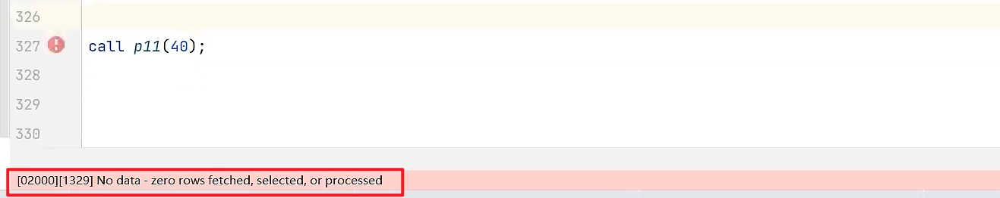 

但是此时，tb_user_pro表结构及其数据都已经插入成功了，我们可以直接刷新表结构，检查表结构中的数据。

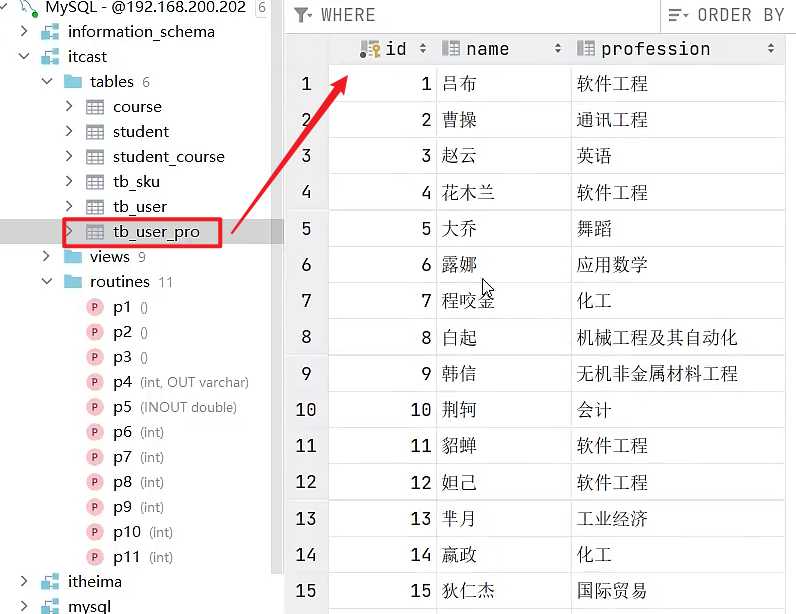 


上述的功能，虽然我们实现了，但是逻辑并不完善，而且程序执行完毕，获取不到数据，数据库还报错。 接下来，我们就需要来完成这个存储过程，并且解决这个问题。

要想解决这个问题，就需要通过MySQL中提供的 条件处理程序 Handler 来解决。


#### 4.2.11 条件处理程序

1). 介绍

条件处理程序（Handler）可以用来定义在流程控制结构执行过程中遇到问题时相应的处理步骤。具体语法为：

```SQL
DECLARE   handler_action   HANDLER FOR    condition_value  [, condition_value] ...   statement ;

handler_action 的取值： 
	CONTINUE: 继续执行当前程序
	EXIT: 终止执行当前程序
	
condition_value 的取值： 
	SQLSTATE  sqlstate_value: 状态码，如 02000
	
	SQLWARNING: 所有以01开头的SQLSTATE代码的简写
	NOT FOUND: 所有以02开头的SQLSTATE代码的简写
	SQLEXCEPTION: 所有没有被SQLWARNING 或 NOT FOUND捕获的SQLSTATE代码的简写	
```


2). 案例

我们继续来完成在上一小节提出的这个需求，并解决其中的问题。

根据传入的参数uage，来查询用户表tb_user中，所有的用户年龄小于等于uage的用户姓名（name）和专业（profession），并将用户的姓名和专业插入到所创建的一张新表(id,name,profession)中。

A. 通过SQLSTATE指定具体的状态码

```SQL
-- 逻辑:
-- A. 声明游标, 存储查询结果集
-- B. 准备: 创建表结构
-- C. 开启游标
-- D. 获取游标中的记录
-- E. 插入数据到新表中
-- F. 关闭游标

create procedure p11(in uage int)
begin
    declare uname varchar(100);
    declare upro varchar(100);
    declare u_cursor cursor for select name,profession from tb_user where age <= uage;
    -- 声明条件处理程序 ： 当SQL语句执行抛出的状态码为02000时，将关闭游标u_cursor，并退出
    declare exit handler for SQLSTATE '02000' close u_cursor;

    drop table if exists tb_user_pro;
    create table if not exists tb_user_pro(
        id int primary key auto_increment,
        name varchar(100),
        profession varchar(100)
    );

    open u_cursor;
    while true do
        fetch u_cursor into uname,upro;
        insert into tb_user_pro values (null, uname, upro);
    end while;
    close u_cursor;

end;

call p11(30);
```


B. 通过SQLSTATE的代码简写方式 NOT FOUND

02 开头的状态码，代码简写为 NOT FOUND

```SQL
create procedure p12(in uage int)
begin
    declare uname varchar(100);
    declare upro varchar(100);
    declare u_cursor cursor for select name,profession from tb_user where age <= uage;
     -- 声明条件处理程序 ： 当SQL语句执行抛出的状态码为02开头时，将关闭游标u_cursor，并退出
    declare exit handler for not found close u_cursor;

    drop table if exists tb_user_pro;
    create table if not exists tb_user_pro(
        id int primary key auto_increment,
        name varchar(100),
        profession varchar(100)
    );

    open u_cursor;
    while true do
        fetch u_cursor into uname,upro;
        insert into tb_user_pro values (null, uname, upro);
    end while;
    close u_cursor;

end;


call p12(30);
```


具体的错误状态码，可以参考官方文档：

https://dev.mysql.com/doc/refman/8.0/en/declare-handler.html 

https://dev.mysql.com/doc/mysql-errors/8.0/en/server-error-reference.html


### 4.3 存储函数

1). 介绍

存储函数是有返回值的存储过程，存储函数的参数只能是IN类型的。具体语法如下：

```SQL
CREATE  FUNCTION   存储函数名称 ([ 参数列表 ])
RETURNS  type  [characteristic ...]
BEGIN
	-- SQL语句
	RETURN ...;
END ;
```

characteristic说明：

- DETERMINISTIC：相同的输入参数总是产生相同的结果
- NO SQL ：不包含 SQL 语句。

- READS SQL DATA：包含读取数据的语句，但不包含写入数据的语句。


2). 案例

计算从1累加到n的值，n为传入的参数值。

```SQL
create function fun1(n int)
returns int deterministic
begin
    declare total int default 0;
	
    while n>0 do
        set total := total + n;
        set n := n - 1;
    end while;
	
    return total;
end;

select fun1(50);
```


在mysql8.0版本中binlog默认是开启的，一旦开启了，mysql就要求在定义存储过程时，需要指定characteristic特性，否则就会报如下错误：

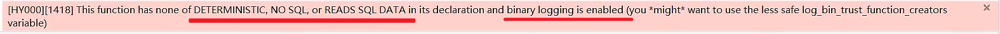


### 4.4 触发器

#### 4.4.1 介绍

触发器是与表有关的数据库对象，指在insert/update/delete之前(BEFORE)或之后(AFTER)，触发并执行触发器中定义的SQL语句集合。触发器的这种特性可以协助应用在数据库端确保数据的完整性 , 日志记录 , 数据校验等操作 。

使用别名OLD和NEW来引用触发器中发生变化的记录内容，这与其他的数据库是相似的。现在触发器还只支持行级触发，不支持语句级触发。

| 触发器类型      | NEW 和 OLD                                               |
| --------------- | -------------------------------------------------------- |
| INSERT 型触发器 | NEW 表示将要或者已经新增的数据                           |
| UPDATE 型触发器 | OLD 表示修改之前的数据  , NEW 表示将要或已经修改后的数据 |
| DELETE 型触发器 | OLD 表示将要或者已经删除的数据                           |


#### 4.4.2 语法

1). 创建

```SQL
CREATE  TRIGGER  trigger_name 
BEFORE/AFTER  INSERT/UPDATE/DELETE
ON tbl_name   FOR EACH ROW  -- 行级触发器
BEGIN
	trigger_stmt ;
END;
```

2). 查看

```SQL
SHOW  TRIGGERS ;
```

3). 删除

```SQL
DROP  TRIGGER  [schema_name.]trigger_name ;  -- 如果没有指定 schema_name，默认为当前数据库 。
```


#### 4.4.3 案例

通过触发器记录 tb_user 表的数据变更日志，将变更日志插入到日志表user_logs中, 包含增加, 修改 , 删除 ;

表结构准备:

```SQL
-- 准备工作 : 日志表 user_logs
create table user_logs(
  id int(11) not null auto_increment,
  operation varchar(20) not null comment '操作类型, insert/update/delete',
  operate_time datetime not null comment '操作时间',
  operate_id int(11) not null comment '操作的ID',
  operate_params varchar(500) comment '操作参数',
  primary key(`id`)
)engine=innodb default charset=utf8;
```


A. 插入数据触发器

```SQL
create trigger tb_user_insert_trigger
    after insert on tb_user for each row
begin
    insert into user_logs(id, operation, operate_time, operate_id, operate_params) VALUES
    (null, 'insert', now(), new.id, concat('插入的数据内容为: id=',new.id,',name=',new.name, ', phone=', NEW.phone, ', email=', NEW.email, ', profession=', NEW.profession));
end;
```


测试:

```SQL
-- 查看
show triggers ;

-- 插入数据到tb_user
insert into tb_user(id, name, phone, email, profession, age, gender, status, createtime) VALUES (26,'三皇子','18809091212','erhuangzi@163.com','软件工程',23,'1','1',now());
```

测试完毕之后，检查日志表中的数据是否可以正常插入，以及插入数据的正确性。


B. 修改数据触发器

```SQL
create trigger tb_user_update_trigger
    after update on tb_user for each row
begin
    insert into user_logs(id, operation, operate_time, operate_id, operate_params) VALUES
    (null, 'update', now(), new.id,
        concat('更新之前的数据: id=',old.id,',name=',old.name, ', phone=', old.phone, ', email=', old.email, ', profession=', old.profession,
            ' | 更新之后的数据: id=',new.id,',name=',new.name, ', phone=', NEW.phone, ', email=', NEW.email, ', profession=', NEW.profession));
end;
```


测试:

```SQL
-- 查看
show triggers ;

-- 更新
update tb_user set profession = '会计' where id = 23;
update tb_user set profession = '会计' where id <= 5;
```

测试完毕之后，检查日志表中的数据是否可以正常插入，以及插入数据的正确性。


C. 删除数据触发器

```SQL
create trigger tb_user_delete_trigger
    after delete on tb_user for each row
begin
    insert into user_logs(id, operation, operate_time, operate_id, operate_params) VALUES
    (null, 'delete', now(), old.id,
        concat('删除之前的数据: id=',old.id,',name=',old.name, ', phone=', old.phone, ', email=', old.email, ', profession=', old.profession));
end;
```


测试:

```SQL
-- 查看
show triggers ;

-- 删除数据
delete from tb_user where id = 26;
```

测试完毕之后，检查日志表中的数据是否可以正常插入，以及插入数据的正确性。


## 5. 锁

### 5.1 概述

锁是计算机协调多个进程或线程并发访问某一资源的机制。在数据库中，除传统的计算资源（CPU、RAM、I/O）的争用以外，数据也是一种供许多用户共享的资源。如何保证数据并发访问的一致性、有效性是所有数据库必须解决的一个问题，锁冲突也是影响数据库并发访问性能的一个重要因素。从这个角度来说，锁对数据库而言显得尤其重要，也更加复杂。

MySQL中的锁，按照锁的粒度分，分为以下三类：

- 全局锁：锁定数据库中的所有表。

- 表级锁：每次操作锁住整张表。

- 行级锁：每次操作锁住对应的行数据。


### 5.2 全局锁

#### 5.2.1 介绍

全局锁就是对整个数据库实例加锁，加锁后整个实例就处于只读状态，后续的DML的写语句，DDL语句，已经更新操作的事务提交语句都将被阻塞。

其典型的使用场景是做全库的逻辑备份，对所有的表进行锁定，从而获取一致性视图，保证数据的完整性。


为什么全库逻辑备份，就需要加全就锁呢？ 

A. 我们一起先来分析一下不加全局锁，可能存在的问题。

假设在数据库中存在这样三张表: tb_stock 库存表，tb_order 订单表，tb_orderlog 订单日志表。


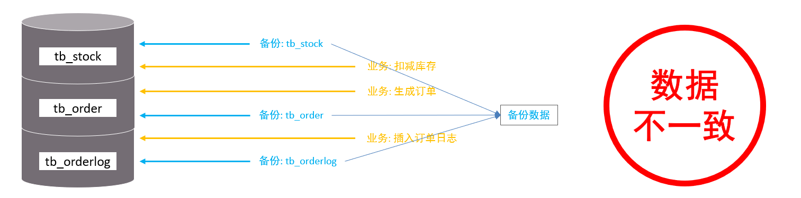  

- 在进行数据备份时，先备份了tb_stock库存表。
- 然后接下来，在业务系统中，执行了下单操作，扣减库存，生成订单（更新tb_stock表，插入tb_order表）。
- 然后再执行备份 tb_order表的逻辑。
- 业务中执行插入订单日志操作。
- 最后，又备份了tb_orderlog表。

此时备份出来的数据，是存在问题的。因为备份出来的数据，tb_stock表与tb_order表的数据不一致(有最新操作的订单信息,但是库存数没减)。

那如何来规避这种问题呢? 此时就可以借助于MySQL的全局锁来解决。


B. 再来分析一下加了全局锁后的情况

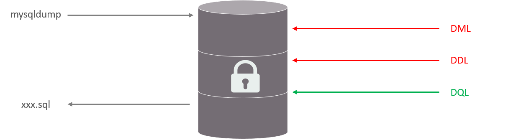 

对数据库进行进行逻辑备份之前，先对整个数据库加上全局锁，一旦加了全局锁之后，其他的DDL、DML全部都处于阻塞状态，但是可以执行DQL语句，也就是处于只读状态，而数据备份就是查询操作。那么数据在进行逻辑备份的过程中，数据库中的数据就是不会发生变化的，这样就保证了数据的一致性和完整性。


#### 5.2.2 语法

1). 加全局锁

```SQL
flush tables with read lock ;
```

2). 数据备份

```SQL
mysqldump  -uroot –p1234  itcast > itcast.sql
```

数据备份的相关指令, 在后面MySQL管理章节, 还会详细讲解.

3). 释放锁

```SQL
unlock tables ;
```


#### 5.2.3 特点

数据库中加全局锁，是一个比较重的操作，存在以下问题：

- 如果在主库上备份，那么在备份期间都不能执行更新，业务基本上就得停摆。

- 如果在从库上备份，那么在备份期间从库不能执行主库同步过来的二进制日志（binlog），会导致主从延迟。


在InnoDB引擎中，我们可以在备份时加上参数 --single-transaction 参数来完成不加锁的一致性数据备份。

```SQL
mysqldump  --single-transaction  -uroot –p123456  itcast > itcast.sql
```


### 5.3 表级锁

#### 5.3.1 介绍

表级锁，每次操作锁住整张表。锁定粒度大，发生锁冲突的概率最高，并发度最低。应用在MyISAM、InnoDB、BDB等存储引擎中。

对于表级锁，主要分为以下三类：

- 表锁

- 元数据锁（meta data lock，MDL）

- 意向锁


#### 5.3.2 表锁

对于表锁，分为两类：

- 表共享读锁（read lock）

- 表独占写锁（write lock）


语法：

- 加锁：lock tables 表名... read/write。

- 释放锁：unlock tables / 客户端断开连接 。


特点:

A. 读锁

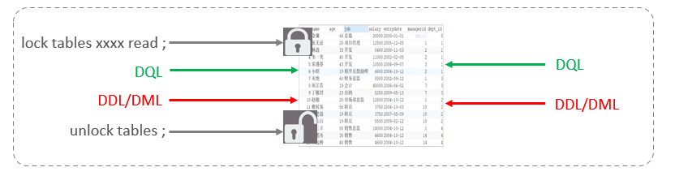 

左侧为客户端一，对指定表加了读锁，不会影响右侧客户端二的读，但是会阻塞右侧客户端的写。

测试: 

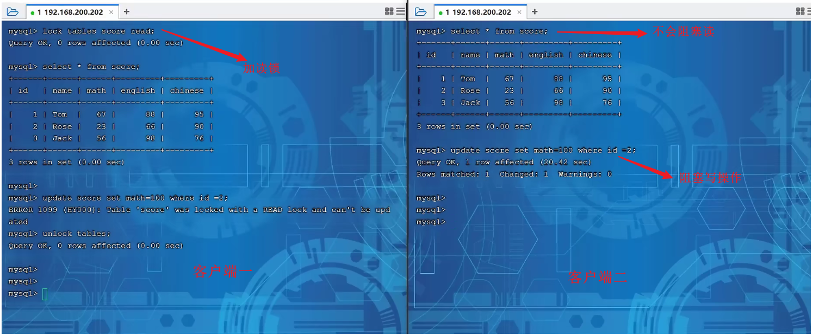 


B. 写锁

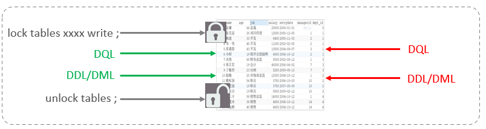 

左侧为客户端一，对指定表加了写锁，会阻塞右侧客户端的读和写。

测试:

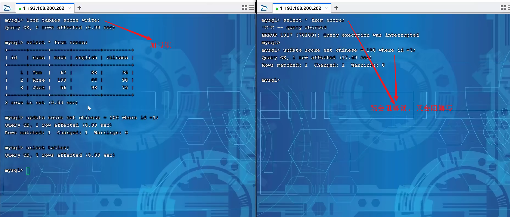 


> 结论: 读锁不会阻塞其他客户端的读，但是会阻塞写。写锁既会阻塞其他客户端的读，又会阻塞其他客户端的写。


#### 5.3.3 元数据锁

meta data lock , 元数据锁，简写MDL。 

MDL加锁过程是系统自动控制，无需显式使用，在访问一张表的时候会自动加上。MDL锁主要作用是维护表元数据的数据一致性，在表上有活动事务的时候，不可以对元数据进行写入操作。**为了避免DML与DDL冲突，保证读写的正确性。**

这里的元数据，大家可以简单理解为就是一张表的表结构。 也就是说，某一张表涉及到未提交的事务时，是不能够修改这张表的表结构的。

在MySQL5.5中引入了MDL，当对一张表进行增删改查的时候，加MDL读锁(共享)；当对表结构进行变更操作的时候，加MDL写锁(排他)。

常见的SQL操作时，所添加的元数据锁：

| 对应SQL                                         | 锁类型                                   | 说明                                             |
| ----------------------------------------------- | ---------------------------------------- | ------------------------------------------------ |
| lock tables xxx read / write                    | SHARED_READ_ONLY  / SHARED_NO_READ_WRITE |                                                  |
| select 、select  ... lock in share mode         | SHARED_READ                              | 与SHARED_READ、SHARED_WRITE兼容，与EXCLUSIVE互斥 |
| insert 、update、delete、select  ... for update | SHARED_WRITE                             | 与SHARED_READ、SHARED_WRITE兼容，与EXCLUSIVE互斥 |
| alter table ...                                 | EXCLUSIVE                                | 与其他的MDL都互斥                                |


演示：

当执行SELECT、INSERT、UPDATE、DELETE等语句时，添加的是元数据共享锁（SHARED_READ / SHARED_WRITE），之间是兼容的。

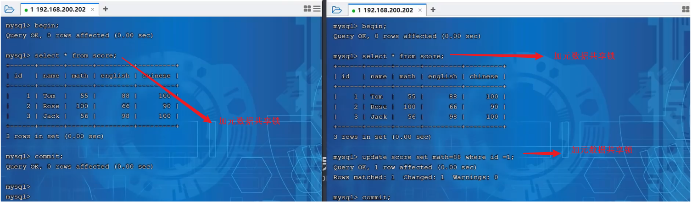 


当执行SELECT语句时，添加的是元数据共享锁（SHARED_READ），会阻塞元数据排他锁（EXCLUSIVE），之间是互斥的。

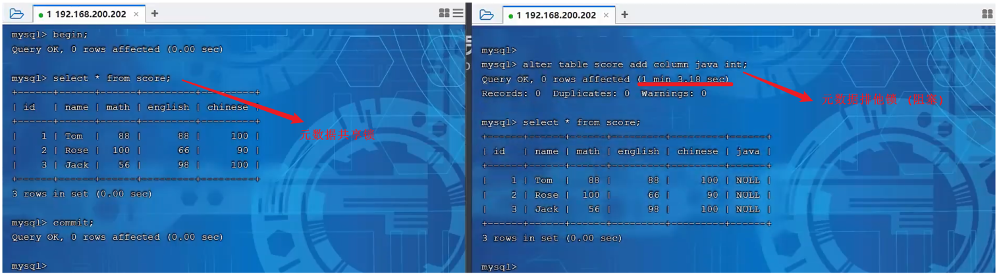 


我们可以通过下面的SQL，来查看数据库中的元数据锁的情况：

```sql
select object_type,object_schema,object_name,lock_type,lock_duration from performance_schema.metadata_locks ;
```

我们在操作过程中，可以通过上述的SQL语句，来查看元数据锁的加锁情况。

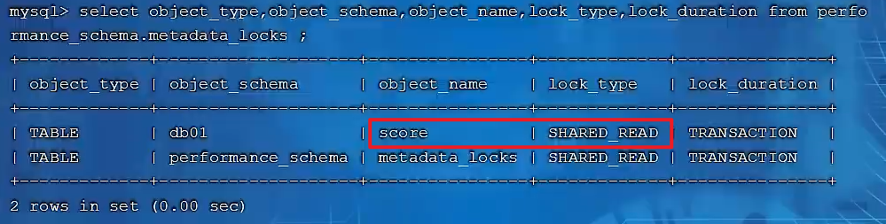 


#### 5.3.4 意向锁

1). 介绍

为了避免DML在执行时，加的行锁与表锁的冲突，在InnoDB中引入了意向锁，使得表锁不用检查每行数据是否加锁，使用意向锁来减少表锁的检查。


假如没有意向锁，客户端一对表加了行锁后，客户端二如何给表加表锁呢，来通过示意图简单分析一下：

首先客户端一，开启一个事务，然后执行DML操作，在执行DML语句时，会对涉及到的行加行锁。

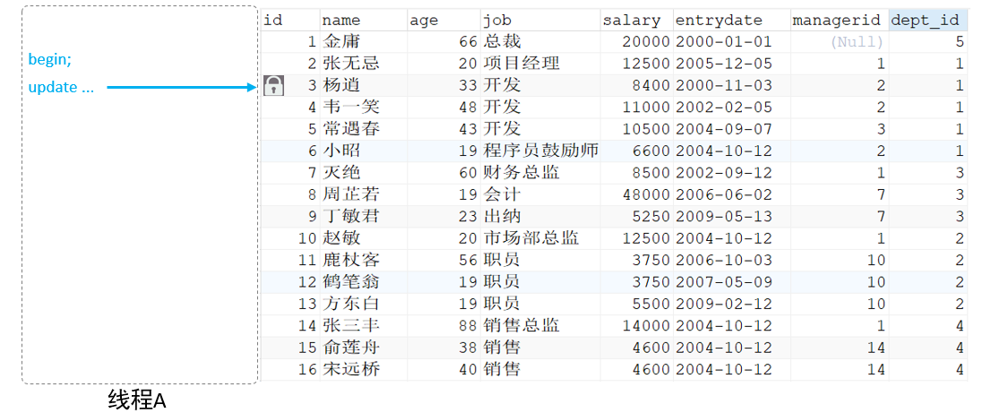 

当客户端二，想对这张表加表锁时，会检查当前表是否有对应的行锁，如果没有，则添加表锁，此时就会从第一行数据，检查到最后一行数据，效率较低。

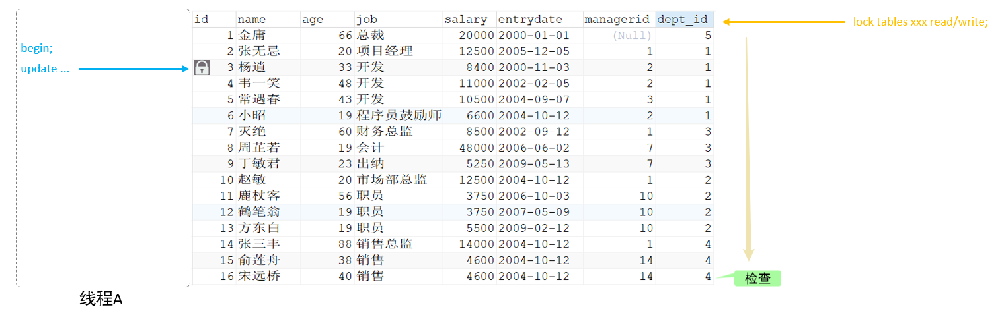 


有了意向锁之后 :

客户端一，在执行DML操作时，会对涉及的行加行锁，同时也会对该表加上意向锁。

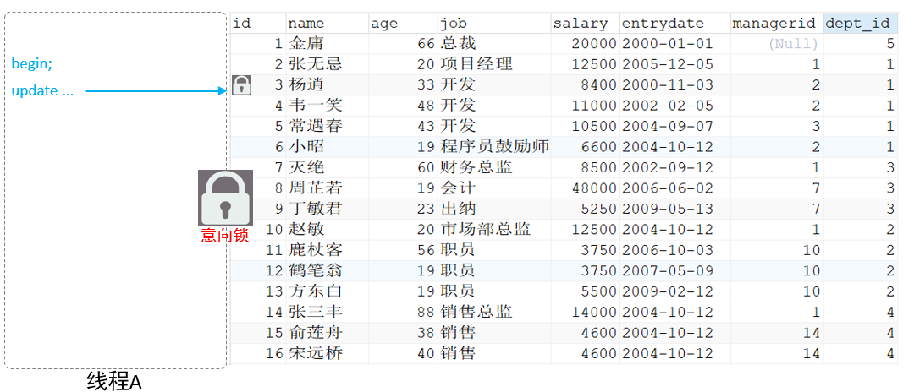 

而其他客户端，在对这张表加表锁的时候，会根据该表上所加的意向锁来判定是否可以成功加表锁，而不用逐行判断行锁情况了。

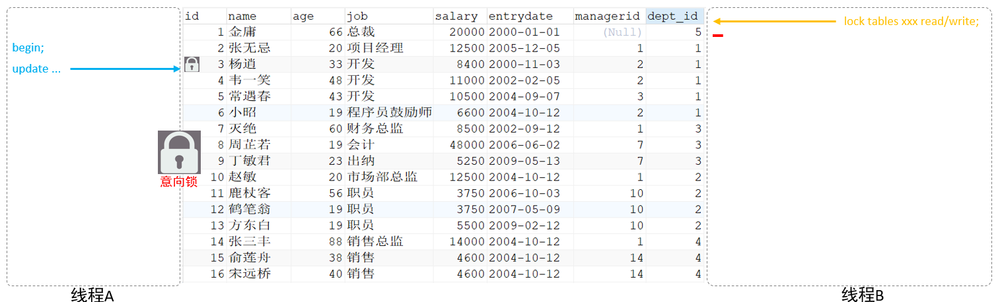 


2). 分类

- 意向共享锁(IS): 由语句select ... lock in share mode添加 。 与 表锁共享锁(read)兼容，与表锁排他锁(write)互斥。
- 意向排他锁(IX): 由insert、update、delete、select...for update添加 。与表锁共享锁(read)及排他锁(write)都互斥，意向锁之间不会互斥。

> 一旦事务提交了，意向共享锁、意向排他锁，都会自动释放。


可以通过以下SQL，查看意向锁及行锁的加锁情况：

```sql
select object_schema,object_name,index_name,lock_type,lock_mode,lock_data from performance_schema.data_locks;
```


演示：

A. 意向共享锁与表读锁是兼容的

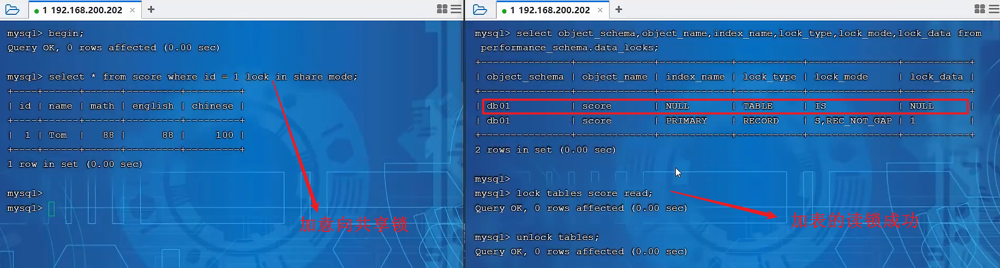 


B. 意向排他锁与表读锁、写锁都是互斥的

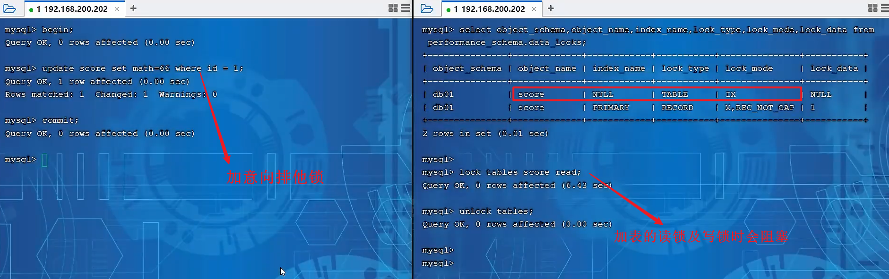 


### 5.4 行级锁

#### 5.4.1 介绍

行级锁，每次操作锁住对应的行数据。锁定粒度最小，发生锁冲突的概率最低，并发度最高。应用在InnoDB存储引擎中。

InnoDB的数据是基于索引组织的，行锁是通过对索引上的索引项加锁来实现的，而不是对记录加的锁。对于行级锁，主要分为以下三类：

- 行锁（Record Lock）：锁定单个行记录的锁，防止其他事务对此行进行update和delete。在RC、RR隔离级别下都支持。

  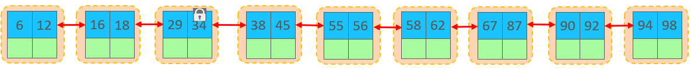 

- 间隙锁（Gap Lock）：锁定索引记录间隙（不含该记录），确保索引记录间隙不变，防止其他事务在这个间隙进行insert，产生幻读。在RR隔离级别下都支持。

  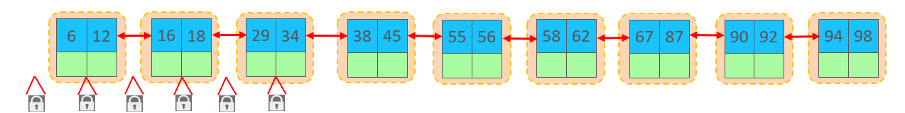 

- 临键锁（Next-Key Lock）：行锁和间隙锁组合，同时锁住数据，并锁住数据前面的间隙Gap。在RR隔离级别下支持。

  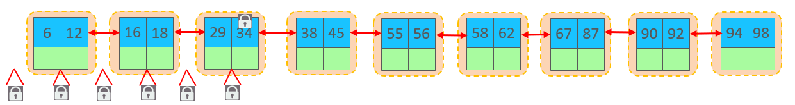 


#### 5.4.2 行锁

1). 介绍

InnoDB实现了以下两种类型的行锁：

- 共享锁（S）：允许一个事务去读一行，阻止其他事务获得相同数据集的排它锁。

- 排他锁（X）：允许获取排他锁的事务更新数据，阻止其他事务获得相同数据集的共享锁和排他锁。


两种行锁的兼容情况如下:

 


常见的SQL语句，在执行时，所加的行锁如下：

| SQL                              | 行锁类型   | 说明                                       |
| -------------------------------- | ---------- | ------------------------------------------ |
| INSERT ...                       | 排他锁     | 自动加锁                                   |
| UPDATE ...                       | 排他锁     | 自动加锁                                   |
| DELETE ...                       | 排他锁     | 自动加锁                                   |
| SELECT（正常）                   | 不加任何锁 |                                            |
| SELECT ...  LOCK IN SHARE   MODE | 共享锁     | 需要手动在SELECT之后加LOCK IN   SHARE MODE |
| SELECT ...  FOR UPDATE           | 排他锁     | 需要手动在SELECT之后加FOR UPDATE           |


2). 演示

默认情况下，InnoDB在 REPEATABLE READ事务隔离级别运行，InnoDB使用 next-key 锁进行搜索和索引扫描，以防止幻读。

- 针对唯一索引进行检索时，对已存在的记录进行等值匹配时，将会自动优化为行锁。

- InnoDB的行锁是针对于索引加的锁，不通过索引条件检索数据，那么InnoDB将对表中的所有记录加锁，此时 就会升级为表锁。


可以通过以下SQL，查看意向锁及行锁的加锁情况：

```SQL
select object_schema,object_name,index_name,lock_type,lock_mode,lock_data from performance_schema.data_locks;
```


**示例演示**

数据准备:

```SQL
CREATE TABLE `stu`  (
  `id` int NOT NULL  PRIMARY KEY AUTO_INCREMENT,
  `name` varchar(255) DEFAULT NULL,
  `age` int NOT NULL
) ENGINE = InnoDB CHARACTER SET = utf8mb4;

INSERT INTO `stu` VALUES (1, 'tom', 1);
INSERT INTO `stu` VALUES (3, 'cat', 3);
INSERT INTO `stu` VALUES (8, 'rose', 8);
INSERT INTO `stu` VALUES (11, 'jetty', 11);
INSERT INTO `stu` VALUES (19, 'lily', 19);
INSERT INTO `stu` VALUES (25, 'luci', 25);
```

演示行锁的时候，我们就通过上面这张表来演示一下。


A. 普通的select语句，执行时，不会加锁。

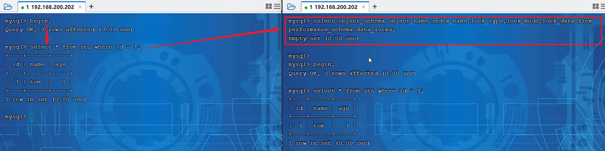 


B. select...lock in share mode，加共享锁，共享锁与共享锁之间兼容。

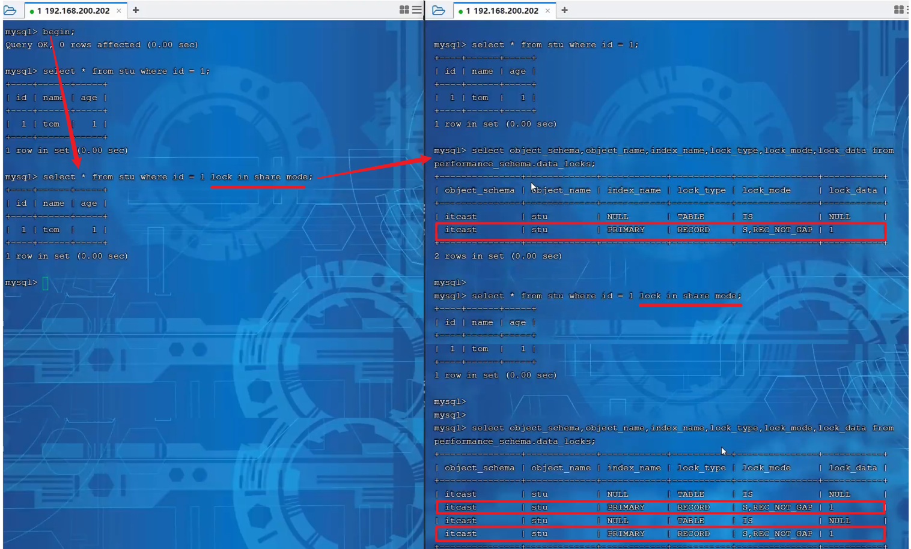  

 共享锁与排他锁之间互斥。

 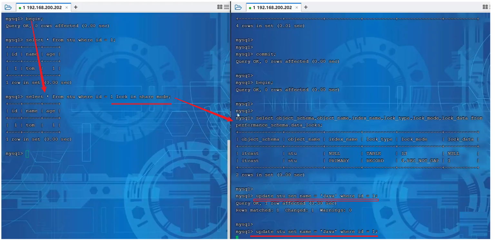 

 客户端一获取的是id为1这行的共享锁，客户端二是可以获取id为3这行的排它锁的，因为不是同一行数据。 而如果客户端二想获取id为1这行的排他锁，会处于阻塞状态，以为共享锁与排他锁之间互斥。


C. 排它锁与排他锁之间互斥

 

当客户端一，执行update语句，会为id为1的记录加排他锁； 客户端二，如果也执行update语句更新id为1的数据，也要为id为1的数据加排他锁，但是客户端二会处于阻塞状态，因为排他锁之间是互斥的。 直到客户端一，把事务提交了，才会把这一行的行锁释放，此时客户端二，解除阻塞。


D. 无索引行锁升级为表锁

stu表中数据如下:

 


我们在两个客户端中执行如下操作:

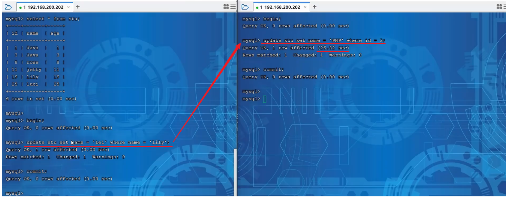 

在客户端一中，开启事务，并执行update语句，更新name为Lily的数据，也就是id为19的记录 。 然后在客户端二中更新id为3的记录，却不能直接执行，会处于阻塞状态，为什么呢？

原因就是因为此时，客户端一，根据name字段进行更新时，name字段是没有索引的，如果没有索引，此时行锁会升级为表锁(因为行锁是对索引项加的锁，而name没有索引)。


接下来，我们再针对name字段建立索引，索引建立之后，再次做一个测试：

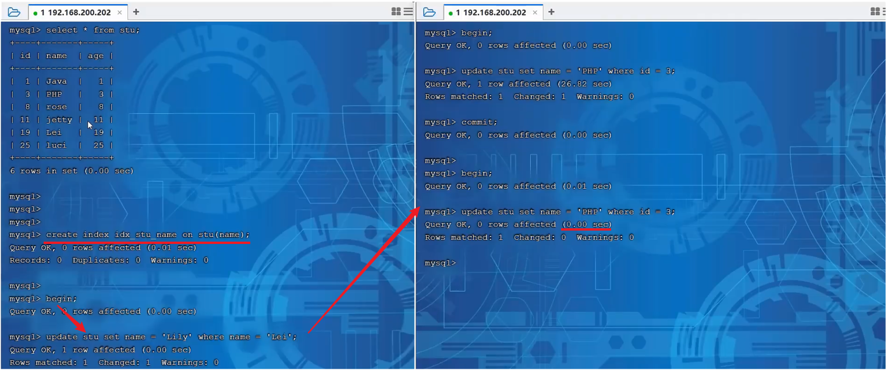 

此时我们可以看到，客户端一，开启事务，然后依然是根据name进行更新。而客户端二，在更新id为3的数据时，更新成功，并未进入阻塞状态。 这样就说明，我们根据索引字段进行更新操作，就可以避免行锁升级为表锁的情况。


#### 5.4.3 间隙锁&临键锁

默认情况下，InnoDB在 REPEATABLE READ事务隔离级别运行，InnoDB使用 next-key 锁进行搜索和索引扫描，以防止幻读。

- 索引上的等值查询(唯一索引)，给不存在的记录加锁时, 优化为间隙锁 。

- 索引上的等值查询(非唯一普通索引)，向右遍历时最后一个值不满足查询需求时，next-key lock 退化为间隙锁。

- 索引上的范围查询(唯一索引)--会访问到不满足条件的第一个值为止。


> 注意：间隙锁唯一目的是防止其他事务插入间隙。间隙锁可以共存，一个事务采用的间隙锁不会阻止另一个事务在同一间隙上采用间隙锁。


**示例演示**

A. 索引上的等值查询(唯一索引)，给不存在的记录加锁时, 优化为间隙锁 。

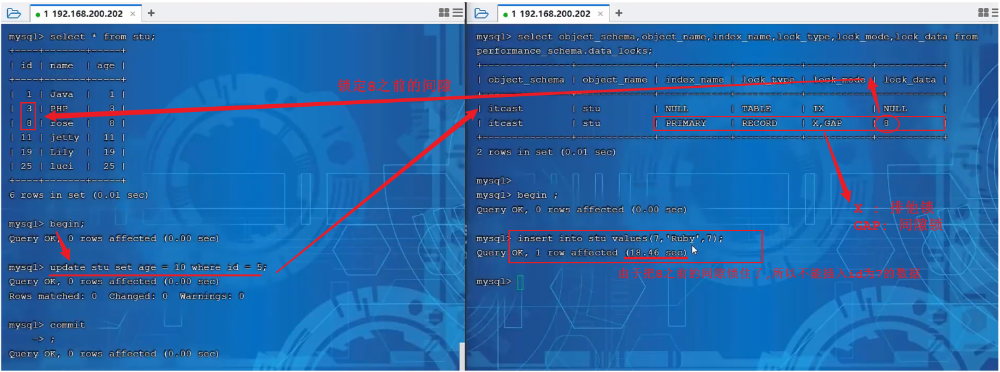 


B. 索引上的等值查询(非唯一普通索引)，向右遍历时最后一个值不满足查询需求时，next-key lock 退化为间隙锁。  

介绍分析一下： 

我们知道InnoDB的B+树索引，叶子节点是有序的双向链表。 假如，我们要根据这个二级索引查询值为18的数据，并加上共享锁，我们是只锁定18这一行就可以了吗？ 并不是，因为是非唯一索引，这个结构中可能有多个18的存在，所以，在加锁时会继续往后找，找到一个不满足条件的值（当前案例中也就是29）。此时会对18加临键锁，并对29之前的间隙加锁。

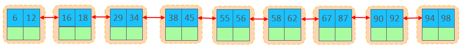 

 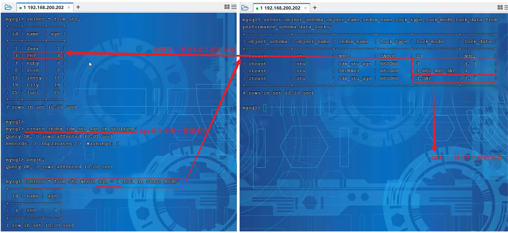


C. 索引上的范围查询(唯一索引)--会访问到不满足条件的第一个值为止。

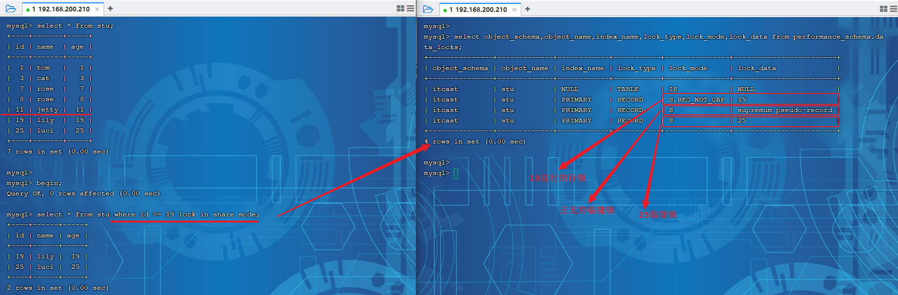 

查询的条件为id>=19，并添加共享锁。 此时我们可以根据数据库表中现有的数据，将数据分为三个部分： 

[19]

(19,25]

(25,+∞]

所以数据库数据在加锁是，就是将19加了行锁，25的临键锁（包含25及25之前的间隙），正无穷的临键锁(正无穷及之前的间隙)。


## 6. InnoDB引擎

### 6.1 逻辑存储结构

InnoDB的逻辑存储结构如下图所示: 

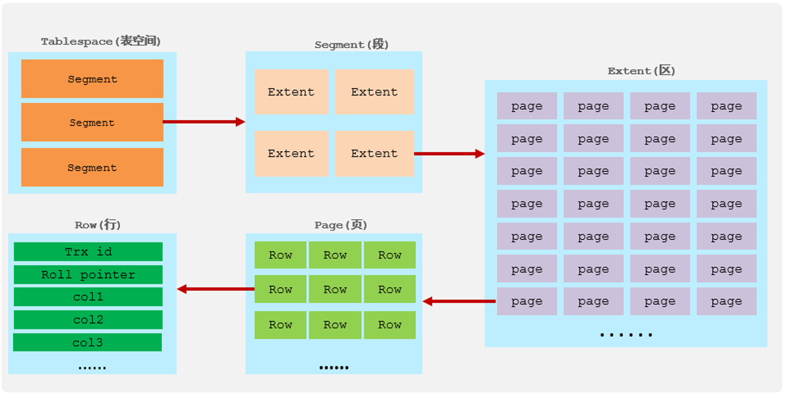 

1). 表空间

表空间是InnoDB存储引擎逻辑结构的最高层， 如果用户启用了参数 innodb_file_per_table(在8.0版本中默认开启) ，则每张表都会有一个表空间（xxx.ibd），一个mysql实例可以对应多个表空间，用于存储记录、索引等数据。

2). 段

段，分为数据段（Leaf node segment）、索引段（Non-leaf node segment）、回滚段（Rollback segment），InnoDB是索引组织表，数据段就是B+树的叶子节点， 索引段即为B+树的非叶子节点。段用来管理多个Extent（区）。

3). 区

区，表空间的单元结构，每个区的大小为1M。 默认情况下， InnoDB存储引擎页大小为16K， 即一个区中一共有64个连续的页。

4). 页

页，是InnoDB 存储引擎磁盘管理的最小单元，每个页的大小默认为 16KB。为了保证页的连续性，InnoDB 存储引擎每次从磁盘申请 4-5 个区。

5). 行

行，InnoDB 存储引擎数据是按行进行存放的。

在行中，默认有两个隐藏字段： 

- Trx_id：每次对某条记录进行改动时，都会把对应的事务id赋值给trx_id隐藏列。

- Roll_pointer：每次对某条引记录进行改动时，都会把旧的版本写入到undo日志中，然后这个隐藏列就相当于一个指针，可以通过它来找到该记录修改前的信息。


### 6.2 架构

#### 6.2.1 概述

MySQL5.5 版本开始，默认使用InnoDB存储引擎，它擅长事务处理，具有崩溃恢复特性，在日常开发中使用非常广泛。下面是InnoDB架构图，左侧为内存结构，右侧为磁盘结构。

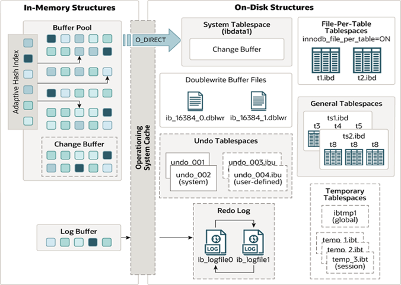 


#### 6.2.2 内存结构

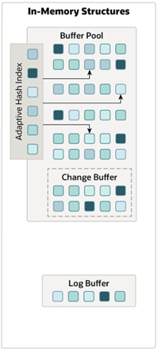 

在左侧的内存结构中，主要分为这么四大块儿： Buffer Pool、Change Buffer、Adaptive Hash Index、Log Buffer。 接下来介绍一下这四个部分。


1). Buffer Pool

InnoDB存储引擎基于磁盘文件存储，访问物理硬盘和在内存中进行访问，速度相差很大，为了尽可能弥补这两者之间的I/O效率的差值，就需要把经常使用的数据加载到缓冲池中，避免每次访问都进行磁盘I/O。

在InnoDB的缓冲池中不仅缓存了索引页和数据页，还包含了undo页、插入缓存、自适应哈希索引以及InnoDB的锁信息等等。


缓冲池 Buffer Pool，是主内存中的一个区域，里面可以缓存磁盘上经常操作的真实数据，在执行增删改查操作时，先操作缓冲池中的数据（若缓冲池没有数据，则从磁盘加载并缓存），然后再以一定频率刷新到磁盘，从而减少磁盘IO，加快处理速度。


缓冲池以Page页为单位，底层采用链表数据结构管理Page。根据状态，将Page分为三种类型：

• free page：空闲page，未被使用。

• clean page：被使用page，数据没有被修改过。

• dirty page：脏页，被使用page，数据被修改过，也中数据与磁盘的数据产生了不一致。


在专用服务器上，通常将多达80％的物理内存分配给缓冲池 。参数设置：  show variables like 'innodb_buffer_pool_size';

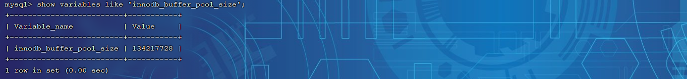 


2). Change Buffer

Change Buffer，更改缓冲区（针对于非唯一二级索引页），在执行DML语句时，如果这些数据Page没有在Buffer Pool中，不会直接操作磁盘，而会将数据变更存在更改缓冲区 Change Buffer 中，在未来数据被读取时，再将数据合并恢复到Buffer Pool中，再将合并后的数据刷新到磁盘中。

Change Buffer的意义是什么呢?

先来看一幅图，这个是二级索引的结构图：

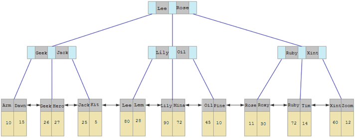 

与聚集索引不同，二级索引通常是非唯一的，并且以相对随机的顺序插入二级索引。同样，删除和更新可能会影响索引树中不相邻的二级索引页，如果每一次都操作磁盘，会造成大量的磁盘IO。有了ChangeBuffer之后，我们可以在缓冲池中进行合并处理，减少磁盘IO。


3). Adaptive Hash Index

自适应hash索引，用于优化对Buffer Pool数据的查询。MySQL的innoDB引擎中虽然没有直接支持hash索引，但是给我们提供了一个功能就是这个自适应hash索引。因为前面我们讲到过，hash索引在进行等值匹配时，一般性能是要高于B+树的，因为hash索引一般只需要一次IO即可，而B+树，可能需要几次匹配，所以hash索引的效率要高，但是hash索引又不适合做范围查询、模糊匹配等。

InnoDB存储引擎会监控对表上各索引页的查询，如果观察到在特定的条件下hash索引可以提升速度，则建立hash索引，称之为自适应hash索引。

**自适应哈希索引，无需人工干预，是系统根据情况自动完成。**

参数： adaptive_hash_index


4). Log Buffer

Log Buffer：日志缓冲区，用来保存要写入到磁盘中的log日志数据（redo log 、undo log），默认大小为 16MB，日志缓冲区的日志会定期刷新到磁盘中。如果需要更新、插入或删除许多行的事务，增加日志缓冲区的大小可以节省磁盘 I/O。

参数:

innodb_log_buffer_size：缓冲区大小

innodb_flush_log_at_trx_commit：日志刷新到磁盘时机，取值主要包含以下三个：

​	1: 日志在每次事务提交时写入并刷新到磁盘，默认值。

​	0: 每秒将日志写入并刷新到磁盘一次。

​	2: 日志在每次事务提交后写入，并每秒刷新到磁盘一次。

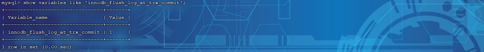 


#### 6.2.3 磁盘结构

接下来，再来看看InnoDB体系结构的右边部分，也就是磁盘结构：

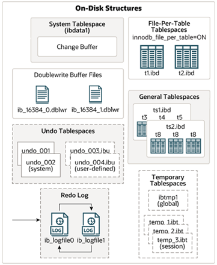 

1). System Tablespace

系统表空间是更改缓冲区的存储区域。如果表是在系统表空间而不是每个表文件或通用表空间中创建的，它也可能包含表和索引数据。(在MySQL5.x版本中还包含InnoDB数据字典、undolog等)

参数：innodb_data_file_path 

 

系统表空间，默认的文件名叫 ibdata1。


2). File-Per-Table Tablespaces

如果开启了innodb_file_per_table开关 ，则每个表的文件表空间包含单个InnoDB表的数据和索引 ，并存储在文件系统上的单个数据文件中。

开关参数：innodb_file_per_table ，该参数默认开启。

 

那也就是说，我们没创建一个表，都会产生一个表空间文件，如图：

 


3). General Tablespaces

通用表空间，需要通过 CREATE TABLESPACE 语法创建通用表空间，在创建表时，可以指定该表空间。

A. 创建表空间

```SQL
CREATE TABLESPACE ts_name  ADD  DATAFILE  'file_name' ENGINE = engine_name;
```

 

B. 创建表时指定表空间

```
CREATE  TABLE  xxx ...  TABLESPACE  ts_name;
```

 


4). Undo Tablespaces

撤销表空间，MySQL实例在初始化时会自动创建两个默认的undo表空间（初始大小16M），用于存储undo log日志。


5). Temporary Tablespaces

InnoDB 使用会话临时表空间和全局临时表空间。存储用户创建的临时表等数据。


6). Doublewrite Buffer Files

双写缓冲区，innoDB引擎将数据页从Buffer Pool刷新到磁盘前，先将数据页写入双写缓冲区文件中，便于系统异常时恢复数据。

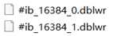 


7). Redo Log

重做日志，是用来实现事务的持久性。该日志文件由两部分组成：重做日志缓冲（redo log buffer）以及重做日志文件（redo log）,前者是在内存中，后者在磁盘中。当事务提交之后会把所有修改信息都会存到该日志中, 用于在刷新脏页到磁盘时,发生错误时, 进行数据恢复使用。

以循环方式写入重做日志文件，涉及两个文件：

 


前面我们介绍了InnoDB的内存结构，以及磁盘结构，那么内存中我们所更新的数据，又是如何到磁盘中的呢？ 此时，就涉及到一组后台线程，接下来，就来介绍一些InnoDB中涉及到的后台线程。

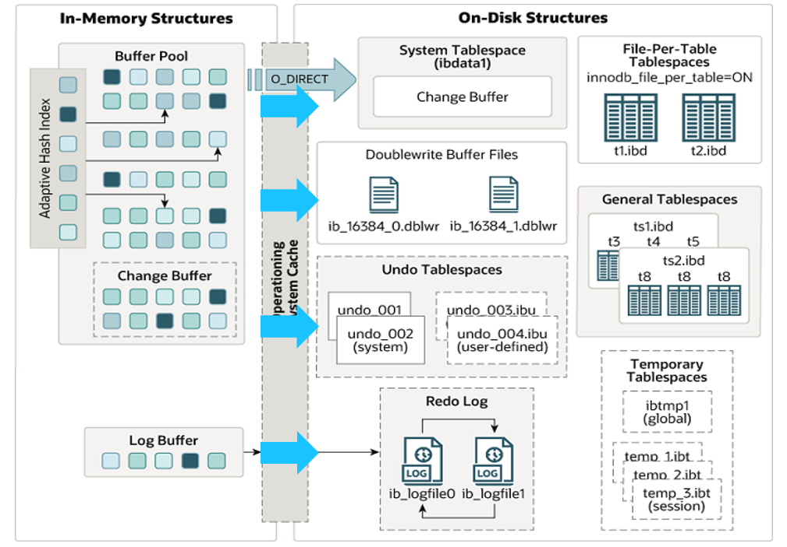 


#### 6.2.4 后台线程

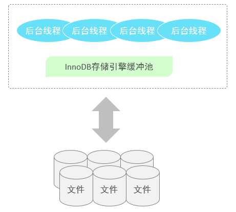 

在InnoDB的后台线程中，分为4类，分别是：Master Thread 、IO Thread、Purge Thread、Page Cleaner Thread。


1). Master Thread

核心后台线程，负责调度其他线程，还负责将缓冲池中的数据异步刷新到磁盘中, 保持数据的一致性， 还包括脏页的刷新、合并插入缓存、undo页的回收 。


2). IO Thread

在InnoDB存储引擎中大量使用了AIO来处理IO请求, 这样可以极大地提高数据库的性能，而IO Thread主要负责这些IO请求的回调。

| 线程类型              | 默认个数 | 职责                         |
| --------------------- | -------- | ---------------------------- |
| Read thread           | 4        | 负责读操作                   |
| Write thread          | 4        | 负责写操作                   |
| Log thread            | 1        | 负责将日志缓冲区刷新到磁盘   |
| Insert  buffer thread | 1        | 负责将写缓冲区内容刷新到磁盘 |

我们可以通过以下的这条指令，查看到InnoDB的状态信息，其中就包含IO Thread信息。

```SQL
show engine innodb status \G;
```

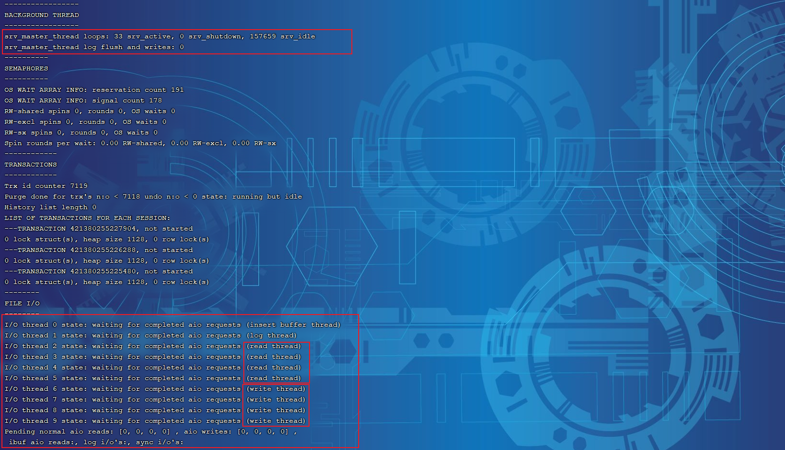


3). Purge Thread

主要用于回收事务已经提交了的undo log，在事务提交之后，undo log可能不用了，就用它来回收。


4). Page Cleaner Thread

协助 Master Thread 刷新脏页到磁盘的线程，它可以减轻 Master Thread 的工作压力，减少阻塞。


### 6.3 事务原理

#### 6.3.1 事务基础

1). 事务

事务 是一组操作的集合，它是一个不可分割的工作单位，事务会把所有的操作作为一个整体一起向系统提交或撤销操作请求，即这些操作要么同时成功，要么同时失败。


2). 特性

• 原子性（Atomicity）：事务是不可分割的最小操作单元，要么全部成功，要么全部失败。

• 一致性（Consistency）：事务完成时，必须使所有的数据都保持一致状态。

• 隔离性（Isolation）：数据库系统提供的隔离机制，保证事务在不受外部并发操作影响的独立环境下运行。

• 持久性（Durability）：事务一旦提交或回滚，它对数据库中的数据的改变就是永久的。


那实际上，我们研究事务的原理，就是研究MySQL的InnoDB引擎是如何保证事务的这四大特性的。

 

而对于这四大特性，实际上分为两个部分。 其中的原子性、一致性、持久化，实际上是由InnoDB中的两份日志来保证的，一份是redo log日志，一份是undo log日志。 而持久性是通过数据库的锁，加上MVCC来保证的。

 

我们在讲解事务原理的时候，主要就是来研究一下redolog，undolog以及MVCC。


#### 6.3.2 redo log

重做日志，记录的是事务提交时数据页的物理修改，是用来实现事务的持久性。

该日志文件由两部分组成：重做日志缓冲（redo log buffer）以及重做日志文件（redo log file）,前者是在内存中，后者在磁盘中。当事务提交之后会把所有修改信息都存到该日志文件中, 用于在刷新脏页到磁盘,发生错误时, 进行数据恢复使用。


如果没有redolog，可能会存在什么问题的？ 我们一起来分析一下。

我们知道，在InnoDB引擎中的内存结构中，主要的内存区域就是缓冲池，在缓冲池中缓存了很多的数据页。 当我们在一个事务中，执行多个增删改的操作时，InnoDB引擎会先操作缓冲池中的数据，如果缓冲区没有对应的数据，会通过后台线程将磁盘中的数据加载出来，存放在缓冲区中，然后将缓冲池中的数据修改，修改后的数据页我们称为脏页。 而脏页则会在一定的时机，通过后台线程刷新到磁盘中，从而保证缓冲区与磁盘的数据一致。 而缓冲区的脏页数据并不是实时刷新的，而是一段时间之后将缓冲区的数据刷新到磁盘中，假如刷新到磁盘的过程出错了，而提示给用户事务提交成功，而数据却没有持久化下来，这就出现问题了，没有保证事务的持久性。

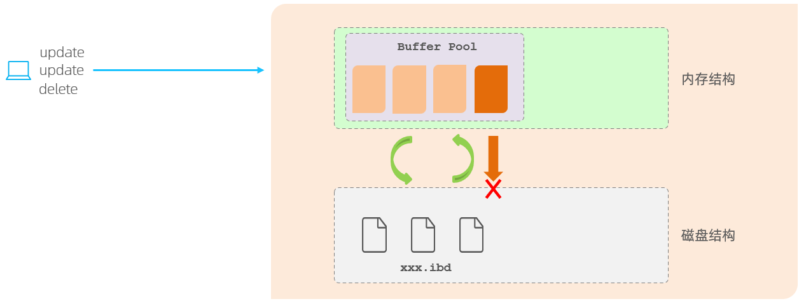 


那么，如何解决上述的问题呢？ 在InnoDB中提供了一份日志 redo log，接下来我们再来分析一下，通过redolog如何解决这个问题。


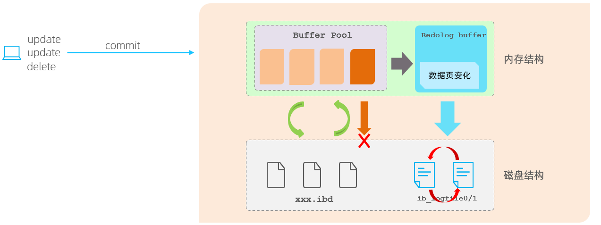 

有了redolog之后，当对缓冲区的数据进行增删改之后，会首先将操作的数据页的变化，记录在redo log buffer中。在事务提交时，会将redo log buffer中的数据刷新到redo log磁盘文件中。 过一段时间之后，如果刷新缓冲区的脏页到磁盘时，发生错误，此时就可以借助于redo log进行数据恢复，这样就保证了事务的持久性。 而如果脏页成功刷新到磁盘 或 或者涉及到的数据已经落盘，此时redolog就没有作用了，就可以删除了，所以存在的两个redolog文件是循环写的。


那为什么每一次提交事务，要刷新redo log 到磁盘中呢，而不是直接将buffer pool中的脏页刷新到磁盘呢 ?

因为在业务操作中，我们操作数据一般都是随机读写磁盘的，而不是顺序读写磁盘。 而redo log在往磁盘文件中写入数据，由于是日志文件，所以都是顺序写的。顺序写的效率，要远大于随机写。 这种先写日志的方式，称之为 WAL（Write-Ahead Logging）。


#### 6.3.3 undo log

回滚日志，用于记录数据被修改前的信息 , 作用包含两个 : 提供回滚(保证事务的原子性) 和 MVCC(多版本并发控制) 。

undo log和redo log记录物理日志不一样，它是逻辑日志。可以认为当delete一条记录时，undo log中会记录一条对应的insert记录，反之亦然，当update一条记录时，它记录一条对应相反的update记录。当执行rollback时，就可以从undo log中的逻辑记录读取到相应的内容并进行回滚。


Undo log销毁：undo log在事务执行时产生，事务提交时，并不会立即删除undo log，因为这些日志可能还用于MVCC。

Undo log存储：undo log采用段的方式进行管理和记录，存放在前面介绍的 rollback segment 回滚段中，内部包含1024个undo log segment。


### 6.4 MVCC

#### 6.4.1 基本概念

1). 当前读

读取的是记录的最新版本，读取时还要保证其他并发事务不能修改当前记录，会对读取的记录进行加锁。对于我们日常的操作，如：select ... lock in share mode(共享锁)，select ... for update、update、insert、delete(排他锁)都是一种当前读。


测试：

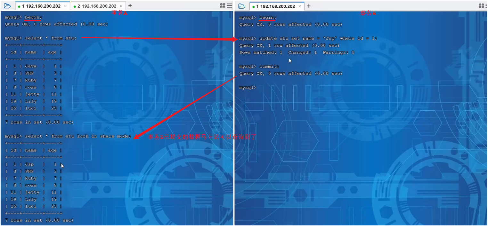 

在测试中我们可以看到，即使是在默认的RR隔离级别下，事务A中依然可以读取到事务B最新提交的内容，因为在查询语句后面加上了 lock in share mode 共享锁，此时是当前读操作。当然，当我们加排他锁的时候，也是当前读操作。


2). 快照读

简单的select（不加锁）就是快照读，快照读，读取的是记录数据的可见版本，有可能是历史数据，不加锁，是非阻塞读。

• Read Committed：每次select，都生成一个快照读。

• Repeatable Read：开启事务后第一个select语句才是快照读的地方。

• Serializable：快照读会退化为当前读。


测试:

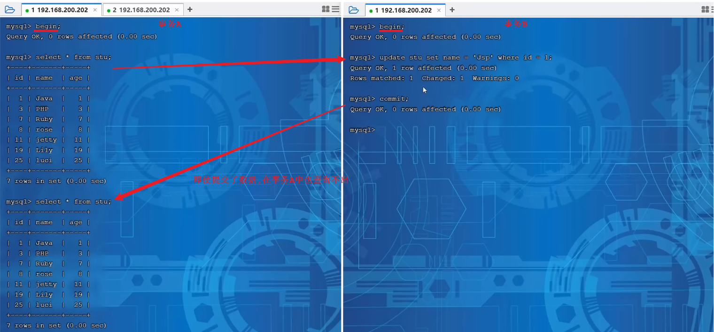 

在测试中,我们看到即使事务B提交了数据,事务A中也查询不到。 原因就是因为普通的select是快照读，而在当前默认的RR隔离级别下，开启事务后第一个select语句才是快照读的地方，后面执行相同的select语句都是从快照中获取数据，可能不是当前的最新数据，这样也就保证了可重复读。


3). MVCC

全称 Multi-Version Concurrency Control，多版本并发控制。指维护一个数据的多个版本，使得读写操作没有冲突，快照读为MySQL实现MVCC提供了一个非阻塞读功能。MVCC的具体实现，还需要依赖于数据库记录中的三个隐式字段、undo log日志、readView。


接下来，我们再来介绍一下InnoDB引擎的表中涉及到的隐藏字段 、undolog 以及 readview，从而来介绍一下MVCC的原理。


#### 6.4.2 隐藏字段

##### 6.4.2.1 介绍

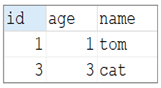 

当我们创建了上面的这张表，我们在查看表结构的时候，就可以显式的看到这三个字段。 实际上除了这三个字段以外，InnoDB还会自动的给我们添加三个隐藏字段及其含义分别是：

| 隐藏字段    | 含义                                                         |
| ----------- | ------------------------------------------------------------ |
| DB_TRX_ID   | 最近修改事务ID，记录插入这条记录或最后一次修改该记录的事务ID。 |
| DB_ROLL_PTR | 回滚指针，指向这条记录的上一个版本，用于配合undo  log，指向上一个版本。 |
| DB_ROW_ID   | 隐藏主键，如果表结构没有指定主键，将会生成该隐藏字段。       |

而上述的前两个字段是肯定会添加的， 是否添加最后一个字段DB_ROW_ID，得看当前表有没有主键，如果有主键，则不会添加该隐藏字段。


##### 6.4.2.2 测试

1). 查看有主键的表 stu

进入服务器中的 /var/lib/mysql/itcast/ , 查看stu的表结构信息, 通过如下指令:

```
ibd2sdi stu.ibd
```

查看到的表结构信息中，有一栏 columns，在其中我们会看到处理我们建表时指定的字段以外，还有额外的两个字段 分别是：DB_TRX_ID 、 DB_ROLL_PTR ，因为该表有主键，所以没有DB_ROW_ID隐藏字段。

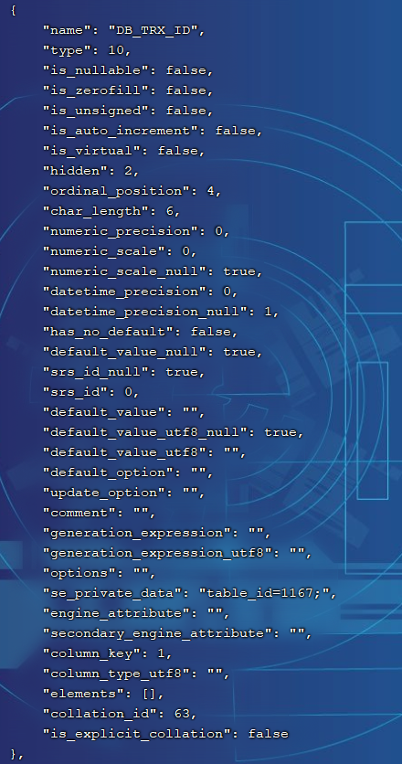 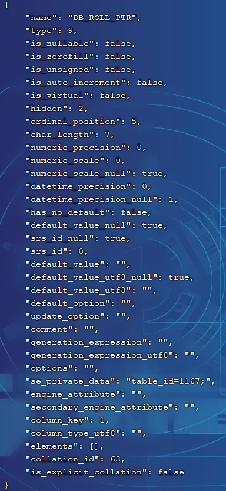 


2). 查看没有主键的表 employee 

建表语句：

```SQL
create table employee (id int , name varchar(10));
```

此时，我们再通过以下指令来查看表结构及其其中的字段信息：

```
ibd2sdi employee.ibd
```

查看到的表结构信息中，有一栏 columns，在其中我们会看到处理我们建表时指定的字段以外，还有额外的三个字段 分别是：DB_TRX_ID 、 DB_ROLL_PTR 、DB_ROW_ID，因为employee表是没有指定主键的。

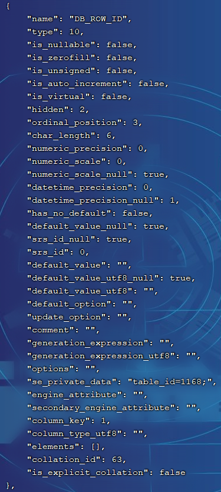 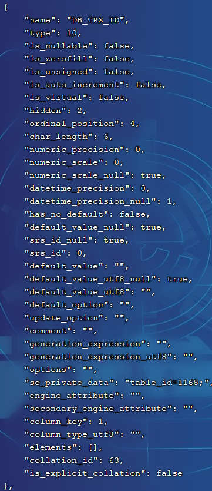 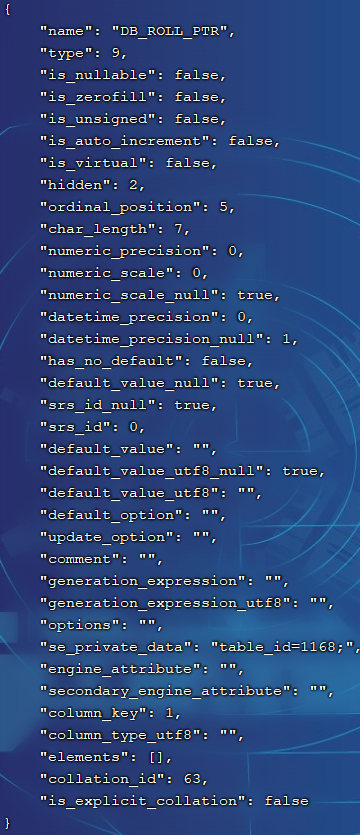 


#### 6.4.3 undolog

##### 6.4.3.1 介绍

回滚日志，在insert、update、delete的时候产生的便于数据回滚的日志。

当insert的时候，产生的undo log日志只在回滚时需要，在事务提交后，可被立即删除。

而update、delete的时候，产生的undo log日志不仅在回滚时需要，在快照读时也需要，不会立即被删除。


##### 6.4.3.2 版本链

有一张表原始数据为：

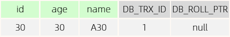 

> DB_TRX_ID : 代表最近修改事务ID，记录插入这条记录或最后一次修改该记录的事务ID，是自增的。
>
> DB_ROLL_PTR ： 由于这条数据是才插入的，没有被更新过，所以该字段值为null。


然后，有四个并发事务同时在访问这张表。

A. 第一步

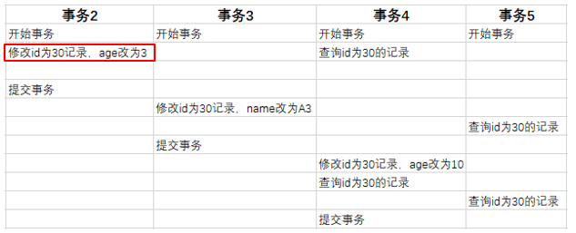 

当事务2执行第一条修改语句时，会记录undo log日志，记录数据变更之前的样子; 然后更新记录，并且记录本次操作的事务ID，回滚指针，回滚指针用来指定如果发生回滚，回滚到哪一个版本。

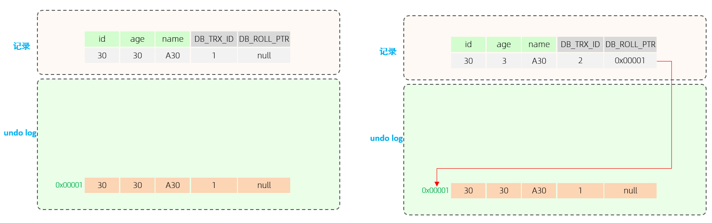 


B.第二步

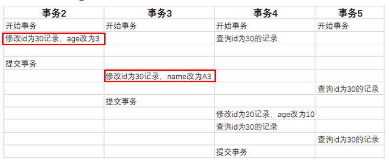 

当事务3执行第一条修改语句时，也会记录undo log日志，记录数据变更之前的样子; 然后更新记录，并且记录本次操作的事务ID，回滚指针，回滚指针用来指定如果发生回滚，回滚到哪一个版本。

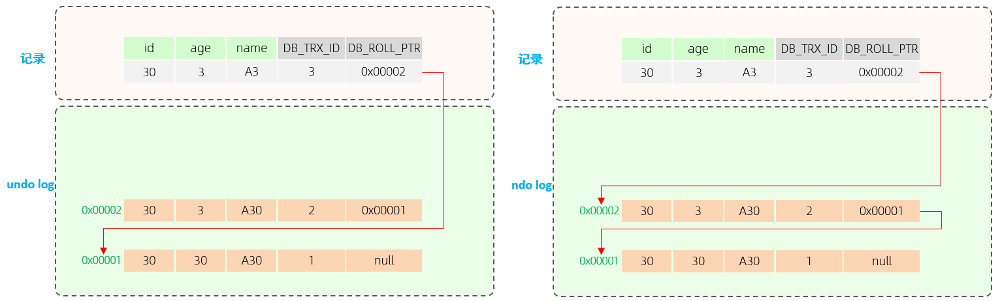 


C. 第三步

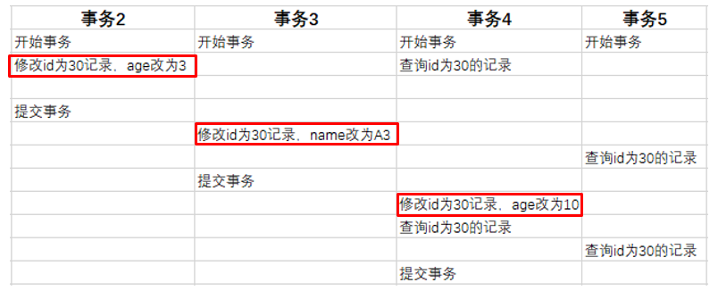 

当事务4执行第一条修改语句时，也会记录undo log日志，记录数据变更之前的样子; 然后更新记录，并且记录本次操作的事务ID，回滚指针，回滚指针用来指定如果发生回滚，回滚到哪一个版本。

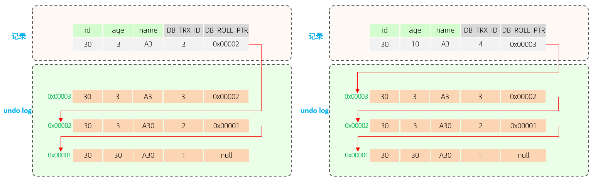 


> 最终我们发现，不同事务或相同事务对同一条记录进行修改，会导致该记录的undolog生成一条记录版本链表，链表的头部是最新的旧记录，链表尾部是最早的旧记录。


#### 6.4.4 readview

ReadView（读视图）是 快照读 SQL执行时MVCC提取数据的依据，记录并维护系统当前活跃的事务（未提交的）id。

ReadView中包含了四个核心字段：

| 字段           | 含义                                                 |
| -------------- | ---------------------------------------------------- |
| m_ids          | 当前活跃的事务ID集合                                 |
| min_trx_id     | 最小活跃事务ID                                       |
| max_trx_id     | 预分配事务ID，当前最大事务ID+1（因为事务ID是自增的） |
| creator_trx_id | ReadView创建者的事务ID                               |


而在readview中就规定了版本链数据的访问规则：

trx_id 代表当前undolog版本链对应事务ID。

| 条件                               | 是否可以访问                              | 说明                                       |
| ---------------------------------- | ----------------------------------------- | ------------------------------------------ |
| trx_id == creator_trx_id           | 可以访问该版本                            | 成立，说明数据是当前这个事务更改的。       |
| trx_id < min_trx_id                | 可以访问该版本                            | 成立，说明数据已经提交了。                 |
| trx_id > max_trx_id                | 不可以访问该版本                          | 成立，说明该事务是在ReadView生成后才开启。 |
| min_trx_id <= trx_id <= max_trx_id | 如果trx_id不在m_ids中，是可以访问该版本的 | 成立，说明数据已经提交。                   |


不同的隔离级别，生成ReadView的时机不同：

- READ COMMITTED ：在事务中每一次执行快照读时生成ReadView。

- REPEATABLE READ：仅在事务中第一次执行快照读时生成ReadView，后续复用该ReadView。


#### 6.4.5 原理分析

##### 6.4.5.1 RC隔离级别

RC隔离级别下，在事务中每一次执行快照读时生成ReadView。


我们就来分析事务5中，两次快照读读取数据，是如何获取数据的? 

在事务5中，查询了两次id为30的记录，由于隔离级别为Read Committed，所以每一次进行快照读都会生成一个ReadView，那么两次生成的ReadView如下。

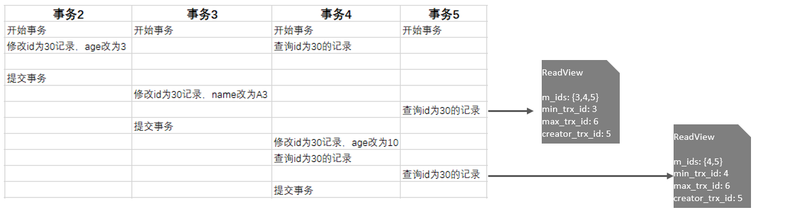 

那么这两次快照读在获取数据时，就需要根据所生成的ReadView以及ReadView的版本链访问规则，到undolog版本链中匹配数据，最终决定此次快照读返回的数据。 


A. 先来看第一次快照读具体的读取过程：

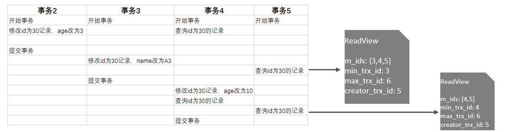 

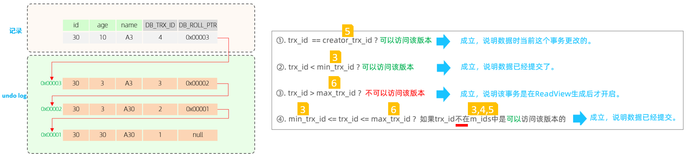 

在进行匹配时，会从undo log的版本链，从上到下进行挨个匹配：

- 先匹配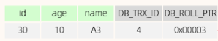 这条记录，这条记录对应的trx_id为4，也就是将4带入右侧的匹配规则中。 ①不满足 ②不满足 ③不满足 ④也不满足 ，都不满足，则继续匹配undo log版本链的下一条。
- 再匹配第二条  ，这条记录对应的trx_id为3，也就是将3带入右侧的匹配规则中。①不满足 ②不满足 ③不满足 ④也不满足 ，都不满足，则继续匹配undo log版本链的下一条。

- 再匹配第三条  ，这条记录对应的trx_id为2，也就是将2带入右侧的匹配规则中。①不满足 ②满足 终止匹配，此次快照读，返回的数据就是版本链中记录的这条数据。


B. 再来看第二次快照读具体的读取过程:

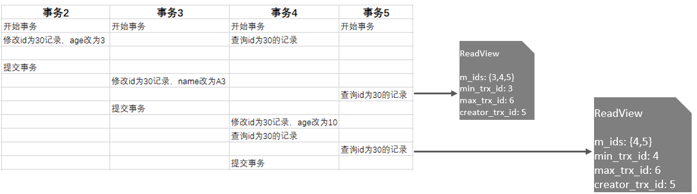 

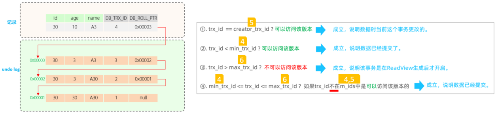 

在进行匹配时，会从undo log的版本链，从上到下进行挨个匹配：

- 先匹配 这条记录，这条记录对应的trx_id为4，也就是将4带入右侧的匹配规则中。 ①不满足 ②不满足 ③不满足 ④也不满足 ，都不满足，则继续匹配undo log版本链的下一条。
- 再匹配第二条  ，这条记录对应的trx_id为3，也就是将3带入右侧的匹配规则中。①不满足 ②满足 。终止匹配，此次快照读，返回的数据就是版本链中记录的这条数据。


##### 6.4.5.3 RR隔离级别

RR隔离级别下，仅在事务中第一次执行快照读时生成ReadView，后续复用该ReadView。 而RR 是可重复读，在一个事务中，执行两次相同的select语句，查询到的结果是一样的。 

那MySQL是如何做到可重复读的呢? 我们简单分析一下就知道了

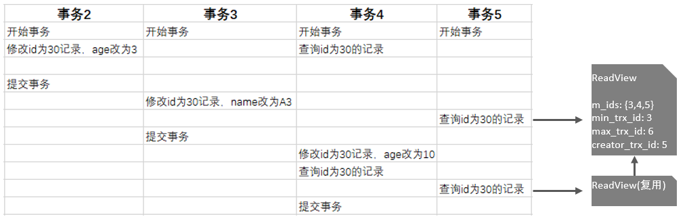 

我们看到，在RR隔离级别下，只是在事务中第一次快照读时生成ReadView，后续都是复用该ReadView，那么既然ReadView都一样， ReadView的版本链匹配规则也一样， 那么最终快照读返回的结果也是一样的。 


所以呢，MVCC的实现原理就是通过 InnoDB表的隐藏字段、UndoLog 版本链、ReadView来实现的。 而MVCC + 锁，则实现了事务的隔离性。 而一致性则是由redolog 与 undolog保证。

 


## 7. MySQL管理

### 7.1 系统数据库

Mysql数据库安装完成后，自带了一下四个数据库，具体作用如下：

| 数据库             | 含义                                                         |
| ------------------ | ------------------------------------------------------------ |
| mysql              | 存储MySQL服务器正常运行所需要的各种信息  （时区、主从、用户、权限等） |
| information_schema | 提供了访问数据库元数据的各种表和视图，包含数据库、表、字段类型及访问权限等 |
| performance_schema | 为MySQL服务器运行时状态提供了一个底层监控功能，主要用于收集数据库服务器性能参数 |
| sys                | 包含了一系列方便 DBA 和开发人员利用  performance_schema 性能数据库进行性能调优和诊断的视图 |


### 7.2 常用工具

#### 7.2.1 mysql

该mysql不是指mysql服务，而是指mysql的客户端工具。

```
语法 ：	
	mysql   [options]   [database]
选项 ： 
	-u, --user=name			#指定用户名
	-p, --password[=name]			#指定密码
	-h, --host=name			#指定服务器IP或域名
	-P, --port=port				#指定连接端口
	-e, --execute=name			#执行SQL语句并退出
```

-e选项可以在Mysql客户端执行SQL语句，而不用连接到MySQL数据库再执行，对于一些批处理脚本，这种方式尤其方便。


示例：

```
mysql -uroot –p123456 db01 -e "select * from stu";
```

 


#### 7.2.2 mysqladmin

mysqladmin 是一个执行管理操作的客户端程序。可以用它来检查服务器的配置和当前状态、创建并删除数据库等。

```
通过帮助文档查看选项：
	mysqladmin --help
```

  


```
语法: 
	mysqladmin [options] command ...
选项:
	-u, --user=name				#指定用户名
	-p, --password[=name]		#指定密码
	-h, --host=name				#指定服务器IP或域名
	-P, --port=port				#指定连接端口
```


示例：

```SQL
mysqladmin -uroot –p1234 drop 'test01';
mysqladmin -uroot –p1234 version;
```

 


#### 7.2.3 mysqlbinlog

由于服务器生成的二进制日志文件以二进制格式保存，所以如果想要检查这些文本的文本格式，就会使用到mysqlbinlog 日志管理工具。

```
语法 ：	
	mysqlbinlog [options]  log-files1 log-files2 ...
选项 ： 
	-d, --database=name 		指定数据库名称，只列出指定的数据库相关操作。
	-o, --offset=# 				忽略掉日志中的前n行命令。
	-r,--result-file=name 		将输出的文本格式日志输出到指定文件。
	-s, --short-form 			显示简单格式， 省略掉一些信息。
	--start-datatime=date1  --stop-datetime=date2 		指定日期间隔内的所有日志。
	--start-position=pos1 --stop-position=pos2 			指定位置间隔内的所有日志。
```


示例:

A. 查看 binlog.000008这个二进制文件中的数据信息

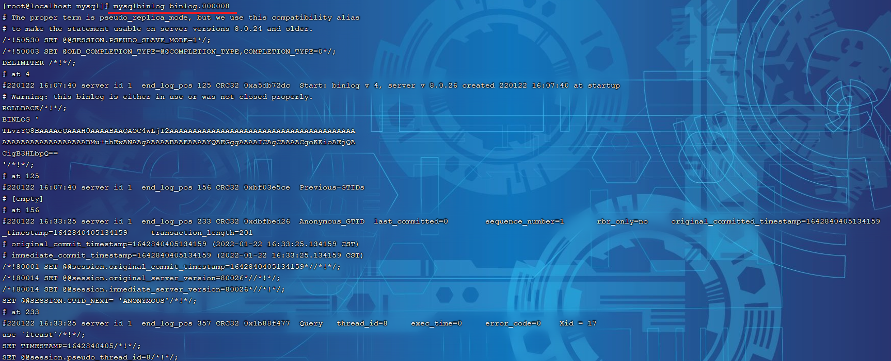 

上述查看到的二进制日志文件数据信息量太多了，不方便查询。 我们可以加上一个参数 -s 来显示简单格式。

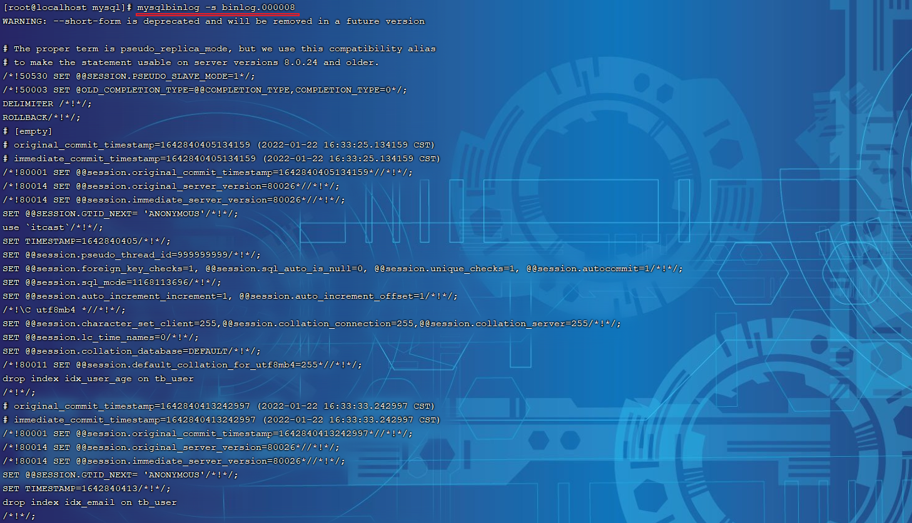 


#### 7.2.4 mysqlshow

mysqlshow 客户端对象查找工具，用来很快地查找存在哪些数据库、数据库中的表、表中的列或者索引。

```
语法 ：	
	mysqlshow [options] [db_name [table_name [col_name]]]
选项 ： 
	--count		显示数据库及表的统计信息（数据库，表 均可以不指定）
	-i		显示指定数据库或者指定表的状态信息
示例：
  
	
    #查询test库中每个表中的字段书，及行数
    mysqlshow -uroot -p2143 test --count

    #查询test库中book表的详细情况
    mysqlshow -uroot -p2143 test book --count
```


示例：

A. 查询每个数据库的表的数量及表中记录的数量
mysqlshow -uroot -p1234 --count

 


B. 查看数据库db01的统计信息

mysqlshow -uroot -p1234 db01 --count

 


C. 查看数据库db01中的course表的信息

mysqlshow -uroot -p1234 db01 course --count

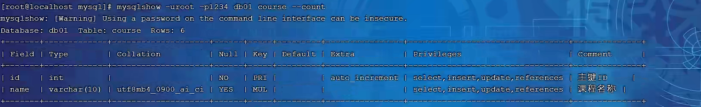 


D. 查看数据库db01中的course表的id字段的信息

mysqlshow -uroot -p1234 db01 course id --count

 


#### 7.2.5 mysqldump

mysqldump 客户端工具用来备份数据库或在不同数据库之间进行数据迁移。备份内容包含创建表，及插入表的SQL语句。

```
语法 ：	
	mysqldump [options] db_name [tables]
	mysqldump [options] --database/-B db1 [db2 db3...]
	mysqldump [options] --all-databases/-A
连接选项 ： 	
	-u, --user=name					指定用户名
	-p, --password[=name]			指定密码
	-h, --host=name					指定服务器ip或域名
	-P, --port=#					指定连接端口
输出选项：
	--add-drop-database			在每个数据库创建语句前加上 drop database 语句
	--add-drop-table			在每个表创建语句前加上 drop table 语句 , 默认开启 ; 不开启 (--skip-add-drop-table)
	-n, --no-create-db			不包含数据库的创建语句
	-t, --no-create-info		不包含数据表的创建语句
	-d --no-data				不包含数据
	 -T, --tab=name				自动生成两个文件：一个.sql文件，创建表结构的语句；一个.txt文件，数据文件
```


示例:

A. 备份db01数据库

mysqldump -uroot -p1234 db01 > db01.sql

 

可以直接打开db01.sql，来查看备份出来的数据到底什么样。

 

备份出来的数据包含： 

- 删除表的语句
- 创建表的语句
- 数据插入语句

如果我们在数据备份时，不需要创建表，或者不需要备份数据，只需要备份表结构，都可以通过对应的参数来实现。


B. 备份db01数据库中的表数据，不备份表结构(-t)

mysqldump -uroot -p1234 -t db01 > db01.sql

  

打开 db02.sql ，来查看备份的数据，只有insert语句，没有备份表结构。

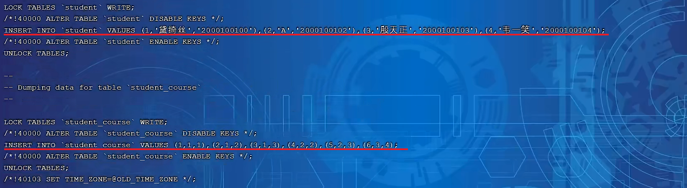 


C. 将db01数据库的表的表结构与数据分开备份(-T)

mysqldump -uroot -p1234 -T /root db01 score

 

执行上述指令，会出错，数据不能完成备份，原因是因为我们所指定的数据存放目录/root，MySQL认为是不安全的，需要存储在MySQL信任的目录下。那么，哪个目录才是MySQL信任的目录呢，可以查看一下系统变量 secure_file_priv 。执行结果如下： 

 

 

上述的两个文件 score.sql 中记录的就是表结构文件，而 score.txt 就是表数据文件，但是需要注意表数据文件，并不是记录一条条的insert语句，而是按照一定的格式记录表结构中的数据。如下：

 


#### 7.2.6 mysqlimport/source

1). mysqlimport

mysqlimport 是客户端数据导入工具，用来导入mysqldump 加 -T 参数后导出的文本文件。

```
语法 ：	
	mysqlimport [options]  db_name  textfile1  [textfile2...]
示例 ： 
	mysqlimport -uroot -p2143 test /tmp/city.txt
```

 


2). source

如果需要导入sql文件,可以使用mysql中的source 指令 : 

```
语法 ：	
	source /root/xxxxx.sql
```

