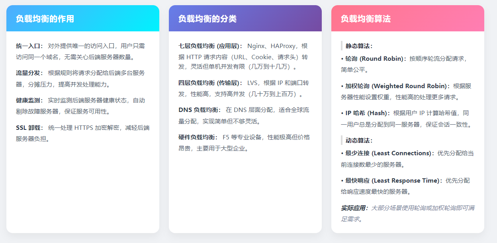

## 负载均衡
## 一、负载均衡的作用
负载均衡是“帮服务器分摊压力、提升服务能力”的工具，核心作用有4个：
1. **统一入口**：用户只需要访问`www.xxx.com`这一个域名，不用关心背后有多少台服务器。
   👉 场景：比如你访问淘宝，不用知道它背后有上万台服务器，只需要输一个网址。
2. **流量分发**：把用户请求“平均分”给多台服务器，避免某一台服务器被挤垮。
   👉 场景：双11时，淘宝的请求会被分到不同服务器，保证不会因为流量太大“崩掉”。
3. **健康监测**：实时检查服务器是否正常工作，如果某台服务器坏了，自动把请求分给其他正常的服务器。
   👉 场景：如果某台服务器突然断电，负载均衡会立刻“跳过它”，用户完全感知不到故障。
4. **SSL卸载**：统一处理HTTPS的加密/解密（比如把`https://xxx`转成`http://`给后端服务器），不用每台服务器都做加密，减轻后端压力。
   👉 场景：大型网站的HTTPS解密都由负载均衡完成，后端服务器只处理业务逻辑。

## 二、负载均衡的分类（重点）
按“工作层级/实现方式”分4类，特点和场景差异很大：
1. **七层负载均衡（应用层）**
   - 原理：基于HTTP请求的**内容**（比如URL、Cookie、请求头）转发请求。
   - 代表工具：Nginx、HAProxy。
   - 特点：灵活（能按业务规则分发，比如把`/pay`请求分给支付服务器），但单机并发有限（几万到十几万请求/秒）。
   👉 场景：中小型网站、需要按业务规则分流的场景（比如电商的“商品页”和“支付页”分开处理）。

2. **四层负载均衡（传输层）**
   - 原理：基于**IP地址+端口**转发请求（不管请求内容）。
   - 代表工具：LVS（Linux虚拟服务器）。
   - 特点：性能极高（几十万到上百万请求/秒），但不够灵活。
   👉 场景：大型网站的“流量入口”（比如先通过LVS把流量分到多台Nginx，再由Nginx做七层分流）。

3. **DNS负载均衡**
   - 原理：在DNS层面，把同一个域名解析到不同服务器IP（比如`www.xxx.com`解析到IP1、IP2）。
   - 特点：实现最简单（不用额外部署工具），但不够灵活（不能实时调整，故障恢复慢）。
   👉 场景：全球流量分发（比如用户在国内访问中国服务器，在国外访问美国服务器）。

4. **硬件负载均衡**
   - 原理：用专用硬件设备（比如F5）实现负载均衡。
   - 特点：性能极高（百万级请求/秒），但价格昂贵（一台设备可能几十万）。
   👉 场景：超大型企业（比如银行、电信）的核心业务系统。

## 三、负载均衡算法
算法是“请求怎么分给服务器”的规则，分静态和动态两类：
1. **静态算法（不看服务器状态）**
   - 轮询：按顺序轮流分请求（比如1→服务器A，2→服务器B，3→服务器A…）。
     👉 场景：所有服务器性能差不多的小网站。
   - 加权轮询：给性能高的服务器“加权重”（比如服务器A权重3、B权重1，会分3次给A、1次给B）。
     👉 场景：服务器性能有差异的场景（比如新服务器性能高，老服务器性能低）。
   - IP哈希：用用户IP算一个“哈希值”，同一个用户永远分到同一台服务器。
     👉 场景：需要“用户会话保持”的场景（比如登录状态存在某台服务器上，不能换服务器）。

2. **动态算法（看服务器实时状态）**
   - 最少连接：把请求分给当前连接数最少的服务器。
     👉 场景：请求处理时间差异大的业务（比如有的请求要处理10秒，有的只要1秒）。
   - 最快响应：把请求分给“响应速度最快”的服务器。
     👉 场景：对延迟敏感的业务（比如游戏、实时视频）。

# 有关静态资源 和 媒体资源

1. **HTTPS 强制要求**：WebRTC 仅允许在 HTTPS/WSS 环境下运行（本地[localhost](https://localhost/)除外），Nginx 必须配置 SSL 证书。
2. **UDP 支持**：WebRTC 媒体流优先用 UDP，Nginx 1.9.13+ 才支持 UDP 代理，需确认版本。
3. **跨域处理**：若前端和信令服务器跨域，Nginx 需配置 CORS，前端无需额外处理（浏览器自动适配）。
4. **调试工具**：Chrome 可通过 `chrome://webrtc-internals` 查看 WebRTC 状态（ICE 候选、流质量、延迟等）。
5. **性能优化**：
    - 静态资源：开启 HTTP/2、雪碧图、资源压缩；
    - WebRTC：调整视频分辨率（如 720p→480p）、关闭回声消除（按需）、设置 JitterBuffer 大小（减少延迟）。